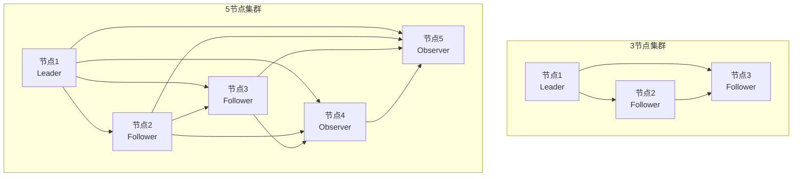
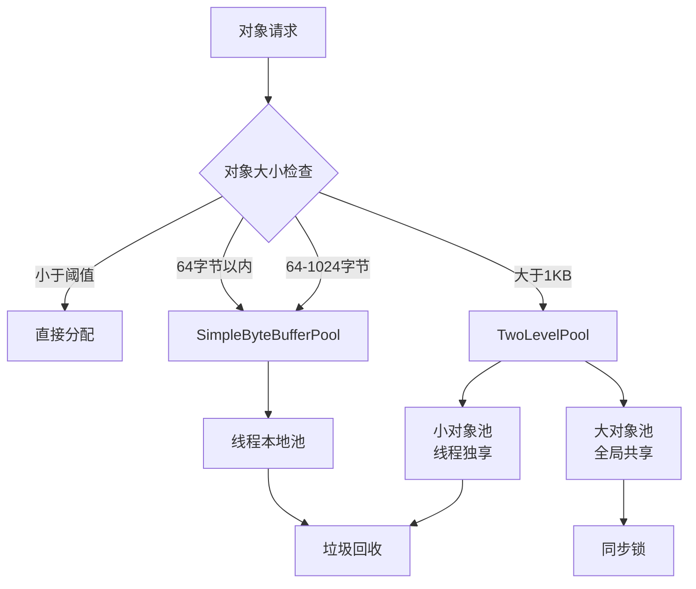
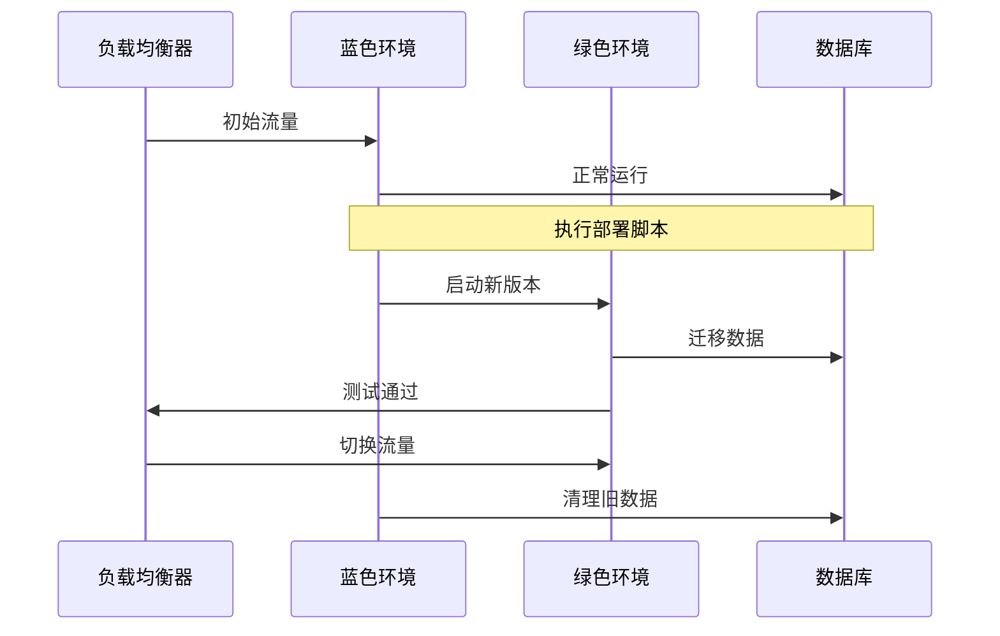

# Dongting 最佳实践指南

<cite>
**本文档中引用的文件**
- [README.md](file://README.md)
- [2023_07_26_dongting线程模型.txt](file://devlogs/2023_07_26_dongting线程模型.txt)
- [2023_07_27_dongting的定位和原则.txt](file://devlogs/2023_07_27_dongting的定位和原则.txt)
- [2023_07_28_dongting的对象池.txt](file://devlogs/2023_07_28_dongting的对象池.txt)
- [2024_07_09_第二点阶段性进展.md](file://devlogs/2024_07_09_第二点阶段性进展.md)
- [RaftServer.java](file://server/src/main/java/com/github/dtprj/dongting/raft/server/RaftServer.java)
- [KvConfig.java](file://server/src/main/java/com/github/dtprj/dongting/dtkv/server/KvConfig.java)
- [Fiber.java](file://server/src/main/java/com/github/dtprj/dongting/fiber/Fiber.java)
- [NioServer.java](file://client/src/main/java/com/github/dtprj/dongting/net/NioServer.java)
- [RaftLog.java](file://server/src/main/java/com/github/dtprj/dongting/raft/store/RaftLog.java)
- [DemoServer1.java](file://demos/src/main/java/com/github/dtprj/dongting/demos/cluster/DemoServer1.java)
- [DemoClient.java](file://demos/src/main/java/com/github/dtprj/dongting/demos/cluster/DemoClient.java)
- [RaftBenchmark.java](file://benchmark/src/main/java/com/github/dtprj/dongting/bench/raft/RaftBenchmark.java)
</cite>

## 目录
1. [简介](#简介)
2. [集群部署最佳实践](#集群部署最佳实践)
3. [性能调优指南](#性能调优指南)
4. [线程模型配置](#线程模型配置)
5. [对象池管理](#对象池管理)
6. [RAFT参数调优](#raft参数调优)
7. [故障排查指南](#故障排查指南)
8. [监控系统配置](#监控系统配置)
9. [生产环境运维](#生产环境运维)
10. [总结](#总结)

## 简介

Dongting是一个高性能的分布式引擎，集成了RAFT共识算法、配置服务器、消息队列和底层RPC功能。本文档基于项目的设计哲学和实际部署经验，提供全面的最佳实践指导，帮助开发者和运维人员在生产环境中成功部署和运维Dongting系统。

## 集群部署最佳实践

### 节点数量规划

根据Dongting的设计理念，推荐采用3节点或5节点的集群架构：



**图表来源**
- [2023_07_27_dongting的定位和原则.txt](file://devlogs/2023_07_27_dongting的定位和原则.txt#L1-L19)

### 网络拓扑设计

#### 推荐的网络架构

1. **内网部署**：所有节点部署在同一内网环境中
2. **端口规划**：
   - 服务端口：5000 + nodeId
   - 复制端口：4000 + nodeId
   - 心跳间隔：选举超时的40%

3. **网络分区容忍**：确保节点间网络延迟低于20ms

### 集群初始化配置

```java
// 示例：3节点集群配置
String servers = "1,127.0.0.1:4001;2,127.0.0.1:4002;3,127.0.0.1:4003";
String members = "1,2,3";
String observers = "";

// 启动服务器
startServer(nodeId, servers, members, observers, new int[]{GROUP_ID});
```

**章节来源**
- [DemoServer1.java](file://demos/src/main/java/com/github/dtprj/dongting/demos/cluster/DemoServer1.java#L1-L33)
- [DemoClient.java](file://demos/src/main/java/com/github/dtprj/dongting/demos/cluster/DemoClient.java#L1-L39)

## 性能调优指南

### 基准测试结果分析

根据项目开发者的测试结果，Dongting在以下配置下表现优异：

- **硬件配置**：AMD 5600X 6核，32GB内存，PCI-E 3.0 SSD
- **JVM参数**：`-XX:+UseZGC -Xmx4G -Xms4G`
- **性能指标**：
  - 同步写入：704,900 TPS，平均RT 2.8ms
  - 异步写入：1,777,224 TPS，平均RT 1.1ms

### 系统参数调优

#### JVM参数优化

```bash
# 生产环境推荐JVM参数
-Xms4g -Xmx4g
-XX:+UseZGC
-XX:MaxGCPauseMillis=100
-XX:+UnlockExperimentalVMOptions
-XX:+UseNUMA
-XX:+OptimizeStringConcat
```

#### 操作系统优化

```bash
# 文件描述符限制
ulimit -n 65535

# 内存锁定
echo "* soft memlock unlimited" >> /etc/security/limits.conf
echo "* hard memlock unlimited" >> /etc/security/limits.conf

# 网络参数优化
sysctl -w net.core.rmem_max=134217728
sysctl -w net.core.wmem_max=134217728
```

### 应用层调优

#### 客户端配置优化

```java
// 客户端最大并发请求数
c.getRaftClient().getNioClient().getConfig().maxOutRequests = 2000;

// 连接池配置
NioClientConfig clientConfig = new NioClientConfig();
clientConfig.ioThreads = Runtime.getRuntime().availableProcessors();
clientConfig.connectTimeout = 5000;
```

**章节来源**
- [2024_07_09_第二点阶段性进展.md](file://devlogs/2024_07_09_第二点阶段性进展.md#L1-L48)
- [RaftBenchmark.java](file://benchmark/src/main/java/com/github/dtprj/dongting/bench/raft/RaftBenchmark.java#L1-L199)

## 线程模型配置

### 核心线程模型

Dongting采用了精心设计的线程模型，减少多线程竞争开销：

```mermaid
graph TB
subgraph "NioServer线程模型"
Accept[Accept线程<br/>${name}IoAccept] --> Workers[NioWorker线程池<br/>${name}IoWorker${index}]
Workers --> Channels[Socket通道]
end
subgraph "Raft线程模型"
Schedule[Schedule线程] --> RaftThreads[Raft线程池]
RaftThreads --> RaftGroups[多个Raft组]
end
subgraph "Fiber线程模型"
Dispatcher[调度器线程] --> FiberGroups[Fiber组]
FiberGroups --> FiberThreads[Fiber线程]
end
```

**图表来源**
- [2023_07_26_dongting线程模型.txt](file://devlogs/2023_07_26_dongting线程模型.txt#L1-L15)

### 线程池配置

#### IO线程配置

```java
// IO线程数量配置
NioServerConfig serverConfig = new NioServerConfig();
serverConfig.ioThreads = Math.min(Runtime.getRuntime().availableProcessors(), 8);
serverConfig.backlog = 1024;
```

#### Fiber调度器配置

```java
// Fiber调度器配置
Dispatcher dispatcher = new Dispatcher(
    "node-" + nodeId + "-dispatcher", 
    new DefaultPoolFactory(),
    groupConfig.perfCallback
);
```

### 线程优先级设置

```java
// 设置线程优先级
Thread.currentThread().setPriority(Thread.MAX_PRIORITY - 1);
```

**章节来源**
- [2023_07_26_dongting线程模型.txt](file://devlogs/2023_07_26_dongting线程模型.txt#L1-L15)
- [Fiber.java](file://server/src/main/java/com/github/dtprj/dongting/fiber/Fiber.java#L1-L199)

## 对象池管理

### 对象池设计原理

Dongting实现了多层次的对象池设计，针对不同大小的对象采用不同的池化策略：



**图表来源**
- [2023_07_28_dongting的对象池.txt](file://devlogs/2023_07_28_dongting的对象池.txt#L1-L10)

### 对象池配置

#### 缓冲区大小配置

```java
// 缓冲区池配置
SimpleByteBufferPoolConfig poolConfig = new SimpleByteBufferPoolConfig();
poolConfig.smallBufferSize = 64;
poolConfig.mediumBufferSize = 1024;
poolConfig.largeBufferSize = 16 * 1024;

// 对象池工厂配置
DefaultPoolFactory factory = new DefaultPoolFactory(poolConfig);
```

#### 引用计数配置

```java
// 引用计数配置
RefBuffer refBuffer = refBufferFactory.borrow();
try {
    // 使用缓冲区
    refBuffer.retain();
    // 处理数据...
} finally {
    refBuffer.release(); // 自动归还到池中
}
```

### 内存管理策略

#### 内存泄漏防护

```java
// 防止内存泄漏的最佳实践
public class BufferManager {
    private final RefBufferFactory bufferFactory;
    
    public void processData(byte[] data) {
        RefBuffer buffer = null;
        try {
            buffer = bufferFactory.borrow();
            // 处理数据
            processBuffer(buffer, data);
        } finally {
            if (buffer != null) {
                buffer.release(); // 确保归还
            }
        }
    }
}
```

**章节来源**
- [2023_07_28_dongting的对象池.txt](file://devlogs/2023_07_28_dongting的对象池.txt#L1-L10)

## RAFT参数调优

### 核心参数配置

#### 选举超时配置

```java
// RAFT组配置
RaftGroupConfig groupConfig = RaftGroupConfig.newInstance(GROUP_ID, members, observers);
groupConfig.electTimeout = 3000; // 3秒
groupConfig.heartbeatInterval = 1000; // 1秒 (40%的选举超时)
groupConfig.rpcTimeout = 5000; // RPC超时
```

#### 日志配置

```java
// 日志持久化配置
groupConfig.syncForce = true; // 同步强制写入
groupConfig.saveSnapshotSeconds = 300; // 5分钟保存快照
groupConfig.maxPendingWrites = 1000; // 最大待写入数量
```

### 参数调优策略

#### 性能优先配置

```java
// 高性能配置
groupConfig.electTimeout = 2000; // 减少选举超时
groupConfig.heartbeatInterval = 800; // 更频繁的心跳
groupConfig.syncForce = false; // 异步写入（数据安全性降低）
```

#### 可靠性优先配置

```java
// 高可靠性配置
groupConfig.electTimeout = 5000; // 增加选举超时
groupConfig.heartbeatInterval = 2000; // 较慢的心跳
groupConfig.syncForce = true; // 同步写入
```

### 动态配置变更

```java
// 运行时配置变更
AdminRaftClient adminClient = new AdminRaftClient();
adminClient.serverAddNode(nodeId, newNodeId, host, port);
adminClient.serverRemoveNode(nodeId, oldNodeId);
```

**章节来源**
- [RaftServer.java](file://server/src/main/java/com/github/dtprj/dongting/raft/server/RaftServer.java#L1-L240)
- [RaftLog.java](file://server/src/main/java/com/github/dtprj/dongting/raft/store/RaftLog.java#L1-L89)

## 故障排查指南

### 常见故障类型

#### 1. Leader选举失败

**症状**：集群无法选出Leader，所有节点处于Candidate状态

**排查步骤**：
```bash
# 检查网络连通性
telnet 127.0.0.1 4001
telnet 127.0.0.1 4002

# 检查日志
tail -f dongting.log | grep -i election

# 检查端口占用
netstat -tulpn | grep 400
```

**解决方案**：
- 确保复制端口未被防火墙阻止
- 检查节点间的网络延迟
- 调整选举超时参数

#### 2. 数据同步延迟

**症状**：Follower节点数据落后较多

**排查步骤**：
```java
// 检查复制延迟
RaftStatus status = raftServer.getRaftGroup(GROUP_ID).getStatus();
long replicationLag = status.getLastApplied() - status.getCommitIndex();
System.out.println("Replication lag: " + replicationLag);
```

**解决方案**：
- 增加IO线程数量
- 优化磁盘I/O性能
- 调整批量写入参数

#### 3. 内存泄漏

**症状**：JVM内存持续增长，最终导致OOM

**排查步骤**：
```bash
# 监控JVM内存
jstat -gc <pid> 1s

# 分析堆转储
jmap -dump:format=b,file=heap.hprof <pid>

# 检查对象池使用情况
jcmd <pid> VM.native_memory summary
```

### 日志分析技巧

#### 关键日志级别

```java
// 设置日志级别
Logger raftLogger = LoggerFactory.getLogger("com.github.dtprj.dongting.raft");
((ch.qos.logback.classic.Logger) raftLogger).setLevel(Level.DEBUG);

// 监控重要事件
grep -E "(ERROR|WARN|FATAL)" dongting.log
```

#### 性能指标监控

```java
// 性能回调配置
groupConfig.perfCallback = new RaftPerfCallback(true, "node" + nodeId + "_");
```

**章节来源**
- [RaftBenchmark.java](file://benchmark/src/main/java/com/github/dtprj/dongting/bench/raft/RaftBenchmark.java#L1-L199)

## 监控系统配置

### 关键指标监控

#### RAFT状态监控

```java
// RAFT状态监控指标
public class RaftMetrics {
    public long getLastApplied() { /* 实现 */ }
    public long getCommitIndex() { /* 实现 */ }
    public String getRole() { /* 实现 */ }
    public long getTerm() { /* 实现 */ }
    public long getVotedFor() { /* 实现 */ }
}
```

#### Fiber队列监控

```java
// Fiber队列监控
public class FiberMetrics {
    public int getQueueLength() { /* 实现 */ }
    public long getTotalTasks() { /* 实现 */ }
    public long getCompletedTasks() { /* 实现 */ }
    public long getFailedTasks() { /* 实现 */ }
}
```

#### 网络延迟监控

```java
// 网络延迟监控
public class NetworkMetrics {
    public long getAverageLatency() { /* 实现 */ }
    public long getMaxLatency() { /* 实现 */ }
    public int getActiveConnections() { /* 实现 */ }
    public long getBytesSent() { /* 实现 */ }
    public long getBytesReceived() { /* 实现 */ }
}
```

### 监控集成

#### Prometheus集成

```java
// Prometheus指标注册
public class PrometheusExporter {
    private final CollectorRegistry registry = new CollectorRegistry();
    
    public void exportMetrics() {
        // 注册各种指标
        Gauge raftRole = Gauge.build()
            .name("raft_role").help("Current RAFT role")
            .register(registry);
            
        Counter fiberTasks = Counter.build()
            .name("fiber_tasks_total").help("Total fiber tasks")
            .labelNames("status").register(registry);
    }
}
```

#### Grafana仪表板

```json
{
  "dashboard": {
    "title": "Dongting监控面板",
    "panels": [
      {
        "title": "RAFT角色分布",
        "type": "piechart",
        "targets": [
          {
            "expr": "raft_role"
          }
        ]
      },
      {
        "title": "Fiber队列长度",
        "type": "graph",
        "targets": [
          {
            "expr": "fiber_queue_length"
          }
        ]
      }
    ]
  }
}
```

## 生产环境运维

### 部署策略

#### 蓝绿部署



#### 滚动升级

```bash
#!/bin/bash
# 滚动升级脚本
NODES=(1 2 3)
for NODE in "${NODES[@]}"; do
    echo "Stopping node $NODE..."
    kill $(pgrep -f "node-$NODE")
    
    echo "Starting node $NODE with new version..."
    java -jar dongting-server.jar --node-id=$NODE &
    
    echo "Waiting for node $NODE to become healthy..."
    sleep 30
    
    curl -f http://localhost:500$NODE/health || exit 1
done
```

### 备份与恢复

#### 自动备份策略

```java
// 自动备份配置
public class BackupConfig {
    public String backupDir = "/data/backups";
    public int retentionDays = 7;
    public boolean compressBackups = true;
    public long backupIntervalMs = 3600000; // 1小时
}
```

#### 快照恢复

```java
// 快照恢复流程
public class SnapshotRestore {
    public void restoreFromSnapshot(String snapshotPath) {
        // 停止所有raft组
        stopAllRaftGroups();
        
        // 恢复快照文件
        extractSnapshot(snapshotPath);
        
        // 重新启动raft组
        restartRaftGroups();
    }
}
```

### 安全配置

#### 认证授权

```java
// 安全配置
public class SecurityConfig {
    public boolean enableSSL = true;
    public String keystorePath = "/etc/ssl/keystore.jks";
    public String truststorePath = "/etc/ssl/truststore.jks";
    public boolean requireClientAuth = true;
}
```

#### 网络隔离

```bash
# iptables规则
iptables -A INPUT -p tcp --dport 4000:4003 -s 10.0.0.0/8 -j ACCEPT
iptables -A INPUT -p tcp --dport 4000:4003 -j DROP

# 防火墙配置
firewall-cmd --add-port=4000-4003/tcp --permanent
firewall-cmd --reload
```

### 运维自动化

#### 健康检查

```java
// 健康检查接口
@RestController
public class HealthController {
    @GetMapping("/health")
    public ResponseEntity<Map<String, Object>> health() {
        Map<String, Object> status = new HashMap<>();
        status.put("status", "UP");
        status.put("timestamp", System.currentTimeMillis());
        status.put("raftGroups", getRaftGroupStatus());
        return ResponseEntity.ok(status);
    }
}
```

#### 自动扩容

```java
// 自动扩容策略
public class AutoScalePolicy {
    public boolean shouldScaleUp(int cpuUsage, int memoryUsage) {
        return cpuUsage > 80 || memoryUsage > 85;
    }
    
    public boolean shouldScaleDown(int cpuUsage, int memoryUsage) {
        return cpuUsage < 30 && memoryUsage < 40;
    }
}
```

## 总结

本文档基于Dongting项目的实际设计理念和开发经验，提供了全面的生产环境部署和运维指导。通过遵循这些最佳实践，可以确保Dongting系统在生产环境中稳定、高效地运行。

### 关键要点回顾

1. **集群规模**：推荐3-5节点集群，确保高可用性
2. **性能调优**：合理配置JVM参数和操作系统参数
3. **线程模型**：充分利用Dongting的单线程设计优势
4. **对象池管理**：正确使用缓冲区池化机制
5. **监控告警**：建立完善的监控体系
6. **运维自动化**：实施蓝绿部署和自动扩缩容

### 持续改进

随着项目的不断发展，建议定期回顾和更新这些最佳实践，结合新的功能特性和性能优化建议，不断完善生产环境的部署和运维策略。