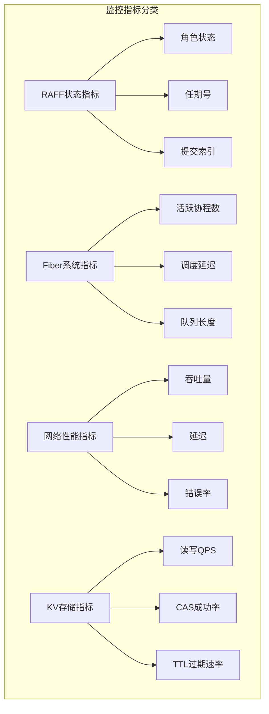
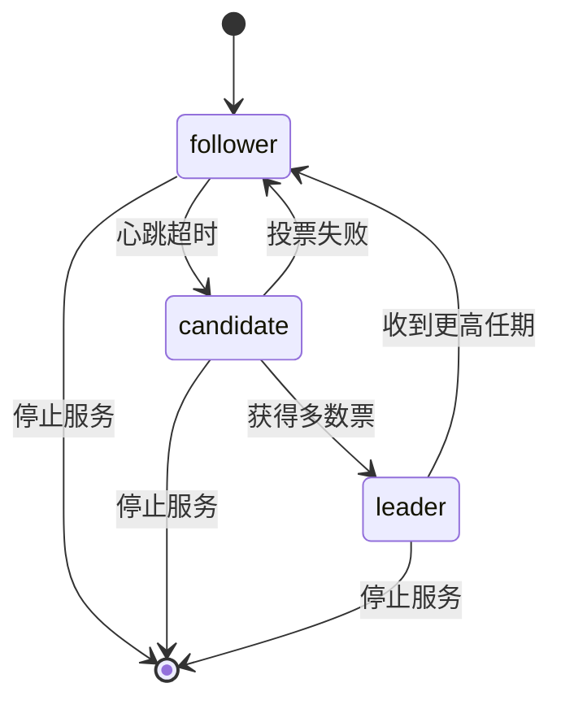
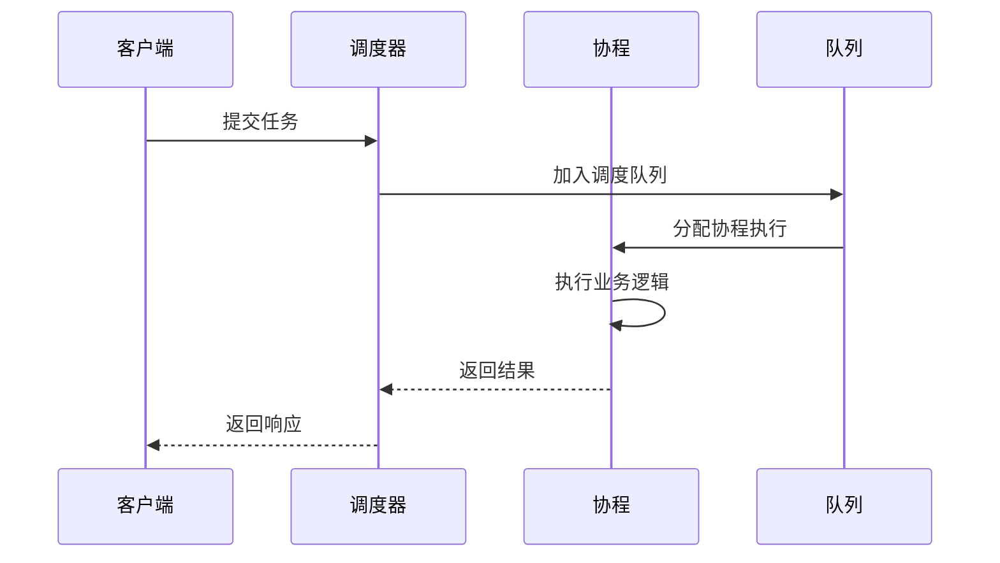
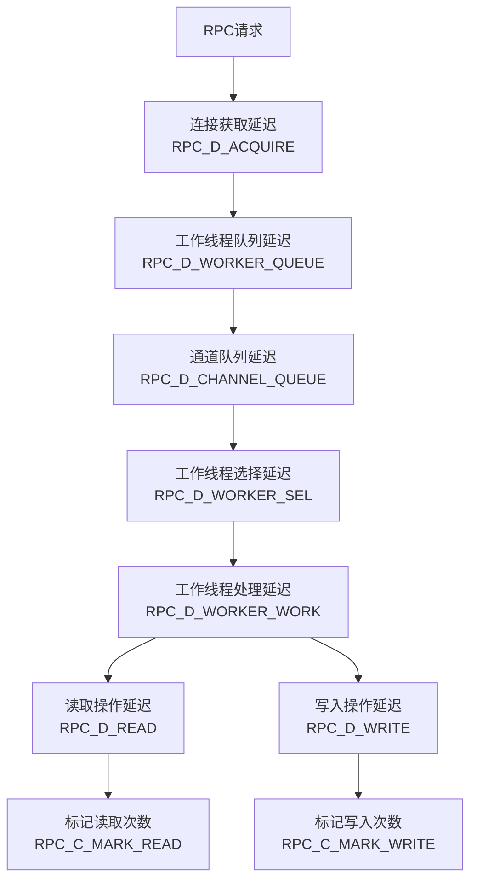
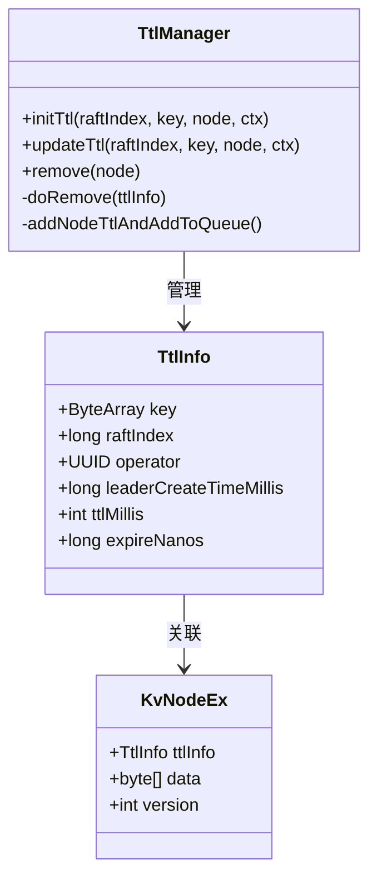
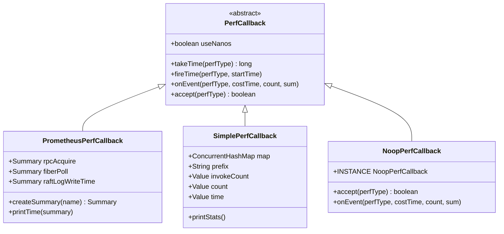
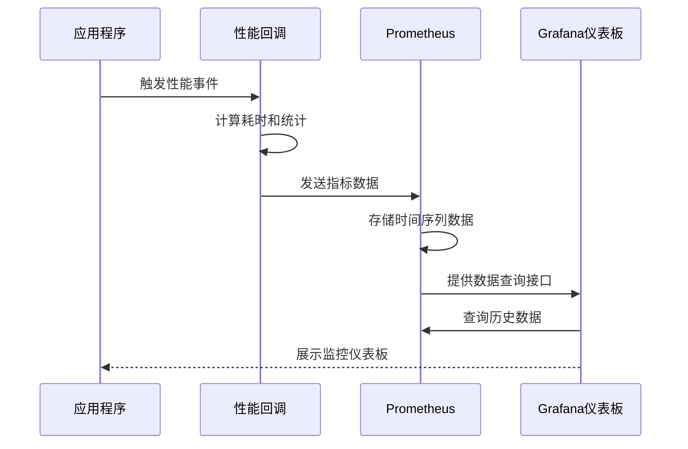
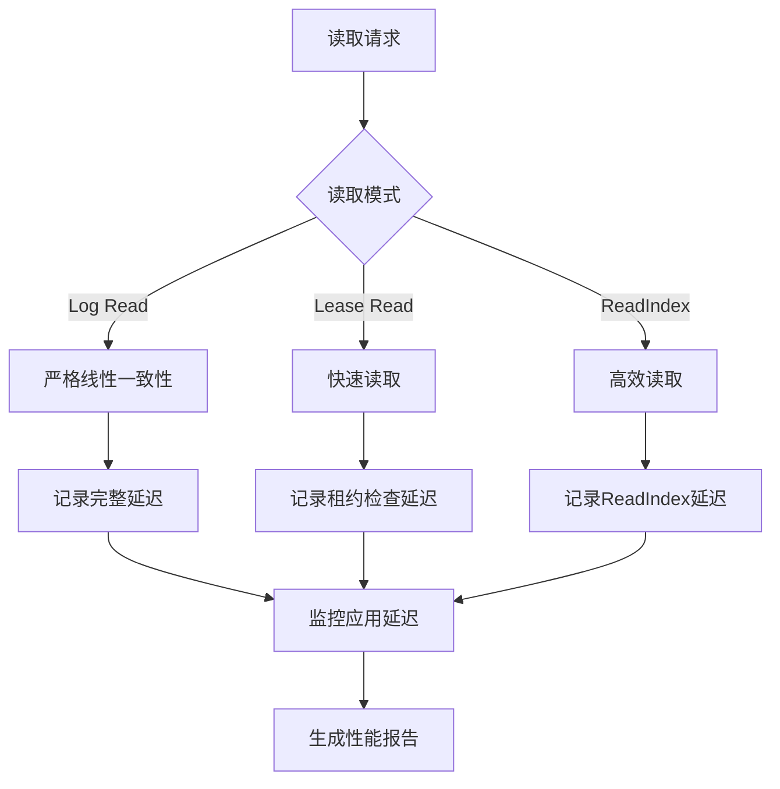

# 监控指标文档

<cite>
**本文档引用的文件**
- [PerfCallback.java](file://client/src/main/java/com/github/dtprj/dongting/common/PerfCallback.java)
- [PerfConsts.java](file://client/src/main/java/com/github/dtprj/dongting/common/PerfConsts.java)
- [PrometheusPerfCallback.java](file://benchmark/src/main/java/com/github/dtprj/dongting/bench/common/PrometheusPerfCallback.java)
- [SimplePerfCallback.java](file://benchmark/src/main/java/com/github/dtprj/dongting/bench/common/SimplePerfCallback.java)
- [RpcPerfCallback.java](file://benchmark/src/main/java/com/github/dtprj/dongting/bench/rpc/RpcPerfCallback.java)
- [RaftPerfCallback.java](file://benchmark/src/main/java/com/github/dtprj/dongting/bench/raft/RaftPerfCallback.java)
- [Dispatcher.java](file://server/src/main/java/com/github/dtprj/dongting/fiber/Dispatcher.java)
- [TtlManager.java](file://server/src/main/java/com/github/dtprj/dongting/dtkv/server/TtlManager.java)
- [KvImpl.java](file://server/src/main/java/com/github/dtprj/dongting/dtkv/server/KvImpl.java)
- [RaftRole.java](file://server/src/main/java/com/github/dtprj/dongting/raft/impl/RaftRole.java)
- [RaftStatus.java](file://server/src/main/java/com/github/dtprj/dongting/raft/server/RaftStatus.java)
</cite>

## 目录
1. [简介](#简介)
2. [核心监控指标概述](#核心监控指标概述)
3. [RAFT状态监控指标](#raft状态监控指标)
4. [Fiber系统监控指标](#fiber系统监控指标)
5. [网络性能监控指标](#网络性能监控指标)
6. [KV存储监控指标](#kv存储监控指标)
7. [监控系统集成](#监控系统集成)
8. [线性一致性读延迟监控](#线性一致性读延迟监控)
9. [最佳实践建议](#最佳实践建议)
10. [故障排除指南](#故障排除指南)

## 简介

Dongting监控系统提供了全面的性能指标监控能力，通过PerfCallback接口实现了与Prometheus等监控系统的无缝集成。该系统能够实时监控分布式系统中的关键组件性能，包括RAFT状态管理、Fiber协程调度、网络通信和KV存储操作等核心功能。

监控系统采用分层架构设计，通过统一的性能回调机制收集各个组件的运行时指标，并支持多种输出格式，便于与现有的监控基础设施集成。

## 核心监控指标概述

Dongting监控系统定义了以下几类核心监控指标：



**图表来源**
- [PerfConsts.java](file://client/src/main/java/com/github/dtprj/dongting/common/PerfConsts.java#L20-L50)

## RAFT状态监控指标

### RAFT角色状态监控

RAFF集群中的每个节点都会维护当前的角色状态，这是监控系统中最基础也是最重要的指标之一。



**图表来源**
- [RaftRole.java](file://server/src/main/java/com/github/dtprj/dongting/raft/impl/RaftRole.java#L20-L23)

### RAFT状态字段监控

RAFF协议的核心状态信息包括：

- **currentTerm**: 当前任期号，用于选举过程中识别过时的领导者
- **votedFor**: 当前任期中获得投票的候选者ID
- **commitIndex**: 已提交的日志条目索引
- **lastApplied**: 最后应用到状态机的日志条目索引

这些状态信息对于监控RAFF集群的健康状况至关重要，特别是在检测分区、脑裂和状态同步问题时。

**章节来源**
- [RaftStatus.java](file://server/src/main/java/com/github/dtprj/dongting/raft/server/RaftStatus.java#L25-L40)

### RAFT性能指标

系统为RAFF操作定义了详细的性能监控指标：

```java
// RAFF性能类型常量
int RAFT_D_LEADER_RUNNER_FIBER_LATENCY = 30;    // 领导者协程延迟
int RAFT_D_ENCODE_AND_WRITE = 31;              // 日志编码和写入
int RAFT_D_LOG_WRITE1 = 32;                     // 日志写入阶段1
int RAFT_D_LOG_WRITE2 = 33;                     // 日志写入阶段2
int RAFT_D_LOG_SYNC = 34;                       // 日志同步
int RAFT_D_REPLICATE_RPC = 42;                  // 复制RPC
int RAFT_D_STATE_MACHINE_EXEC = 43;             // 状态机执行
```

**章节来源**
- [PerfConsts.java](file://client/src/main/java/com/github/dtprj/dongting/common/PerfConsts.java#L35-L50)

## Fiber系统监控指标

### 协程调度监控

Fiber系统是Dongting的核心异步处理引擎，其性能直接影响整个系统的响应能力。



**图表来源**
- [Dispatcher.java](file://server/src/main/java/com/github/dtprj/dongting/fiber/Dispatcher.java#L584-L616)

### Fiber性能指标

系统为Fiber调度定义了以下关键指标：

- **FIBER_D_POLL**: 协程轮询延迟
- **FIBER_D_WORK**: 协程工作延迟

这些指标帮助监控协程调度的效率和系统资源利用率。

**章节来源**
- [PerfConsts.java](file://client/src/main/java/com/github/dtprj/dongting/common/PerfConsts.java#L28-L29)

### Fiber系统统计信息

通过简单的性能回调实现，系统可以输出详细的Fiber统计信息：

```java
// Fiber线程利用率计算
double total = fiberPoll.get().sum + fiberWork.get().sum;
double work = fiberWork.get().sum / total;
log.info(String.format("fiber thread utilization rate: %.2f%%", work * 100));
```

**章节来源**
- [RaftPerfCallback.java](file://benchmark/src/main/java/com/github/dtprj/dongting/bench/raft/RaftPerfCallback.java#L170-L175)

## 网络性能监控指标

### RPC通信监控

Dongting的RPC系统包含多个层次的性能监控点：



**图表来源**
- [RpcPerfCallback.java](file://benchmark/src/main/java/com/github/dtprj/dongting/bench/rpc/RpcPerfCallback.java#L52-L93)

### 网络性能指标详解

系统为RPC操作定义了以下详细指标：

- **RPC_D_ACQUIRE**: 连接池获取连接的延迟
- **RPC_D_WORKER_QUEUE**: 工作线程队列等待时间
- **RPC_D_CHANNEL_QUEUE**: 通道队列等待时间
- **RPC_D_WORKER_SEL**: 工作线程选择延迟
- **RPC_D_WORKER_WORK**: 工作线程实际处理时间
- **RPC_D_READ**: 网络读取操作延迟和字节数
- **RPC_D_WRITE**: 网络写入操作延迟和字节数
- **RPC_C_MARK_READ/WRITE**: 读写操作计数

**章节来源**
- [PerfConsts.java](file://client/src/main/java/com/github/dtprj/dongting/common/PerfConsts.java#L20-L27)

## KV存储监控指标

### TTL管理监控

Dongting的KV存储系统支持TTL（生存时间）功能，这对于缓存和临时数据管理至关重要。



**图表来源**
- [TtlManager.java](file://server/src/main/java/com/github/dtprj/dongting/dtkv/server/TtlManager.java#L145-L179)

### KV操作性能监控

系统为KV操作定义了以下性能指标：

- **读写QPS**: 每秒查询和写入操作数量
- **CAS成功率**: Compare-And-Swap操作的成功比例
- **TTL过期速率**: 定期清理过期数据的速率

这些指标帮助监控KV存储系统的整体性能和数据生命周期管理效果。

**章节来源**
- [TtlManager.java](file://server/src/main/java/com/github/dtprj/dongting/dtkv/server/TtlManager.java#L145-L179)

## 监控系统集成

### PerfCallback接口设计

Dongting的监控系统基于统一的PerfCallback接口设计，支持多种监控后端集成：



**图表来源**
- [PerfCallback.java](file://client/src/main/java/com/github/dtprj/dongting/common/PerfCallback.java#L20-L48)
- [PrometheusPerfCallback.java](file://benchmark/src/main/java/com/github/dtprj/dongting/bench/common/PrometheusPerfCallback.java#L33-L71)

### Prometheus集成实现

PrometheusPerfCallback实现了与Prometheus监控系统的无缝集成：

```java
protected Summary createSummary(String name) {
    return Summary.build()
            .name(name)
            .help(name)
            .quantile(0.0, 0.0)
            .quantile(0.5, 0.02)
            .quantile(0.99, 0.003)
            .quantile(1.0, 0.0)
            .register();
}
```

该实现支持多种百分位数统计，包括P50、P99和最大值，便于进行性能分析和容量规划。

**章节来源**
- [PrometheusPerfCallback.java](file://benchmark/src/main/java/com/github/dtprj/dongting/bench/common/PrometheusPerfCallback.java#L33-L71)

### 性能数据收集流程



**图表来源**
- [PrometheusPerfCallback.java](file://benchmark/src/main/java/com/github/dtprj/dongting/bench/common/PrometheusPerfCallback.java#L55-L71)

## 线性一致性读延迟监控

### 线性一致性读原理

Dongting实现了严格的线性一致性读保证，这对于分布式系统的一致性至关重要。系统支持多种读取模式：

1. **Log Read**: 按日志顺序读取，保证严格线性一致性
2. **Lease Read**: 基于租约的快速读取，允许一定程度的最终一致性
3. **ReadIndex Read**: 通过ReadIndex机制实现的高效读取

### 读取延迟监控策略



### 监控指标配置

为了有效监控线性一致性读的性能，建议配置以下指标：

- **读取总延迟**: 包括所有读取模式的总体延迟
- **不同读取模式的延迟分布**: 分别监控Log Read、Lease Read和ReadIndex的延迟
- **读取成功率**: 统计各种读取模式的成功率
- **读取超时率**: 监控读取操作的超时情况

## 最佳实践建议

### 监控指标选择

1. **核心指标优先**: 优先监控对系统稳定性影响最大的指标
2. **分层监控**: 按照系统架构层次设置相应的监控指标
3. **阈值设置**: 为关键指标设置合理的告警阈值
4. **历史对比**: 建立基线并进行历史趋势分析

### 性能优化建议

1. **定期审查**: 定期审查监控指标，识别性能瓶颈
2. **容量规划**: 基于监控数据进行容量规划和扩容决策
3. **故障预防**: 通过监控提前发现潜在故障风险
4. **成本优化**: 分析监控开销，优化监控系统性能

### 监控系统运维

1. **数据保留策略**: 合理设置监控数据的保留时间
2. **告警配置**: 设置多层次的告警机制
3. **可视化展示**: 使用合适的图表和仪表板展示监控数据
4. **文档维护**: 保持监控指标文档的及时更新

## 故障排除指南

### 常见性能问题诊断

1. **高延迟问题**
   - 检查Fiber调度延迟指标
   - 分析RPC网络延迟
   - 查看RAFF日志写入延迟

2. **高错误率问题**
   - 监控网络连接错误
   - 检查Fiber异常情况
   - 分析RAFF状态同步问题

3. **资源耗尽问题**
   - 监控内存使用情况
   - 检查文件描述符使用
   - 分析线程池状态

### 故障恢复策略

1. **自动恢复**: 配置自动重启和恢复机制
2. **手动干预**: 准备故障处理手册和脚本
3. **降级策略**: 实施服务降级和限流措施
4. **数据恢复**: 建立数据备份和恢复流程

### 监控系统自身故障

1. **监控系统可用性**: 确保监控系统本身的高可用性
2. **监控数据准确性**: 定期验证监控数据的准确性
3. **监控系统性能**: 监控监控系统的性能开销
4. **监控系统安全**: 保护监控系统的访问安全

通过以上全面的监控指标体系和最佳实践，Dongting用户可以有效地监控和维护分布式系统的稳定性和性能。监控系统不仅提供了丰富的性能数据，还为系统的持续优化和故障排除提供了强有力的支持。