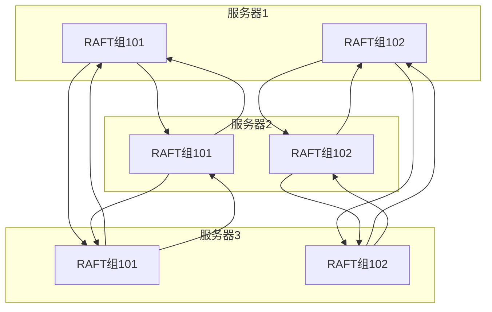
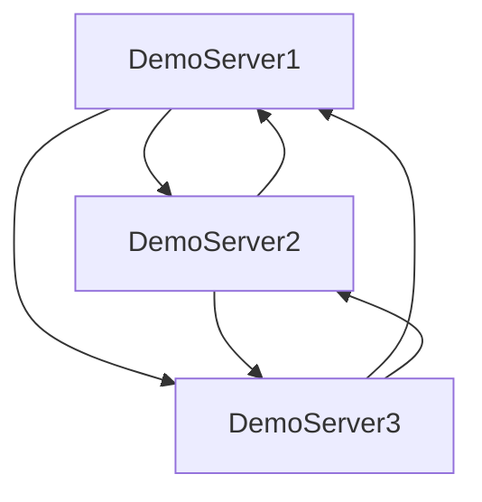
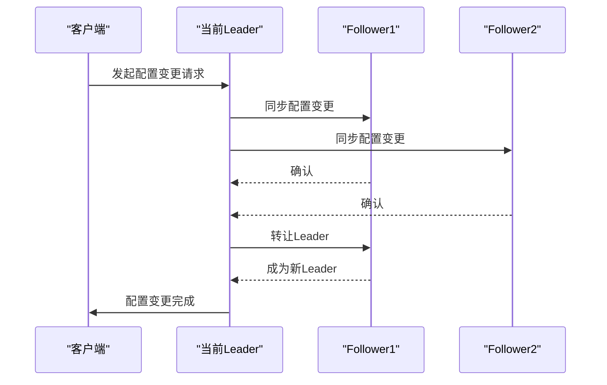
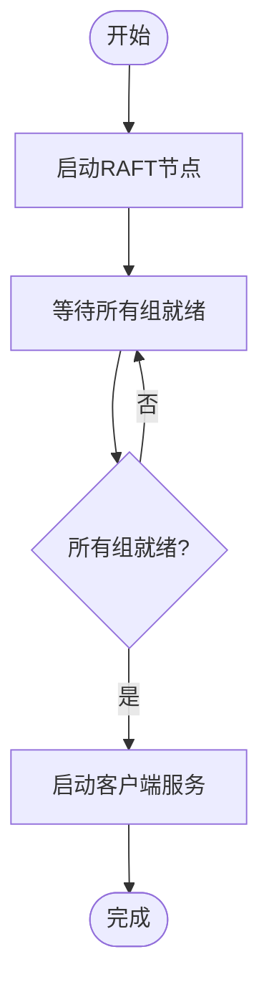

# 部署指南

<cite>
**本文档中引用的文件**  
- [DemoServer1.java](file://demos/src/main/java/com/github/dtprj/dongting/demos/cluster/DemoServer1.java)
- [DemoServer2.java](file://demos/src/main/java/com/github/dtprj/dongting/demos/cluster/DemoServer2.java)
- [DemoServer3.java](file://demos/src/main/java/com/github/dtprj/dongting/demos/cluster/DemoServer3.java)
- [MultiRaftDemoServer1.java](file://demos/src/main/java/com/github/dtprj/dongting/demos/multiraft/MultiRaftDemoServer1.java)
- [MultiRaftDemoServer2.java](file://demos/src/main/java/com/github/dtprj/dongting/demos/multiraft/MultiRaftDemoServer2.java)
- [MultiRaftDemoServer3.java](file://demos/src/main/java/com/github/dtprj/dongting/demos/multiraft/MultiRaftDemoServer3.java)
- [ConfigChangeDemoServer1.java](file://demos/src/main/java/com/github/dtprj/dongting/demos/configchange/ConfigChangeDemoServer1.java)
- [ConfigChangeDemoServer2.java](file://demos/src/main/java/com/github/dtprj/dongting/demos/configchange/ConfigChangeDemoServer2.java)
- [ConfigChangeDemoServer3.java](file://demos/src/main/java/com/github/dtprj/dongting/demos/configchange/ConfigChangeDemoServer3.java)
- [ConfigChangeDemoServer4.java](file://demos/src/main/java/com/github/dtprj/dongting/demos/configchange/ConfigChangeDemoServer4.java)
- [EmbeddedDemo.java](file://demos/src/main/java/com/github/dtprj/dongting/demos/embedded/EmbeddedDemo.java)
- [RaftServerConfig.java](file://server/src/main/java/com/github/dtprj/dongting/raft/server/RaftServerConfig.java)
- [2023_07_27_dongting的定位和原则.txt](file://devlogs/2023_07_27_dongting的定位和原则.txt)
</cite>

## 目录
1. [引言](#引言)
2. [集群部署建议](#集群部署建议)
3. [典型部署模式](#典型部署模式)
4. [高可用性设计](#高可用性设计)
5. [故障域隔离策略](#故障域隔离策略)
6. [启动顺序与健康检查](#启动顺序与健康检查)
7. [结论](#结论)

## 引言
本部署指南基于Dongting项目的devlogs中关于项目定位和设计原则的讨论，为生产环境下的集群部署提供详细建议。Dongting是一个集RAFT、MQ、配置中心和RPC于一体的高性能、零依赖引擎，其核心设计原则是精练、稳定和可扩展。本文档将重点介绍生产环境下的集群部署方案，包括节点数量、网络拓扑、硬件资源配置，以及单机多RAFT组与多机单组的适用场景。

## 集群部署建议

### 推荐的节点数量
根据RAFT算法的容错原理，推荐使用奇数个节点以确保在发生网络分区时能够形成多数派。常见的部署规模为3、5、7个节点：
- **3节点集群**：适用于大多数场景，可容忍1个节点故障
- **5节点集群**：适用于对可用性要求较高的场景，可容忍2个节点故障
- **7节点集群**：适用于跨地域部署的大型系统，可容忍3个节点故障

### 网络拓扑结构
建议采用跨机房部署策略以提高系统的容灾能力：
- **同城多机房部署**：将节点分布在不同机房，避免单点故障
- **主备机房部署**：在主机房部署多数节点，在备机房部署少数节点
- **跨地域部署**：对于需要异地多活的系统，可在不同地域部署节点

### 硬件资源配置
根据生产环境的性能需求，建议的硬件资源配置如下：
- **CPU**：至少4核，建议8核或以上
- **内存**：至少16GB，建议32GB或以上
- **磁盘类型**：建议使用SSD，确保RAFT日志的写入性能
- **网络**：建议使用千兆或万兆网络，确保节点间通信的低延迟

**Section sources**
- [2023_07_27_dongting的定位和原则.txt](file://devlogs/2023_07_27_dongting的定位和原则.txt)

## 典型部署模式

### 单机多RAFT组 vs 多机单组
Dongting支持灵活的部署模式，可根据业务需求选择合适的方案：

#### 单机多RAFT组
- **适用场景**：资源利用率要求高、节点数量有限的环境
- **优势**：充分利用单机资源，减少物理服务器数量
- **示例**：`MultiRaftDemoServer1`、`MultiRaftDemoServer2`、`MultiRaftDemoServer3`在每台服务器上运行多个RAFT组

**Diagram sources**
- [MultiRaftDemoServer1.java](file://demos/src/main/java/com/github/dtprj/dongting/demos/multiraft/MultiRaftDemoServer1.java)
- [MultiRaftDemoServer2.java](file://demos/src/main/java/com/github/dtprj/dongting/demos/multiraft/MultiRaftDemoServer2.java)
- [MultiRaftDemoServer3.java](file://demos/src/main/java/com/github/dtprj/dongting/demos/multiraft/MultiRaftDemoServer3.java)

#### 多机单组
- **适用场景**：对单个RAFT组性能要求极高、需要最大化可用性的环境
- **优势**：避免单机故障影响多个RAFT组，提高系统整体稳定性
- **示例**：`DemoServer1`、`DemoServer2`、`DemoServer3`构成一个3节点的RAFT集群

**Diagram sources**
- [DemoServer1.java](file://demos/src/main/java/com/github/dtprj/dongting/demos/cluster/DemoServer1.java)
- [DemoServer2.java](file://demos/src/main/java/com/github/dtprj/dongting/demos/cluster/DemoServer2.java)
- [DemoServer3.java](file://demos/src/main/java/com/github/dtprj/dongting/demos/cluster/DemoServer3.java)

## 高可用性设计

### 故障转移机制
Dongting的RAFT实现支持自动故障转移，当leader节点故障时，其他节点会通过选举产生新的leader，确保服务的连续性。

### 配置变更
Dongting支持运行时平滑的成员变更，通过两阶段变更和leader转让API，可以在不中断服务的情况下完成集群配置的调整。

**Diagram sources**
- [ConfigChangeDemoServer1.java](file://demos/src/main/java/com/github/dtprj/dongting/demos/configchange/ConfigChangeDemoServer1.java)
- [ConfigChangeDemoServer2.java](file://demos/src/main/java/com/github/dtprj/dongting/demos/configchange/ConfigChangeDemoServer2.java)
- [ConfigChangeDemoServer3.java](file://demos/src/main/java/com/github/dtprj/dongting/demos/configchange/ConfigChangeDemoServer3.java)
- [ConfigChangeDemoServer4.java](file://demos/src/main/java/com/github/dtprj/dongting/demos/configchange/ConfigChangeDemoServer4.java)

## 故障域隔离策略

### 物理隔离
将RAFT集群的节点部署在不同的物理机、机架或机房，避免单点故障影响整个集群。

### 网络隔离
使用独立的网络通道进行RAFT日志复制和客户端服务，确保关键通信不受影响。

### 资源隔离
为RAFT日志和数据存储使用独立的磁盘，避免I/O竞争影响性能。

**Section sources**
- [2023_07_27_dongting的定位和原则.txt](file://devlogs/2023_07_27_dongting的定位和原则.txt)

## 启动顺序与健康检查

### 启动顺序
1. 启动所有RAFT节点
2. 等待所有节点的`getAllGroupReadyFuture()`完成
3. 启动客户端服务

**Diagram sources**
- [EmbeddedDemo.java](file://demos/src/main/java/com/github/dtprj/dongting/demos/embedded/EmbeddedDemo.java)

### 健康检查机制
- **心跳检查**：节点间通过心跳机制检测彼此的健康状态
- **选举超时**：配置合理的选举超时时间（默认15秒）
- **RPC超时**：设置适当的RPC超时时间（默认5秒）
- **连接超时**：配置连接超时时间（默认2秒）

**Section sources**
- [RaftServerConfig.java](file://server/src/main/java/com/github/dtprj/dongting/raft/server/RaftServerConfig.java)

## 结论
Dongting提供了灵活的集群部署方案，可根据实际需求选择合适的节点数量、网络拓扑和硬件资源配置。通过单机多RAFT组或多机单组的部署模式，可以满足不同场景下的性能和可用性要求。结合高可用性设计和故障域隔离策略，可以构建稳定可靠的分布式系统。建议在生产环境中根据具体业务需求进行部署规划，并通过健康检查机制确保系统的稳定运行。