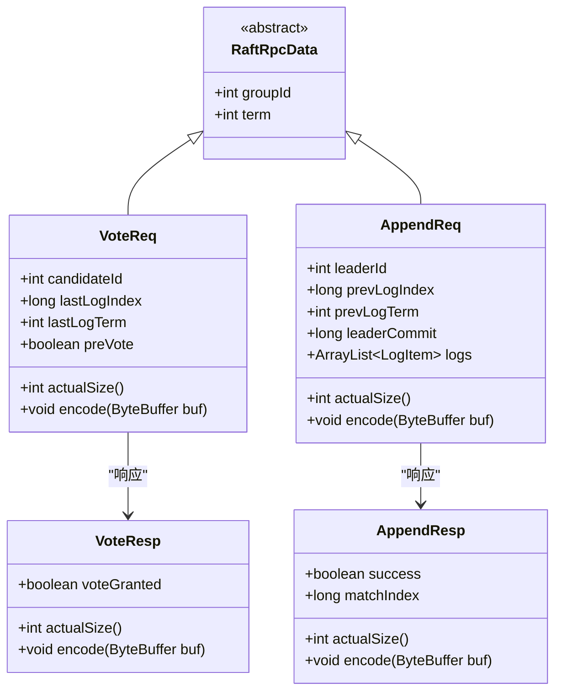

# RAFT一致性算法实现架构

<cite>
**本文档引用的文件**
- [RaftGroup.java](file://server/src/main/java/com/github/dtprj/dongting/raft/server/RaftGroup.java)
- [RaftGroupImpl.java](file://server/src/main/java/com/github/dtprj/dongting/raft/impl/RaftGroupImpl.java)
- [RaftRole.java](file://server/src/main/java/com/github/dtprj/dongting/raft/impl/RaftRole.java)
- [VoteReq.java](file://server/src/main/java/com/github/dtprj/dongting/raft/rpc/VoteReq.java)
- [AppendReq.java](file://server/src/main/java/com/github/dtprj/dongting/raft/rpc/AppendReq.java)
- [GroupComponents.java](file://server/src/main/java/com/github/dtprj/dongting/raft/impl/GroupComponents.java)
- [MemberManager.java](file://server/src/main/java/com/github/dtprj/dongting/raft/impl/MemberManager.java)
- [RaftServer.java](file://server/src/main/java/com/github/dtprj/dongting/raft/server/RaftServer.java)
- [Fiber.java](file://server/src/main/java/com/github/dtprj/dongting/fiber/Fiber.java)
- [AdminConfigChangeProcessor.java](file://server/src/main/java/com/github/dtprj/dongting/raft/rpc/AdminConfigChangeProcessor.java)
- [LinearTaskRunner.java](file://server/src/main/java/com/github/dtprj/dongting/raft/impl/LinearTaskRunner.java) - *流控逻辑已迁移至此*
- [TailCache.java](file://server/src/main/java/com/github/dtprj/dongting/raft/impl/TailCache.java) - *计数器管理已更新*
- [RaftGroupConfig.java](file://server/src/main/java/com/github/dtprj/dongting/raft/server/RaftGroupConfig.java) - *配置参数已调整*
- [RaftInput.java](file://server/src/main/java/com/github/dtprj/dongting/raft/server/RaftInput.java) - *流控大小计算已更新*
</cite>

## 更新摘要
**变更内容**
- 移除了 `PendingStat` 类，其功能已整合至 `TailCache` 和 `LinearTaskRunner`
- 流量控制逻辑已从 `RaftGroupImpl` 迁移至 `LinearTaskRunner` 类中
- `TailCache` 类现在直接管理待处理任务的计数和字节大小
- `RaftGroupConfig` 配置类中的流控参数名称已更新，移除了冗余前缀
- 更新了相关代码示例和序列图以反映最新的实现细节

## 目录
1. [简介](#简介)
2. [项目结构概览](#项目结构概览)
3. [RaftGroup抽象类设计](#raftgroup抽象类设计)
4. [RaftGroupImpl核心实现](#raftgroupimpl核心实现)
5. [三节点角色转换机制](#三节点角色转换机制)
6. [RPC消息类型详解](#rpc消息类型详解)
7. [Fiber协程系统集成](#fiber协程系统集成)
8. [Joint Consensus配置变更](#joint-consensus配置变更)
9. [故障检测与恢复机制](#故障检测与恢复机制)
10. [多RAFT组部署架构](#多raft组部署架构)
11. [性能考虑与优化](#性能考虑与优化)
12. [总结](#总结)

## 简介

Dongting项目实现了一个高性能的RAFT一致性算法，采用单线程状态机的线性执行模式，结合Fiber协程系统确保数据一致性和高可用性。该实现具有以下特点：

- **单线程状态机**：所有状态机操作在单个Fiber线程中执行，保证线性一致性
- **协程驱动**：基于Fiber协程系统，提供高效的异步处理能力
- **多组部署**：支持多个独立的RAFT组并行运行
- **配置变更**：完整实现Joint Consensus算法，支持动态集群配置调整
- **故障自愈**：内置心跳检测和自动故障恢复机制

## 项目结构概览

RAFT相关的核心组件分布在以下目录结构中：


**图表来源**
- [RaftServer.java](file://server/src/main/java/com/github/dtprj/dongting/raft/server/RaftServer.java#L1-L50)
- [GroupComponents.java](file://server/src/main/java/com/github/dtprj/dongting/raft/impl/GroupComponents.java#L1-L30)

## RaftGroup抽象类设计

RaftGroup是RAFT协议执行单元的核心抽象类，定义了所有RAFT组必须实现的基本接口：


**图表来源**
- [RaftGroup.java](file://server/src/main/java/com/github/dtprj/dongting/raft/server/RaftGroup.java#L25-L101)
- [RaftGroupImpl.java](file://server/src/main/java/com/github/dtprj/dongting/raft/impl/RaftGroupImpl.java#L40-L80)

### 核心功能职责

1. **日志提交管理** (`submitLinearTask`)
   - 接收客户端请求并将其转换为RAFT日志条目
   - 实现流量控制，防止系统过载
   - 确保日志的线性化提交

2. **成员管理**
   - 维护集群成员列表
   - 处理成员加入和离开
   - 支持观察者节点模式

3. **领导权转移**
   - 提供主动领导权转移功能
   - 支持超时控制和异常处理

4. **配置变更**
   - 实现Joint Consensus算法
   - 支持准备、提交和中止阶段

**章节来源**
- [RaftGroup.java](file://server/src/main/java/com/github/dtprj/dongting/raft/server/RaftGroup.java#L25-L101)
- [RaftGroupImpl.java](file://server/src/main/java/com/github/dtprj/dongting/raft/impl/RaftGroupImpl.java#L75-L120)

## RaftGroupImpl核心实现

RaftGroupImpl是RaftGroup抽象类的具体实现，负责协调各个子组件完成RAFT协议的执行：


**图表来源**
- [RaftGroupImpl.java](file://server/src/main/java/com/github/dtprj/dongting/raft/impl/RaftGroupImpl.java#L75-L120)
- [LinearTaskRunner.java](file://server/src/main/java/com/github/dtprj/dongting/raft/impl/LinearTaskRunner.java#L131-L138)

### 关键实现特性

1. **线性任务执行**
   ```java
   @Override
   public void submitLinearTask(RaftInput input, RaftCallback callback) {
       Objects.requireNonNull(input);
       if (fiberGroup.isShouldStop()) {
           RaftUtil.release(input);
           throw new RaftException("raft group thread is stop");
       }
       int type = input.isReadOnly() ? LogItem.TYPE_LOG_READ : LogItem.TYPE_NORMAL;
       // 任务提交已迁移至LinearTaskRunner，由其负责流控
       groupComponents.linearTaskRunner.submitRaftTaskInBizThread(type, input, callback);
   }
   ```

2. **租约读取机制**
   - 实现线性化读取
   - 基于租约时间窗口
   - 自动检测租约过期

3. **状态机集成**
   - 确保状态机操作的原子性
   - 支持快照恢复
   - 提供状态查询接口

**章节来源**
- [RaftGroupImpl.java](file://server/src/main/java/com/github/dtprj/dongting/raft/impl/RaftGroupImpl.java#L75-L150)

## 三节点角色转换机制

RAFT算法的核心是三种节点角色之间的动态转换：


**图表来源**
- [RaftRole.java](file://server/src/main/java/com/github/dtprj/dongting/raft/impl/RaftRole.java#L18-L23)

### 角色转换触发条件

1. **Follower → Candidate**
   - 选举超时（随机时间间隔）
   - 当前没有有效的领导者
   - 自动发起选举

2. **Candidate → Leader**
   - 获得超过半数的选票
   - 成功建立领导地位

3. **Leader → Follower**
   - 收到更高任期号的投票请求
   - 收到更新的日志条目

### 投票机制实现

投票请求包含以下关键字段：
- `candidateId`: 候选人ID
- `lastLogIndex`: 最后一条日志索引
- `lastLogTerm`: 最后一条日志任期
- `preVote`: 预投票标志

```java
public class VoteReq extends RaftRpcData {
    public int candidateId;
    public long lastLogIndex;
    public int lastLogTerm;
    public boolean preVote;
}
```

**章节来源**
- [RaftRole.java](file://server/src/main/java/com/github/dtprj/dongting/raft/impl/RaftRole.java#L18-L23)
- [VoteReq.java](file://server/src/main/java/com/github/dtprj/dongting/raft/rpc/VoteReq.java#L30-L40)

## RPC消息类型详解

RAFT协议依赖多种RPC消息类型来实现选举和日志复制：



**图表来源**
- [VoteReq.java](file://server/src/main/java/com/github/dtprj/dongting/raft/rpc/VoteReq.java#L30-L40)
- [AppendReq.java](file://server/src/main/java/com/github/dtprj/dongting/raft/rpc/AppendReq.java#L40-L60)

### 选举流程RPC交互


**图表来源**
- [VoteReq.java](file://server/src/main/java/com/github/dtprj/dongting/raft/rpc/VoteReq.java#L30-L101)

### 日志复制流程RPC交互


**图表来源**
- [AppendReq.java](file://server/src/main/java/com/github/dtprj/dongting/raft/rpc/AppendReq.java#L40-L155)

**章节来源**
- [VoteReq.java](file://server/src/main/java/com/github/dtprj/dongting/raft/rpc/VoteReq.java#L30-L101)
- [AppendReq.java](file://server/src/main/java/com/github/dtprj/dongting/raft/rpc/AppendReq.java#L40-L155)

## Fiber协程系统集成

Dongting的RAFT实现深度集成了Fiber协程系统，确保所有状态机操作都在单个线程中顺序执行：


**图表来源**
- [Fiber.java](file://server/src/main/java/com/github/dtprj/dongting/fiber/Fiber.java#L25-L50)

### 协程执行模型

1. **单线程执行**：所有RAFT状态机操作在同一个Fiber线程中执行
2. **异步非阻塞**：使用协程框架避免线程切换开销
3. **错误隔离**：单个协程的异常不会影响其他协程

### 线性任务运行器

```java
public class LinearTaskRunner {
    public void submitRaftTaskInBizThread(int type, RaftInput input, RaftCallback callback) {
        // 在业务线程中顺序执行任务
        // 确保状态机操作的线性化
    }
}
```

**章节来源**
- [Fiber.java](file://server/src/main/java/com/github/dtprj/dongting/fiber/Fiber.java#L25-L100)

## Joint Consensus配置变更

Dongting实现了完整的Joint Consensus算法，支持动态集群配置变更：


### 配置变更流程

1. **准备阶段**
   ```java
   public CompletableFuture<Long> leaderPrepareJointConsensus(
           Set<Integer> members, Set<Integer> observers,
           Set<Integer> prepareMembers, Set<Integer> prepareObservers) {
       // 写入联合配置到日志
       // 等待多数节点确认
   }
   ```

2. **提交阶段**
   ```java
   public CompletableFuture<Long> leaderCommitJointConsensus(long prepareIndex) {
       // 提交新的配置
       // 移除旧配置的影响
   }
   ```

3. **中止阶段**
   ```java
   public CompletableFuture<Long> leaderAbortJointConsensus() {
       // 中止正在进行的配置变更
       // 恢复到原始配置
   }
   ```

### 行政命令处理器

```java
public class AdminConfigChangeProcessor extends RaftSequenceProcessor<AdminPrepareConfigChangeReq> {
    @Override
    protected WritePacket doProcess(ReqInfo reqInfo) {
        // 处理配置变更请求
        // 包括准备、提交和中止操作
    }
}
```

**章节来源**
- [AdminConfigChangeProcessor.java](file://server/src/main/java/com/github/dtprj/dongting/raft/rpc/AdminConfigChangeProcessor.java#L68-L102)

## 故障检测与恢复机制

RAFT协议内置了完善的心跳检测和故障恢复机制：


**图表来源**
- [MemberManager.java](file://server/src/main/java/com/github/dtprj/dongting/raft/impl/MemberManager.java#L197-L259)

### 心跳检测实现

```java
private void raftPing(RaftNodeEx raftNodeEx, RaftMember member, int nodeEpochWhenStartPing) {
    member.pinging = true;
    try {
        DtTime timeout = new DtTime(serverConfig.rpcTimeout, TimeUnit.MILLISECONDS);
        
        SimpleWritePacket f = RaftUtil.buildRaftPingPacket(serverConfig.nodeId, raftStatus);
        f.command = Commands.RAFT_PING;
        
        Executor executor = groupConfig.fiberGroup.getExecutor();
        RpcCallback<RaftPing> callback = (result, ex) -> executor.execute(
                () -> processPingResult(raftNodeEx, member, result, ex, nodeEpochWhenStartPing));
        client.sendRequest(raftNodeEx.peer, f, ctx -> ctx.toDecoderCallback(new RaftPing()),
                timeout, callback);
    } catch (Exception e) {
        log.error("raft ping error, remote={}", raftNodeEx.hostPort, e);
        member.pinging = false;
    }
}
```

### 故障恢复策略

1. **自动重连**：节点断开后自动尝试重新连接
2. **状态同步**：通过安装快照或增量日志同步状态
3. **配置适应**：动态调整集群配置以适应节点变化

**章节来源**
- [MemberManager.java](file://server/src/main/java/com/github/dtprj/dongting/raft/impl/MemberManager.java#L197-L259)

## 多RAFT组部署架构

Dongting支持在同一服务器上运行多个独立的RAFT组，实现资源的高效利用：


**图表来源**
- [RaftServer.java](file://server/src/main/java/com/github/dtprj/dongting/raft/server/RaftServer.java#L212-L240)

### 多组部署的优势

1. **资源隔离**：每个组有独立的Fiber线程组
2. **负载均衡**：不同组可以处理不同类型的服务请求
3. **故障隔离**：单个组的故障不影响其他组
4. **灵活配置**：每个组可以有不同的配置参数

### 初始化过程

```java
private void createRaftGroups(RaftServerConfig serverConfig,
                              List<RaftGroupConfig> groupConfig, HashSet<Integer> allNodeIds) {
    for (RaftGroupConfig rgc : groupConfig) {
        RaftGroupImpl g = createRaftGroup(serverConfig, allNodeIds, rgc);
        raftGroups.put(rgc.groupId, g);
    }
}

private RaftGroupImpl createRaftGroup(RaftServerConfig serverConfig, 
                                     Set<Integer> allNodeIds, RaftGroupConfig rgc) {
    GroupComponents gc = new GroupComponents();
    // 初始化GroupComponents
    // 创建FiberGroup
    // 设置状态机和日志存储
    return new RaftGroupImpl(gc);
}
```

**章节来源**
- [RaftServer.java](file://server/src/main/java/com/github/dtprj/dongting/raft/server/RaftServer.java#L212-L240)
- [RaftServer.java](file://server/src/main/java/com/github/dtprj/dongting/raft/server/RaftServer.java#L586-L610)

## 性能考虑与优化

### 流量控制机制

流控逻辑已从 `RaftGroupImpl` 迁移至 `LinearTaskRunner` 类中，由 `TailCache` 直接管理计数器。`RaftGroupConfig` 中的配置参数也已更新，移除了冗余的 `maxPendingRaftTasks` 前缀。

```java
private Throwable checkTask(RaftTask rt, RaftStatusImpl raftStatus) {
    RaftInput input = rt.input;
    if (input.getDeadline() != null && input.getDeadline().isTimeout(ts)) {
        return new RaftTimeoutException("timeout " + input.getDeadline().getTimeout(TimeUnit.MILLISECONDS) + "ms");
    }
    if (rt.type == LogItem.TYPE_NORMAL || rt.type == LogItem.TYPE_LOG_READ) {
        // 流控检查现在在LinearTaskRunner中执行
        if (raftStatus.tailCache.pendingCount >= groupConfig.maxPendingTasks) {
            log.warn("reject task, pendingRequests={}, maxPendingTasks={}",
                    raftStatus.tailCache.pendingCount, groupConfig.maxPendingTasks);
            return new FlowControlException("max pending tasks reached: " + groupConfig.maxPendingTasks);
        }
        if (raftStatus.tailCache.pendingBytes >= groupConfig.maxPendingTaskBytes) {
            log.warn("reject task, pendingBytes={}, maxPendingTaskBytes={}",
                    raftStatus.tailCache.pendingBytes, groupConfig.maxPendingTaskBytes);
            return new FlowControlException("max pending bytes reached: " + groupConfig.maxPendingTaskBytes);
        }
    }
    return null;
}
```

**章节来源**
- [LinearTaskRunner.java](file://server/src/main/java/com/github/dtprj/dongting/raft/impl/LinearTaskRunner.java#L203-L220)
- [TailCache.java](file://server/src/main/java/com/github/dtprj/dongting/raft/impl/TailCache.java#L40-L41)
- [RaftGroupConfig.java](file://server/src/main/java/com/github/dtprj/dongting/raft/server/RaftGroupConfig.java#L38-L41)

### 缓存优化

1. **尾部缓存**：缓存最近的日志条目，减少磁盘I/O
2. **状态缓存**：缓存RAFT状态信息，提高查询效率
3. **连接池**：复用网络连接，降低连接开销

### 并发优化

1. **Fiber协程**：避免传统线程切换的开销
2. **无锁设计**：在可能的情况下使用无锁算法
3. **批量处理**：合并多个小请求为批量操作

## 总结

Dongting的RAFT一致性算法实现展现了现代分布式系统设计的最佳实践：

### 核心优势

1. **架构清晰**：采用分层架构，职责分离明确
2. **性能优异**：基于Fiber协程系统，提供高并发性能
3. **功能完整**：支持所有RAFT核心功能和高级特性
4. **易于扩展**：模块化设计便于功能扩展和定制

### 技术创新

1. **单线程状态机**：确保线性一致性的同时保持高性能
2. **协程集成**：充分利用现代JVM的协程特性
3. **多组部署**：支持灵活的集群规模和资源配置
4. **智能故障恢复**：内置完善的故障检测和恢复机制

### 应用价值

该实现不仅适用于构建高性能的分布式存储系统，也为其他需要强一致性保证的分布式应用提供了优秀的参考架构。通过合理的配置和调优，可以在生产环境中稳定运行，满足各种高可用性要求的应用场景。