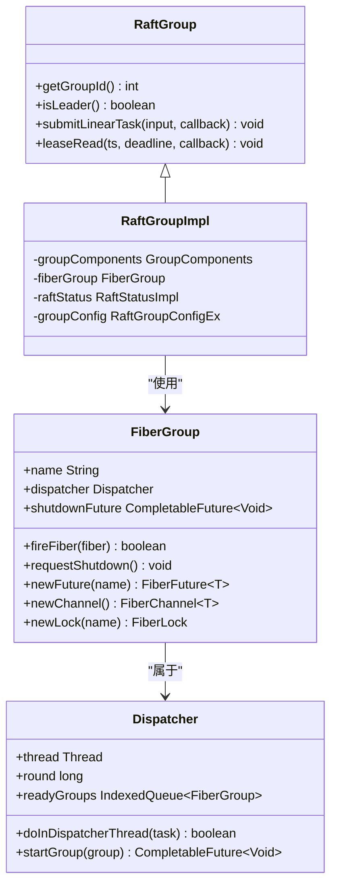

# 核心概念

<cite>
**本文档中引用的文件**  
- [FiberGroup.java](file://server/src/main/java/com/github/dtprj/dongting/fiber/FiberGroup.java)
- [Fiber.java](file://server/src/main/java/com/github/dtprj/dongting/fiber/Fiber.java)
- [RaftGroupImpl.java](file://server/src/main/java/com/github/dtprj/dongting/raft/impl/RaftGroupImpl.java)
- [RaftServer.java](file://server/src/main/java/com/github/dtprj/dongting/raft/server/RaftServer.java)
- [RaftGroup.java](file://server/src/main/java/com/github/dtprj/dongting/raft/server/RaftGroup.java)
- [2023_07_26_dongting线程模型.txt](file://devlogs/2023_07_26_dongting线程模型.txt)
- [2024_07_16_3000行代码实现fiber.md](file://devlogs/2024_07_16_3000行代码实现fiber.md)
- [2024_07_26_raft算法的工程实现秘笈.md](file://devlogs/2024_07_26_raft算法的工程实现秘笈.md)
- [2023_07_25_再论线性一致性.md](file://devlogs/2023_07_25_再论线性一致性.md)
</cite>

## 目录
1. [Fiber协程模型](#fiber协程模型)
2. [RAFT一致性算法](#raft一致性算法)
3. [RaftGroup与FiberGroup](#raftgroup与fibergroup)

## Fiber协程模型

Dongting项目中的Fiber是一种轻量级的用户态协程实现，旨在简化异步编程并提升并发性能。与Java线程和有栈协程相比，Fiber具有独特的设计和优势。

传统的异步编程依赖于`CompletableFuture`等回调机制，导致代码层层嵌套，难以维护。而Java 21的虚拟线程虽然简化了编程模型，但其底层实现依赖于JVM对线程栈的操作，无法在Java应用层直接实现。Dongting的Fiber通过无栈协程的方式，在不修改JDK底层的情况下，实现了类似的效果。

Fiber的核心概念包括：
- **Fiber**: 代表一个虚拟线程，当Fiber挂起时，不会阻塞底层操作系统线程，调度器可以将线程用于执行其他Fiber。
- **FiberFrame**: 模拟线程调用栈帧，用于保存Fiber的执行状态。由于Dongting Fiber是无栈实现，FiberFrame的切换不需要进行栈的保存和恢复，从而减少了性能开销。
- **FiberGroup**: 一组相关的Fiber集合，由同一个Dispatcher线程执行。只有当FiberGroup内所有非守护Fiber都执行完成后，该组才会停止。
- **Dispatcher**: 调度器，与线程一一对应，负责执行一个或多个FiberGroup中的Fiber。

Fiber的使用需要开发者显式调用`Fiber.call()`或`FiberFuture.await()`等方法来挂起Fiber。被调用的方法必须立即返回`Fiber.frameReturn()`，以便调度器可以切换到其他Fiber。这种设计避免了编译时检查的复杂性，但通过运行时检查来确保正确使用。

与Java线程相比，Fiber的创建和切换开销极小，可以轻松创建成千上万个Fiber。与有栈协程相比，Fiber无需复制整个调用栈，性能更高。然而，Fiber的切换需要手动控制，如果调用了会阻塞线程的方法（如`Thread.sleep()`），则会阻塞整个Dispatcher线程。

Fiber还提供了丰富的同步原语，如`FiberLock`、`FiberCondition`、`FiberChannel`等，其API设计与Java标准库中的对应类相似，便于开发者理解和使用。此外，Fiber通过`Throwable.addSuppressed`方法将FiberFrame的调用层次附加到异常堆栈中，解决了异步编程中常见的堆栈丢失问题，便于调试。

**Section sources**
- [FiberGroup.java](file://server/src/main/java/com/github/dtprj/dongting/fiber/FiberGroup.java)
- [Fiber.java](file://server/src/main/java/com/github/dtprj/dongting/fiber/Fiber.java)
- [2024_07_16_3000行代码实现fiber.md](file://devlogs/2024_07_16_3000行代码实现fiber.md)

## RAFT一致性算法

RAFT是一种用于管理复制日志的共识算法，能够保证分布式系统中数据的一致性。Dongting项目实现了完整的RAFT算法，并在此基础上进行了多项工程优化。

RAFT算法的核心是选举和日志复制。集群中的节点分为Leader、Follower和Candidate三种角色。正常情况下，只有一个Leader负责处理所有客户端请求，并将日志条目复制到其他Follower节点。当Leader失效时，Follower会超时并发起选举，选出新的Leader。

Dongting的RAFT实现支持多种读取方式，以平衡性能和一致性：
- **Log Read**: 将读请求作为普通日志条目处理，通过RAFT共识后在状态机中执行。这是最安全但性能最低的方式。
- **Read Index**: Leader与多数Follower通信确认其领导者地位后，记录当前的commit index作为读取索引，后续的读请求可以直接在该索引处执行。
- **Lease Read**: Leader通过租约机制确定其领导者地位。只要租约未过期，Leader就可以直接处理读请求，无需与Follower通信，性能最高。

线性一致性是分布式系统中最强的一致性模型。它要求所有操作看起来像是在一个单一的、全局的顺序中执行，且每个操作的执行时间点必须在其发起和完成之间。Dongting通过Lease Read机制实现了线性一致性读。Leader在租约有效期内处理的读请求，其执行时间点被视为在租约开始和结束之间，从而满足线性一致性。

为了实现高性能，Dongting的RAFT实现采用了多项优化技术：
- **异步Apply**: 状态机的执行可以在其他线程中异步进行，减轻了RAFT线程的负担。
- **并发写日志**: 日志的写入和刷盘操作是异步并发的，通过精确计算写入位置避免冲突，提升了吞吐量。
- **快速Index匹配**: 当Follower日志落后时，采用快速匹配算法（`tryFindMatchPos`）快速找到正确的复制起点，避免了逐条重试的低效。

**Section sources**
- [2024_07_26_raft算法的工程实现秘笈.md](file://devlogs/2024_07_26_raft算法的工程实现秘笈.md)
- [2023_07_25_再论线性一致性.md](file://devlogs/2023_07_25_再论线性一致性.md)

## RaftGroup与FiberGroup

在Dongting系统中，`RaftGroup`和`FiberGroup`是两个核心概念，它们共同构成了系统的并发和一致性模型。

`RaftGroup`代表一个独立的RAFT共识组，负责管理一组复制日志和状态机。一个Dongting集群可以包含多个`RaftGroup`，实现multi-raft架构。每个`RaftGroup`都有自己的成员配置、日志和状态机，可以独立进行选举和日志复制。这种设计使得系统可以通过增加`RaftGroup`的数量来水平扩展，而无需增加单个`RaftGroup`的副本数。

`FiberGroup`是Fiber的执行环境，一个`FiberGroup`内的所有Fiber都由同一个Dispatcher线程顺序执行。根据“Dongting线程模型”，每个`RaftGroup`的线性一致执行器是单线程的，因此每个`RaftGroup`都关联一个独立的`FiberGroup`。这确保了`RaftGroup`内部的操作是线程安全的，无需额外的同步开销。

`RaftGroup`和`FiberGroup`之间存在紧密的关联。在`RaftGroupImpl`的构造函数中，`FiberGroup`作为`GroupComponents`的一部分被注入。`RaftGroup`的许多操作，如`submitLinearTask`和`leaseRead`，都需要在`FiberGroup`的上下文中执行。当需要执行一个可能耗时的操作（如成员变更）时，`RaftGroup`会通过`fiberGroup.fireFiber()`启动一个新的Fiber来执行，从而避免阻塞主线程。

这种设计实现了并发而无并行的模型。`FiberGroup`内部的Fiber是并发执行的，但不会并行，因此避免了线程竞争和内存屏障的开销。同时，通过多个`Dispatcher`线程执行多个`FiberGroup`，系统可以充分利用多核CPU的计算能力。

**Diagram sources **
- [RaftGroupImpl.java](file://server/src/main/java/com/github/dtprj/dongting/raft/impl/RaftGroupImpl.java)
- [FiberGroup.java](file://server/src/main/java/com/github/dtprj/dongting/fiber/FiberGroup.java)
- [RaftServer.java](file://server/src/main/java/com/github/dtprj/dongting/raft/server/RaftServer.java)

**Section sources**
- [RaftGroupImpl.java](file://server/src/main/java/com/github/dtprj/dongting/raft/impl/RaftGroupImpl.java)
- [RaftServer.java](file://server/src/main/java/com/github/dtprj/dongting/raft/server/RaftServer.java)
- [RaftGroup.java](file://server/src/main/java/com/github/dtprj/dongting/raft/server/RaftGroup.java)