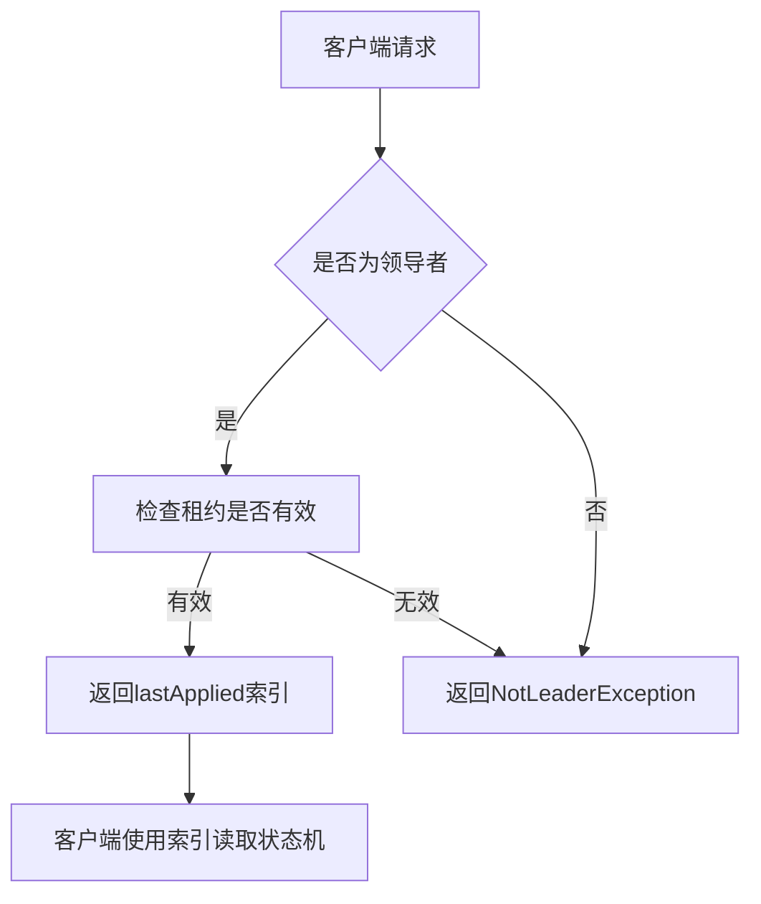
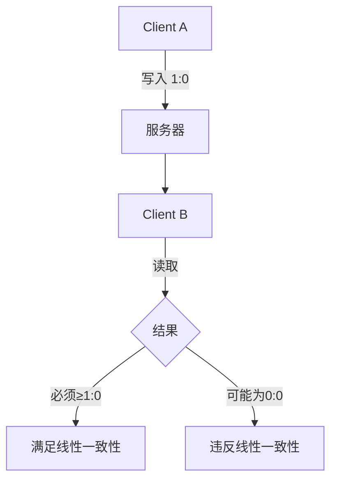
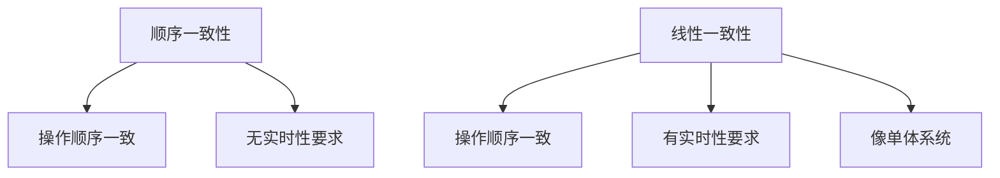
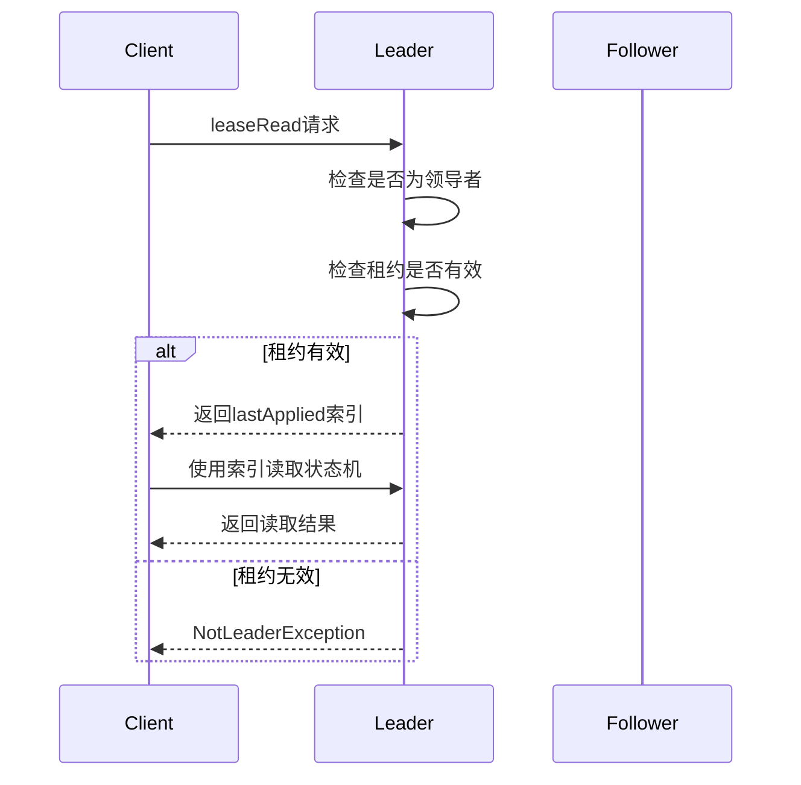
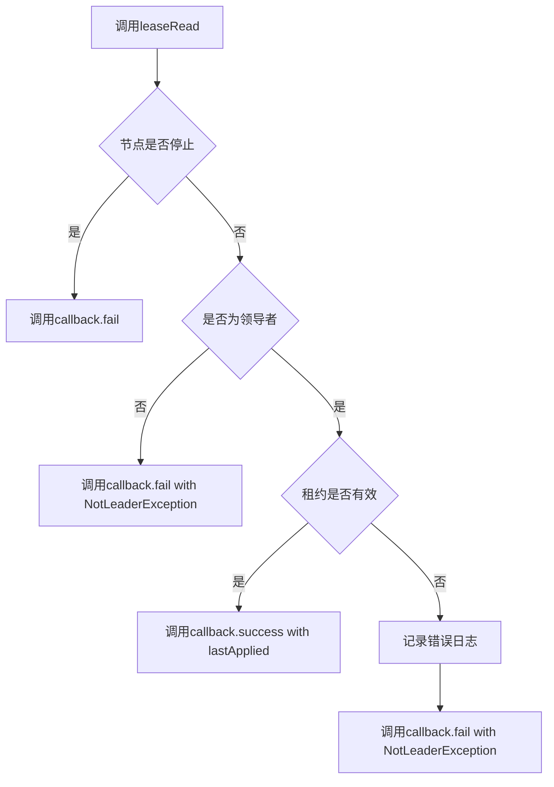
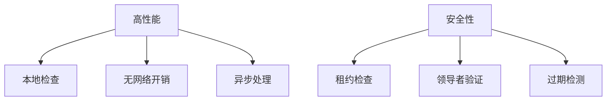
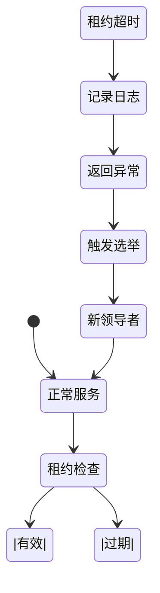
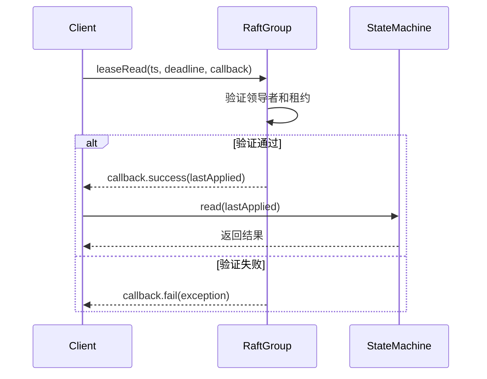

# 线性一致性

<cite>
**本文档引用的文件**
- [RaftGroup.java](file://server/src/main/java/com/github/dtprj/dongting/raft/server/RaftGroup.java)
- [RaftGroupImpl.java](file://server/src/main/java/com/github/dtprj/dongting/raft/impl/RaftGroupImpl.java)
- [2023_07_25_再论线性一致性.md](file://devlogs/2023_07_25_再论线性一致性.md)
- [DtKV.java](file://server/src/main/java/com/github/dtprj/dongting/dtkv/server/DtKV.java)
- [Timestamp.java](file://client/src/main/java/com/github/dtprj/dongting/common/Timestamp.java)
</cite>

## 目录
1. [引言](#引言)
2. [线性一致性的重要性](#线性一致性的重要性)
3. [线性一致性与顺序一致性的区别](#线性一致性与顺序一致性的区别)
4. [leaseRead机制实现原理](#leaseread机制实现原理)
5. [leaseRead方法参数分析](#leaseread方法参数分析)
6. [避免过期读的机制](#避免过期读的机制)
7. [租约超时处理策略](#租约超时处理策略)
8. [实际使用示例](#实际使用示例)
9. [结论](#结论)

## 引言
在分布式系统中，数据一致性是确保系统正确性和可靠性的关键。本文深入探讨了本项目中线性一致性（Linearizability）的实现机制，重点分析了通过leaseRead机制实现线性一致读的具体流程。基于devlogs中的技术笔记，我们将解释线性一致性对于分布式系统的重要性及其与顺序一致性的区别。



**图源**
- [RaftGroupImpl.java](file://server/src/main/java/com/github/dtprj/dongting/raft/impl/RaftGroupImpl.java#L200-L230)

**本节来源**
- [2023_07_25_再论线性一致性.md](file://devlogs/2023_07_25_再论线性一致性.md#L0-L63)
- [RaftGroupImpl.java](file://server/src/main/java/com/github/dtprj/dongting/raft/impl/RaftGroupImpl.java#L1-L50)

## 线性一致性的重要性
线性一致性是分布式系统中最强的一致性模型之一。它要求所有操作看起来像是在一个单一的、全局的顺序中执行，且每个操作的执行时间点必须在其开始和结束之间。这种一致性模型确保了系统对外表现得像一个单体系统，即使内部是分布式的。

在本项目中，线性一致性的重要性体现在以下几个方面：
- **数据新鲜性保证**：确保客户端读取到的数据是最新的，不会出现"时光倒流"的现象
- **因果关系维护**：如果一个写操作完成后，后续的读操作必须能看到该写操作的结果
- **系统可预测性**：为应用程序提供一个简单、可预测的数据访问模型



**图源**
- [2023_07_25_再论线性一致性.md](file://devlogs/2023_07_25_再论线性一致性.md#L0-L63)

**本节来源**
- [2023_07_25_再论线性一致性.md](file://devlogs/2023_07_25_再论线性一致性.md#L0-L63)

## 线性一致性与顺序一致性的区别
虽然线性一致性和顺序一致性都是强一致性模型，但它们之间存在重要区别。顺序一致性要求所有进程看到的操作顺序是一致的，但不强制要求操作的实时性约束。而线性一致性在此基础上增加了实时性要求。

关键区别在于：
- **顺序一致性**：只要求所有客户端看到相同的操作顺序，但不保证这个顺序与实际时间顺序一致
- **线性一致性**：不仅要求所有客户端看到相同的操作顺序，还要求这个顺序与实际时间顺序保持一致

例如，如果客户端A在时间t1写入数据，客户端B在时间t2（t2 > t1）读取数据，则线性一致性要求客户端B必须能读取到客户端A写入的数据或更新的数据。



**图源**
- [2023_07_25_再论线性一致性.md](file://devlogs/2023_07_25_再论线性一致性.md#L0-L63)

**本节来源**
- [2023_07_25_再论线性一致性.md](file://devlogs/2023_07_25_再论线性一致性.md#L0-L63)

## leaseRead机制实现原理
leaseRead机制是本项目实现线性一致读的核心技术。它允许领导者在不发起新一轮共识的情况下安全地处理读请求，从而显著提高读取性能。

### 基本流程
1. **租约获取**：领导者在成为领导者后获得一个租约，租约的有效期基于时钟同步假设
2. **读请求处理**：当收到读请求时，领导者检查当前租约是否有效
3. **安全读取**：如果租约有效，领导者可以直接返回其lastApplied索引，客户端使用该索引来读取状态机
4. **租约验证**：整个机制的安全性基于这样的假设：如果当前节点是领导者且租约未过期，则不会有其他节点能成为新的领导者

### 实现细节
在`RaftGroupImpl.leaseRead`方法中，实现逻辑如下：
- 首先检查当前节点是否为领导者
- 然后检查租约是否过期（`ss.leaseEndNanos - t < 0`）
- 如果租约有效，直接返回`ss.lastApplied`索引
- 如果租约过期或不是领导者，返回`NotLeaderException`



**图源**
- [RaftGroupImpl.java](file://server/src/main/java/com/github/dtprj/dongting/raft/impl/RaftGroupImpl.java#L200-L230)

**本节来源**
- [RaftGroupImpl.java](file://server/src/main/java/com/github/dtprj/dongting/raft/impl/RaftGroupImpl.java#L200-L230)
- [RaftGroup.java](file://server/src/main/java/com/github/dtprj/dongting/raft/server/RaftGroup.java#L30-L50)

## leaseRead方法参数分析
`leaseRead`方法的签名如下：
```java
public abstract void leaseRead(Timestamp ts, DtTime deadline, FutureCallback<Long> callback);
```

### 参数作用
- **Timestamp ts**：时间戳对象，用于获取当前时间。在`RaftGroupImpl`的实现中，通过`ts.refresh(1)`来确保时间戳的更新，参数1表示至少间隔1毫秒才更新
- **DtTime deadline**：截止时间，如果在截止时间前无法完成操作，将返回超时异常
- **FutureCallback<Long> callback**：回调函数，用于异步返回读取索引或异常

### 回调处理逻辑
回调处理遵循以下原则：
- **成功情况**：当租约有效时，立即调用`FutureCallback.callSuccess(callback, ss.lastApplied)`
- **失败情况**：当不是领导者或租约过期时，调用`FutureCallback.callFail(callback, exception)`
- **异步处理**：如果组尚未准备就绪，会将请求加入等待队列，待准备就绪后再通过`whenComplete`回调处理



**图源**
- [RaftGroupImpl.java](file://server/src/main/java/com/github/dtprj/dongting/raft/impl/RaftGroupImpl.java#L200-L230)

**本节来源**
- [RaftGroupImpl.java](file://server/src/main/java/com/github/dtprj/dongting/raft/impl/RaftGroupImpl.java#L200-L230)
- [Timestamp.java](file://client/src/main/java/com/github/dtprj/dongting/common/Timestamp.java#L0-L72)

## 避免过期读的机制
leaseRead机制通过多种方式避免网络分区下的过期读，同时保持高读取性能。

### 租约安全保证
租约机制的安全性基于以下假设：
- **时钟同步**：系统中所有节点的时钟偏差在可接受范围内
- **租约互斥**：在任何时刻，最多只有一个节点能持有有效的租约
- **心跳机制**：领导者通过定期发送心跳来维持其领导地位和租约

### 过期读检测
当租约过期时，系统会立即检测到并返回`NotLeaderException`，防止客户端读取可能过期的数据。在`RaftGroupImpl.leaseRead`方法中：
```java
if (ss.leaseEndNanos - t < 0) {
    // 租约已过期，记录错误日志并返回异常
    FutureCallback.callFail(callback, new NotLeaderException(...));
}
```

### 性能优化
- **零开销读取**：在租约有效期内，读取操作不需要额外的网络通信
- **本地处理**：所有检查都在领导者本地完成，避免了共识过程的开销
- **异步回调**：使用FutureCallback模式，避免阻塞调用线程



**图源**
- [RaftGroupImpl.java](file://server/src/main/java/com/github/dtprj/dongting/raft/impl/RaftGroupImpl.java#L200-L230)

**本节来源**
- [RaftGroupImpl.java](file://server/src/main/java/com/github/dtprj/dongting/raft/impl/RaftGroupImpl.java#L200-L230)

## 租约超时处理策略
租约超时是分布式系统中常见的故障场景，本项目采用了稳健的处理策略。

### 超时检测
系统通过比较当前时间与租约结束时间来检测超时：
```java
long t = ts.nanoTime;
if (ss.leaseEndNanos - t < 0) {
    // 租约已过期
}
```

### 日志记录
为了便于故障排查，系统会记录租约超时的详细信息：
```java
long x = (t - ss.leaseEndNanos) / 1_000_000;
log.error("lease expired for {} ms. lastApplied={}", x, ss.lastApplied);
```

### 故障场景
常见的租约超时故障场景包括：
- **网络延迟**：网络延迟导致心跳包无法及时到达
- **GC停顿**：长时间的垃圾回收导致节点无法及时更新租约
- **CPU过载**：节点CPU过载导致处理延迟
- **时钟漂移**：节点间时钟偏差过大

### 恢复机制
当租约超时后，系统会：
1. 立即拒绝新的读请求
2. 触发领导者选举过程
3. 新的领导者建立后，重新开始服务



**图源**
- [RaftGroupImpl.java](file://server/src/main/java/com/github/dtprj/dongting/raft/impl/RaftGroupImpl.java#L200-L230)

**本节来源**
- [RaftGroupImpl.java](file://server/src/main/java/com/github/dtprj/dongting/raft/impl/RaftGroupImpl.java#L200-L230)

## 实际使用示例
以下是leaseRead机制的实际使用示例：

### 基本使用模式
```java
Timestamp ts = new Timestamp();
DtTime deadline = new DtTime(5, TimeUnit.SECONDS);
FutureCallback<Long> callback = new FutureCallback<Long>() {
    @Override
    public void success(Long index) {
        // 使用index读取状态机
        Object result = stateMachine.read(index);
        // 处理读取结果
    }
    
    @Override
    public void fail(Throwable ex) {
        // 处理异常情况
        if (ex instanceof NotLeaderException) {
            // 尝试寻找新的领导者
            findNewLeader();
        } else if (ex instanceof RaftExecTimeoutException) {
            // 超时处理
            retryOrFail();
        }
    }
};
raftGroup.leaseRead(ts, deadline, callback);
```

### 在DtKV中的应用
在`DtKV`类中，线性一致读的使用模式如下：
```java
public FiberFuture<Object> exec(long index, long leaderCreateTimeMillis, 
                              long localCreateNanos, RaftInput input) {
    // 使用index确保线性一致性
    return dtkvExecutor.submitTaskInFiberThread(() -> {
        Object r = exec0(index, leaderCreateTimeMillis, localCreateNanos, input);
        f.fireComplete(r);
    });
}
```



**图源**
- [RaftGroupImpl.java](file://server/src/main/java/com/github/dtprj/dongting/raft/impl/RaftGroupImpl.java#L200-L230)
- [DtKV.java](file://server/src/main/java/com/github/dtprj/dongting/dtkv/server/DtKV.java#L150-L180)

**本节来源**
- [RaftGroupImpl.java](file://server/src/main/java/com/github/dtprj/dongting/raft/impl/RaftGroupImpl.java#L200-L230)
- [DtKV.java](file://server/src/main/java/com/github/dtprj/dongting/dtkv/server/DtKV.java#L150-L180)

## 结论
leaseRead机制是本项目实现线性一致性的关键技术，它通过租约机制在保证数据一致性的同时，显著提高了读取性能。该机制的核心优势在于：

1. **高性能**：在租约有效期内，读取操作无需额外的网络通信和共识过程
2. **强一致性**：通过租约和领导者验证，确保了线性一致性语义
3. **容错性**：完善的超时处理和故障恢复机制，保证了系统的可靠性

通过深入分析`RaftGroup.leaseRead`方法的实现，我们可以看到该项目在分布式一致性方面的精心设计。这种机制不仅满足了线性一致性的严格要求，还通过异步回调和本地检查等技术，实现了高性能的读取操作。

未来可以进一步优化的方向包括：
- 更精确的时钟同步机制
- 动态租约时长调整
- 更智能的故障预测和预防

这些改进将进一步提升系统的性能和可靠性。