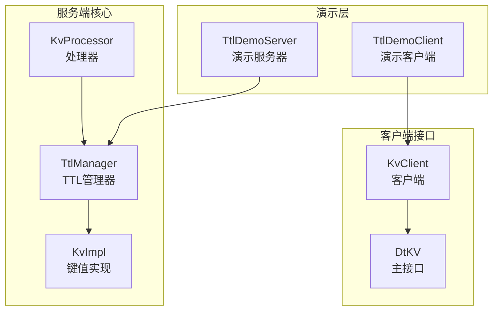
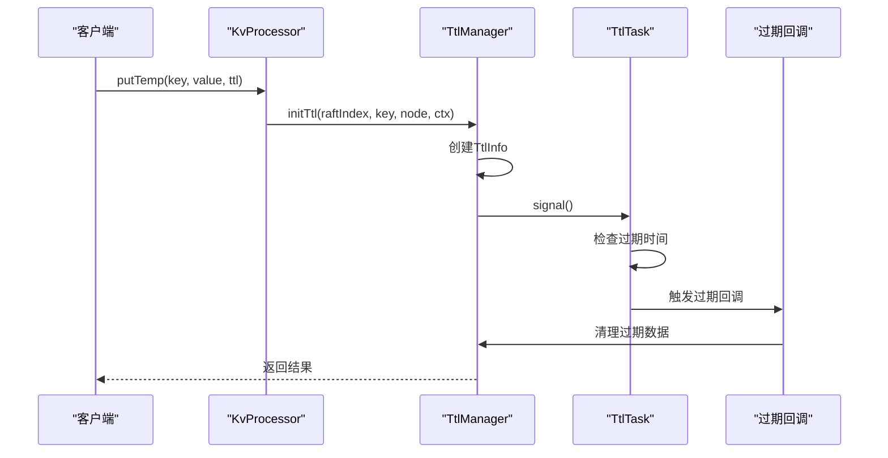
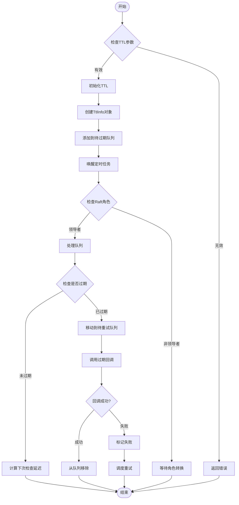
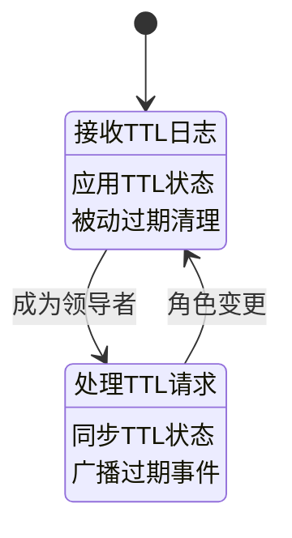
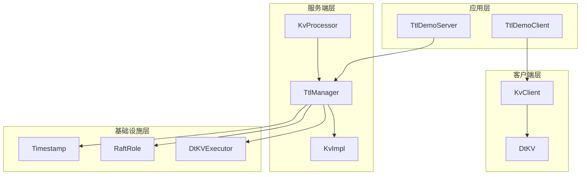

# TTL支持示例

<cite>
**本文档中引用的文件**
- [TtlDemoServer.java](file://demos/src/main/java/com/github/dtprj/dongting/demos/ttl/TtlDemoServer.java)
- [TtlDemoClient.java](file://demos/src/main/java/com/github/dtprj/dongting/demos/ttl/TtlDemoClient.java)
- [TtlManager.java](file://server/src/main/java/com/github/dtprj/dongting/dtkv/server/TtlManager.java)
- [TtlManagerTest.java](file://server/src/test/java/com/github/dtprj/dongting/dtkv/server/TtlManagerTest.java)
- [KvClient.java](file://client/src/main/java/com/github/dtprj/dongting/dtkv/KvClient.java)
- [KvImpl.java](file://server/src/main/java/com/github/dtprj/dongting/dtkv/server/KvImpl.java)
- [KvProcessor.java](file://server/src/main/java/com/github/dtprj/dongting/dtkv/server/KvProcessor.java)
- [DtKVTest.java](file://server/src/test/java/com/github/dtprj/dongting/dtkv/server/DtKVTest.java)
</cite>

## 目录
1. [简介](#简介)
2. [项目结构](#项目结构)
3. [核心组件](#核心组件)
4. [架构概览](#架构概览)
5. [详细组件分析](#详细组件分析)
6. [依赖关系分析](#依赖关系分析)
7. [性能考虑](#性能考虑)
8. [故障排除指南](#故障排除指南)
9. [结论](#结论)

## 简介

Dongting项目的TTL（Time-To-Live）功能是一个强大的自动过期机制，用于管理带有生存周期限制的键值对。该功能允许客户端为临时数据设置过期时间，系统会在指定时间后自动清理这些数据，确保存储空间的有效利用和数据的一致性。

TTL功能的核心特性包括：
- **自动过期清理**：系统会自动检测并清理过期的数据节点
- **分布式一致性**：基于Raft协议保证跨节点的一致性
- **高可用性**：支持主从切换时的TTL状态保持
- **精确计时**：基于纳秒级时间戳确保时间精度
- **批量处理**：支持批量过期操作提高效率

## 项目结构

TTL功能的实现分布在多个模块中，形成了一个完整的解决方案：



**图表来源**
- [TtlDemoServer.java](file://demos/src/main/java/com/github/dtprj/dongting/demos/ttl/TtlDemoServer.java#L1-L33)
- [TtlDemoClient.java](file://demos/src/main/java/com/github/dtprj/dongting/demos/ttl/TtlDemoClient.java#L1-L58)
- [TtlManager.java](file://server/src/main/java/com/github/dtprj/dongting/dtkv/server/TtlManager.java#L1-L242)

**章节来源**
- [TtlDemoServer.java](file://demos/src/main/java/com/github/dtprj/dongting/demos/ttl/TtlDemoServer.java#L1-L33)
- [TtlDemoClient.java](file://demos/src/main/java/com/github/dtprj/dongting/demos/ttl/TtlDemoClient.java#L1-L58)

## 核心组件

### TTL管理器（TtlManager）

TTL管理器是整个TTL功能的核心组件，负责管理所有带有过期时间的键值对：

```java
class TtlManager {
    final TreeSet<TtlInfo> ttlQueue = new TreeSet<>();      // 待过期队列
    final TreeSet<TtlInfo> pendingQueue = new TreeSet<>();  // 待重试队列
    final TtlTask task;                                     // 定时任务
    boolean stop;                                           // 停止标志
    private RaftRole role;                                  // Raft角色
}
```

### TTL信息（TtlInfo）

每个TTL条目都由TtlInfo对象表示，包含关键的过期信息：

```java
final class TtlInfo implements Comparable<TtlInfo> {
    final ByteArray key;                    // 键名
    final long raftIndex;                   // Raft索引
    final UUID owner;                       // 所有者UUID
    final long leaderTtlStartMillis;        // 领导者TTL开始时间
    final long ttlMillis;                   // 存活时间（毫秒）
    final long expireNanos;                 // 过期时间（纳秒）
    private final int ttlInfoIndex;         // TTL信息索引
}
```

**章节来源**
- [TtlManager.java](file://server/src/main/java/com/github/dtprj/dongting/dtkv/server/TtlManager.java#L35-L242)

## 架构概览

TTL功能采用分层架构设计，确保高效的时间管理和数据清理：



**图表来源**
- [KvProcessor.java](file://server/src/main/java/com/github/dtprj/dongting/dtkv/server/KvProcessor.java#L148-L179)
- [TtlManager.java](file://server/src/main/java/com/github/dtprj/dongting/dtkv/server/TtlManager.java#L136-L179)

## 详细组件分析

### TTL演示服务器

TTL演示服务器是一个简单的单节点Raft集群，用于展示TTL功能的基本使用：

```java
public class TtlDemoServer extends DemoKvServerBase implements GroupId {
    public static void main(String[] args) {
        int nodeId = 1;
        String servers = "1,127.0.0.1:4001"; // serverId,ip:replicatePort
        String members = "1";
        String observers = "";
        startServer(nodeId, servers, members, observers, new int[]{GROUP_ID});
    }
}
```

这个服务器配置了一个单一的Raft节点，监听本地回环地址的4001端口。

### TTL演示客户端

TTL演示客户端展示了如何使用TTL功能进行键值对的临时存储：

```java
public class TtlDemoClient extends DemoClientBase implements GroupId {
    public static void main(String[] args) throws Exception {
        // 连接服务器
        String servers = "1,127.0.0.1:5001";
        KvClient kvClient = new KvClient();
        kvClient.start();
        kvClient.getRaftClient().clientAddNode(servers);
        
        // 设置3秒的TTL
        long ttlMillis = 3000;
        kvClient.putTemp(GROUP_ID, "tempKey1".getBytes(), "tempValue1".getBytes(), ttlMillis);
        
        // 获取数据
        KvNode node = kvClient.get(GROUP_ID, "tempKey1".getBytes());
        System.out.println("get tempKey1, value=" + new String(node.data));
        
        // 等待过期
        Thread.sleep(5000);
        
        // 数据应该已经过期
        node = kvClient.get(GROUP_ID, "tempKey1".getBytes());
        System.out.println("get tempKey1, value=" + (node == null ? "null" : new String(node.data)));
    }
}
```

### TTL管理器核心逻辑

TTL管理器的核心功能包括初始化、更新和删除TTL条目：



**图表来源**
- [TtlManager.java](file://server/src/main/java/com/github/dtprj/dongting/dtkv/server/TtlManager.java#L60-L120)

### 时间精度和延迟控制

TTL系统使用纳秒级时间戳确保精确的时间控制：

```java
// 默认延迟1秒
long defaultDelayNanos = 1_000_000_000L;

// 重试延迟1秒
long retryDelayNanos = 1_000_000_000L;

// 最大重试批次
static final int MAX_RETRY_BATCH = 10;

// 最大过期批次
static final int MAX_EXPIRE_BATCH = 50;
```

### 分布式一致性保证

TTL功能通过Raft协议确保分布式环境下的数据一致性：



**章节来源**
- [TtlManager.java](file://server/src/main/java/com/github/dtprj/dongting/dtkv/server/TtlManager.java#L43-L58)
- [TtlManager.java](file://server/src/main/java/com/github/dtprj/dongting/dtkv/server/TtlManager.java#L177-L240)

## 依赖关系分析

TTL功能的依赖关系体现了清晰的分层架构：



**图表来源**
- [TtlDemoClient.java](file://demos/src/main/java/com/github/dtprj/dongting/demos/ttl/TtlDemoClient.java#L1-L58)
- [TtlDemoServer.java](file://demos/src/main/java/com/github/dtprj/dongting/demos/ttl/TtlDemoServer.java#L1-L33)
- [TtlManager.java](file://server/src/main/java/com/github/dtprj/dongting/dtkv/server/TtlManager.java#L1-L242)

**章节来源**
- [TtlManager.java](file://server/src/main/java/com/github/dtprj/dongting/dtkv/server/TtlManager.java#L1-L242)

## 性能考虑

### 批量处理优化

TTL系统实现了批量处理机制以提高性能：

- **最大重试批次**：每次最多处理10个失败的过期任务
- **最大过期批次**：每次最多处理50个即将过期的任务
- **异步处理**：过期回调在单独的线程中执行，避免阻塞主流程

### 内存管理

- 使用TreeSet数据结构确保O(log n)的插入和查找复杂度
- 支持垃圾回收机制清理过期的节点引用
- 实现了高效的队列管理策略

### 网络延迟优化

- 基于纳秒级时间戳减少网络延迟影响
- 支持批量操作减少网络往返次数
- 实现了智能的重试机制

## 故障排除指南

### 常见问题及解决方案

#### 1. TTL数据未过期

**症状**：设置了TTL的数据没有在预期时间内过期

**可能原因**：
- 系统时间不准确
- Raft角色不是领导者
- 过期回调异常

**解决方案**：
```java
// 检查系统时间同步
Timestamp ts = new Timestamp();
System.out.println("当前时间：" + ts.wallClockMillis);

// 强制触发TTL检查
ttlManager.task.execute();

// 检查过期回调状态
if (ttlInfo.expireFailed) {
    System.out.println("上次过期失败，将在" + 
        (ttlInfo.lastFailNanos + ttlManager.retryDelayNanos - ts.nanoTime) + 
        "纳秒后重试");
}
```

#### 2. 过期回调异常

**症状**：过期回调抛出异常导致数据无法清理

**解决方案**：
- 检查回调函数的异常处理逻辑
- 确保回调函数不会抛出未捕获的异常
- 使用日志记录失败的过期操作

#### 3. 性能问题

**症状**：大量TTL数据导致性能下降

**解决方案**：
- 调整MAX_EXPIRE_BATCH和MAX_RETRY_BATCH参数
- 优化过期回调的处理逻辑
- 考虑使用更高效的存储策略

**章节来源**
- [TtlManagerTest.java](file://server/src/test/java/com/github/dtprj/dongting/dtkv/server/TtlManagerTest.java#L197-L233)

## 结论

Dongting项目的TTL功能提供了一个强大而可靠的自动过期机制，适用于各种分布式应用场景。其主要优势包括：

1. **简单易用**：通过putTemp API即可轻松实现临时数据存储
2. **高可靠性**：基于Raft协议确保分布式环境下的数据一致性
3. **高性能**：批量处理和异步回调机制提供优秀的性能表现
4. **精确计时**：纳秒级时间戳确保时间精度
5. **容错性强**：完善的错误处理和重试机制

通过本文档的详细介绍，开发者可以充分理解和正确使用Dongting的TTL功能，在分布式环境中实现高效的临时数据管理。建议在实际使用中根据具体需求调整参数配置，并建立完善的监控和告警机制以确保系统的稳定运行。