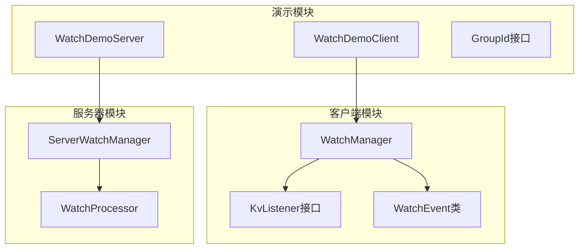
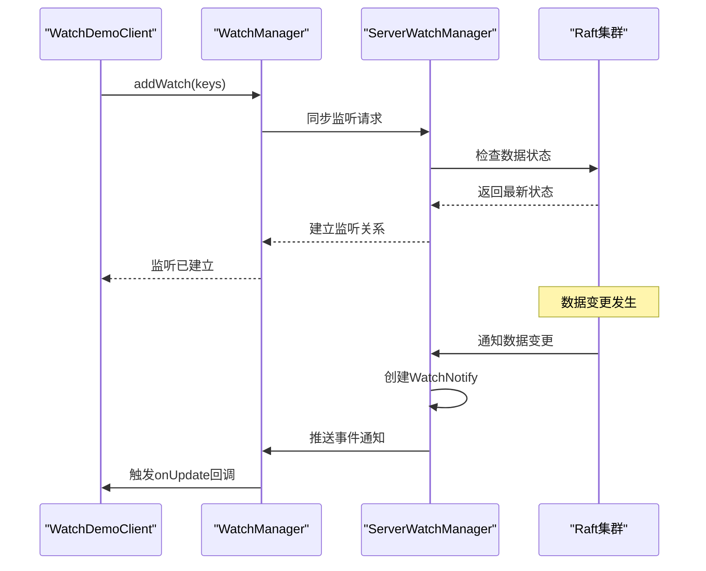
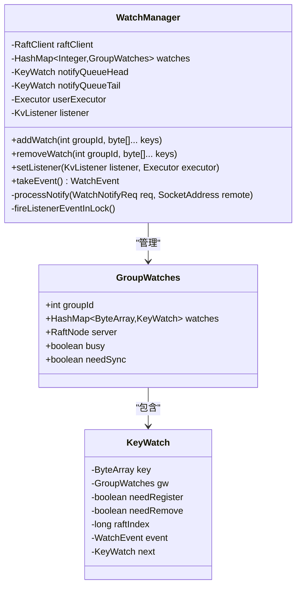
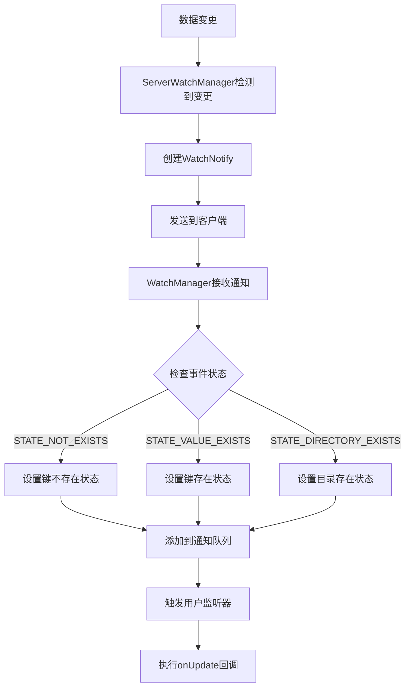
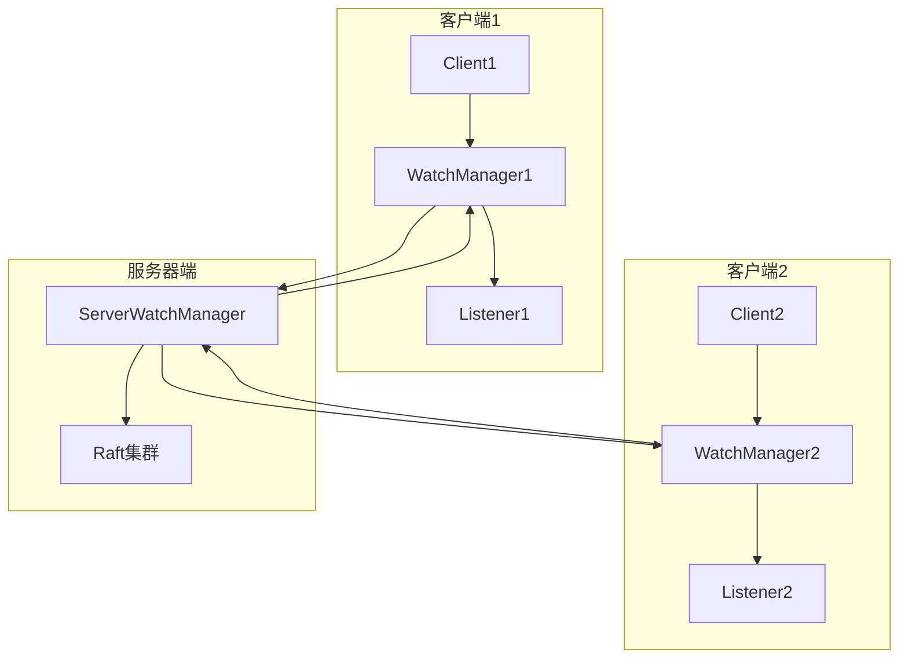
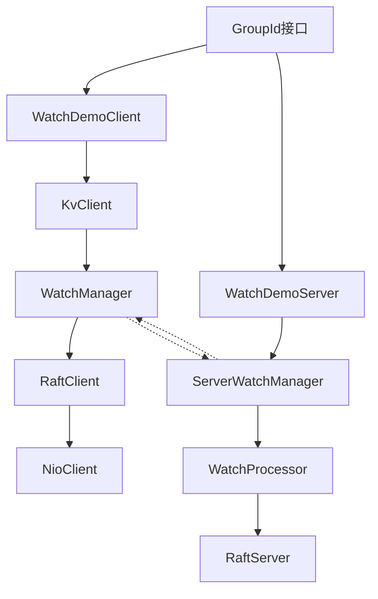

# Watch机制示例文档

<cite>
**本文档引用的文件**
- [WatchDemoServer.java](file://demos/src/main/java/com/github/dtprj/dongting/demos/watch/WatchDemoServer.java)
- [WatchDemoClient.java](file://demos/src/main/java/com/github/dtprj/dongting/demos/watch/WatchDemoClient.java)
- [GroupId.java](file://demos/src/main/java/com/github/dtprj/dongting/demos/watch/GroupId.java)
- [WatchEvent.java](file://client/src/main/java/com/github/dtprj/dongting/dtkv/WatchEvent.java)
- [KvListener.java](file://client/src/main/java/com/github/dtprj/dongting/dtkv/KvListener.java)
- [WatchManager.java](file://client/src/main/java/com/github/dtprj/dongting/dtkv/WatchManager.java)
- [ServerWatchManager.java](file://server/src/main/java/com/github/dtprj/dongting/dtkv/server/ServerWatchManager.java)
- [WatchProcessor.java](file://server/src/main/java/com/github/dtprj/dongting/dtkv/server/WatchProcessor.java)
- [WatchManagerTest.java](file://server/src/test/java/com/github/dtprj/dongting/dtkv/server/WatchManagerTest.java)
</cite>

## 目录
1. [简介](#简介)
2. [项目结构](#项目结构)
3. [核心组件](#核心组件)
4. [架构概览](#架构概览)
5. [详细组件分析](#详细组件分析)
6. [依赖关系分析](#依赖关系分析)
7. [性能考虑](#性能考虑)
8. [故障排除指南](#故障排除指南)
9. [结论](#结论)

## 简介

Watch机制是Dongting分布式键值存储系统中的一个重要特性，它允许客户端实时监听数据变更事件。本示例展示了如何使用Watch机制来实现事件通知功能，包括WatchDemoServer如何提供数据变更通知服务，以及WatchDemoClient如何注册监听器并接收数据变更事件。

Watch机制的核心价值在于为分布式系统提供了实时的数据变更通知能力，使得客户端能够及时响应数据变化，实现高效的缓存更新、状态同步等场景。

## 项目结构

Watch机制的实现分布在多个模块中，主要包括：



**图表来源**
- [WatchDemoServer.java](file://demos/src/main/java/com/github/dtprj/dongting/demos/watch/WatchDemoServer.java#L1-L33)
- [WatchDemoClient.java](file://demos/src/main/java/com/github/dtprj/dongting/demos/watch/WatchDemoClient.java#L1-L90)

**章节来源**
- [WatchDemoServer.java](file://demos/src/main/java/com/github/dtprj/dongting/demos/watch/WatchDemoServer.java#L1-L33)
- [WatchDemoClient.java](file://demos/src/main/java/com/github/dtprj/dongting/demos/watch/WatchDemoClient.java#L1-L90)

## 核心组件

### WatchDemoServer - 事件通知服务器

WatchDemoServer继承自DemoKvServerBase，负责启动一个单节点的Raft集群，为Watch机制提供数据存储和变更通知的基础服务。

```java
public class WatchDemoServer extends DemoKvServerBase implements GroupId {
    public static void main(String[] args) {
        int nodeId = 1;
        String servers = "1,127.0.0.1:4001";
        String members = "1";
        String observers = "";
        startServer(nodeId, servers, members, observers, new int[]{GROUP_ID});
    }
}
```

### WatchDemoClient - 监听器客户端

WatchDemoClient实现了完整的Watch机制使用示例，包括：
- 初始化数据
- 注册监听器
- 添加监听目标
- 处理各种事件类型
- 并发监听测试

```java
public class WatchDemoClient extends DemoClientBase implements GroupId {
    private static KvClient kvClient;

    public static void main(String[] args) throws Exception {
        // 配置服务器地址
        String servers = "1,127.0.0.1:5001";
        
        // 创建并配置KvClient
        kvClient = new KvClient();
        kvClient.getWatchManager().setListener(WatchDemoClient::onUpdate, Executors.newSingleThreadExecutor());
        kvClient.start();
        
        // 初始化数据和监听
        kvClient.put(GROUP_ID, "key1".getBytes(), "key1_v1".getBytes());
        kvClient.mkdir(GROUP_ID, "dir1".getBytes());
        kvClient.getWatchManager().addWatch(GROUP_ID, "key1".getBytes(), "dir1".getBytes());
    }
}
```

**章节来源**
- [WatchDemoServer.java](file://demos/src/main/java/com/github/dtprj/dongting/demos/watch/WatchDemoServer.java#L20-L33)
- [WatchDemoClient.java](file://demos/src/main/java/com/github/dtprj/dongting/demos/watch/WatchDemoClient.java#L30-L60)

## 架构概览

Watch机制的整体架构采用客户端-服务器模式，通过Raft共识算法保证数据的一致性和可靠性：



**图表来源**
- [WatchManager.java](file://client/src/main/java/com/github/dtprj/dongting/dtkv/WatchManager.java#L150-L200)
- [ServerWatchManager.java](file://server/src/main/java/com/github/dtprj/dongting/dtkv/server/ServerWatchManager.java#L450-L500)

## 详细组件分析

### WatchEvent - 事件数据结构

WatchEvent类定义了三种主要的事件状态：

```java
public class WatchEvent {
    public static final int STATE_NOT_EXISTS = 0;      // 键不存在
    public static final int STATE_VALUE_EXISTS = 1;    // 键存在且有值
    public static final int STATE_DIRECTORY_EXISTS = 2;// 目录存在
    
    public final int groupId;
    public final long raftIndex;
    public final int state;
    public final byte[] key;
    public final byte[] value;
}
```

### KvListener - 监听器接口

KvListener是一个函数式接口，定义了事件处理回调：

```java
@FunctionalInterface
public interface KvListener {
    void onUpdate(WatchEvent event);
}
```

### WatchManager - 客户端管理器

WatchManager是客户端的核心组件，负责：



**图表来源**
- [WatchManager.java](file://client/src/main/java/com/github/dtprj/dongting/dtkv/WatchManager.java#L60-L120)

### 事件处理流程

Watch事件的处理遵循以下流程：



**图表来源**
- [ServerWatchManager.java](file://server/src/main/java/com/github/dtprj/dongting/dtkv/server/ServerWatchManager.java#L345-L372)
- [WatchManager.java](file://client/src/main/java/com/github/dtprj/dongting/dtkv/WatchManager.java#L470-L520)

**章节来源**
- [WatchEvent.java](file://client/src/main/java/com/github/dtprj/dongting/dtkv/WatchEvent.java#L20-L40)
- [KvListener.java](file://client/src/main/java/com/github/dtprj/dongting/dtkv/KvListener.java#L20-L25)
- [WatchManager.java](file://client/src/main/java/com/github/dtprj/dongting/dtkv/WatchManager.java#L60-L150)

### 事件类型处理

WatchDemoClient展示了如何处理不同类型的事件：

```java
private static void onUpdate(WatchEvent event) {
    System.out.println("--------------------------");
    String key = new String(event.key);
    switch (event.state) {
        case WatchEvent.STATE_NOT_EXISTS:
            // 键被删除时的状态
            System.out.println("get STATE_NOT_EXISTS event: key=" + key + 
                             ", raftLogIndex=" + event.raftIndex);
            break;
        case WatchEvent.STATE_VALUE_EXISTS:
            // 键存在且有值时的状态
            System.out.println("get STATE_VALUE_EXISTS event: key=" + key + 
                             ", value=" + new String(event.value) + 
                             ", raftLogIndex=" + event.raftIndex);
            break;
        case WatchEvent.STATE_DIRECTORY_EXISTS:
            // 目录存在时的状态
            System.out.println("get STATE_DIRECTORY_EXISTS event: dir=" + key + 
                             ", raftLogIndex=" + event.raftIndex);
            // 需要手动检查子键
            KvNode n2 = kvClient.get(GROUP_ID, "dir1.key2".getBytes());
            KvNode n3 = kvClient.get(GROUP_ID, "dir1.key3".getBytes());
            System.out.println("dir1.key2=" + new String(n2.data) + 
                             ", dir1.key3=" + new String(n3.data));
            break;
    }
}
```

### 多客户端并发监听测试

Watch机制支持多个客户端同时监听相同的数据变更：



**图表来源**
- [WatchManager.java](file://client/src/main/java/com/github/dtprj/dongting/dtkv/WatchManager.java#L550-L600)

**章节来源**
- [WatchDemoClient.java](file://demos/src/main/java/com/github/dtprj/dongting/demos/watch/WatchDemoClient.java#L65-L88)

## 依赖关系分析

Watch机制的依赖关系体现了清晰的分层架构：



**图表来源**
- [WatchDemoClient.java](file://demos/src/main/java/com/github/dtprj/dongting/demos/watch/WatchDemoClient.java#L20-L30)
- [WatchDemoServer.java](file://demos/src/main/java/com/github/dtprj/dongting/demos/watch/WatchDemoServer.java#L20-L30)

**章节来源**
- [WatchDemoClient.java](file://demos/src/main/java/com/github/dtprj/dongting/demos/watch/WatchDemoClient.java#L1-L90)
- [WatchDemoServer.java](file://demos/src/main/java/com/github/dtprj/dongting/demos/watch/WatchDemoServer.java#L1-L33)

## 性能考虑

### 事件顺序保证

Watch机制通过Raft日志索引确保事件的顺序性：

1. **Raft Index跟踪**：每个事件都关联一个Raft日志索引，确保事件按正确顺序处理
2. **全局序列化**：监听器回调在全局序列化的方式下执行，避免竞态条件
3. **事件去重**：重复的事件会被覆盖，只保留最新的状态信息

### 批量处理优化

服务器端采用批量处理机制来提高性能：

```java
// 最大批处理大小配置
private final int dispatchBatchSize = config.watchMaxBatchSize;

// 批量推送通知
private void pushNotify(ChannelInfo ci) {
    // 收集待通知的事件
    // 限制单次推送的字节数
    // 批量发送给客户端
}
```

### 内存管理

WatchManager使用队列机制管理事件通知：

- **通知队列**：维护一个链表结构的事件队列
- **内存回收**：及时清理已处理的事件对象
- **资源释放**：在客户端断开连接时自动清理监听器

## 故障排除指南

### 常见问题及解决方案

1. **监听器未触发**
   - 检查是否正确设置了监听器
   - 确认客户端与服务器的网络连接正常
   - 验证数据变更操作是否成功

2. **事件丢失**
   - 检查Raft集群状态
   - 验证客户端的监听范围是否正确
   - 确认事件处理逻辑没有异常

3. **性能问题**
   - 调整批处理大小配置
   - 优化事件处理逻辑
   - 监控网络延迟和带宽使用

### 调试技巧

```java
// 启用调试日志
log.debug("Processing watch event: {}", event);

// 监控事件队列状态
System.out.println("Event queue size: " + notifyQueueSize);

// 检查监听器状态
if (listener == null) {
    System.out.println("No listener registered");
}
```

**章节来源**
- [WatchManager.java](file://client/src/main/java/com/github/dtprj/dongting/dtkv/WatchManager.java#L470-L520)

## 结论

Dongting的Watch机制提供了一个强大而灵活的实时数据变更通知系统。通过WatchDemoServer和WatchDemoClient的示例，我们可以看到：

1. **简单易用**：只需要几行代码就可以实现完整的监听功能
2. **高可靠性**：基于Raft共识算法，确保事件通知的一致性和可靠性
3. **高性能**：支持批量处理和异步通知，适合高并发场景
4. **灵活扩展**：支持多种事件类型和自定义处理逻辑

这个Watch机制特别适用于需要实时响应数据变化的应用场景，如缓存更新、状态同步、消息推送等。通过合理的设计和配置，可以在分布式系统中实现高效可靠的通知机制。