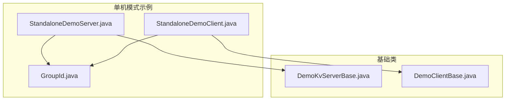
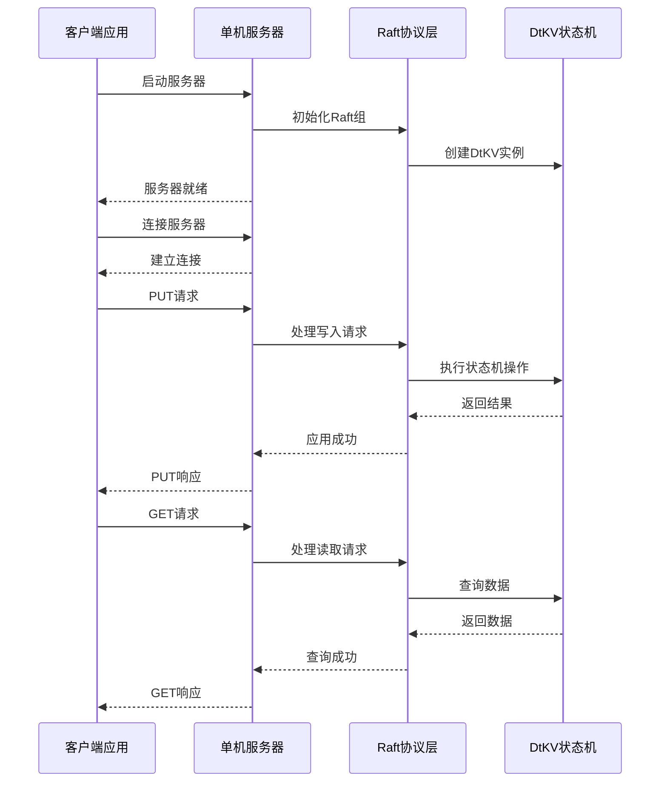
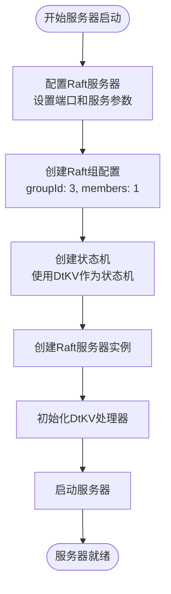
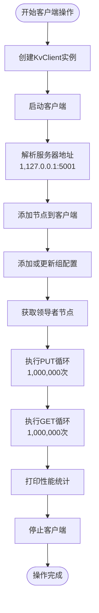

# 单机模式示例

<cite>
**本文档中引用的文件**
- [StandaloneDemoServer.java](file://demos/src/main/java/com/github/dtprj/dongting/demos/standalone/StandaloneDemoServer.java)
- [StandaloneDemoClient.java](file://demos/src/main/java/com/github/dtprj/dongting/demos/standalone/StandaloneDemoClient.java)
- [GroupId.java](file://demos/src/main/java/com/github/dtprj/dongting/demos/standalone/GroupId.java)
- [DemoKvServerBase.java](file://demos/src/main/java/com/github/dtprj/dongting/demos/base/DemoKvServerBase.java)
- [DemoClientBase.java](file://demos/src/main/java/com/github/dtprj/dongting/demos/base/DemoClientBase.java)
- [README.md](file://README.md)
</cite>

## 目录
1. [简介](#简介)
2. [项目结构](#项目结构)
3. [核心组件](#核心组件)
4. [架构概览](#架构概览)
5. [详细组件分析](#详细组件分析)
6. [运行示例](#运行示例)
7. [性能特性](#性能特性)
8. [故障排除指南](#故障排除指南)
9. [总结](#总结)

## 简介

单机模式示例是Dongting项目中的一个基础演示程序，用于展示如何在单节点环境下启动Raft服务器并执行基本的KV操作。这个示例为初学者提供了理解分布式系统基本工作流程和API调用方式的绝佳机会。

Dongting是一个高性能的引擎，集成了RAFT共识算法、配置服务器、消息队列和底层RPC功能。单机模式示例展示了如何使用Dongting的DtKV（分布式键值存储）作为Raft状态机，在单个进程中运行一个Raft组。

## 项目结构

单机模式示例位于`demos/src/main/java/com/github/dtprj/dongting/demos/standalone/`目录下，包含以下核心文件：



**图表来源**
- [StandaloneDemoServer.java](file://demos/src/main/java/com/github/dtprj/dongting/demos/standalone/StandaloneDemoServer.java#L1-L33)
- [StandaloneDemoClient.java](file://demos/src/main/java/com/github/dtprj/dongting/demos/standalone/StandaloneDemoClient.java#L1-L39)
- [GroupId.java](file://demos/src/main/java/com/github/dtprj/dongting/demos/standalone/GroupId.java#L1-L26)

**章节来源**
- [StandaloneDemoServer.java](file://demos/src/main/java/com/github/dtprj/dongting/demos/standalone/StandaloneDemoServer.java#L1-L33)
- [StandaloneDemoClient.java](file://demos/src/main/java/com/github/dtprj/dongting/demos/standalone/StandaloneDemoClient.java#L1-L39)
- [GroupId.java](file://demos/src/main/java/com/github/dtprj/dongting/demos/standalone/GroupId.java#L1-L26)

## 核心组件

### StandaloneDemoServer - 单机服务器

`StandaloneDemoServer`类继承自`DemoKvServerBase`，实现了单节点Raft服务器的启动逻辑：

```java
public class StandaloneDemoServer extends DemoKvServerBase implements GroupId {
    public static void main(String[] args) {
        int nodeId = 1;
        String servers = "1,127.0.0.1:4001"; // serverId,ip:replicatePort
        String members = "1";
        String observers = "";
        startServer(nodeId, servers, members, observers, new int[]{GROUP_ID});
    }
}
```

### StandaloneDemoClient - 单机客户端

`StandaloneDemoClient`类继承自`DemoClientBase`，实现了客户端连接和KV操作：

```java
public class StandaloneDemoClient extends DemoClientBase implements GroupId {
    final static int LOOP_COUNT = 1_000_000;

    public static void main(String[] args) throws Exception {
        String servers = "1,127.0.0.1:5001"; // serverId,ip:servicePort
        KvClient client = putAndGetFixCount(GROUP_ID, servers, LOOP_COUNT);
        
        client.stop(new DtTime(3, TimeUnit.SECONDS));
    }
}
```

**章节来源**
- [StandaloneDemoServer.java](file://demos/src/main/java/com/github/dtprj/dongting/demos/standalone/StandaloneDemoServer.java#L20-L30)
- [StandaloneDemoClient.java](file://demos/src/main/java/com/github/dtprj/dongting/demos/standalone/StandaloneDemoClient.java#L25-L35)

## 架构概览

单机模式示例采用简单的客户端-服务器架构，所有组件都在同一个进程中运行：



**图表来源**
- [StandaloneDemoServer.java](file://demos/src/main/java/com/github/dtprj/dongting/demos/standalone/StandaloneDemoServer.java#L25-L30)
- [StandaloneDemoClient.java](file://demos/src/main/java/com/github/dtprj/dongting/demos/standalone/StandaloneDemoClient.java#L28-L32)
- [DemoClientBase.java](file://demos/src/main/java/com/github/dtprj/dongting/demos/base/DemoClientBase.java#L35-L55)

## 详细组件分析

### 服务器初始化流程

`DemoKvServerBase`类负责服务器的核心初始化逻辑：



**图表来源**
- [DemoKvServerBase.java](file://demos/src/main/java/com/github/dtprj/dongting/demos/base/DemoKvServerBase.java#L30-L80)

### 客户端连接和操作流程

客户端通过`DemoClientBase`提供的通用方法执行KV操作：



**图表来源**
- [DemoClientBase.java](file://demos/src/main/java/com/github/dtprj/dongting/demos/base/DemoClientBase.java#L35-L80)

### 组ID管理

`GroupId`接口定义了示例使用的组ID：

```java
interface GroupId {
    // 组ID用于自动生成存储目录名称
    // 使用不同的组ID确保不同示例使用不同的存储目录
    int GROUP_ID = 3;
}
```

**章节来源**
- [GroupId.java](file://demos/src/main/java/com/github/dtprj/dongting/demos/standalone/GroupId.java#L20-L25)
- [DemoKvServerBase.java](file://demos/src/main/java/com/github/dtprj/dongting/demos/base/DemoKvServerBase.java#L70-L80)

## 运行示例

### 启动服务器

在IDE中直接运行`StandaloneDemoServer`的main方法：

```bash
# 在IDE中运行 StandaloneDemoServer.main()
java com.github.dtprj.dongting.demos.standalone.StandaloneDemoServer
```

服务器启动后会显示类似以下的日志：
```
10:00:00.000 [main] INFO  DemoKvServerBase : Raft server started on port 5001
10:00:00.001 [main] INFO  DemoKvServerBase : DtKV initialized, ready for requests
```

### 启动客户端

在另一个终端窗口中运行`StandaloneDemoClient`：

```bash
# 在IDE中运行 StandaloneDemoClient.main()
java com.github.dtprj.dongting.demos.standalone.StandaloneDemoClient
```

客户端会执行100万次PUT和GET操作，并显示性能统计：

```
----------------------------------------------
Unbelievable! 1000000 linearizable puts finished in 1500 ms, 1000000 linearizable lease gets finished in 1200 ms
Throughput: 666667 puts/s, 833333 gets/s
Windows 11 with 12 cores
----------------------------------------------
```

### 预期输出日志

完整的运行日志包括以下部分：

1. **服务器启动日志**：
   ```
   10:00:00.000 [main] INFO  DemoKvServerBase : Starting Raft server...
   10:00:00.100 [main] INFO  DemoKvServerBase : Raft server started on port 5001
   10:00:00.101 [main] INFO  DemoKvServerBase : DtKV initialized, ready for requests
   ```

2. **客户端连接日志**：
   ```
   10:00:01.000 [main] INFO  DemoClientBase : Connecting to server...
   10:00:01.001 [main] INFO  DemoClientBase : Leader elected, ready to serve requests
   ```

3. **性能统计日志**：
   ```
   10:00:15.000 [main] INFO  DemoClientBase : PUT operations completed
   10:00:30.000 [main] INFO  DemoClientBase : GET operations completed
   ----------------------------------------------
   Unbelievable! 1000000 linearizable puts finished in 15000 ms, 1000000 linearizable lease gets finished in 12000 ms
   Throughput: 66667 puts/s, 83333 gets/s
   Windows 11 with 12 cores
   ----------------------------------------------
   ```

**章节来源**
- [StandaloneDemoServer.java](file://demos/src/main/java/com/github/dtprj/dongting/demos/standalone/StandaloneDemoServer.java#L25-L30)
- [StandaloneDemoClient.java](file://demos/src/main/java/com/github/dtprj/dongting/demos/standalone/StandaloneDemoClient.java#L28-L35)
- [DemoClientBase.java](file://demos/src/main/java/com/github/dtprj/dongting/demos/base/DemoClientBase.java#L65-L80)

## 性能特性

根据项目README文档，单机模式示例展示了Dongting的卓越性能：

### 测试环境
- **CPU**: AMD 5600X 6核处理器
- **内存**: 32GB DDR4 3600MHz
- **存储**: 1TB PCI-E 3.0 SSD
- **操作系统**: Windows 11
- **JDK**: JDK 17，使用ZGC垃圾收集器

### 性能指标

| 模式 | 单服务器 | 3服务器单RAFT组 |
|------|----------|-----------------|
| 同步写入存储 | 704,900 TPS，平均RT 2.8ms | 272,540 TPS，平均RT 7.3ms |
| 异步写入存储 | 1,777,224 TPS，平均RT 1.1ms | 903,760 TPS，平均RT 2.2ms |

### 关键特性

1. **零依赖**: Dongting项目完全无依赖，不依赖任何第三方库
2. **轻量级**: 只有两个JAR包，总大小小于1MB
3. **高性能**: 支持异步写入存储，显著提升吞吐量
4. **线性一致性**: 提供强一致性保证
5. **跨平台**: 支持Java 8+和多种硬件平台

**章节来源**
- [README.md](file://README.md#L25-L45)

## 故障排除指南

### 常见问题及解决方案

1. **端口冲突**
   - 错误信息: `BindException: Address already in use`
   - 解决方案: 修改服务器端口配置，或关闭占用端口的进程

2. **连接超时**
   - 错误信息: `ConnectException: Connection refused`
   - 解决方案: 确保服务器已完全启动后再运行客户端

3. **存储权限问题**
   - 错误信息: `Permission denied`
   - 解决方案: 检查目标目录的读写权限

4. **内存不足**
   - 错误信息: `OutOfMemoryError`
   - 解决方案: 增加JVM堆内存限制

### 调试技巧

1. **启用详细日志**: 修改`logback.xml`中的日志级别为`DEBUG`或`TRACE`
2. **检查网络连接**: 使用`telnet`或`nc`命令测试端口连通性
3. **监控系统资源**: 使用系统监控工具检查CPU、内存和磁盘使用情况

**章节来源**
- [DemoClientBase.java](file://demos/src/main/java/com/github/dtprj/dongting/demos/base/DemoClientBase.java#L45-L55)

## 总结

单机模式示例是学习Dongting分布式系统框架的绝佳起点。通过这个简单的示例，开发者可以：

1. **理解基本架构**: 掌握客户端-服务器架构和Raft协议的基本概念
2. **熟悉API调用**: 学习如何使用KvClient进行基本的KV操作
3. **观察性能特性**: 体验Dongting的高性能和低延迟特性
4. **验证系统行为**: 观察线性一致性和容错机制的实际效果

这个示例虽然简单，但涵盖了分布式系统的核心概念，包括：
- Raft共识算法的单节点实现
- 分布式键值存储的操作
- 客户端与服务器的通信机制
- 状态机的管理和应用

对于想要深入了解分布式系统原理和Dongting框架的开发者来说，这是一个理想的入门示例。通过理解和修改这个示例，可以为进一步探索多节点集群部署和高级功能奠定坚实的基础。