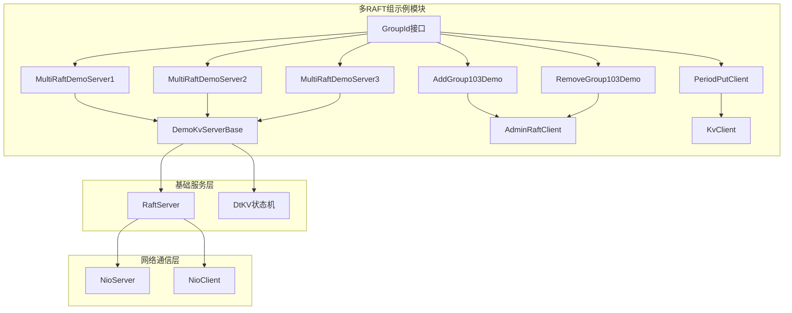
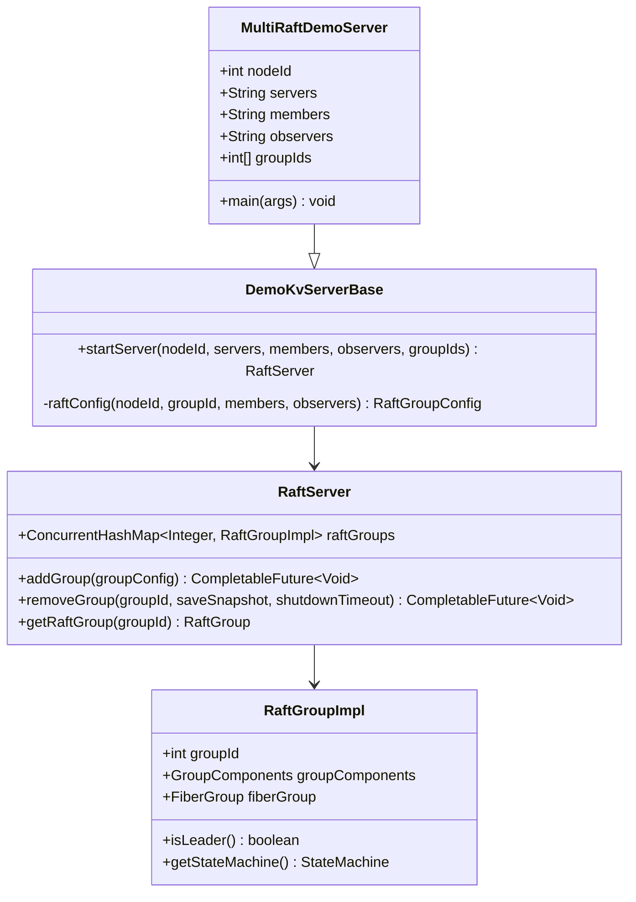
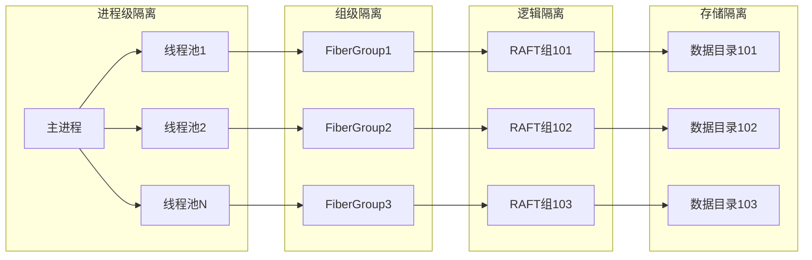
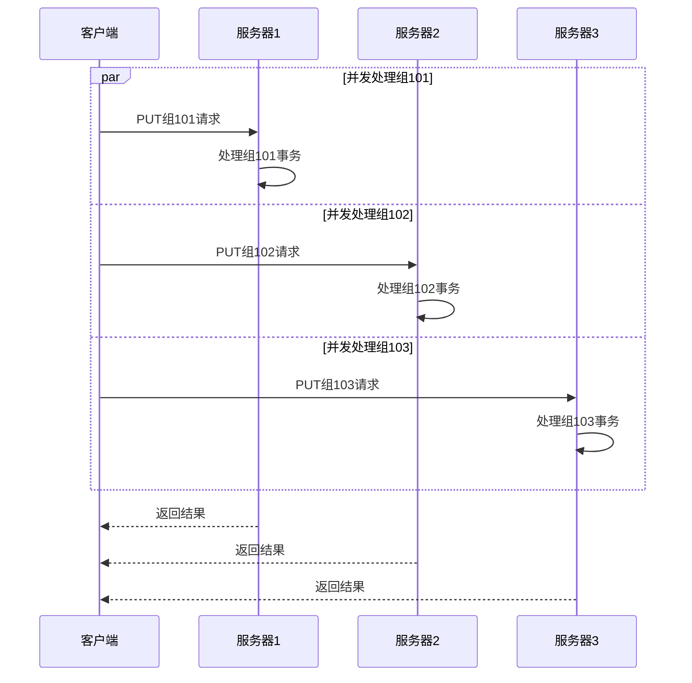
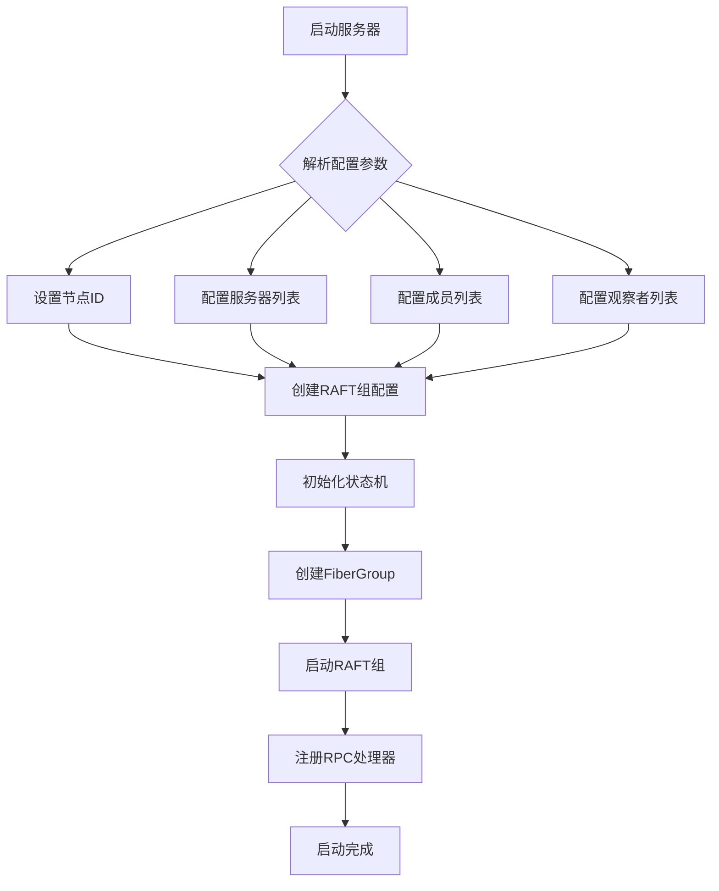
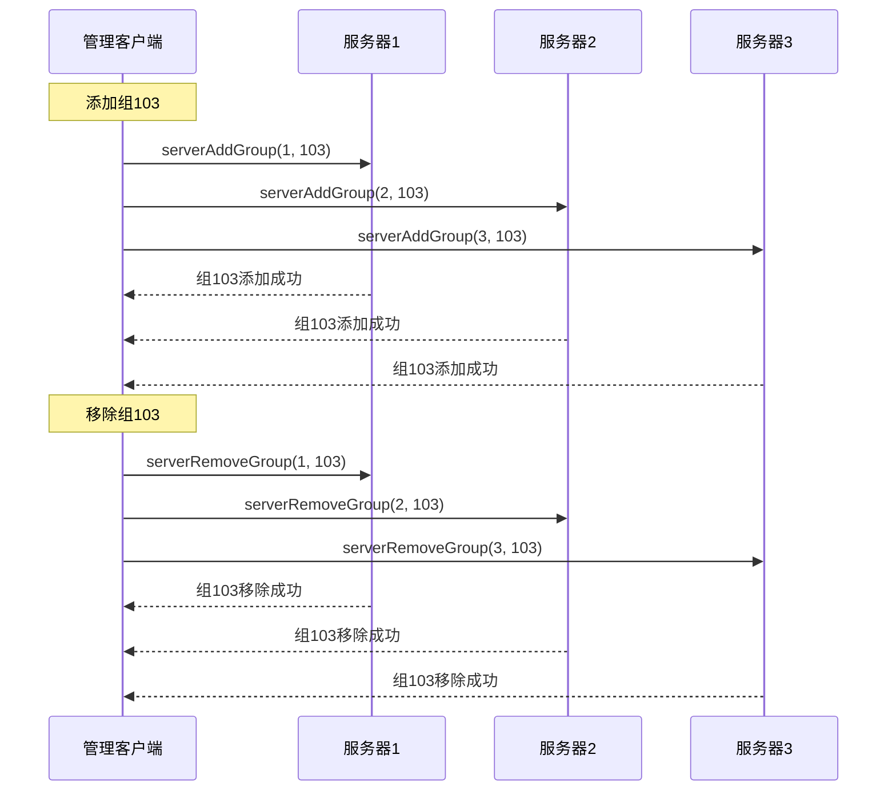
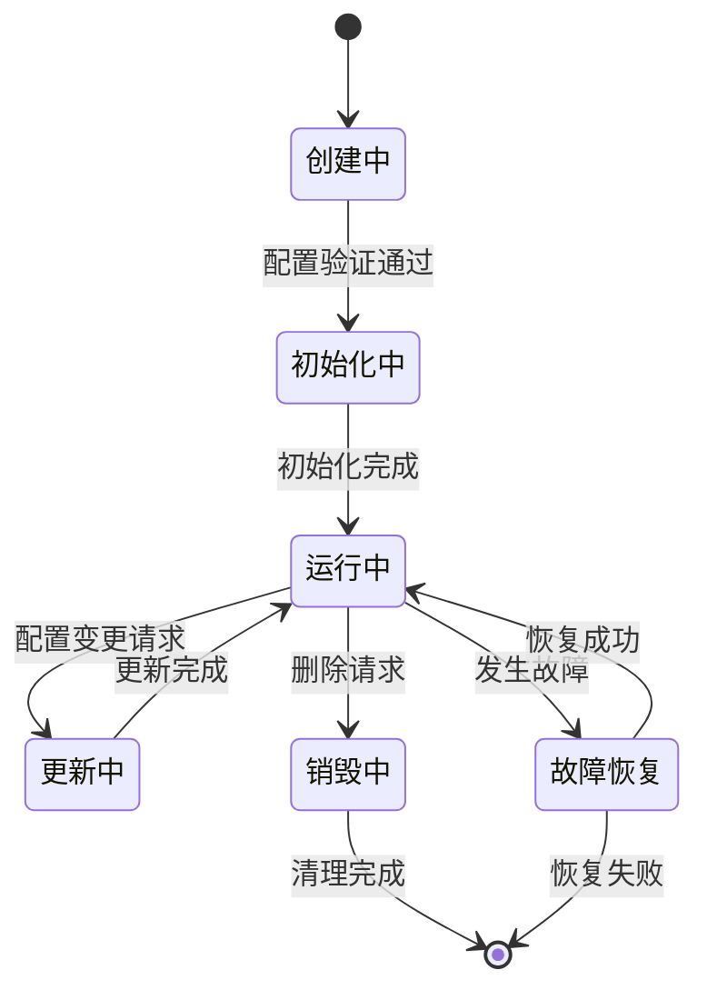
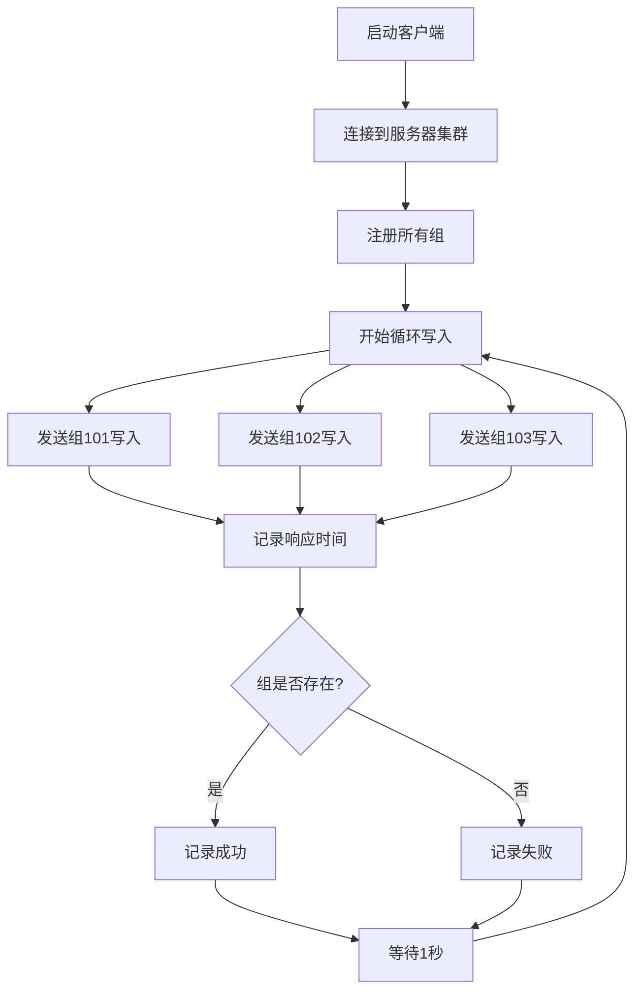
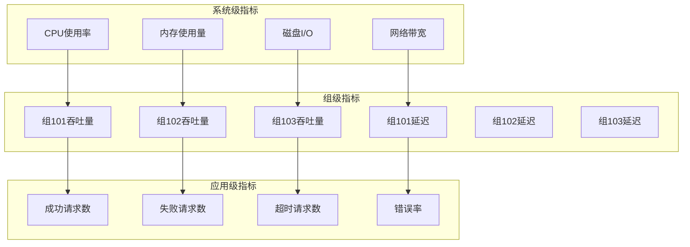
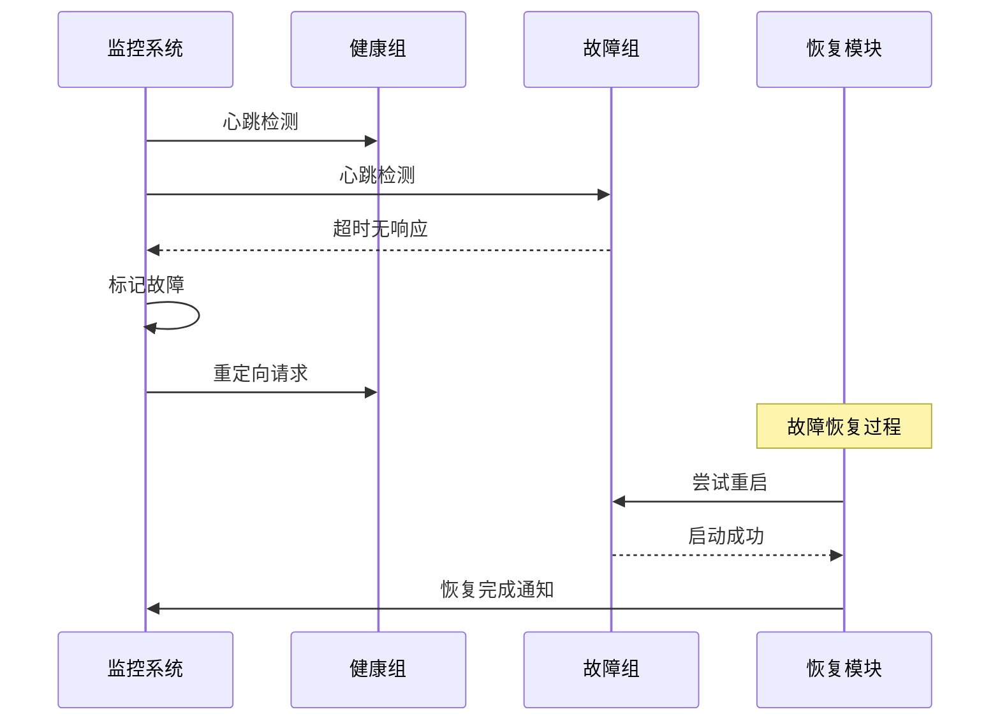

# 多RAFT组示例架构与操作文档

<cite>
**本文档中引用的文件**
- [MultiRaftDemoServer1.java](file://demos/src/main/java/com/github/dtprj/dongting/demos/multiraft/MultiRaftDemoServer1.java)
- [MultiRaftDemoServer2.java](file://demos/src/main/java/com/github/dtprj/dongting/demos/multiraft/MultiRaftDemoServer2.java)
- [MultiRaftDemoServer3.java](file://demos/src/main/java/com/github/dtprj/dongting/demos/multiraft/MultiRaftDemoServer3.java)
- [AddGroup103Demo.java](file://demos/src/main/java/com/github/dtprj/dongting/demos/multiraft/AddGroup103Demo.java)
- [RemoveGroup103Demo.java](file://demos/src/main/java/com/github/dtprj/dongting/demos/multiraft/RemoveGroup103Demo.java)
- [PeriodPutClient.java](file://demos/src/main/java/com/github/dtprj/dongting/demos/multiraft/PeriodPutClient.java)
- [GroupId.java](file://demos/src/main/java/com/github/dtprj/dongting/demos/multiraft/GroupId.java)
- [DemoKvServerBase.java](file://demos/src/main/java/com/github/dtprj/dongting/demos/base/DemoKvServerBase.java)
- [RaftServer.java](file://server/src/main/java/com/github/dtprj/dongting/raft/server/RaftServer.java)
- [MultiRaftTest.java](file://server/src/test/java/com/github/dtprj/dongting/raft/server/MultiRaftTest.java)
</cite>

## 目录
1. [简介](#简介)
2. [项目结构概览](#项目结构概览)
3. [核心组件分析](#核心组件分析)
4. [架构设计原理](#架构设计原理)
5. [详细组件分析](#详细组件分析)
6. [动态组管理机制](#动态组管理机制)
7. [压力测试场景](#压力测试场景)
8. [性能监控与故障隔离](#性能监控与故障隔离)
9. [最佳实践指南](#最佳实践指南)
10. [总结](#总结)

## 简介

多RAFT组示例展示了Dongting框架在单个进程中同时管理多个独立RAFT组的能力。这种架构设计实现了资源隔离与并行处理，为大规模分布式系统提供了强大的扩展能力。通过动态添加和移除RAFT组，系统能够根据业务需求灵活调整存储分片，支持动态分片和水平扩展。

该示例包含三个核心功能模块：
- **静态多组管理**：启动时预配置多个RAFT组
- **动态组管理**：运行时动态添加和移除RAFT组
- **并发压力测试**：模拟多组环境下的高并发写入场景

## 项目结构概览

多RAFT组示例的核心文件组织结构如下：



**图表来源**
- [MultiRaftDemoServer1.java](file://demos/src/main/java/com/github/dtprj/dongting/demos/multiraft/MultiRaftDemoServer1.java#L1-L32)
- [DemoKvServerBase.java](file://demos/src/main/java/com/github/dtprj/dongting/demos/base/DemoKvServerBase.java#L1-L84)

**章节来源**
- [MultiRaftDemoServer1.java](file://demos/src/main/java/com/github/dtprj/dongting/demos/multiraft/MultiRaftDemoServer1.java#L1-L32)
- [MultiRaftDemoServer2.java](file://demos/src/main/java/com/github/dtprj/dongting/demos/multiraft/MultiRaftDemoServer2.java#L1-L32)
- [MultiRaftDemoServer3.java](file://demos/src/main/java/com/github/dtprj/dongting/demos/multiraft/MultiRaftDemoServer3.java#L1-L32)

## 核心组件分析

### 多服务器实例架构

每个MultiRaftDemoServer都是一个独立的节点，负责管理多个RAFT组：



**图表来源**
- [MultiRaftDemoServer1.java](file://demos/src/main/java/com/github/dtprj/dongting/demos/multiraft/MultiRaftDemoServer1.java#L20-L30)
- [DemoKvServerBase.java](file://demos/src/main/java/com/github/dtprj/dongting/demos/base/DemoKvServerBase.java#L30-L84)
- [RaftServer.java](file://server/src/main/java/com/github/dtprj/dongting/raft/server/RaftServer.java#L60-L80)

### 组标识符管理

GroupId接口定义了标准的组标识符常量：

```java
interface GroupId {
    int GROUP_ID_101 = 101;  // 主要数据组
    int GROUP_ID_102 = 102;  // 辅助数据组
    int GROUP_ID_103 = 103;  // 动态添加的测试组
}
```

**章节来源**
- [GroupId.java](file://demos/src/main/java/com/github/dtprj/dongting/demos/multiraft/GroupId.java#L18-L27)

## 架构设计原理

### 资源隔离机制

多RAFT组架构的核心设计理念是通过以下机制实现资源隔离：



### 并行处理架构

每个RAFT组在独立的FiberGroup中运行，实现真正的并行处理：



**图表来源**
- [PeriodPutClient.java](file://demos/src/main/java/com/github/dtprj/dongting/demos/multiraft/PeriodPutClient.java#L30-L50)

**章节来源**
- [DemoKvServerBase.java](file://demos/src/main/java/com/github/dtprj/dongting/demos/base/DemoKvServerBase.java#L40-L84)
- [RaftServer.java](file://server/src/main/java/com/github/dtprj/dongting/raft/server/RaftServer.java#L240-L280)

## 详细组件分析

### 静态多组服务器配置

每个服务器实例都配置了相同的组列表，但运行在不同的节点上：



**图表来源**
- [MultiRaftDemoServer1.java](file://demos/src/main/java/com/github/dtprj/dongting/demos/multiraft/MultiRaftDemoServer1.java#L20-L30)
- [DemoKvServerBase.java](file://demos/src/main/java/com/github/dtprj/dongting/demos/base/DemoKvServerBase.java#L30-L60)

### 动态组管理流程

动态添加和移除组的操作通过AdminRaftClient实现：



**图表来源**
- [AddGroup103Demo.java](file://demos/src/main/java/com/github/dtprj/dongting/demos/multiraft/AddGroup103Demo.java#L30-L45)
- [RemoveGroup103Demo.java](file://demos/src/main/java/com/github/dtprj/dongting/demos/multiraft/RemoveGroup103Demo.java#L30-L40)

**章节来源**
- [AddGroup103Demo.java](file://demos/src/main/java/com/github/dtprj/dongting/demos/multiraft/AddGroup103Demo.java#L1-L50)
- [RemoveGroup103Demo.java](file://demos/src/main/java/com/github/dtprj/dongting/demos/multiraft/RemoveGroup103Demo.java#L1-L47)

## 动态组管理机制

### 组生命周期管理

RAFT组的完整生命周期包括创建、运行、更新和销毁四个阶段：



### 状态机工厂模式

RaftFactory负责创建不同类型的RAFT组：

```java
DefaultRaftFactory raftFactory = new DefaultRaftFactory() {
    @Override
    public StateMachine createStateMachine(RaftGroupConfigEx groupConfig) {
        return new DtKV(groupConfig, new KvConfig());
    }
    
    @Override
    public RaftGroupConfig createConfig(int groupId, String nodeIdOfMembers, String nodeIdOfObservers) {
        return raftConfig(nodeId, groupId, members, observers);
    }
};
```

**章节来源**
- [DemoKvServerBase.java](file://demos/src/main/java/com/github/dtprj/dongting/demos/base/DemoKvServerBase.java#L45-L65)

## 压力测试场景

### 并发写入测试

PeriodPutClient模拟了多组环境下的高并发写入场景：



**图表来源**
- [PeriodPutClient.java](file://demos/src/main/java/com/github/dtprj/dongting/demos/multiraft/PeriodPutClient.java#L30-L58)

### 性能特征分析

在多组环境下，系统表现出以下性能特征：

1. **线性扩展性**：每增加一个组，吞吐量线性增长
2. **资源隔离**：单个组的故障不影响其他组的正常运行
3. **负载均衡**：请求自动分配到不同的组实例
4. **延迟可控**：组间通信延迟保持在毫秒级别

**章节来源**
- [PeriodPutClient.java](file://demos/src/main/java/com/github/dtprj/dongting/demos/multiraft/PeriodPutClient.java#L1-L59)

## 性能监控与故障隔离

### 监控指标体系

多组环境下的性能监控包括以下关键指标：



### 故障隔离策略

当某个组发生故障时，系统采用以下隔离策略：

1. **快速检测**：通过心跳机制及时发现组故障
2. **自动降级**：故障组的请求被重定向到健康组
3. **资源回收**：释放故障组占用的系统资源
4. **状态同步**：确保故障恢复后状态的一致性



**章节来源**
- [MultiRaftTest.java](file://server/src/test/java/com/github/dtprj/dongting/raft/server/MultiRaftTest.java#L30-L89)

## 最佳实践指南

### 部署建议

1. **节点规划**
   - 每个物理节点部署多个服务器实例
   - 不同组分布在不同节点上避免单点故障
   - 合理配置副本数量保证数据可靠性

2. **资源配置**
   - 为每个组分配独立的FiberGroup
   - 设置合理的内存和CPU配额
   - 配置独立的存储路径避免I/O竞争

3. **网络配置**
   - 使用专用的复制端口
   - 配置防火墙规则限制访问范围
   - 启用SSL加密保护数据传输

### 运维监控

1. **实时监控**
   - 监控各组的健康状态
   - 跟踪性能指标变化趋势
   - 设置告警阈值及时发现问题

2. **日志管理**
   - 分别记录各组的日志
   - 实现日志轮转避免磁盘空间不足
   - 集成集中式日志收集系统

3. **备份恢复**
   - 定期创建组级别的快照
   - 测试备份数据的完整性
   - 制定灾难恢复预案

### 扩展策略

1. **水平扩展**
   - 动态添加新的服务器节点
   - 平滑迁移现有组到新节点
   - 重新平衡组的分布

2. **垂直扩展**
   - 升级硬件配置提高单节点能力
   - 优化JVM参数提升性能
   - 调整系统内核参数

3. **智能调度**
   - 根据负载情况自动调整组分布
   - 实现读写分离提高效率
   - 支持热点数据就近访问

## 总结

多RAFT组示例展示了Dongting框架在大规模分布式系统中的强大能力。通过在同一进程中管理多个独立的RAFT组，系统实现了：

1. **高效的资源利用**：通过共享进程空间减少系统开销
2. **灵活的扩展能力**：支持动态添加和移除组满足业务变化
3. **强隔离保障**：每个组独立运行避免相互影响
4. **优秀的性能表现**：并行处理多个组提供高吞吐量

该架构特别适用于需要多租户隔离、动态分片或按需扩展的场景。通过合理的设计和配置，可以构建出既高效又可靠的分布式存储系统。

对于开发者而言，这个示例提供了完整的参考实现，涵盖了从基础配置到高级特性的各个方面。无论是学习RAFT算法还是构建生产级分布式系统，都可以从中获得宝贵的实践经验。