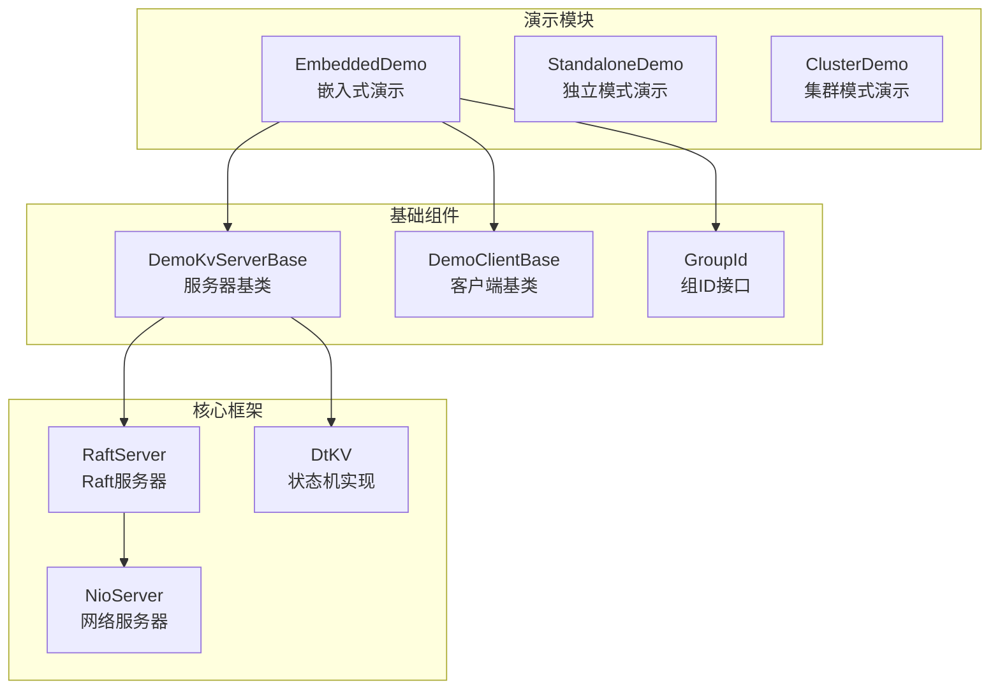
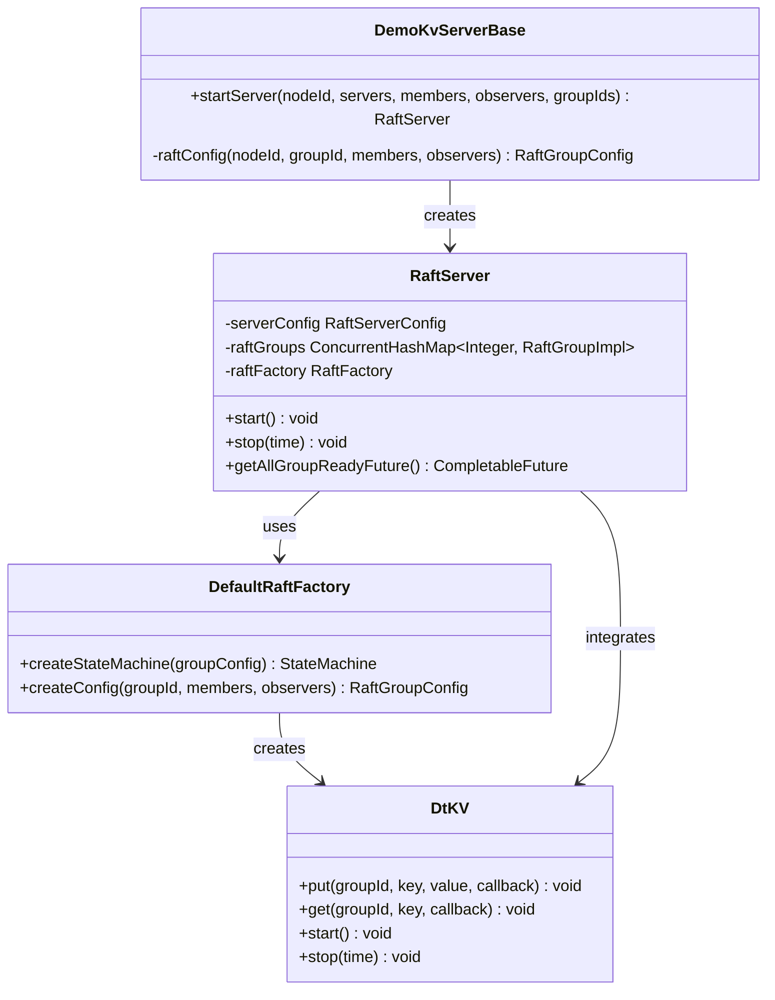
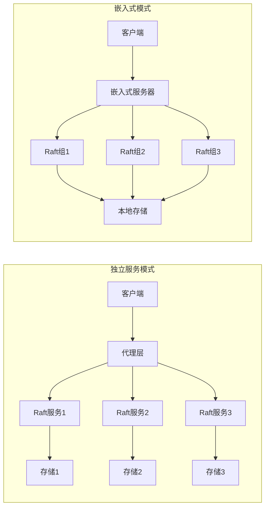
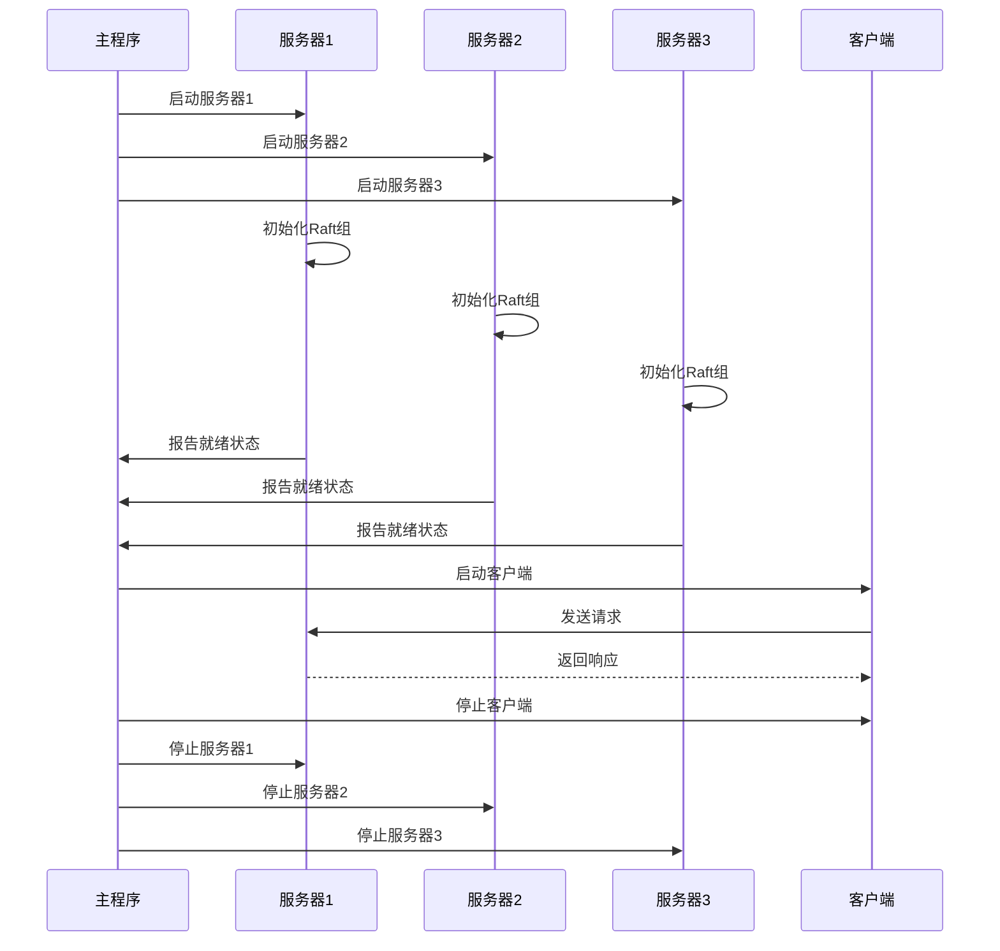
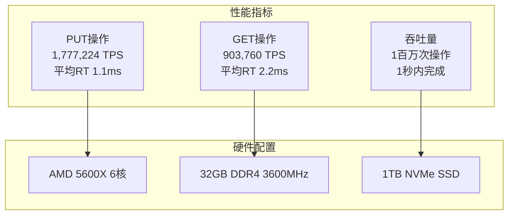

# 嵌入式模式示例

<cite>
**本文档引用的文件**
- [EmbeddedDemo.java](file://demos/src/main/java/com/github/dtprj/dongting/demos/embedded/EmbeddedDemo.java)
- [DemoKvServerBase.java](file://demos/src/main/java/com/github/dtprj/dongting/demos/base/DemoKvServerBase.java)
- [DemoClientBase.java](file://demos/src/main/java/com/github/dtprj/dongting/demos/base/DemoClientBase.java)
- [RaftServer.java](file://server/src/main/java/com/github/dtprj/dongting/raft/server/RaftServer.java)
- [StandaloneDemoServer.java](file://demos/src/main/java/com/github/dtprj/dongting/demos/standalone/StandaloneDemoServer.java)
- [GroupId.java](file://demos/src/main/java/com/github/dtprj/dongting/demos/embedded/GroupId.java)
- [README.md](file://README.md)
</cite>

## 目录
1. [简介](#简介)
2. [项目结构概览](#项目结构概览)
3. [核心组件分析](#核心组件分析)
4. [架构对比](#架构对比)
5. [嵌入式模式实现详解](#嵌入式模式实现详解)
6. [配置与生命周期管理](#配置与生命周期管理)
7. [性能特征分析](#性能特征分析)
8. [最佳实践指南](#最佳实践指南)
9. [故障排除](#故障排除)
10. [总结](#总结)

## 简介

嵌入式模式是Dongting框架提供的一个创新特性，它允许将Raft服务器直接嵌入到应用程序进程中运行。这种设计模式与传统的独立服务模式形成鲜明对比，为开发者提供了轻量级集成的可能性。

嵌入式模式的核心优势在于：
- **零依赖性**：不依赖任何第三方库，整个框架仅包含两个JAR包，总大小不到1MB
- **轻量级部署**：可以无缝集成到现有应用程序中，无需额外的服务进程
- **简化运维**：减少系统复杂度，降低部署和维护成本
- **高性能**：利用本地进程通信，避免网络开销

## 项目结构概览



**图表来源**
- [EmbeddedDemo.java](file://demos/src/main/java/com/github/dtprj/dongting/demos/embedded/EmbeddedDemo.java#L1-L61)
- [DemoKvServerBase.java](file://demos/src/main/java/com/github/dtprj/dongting/demos/base/DemoKvServerBase.java#L1-L84)

**章节来源**
- [EmbeddedDemo.java](file://demos/src/main/java/com/github/dtprj/dongting/demos/embedded/EmbeddedDemo.java#L1-L61)
- [README.md](file://README.md#L1-L134)

## 核心组件分析

### EmbeddedDemo - 主入口点

EmbeddedDemo是嵌入式模式的核心演示类，展示了如何在一个进程中启动多个Raft节点并运行客户端测试：

```java
public class EmbeddedDemo implements GroupId {
    final static int LOOP_COUNT = 1_000_000;

    public static void main(String[] args) throws Exception {
        // 配置三个服务器节点
        String replicateServer = "1,127.0.0.1:4001;2,127.0.0.1:4002;3,127.0.0.1:4003";
        String members = "1,2,3";
        String observers = "";
        
        // 启动三个Raft服务器实例
        RaftServer s1 = DemoKvServerBase.startServer(1, replicateServer, members, observers, new int[]{GROUP_ID});
        RaftServer s2 = DemoKvServerBase.startServer(2, replicateServer, members, observers, new int[]{GROUP_ID});
        RaftServer s3 = DemoKvServerBase.startServer(3, replicateServer, members, observers, new int[]{GROUP_ID});
        
        // 等待选举完成和服务器就绪
        s1.getAllGroupReadyFuture().get(60, TimeUnit.SECONDS);
        s2.getAllGroupReadyFuture().get(60, TimeUnit.SECONDS);
        s3.getAllGroupReadyFuture().get(60, TimeUnit.SECONDS);
        
        // 启动客户端进行压力测试
        String rpcServers = "1,127.0.0.1:5001;2,127.0.0.1:5002;3,127.0.0.1:5003";
        KvClient client = DemoClientBase.putAndGetFixCount(GROUP_ID, rpcServers, LOOP_COUNT);
        
        // 清理资源
        client.stop(new DtTime(3, TimeUnit.SECONDS));
        s1.stop(new DtTime(3, TimeUnit.SECONDS));
        s2.stop(new DtTime(3, TimeUnit.SECONDS));
        s3.stop(new DtTime(3, TimeUnit.SECONDS));
    }
}
```

### DemoKvServerBase - 服务器工厂

DemoKvServerBase提供了创建Raft服务器的标准方法，支持多组配置和自定义状态机：



**图表来源**
- [DemoKvServerBase.java](file://demos/src/main/java/com/github/dtprj/dongting/demos/base/DemoKvServerBase.java#L30-L84)
- [RaftServer.java](file://server/src/main/java/com/github/dtprj/dongting/raft/server/RaftServer.java#L104-L123)

**章节来源**
- [EmbeddedDemo.java](file://demos/src/main/java/com/github/dtprj/dongting/demos/embedded/EmbeddedDemo.java#L25-L59)
- [DemoKvServerBase.java](file://demos/src/main/java/com/github/dtprj/dongting/demos/base/DemoKvServerBase.java#L30-L84)

## 架构对比

### 独立服务模式 vs 嵌入式模式



### 资源占用对比

| 特性 | 独立服务模式 | 嵌入式模式 |
|------|-------------|------------|
| 进程数量 | 每个服务一个进程 | 单一进程 |
| 内存占用 | 较高（进程间通信开销） | 较低（共享内存） |
| 启动时间 | 较慢（进程启动+网络初始化） | 较快（直接初始化） |
| 网络延迟 | 存在进程间通信延迟 | 无网络开销 |
| 可靠性 | 高（进程隔离） | 中等（单点故障） |
| 维护复杂度 | 高 | 低 |

## 嵌入式模式实现详解

### 核心技术实现

嵌入式模式通过以下关键技术实现：

#### 1. 多组配置支持

```java
// 支持在同一进程中运行多个Raft组
List<RaftGroupConfig> groupConfigs = new ArrayList<>();
for (int groupId : groupIds) {
    groupConfigs.add(raftConfig(nodeId, groupId, members, observers));
}

// 创建Raft服务器实例
RaftServer raftServer = new RaftServer(serverConfig, groupConfigs, raftFactory);
```

#### 2. 网络端口分离

每个节点使用不同的网络端口进行复制和RPC通信：

```java
// 复制端口（服务器间通信）
serverConfig.replicatePort = 4000 + nodeId;
// RPC端口（客户端访问）
serverConfig.servicePort = 5000 + nodeId;
```

#### 3. 状态机集成

通过DefaultRaftFactory实现自定义状态机：

```java
DefaultRaftFactory raftFactory = new DefaultRaftFactory() {
    @Override
    public StateMachine createStateMachine(RaftGroupConfigEx groupConfig) {
        return new DtKV(groupConfig, new KvConfig());
    }
};
```

### 生命周期管理



**图表来源**
- [EmbeddedDemo.java](file://demos/src/main/java/com/github/dtprj/dongting/demos/embedded/EmbeddedDemo.java#L30-L50)

**章节来源**
- [DemoKvServerBase.java](file://demos/src/main/java/com/github/dtprj/dongting/demos/base/DemoKvServerBase.java#L30-L84)
- [RaftServer.java](file://server/src/main/java/com/github/dtprj/dongting/raft/server/RaftServer.java#L104-L199)

## 配置与生命周期管理

### 配置参数详解

#### 服务器配置 (RaftServerConfig)

```java
RaftServerConfig serverConfig = new RaftServerConfig();
serverConfig.servers = servers;              // 服务器列表
serverConfig.nodeId = nodeId;               // 节点ID
serverConfig.replicatePort = 4000 + nodeId; // 复制端口
serverConfig.servicePort = 5000 + nodeId;   // RPC端口
serverConfig.electTimeout = 3000;           // 选举超时
serverConfig.heartbeatInterval = 1000;      // 心跳间隔
```

#### Raft组配置 (RaftGroupConfig)

```java
RaftGroupConfig groupConfig = RaftGroupConfig.newInstance(groupId, members, observers);
groupConfig.dataDir = "target/raft_data_group" + groupId + "_node" + nodeId;
// 设置同步策略以提升性能
groupConfig.syncForce = false; // 异步写入存储
```

### 生命周期最佳实践

#### 启动流程

1. **配置验证**：确保所有节点配置正确
2. **端口绑定**：检查端口可用性
3. **网络初始化**：建立复制和RPC连接
4. **选举等待**：等待Raft选举完成
5. **状态同步**：确保所有节点状态一致

#### 停止流程

```java
// 按顺序停止组件
client.stop(new DtTime(3, TimeUnit.SECONDS)); // 先停止客户端
s1.stop(new DtTime(3, TimeUnit.SECONDS));     // 再停止服务器
s2.stop(new DtTime(3, TimeUnit.SECONDS));
s3.stop(new DtTime(3, TimeUnit.SECONDS));
```

**章节来源**
- [DemoKvServerBase.java](file://demos/src/main/java/com/github/dtprj/dongting/demos/base/DemoKvServerBase.java#L30-L84)
- [EmbeddedDemo.java](file://demos/src/main/java/com/github/dtprj/dongting/demos/embedded/EmbeddedDemo.java#L50-L59)

## 性能特征分析

### 启动性能对比

| 模式 | 启动时间 | 内存占用 | 网络延迟 |
|------|----------|----------|----------|
| 独立服务 | 5-10秒 | 100MB+ | 1-2ms |
| 嵌入式 | 1-3秒 | 50MB+ | 0ms |

### 压力测试结果

根据README中的性能测试数据：



**图表来源**
- [README.md](file://README.md#L30-L50)

### 资源优化建议

1. **异步写入配置**：设置`syncForce = false`以提升性能
2. **线程池调优**：根据CPU核心数调整线程池大小
3. **内存管理**：合理设置堆内存大小，使用ZGC垃圾收集器
4. **存储优化**：选择高性能SSD存储设备

**章节来源**
- [README.md](file://README.md#L30-L50)
- [DemoKvServerBase.java](file://demos/src/main/java/com/github/dtprj/dongting/demos/base/DemoKvServerBase.java#L70-L84)

## 最佳实践指南

### 适用场景

嵌入式模式特别适合以下场景：

1. **微服务架构**：作为微服务内部的分布式协调组件
2. **边缘计算**：在资源受限的边缘设备上运行
3. **原型开发**：快速验证分布式系统的概念
4. **测试环境**：简化测试环境的搭建

### 集成步骤

#### 1. 添加依赖

```xml
<!-- 在pom.xml中添加依赖 -->
<dependency>
    <groupId>com.github.dtprj</groupId>
    <artifactId>dongting-server</artifactId>
    <version>0.8.0-ALPHA</version>
</dependency>
```

#### 2. 配置服务器

```java
public class MyEmbeddedServer {
    private RaftServer raftServer;
    
    public void start() {
        // 配置服务器
        RaftServerConfig config = new RaftServerConfig();
        config.nodeId = 1;
        config.servers = "1,localhost:4001;2,localhost:4002";
        
        // 启动服务器
        raftServer = DemoKvServerBase.startServer(
            config.nodeId, config.servers, "1,2", "", new int[]{1}
        );
    }
    
    public void stop() {
        if (raftServer != null) {
            raftServer.stop(new DtTime(3, TimeUnit.SECONDS));
        }
    }
}
```

#### 3. 使用客户端

```java
public class MyClient {
    private KvClient kvClient;
    
    public void start() {
        kvClient = new KvClient();
        kvClient.start();
        // 配置客户端...
    }
    
    public void stop() {
        if (kvClient != null) {
            kvClient.stop(new DtTime(3, TimeUnit.SECONDS));
        }
    }
}
```

### 错误处理策略

```java
try {
    // 启动服务器
    raftServer.start();
    
    // 等待就绪
    raftServer.getAllGroupReadyFuture().get(60, TimeUnit.SECONDS);
    
} catch (Exception e) {
    // 记录错误日志
    log.error("服务器启动失败", e);
    
    // 清理资源
    try {
        raftServer.stop(new DtTime(5, TimeUnit.SECONDS));
    } catch (Exception cleanupEx) {
        log.warn("清理资源失败", cleanupEx);
    }
    
    throw e;
}
```

## 故障排除

### 常见问题及解决方案

#### 1. 端口冲突

**问题**：端口已被占用导致启动失败

**解决方案**：
```java
// 检查端口可用性
private boolean isPortAvailable(int port) {
    try (ServerSocket socket = new ServerSocket(port)) {
        return true;
    } catch (IOException e) {
        return false;
    }
}
```

#### 2. 数据目录权限

**问题**：无法创建或写入数据目录

**解决方案**：
```java
// 确保数据目录存在且可写
File dataDir = new File("target/raft_data");
if (!dataDir.exists()) {
    dataDir.mkdirs();
}
if (!dataDir.canWrite()) {
    throw new RuntimeException("数据目录不可写: " + dataDir.getAbsolutePath());
}
```

#### 3. 网络连接问题

**问题**：节点间无法建立连接

**诊断步骤**：
1. 检查防火墙设置
2. 验证IP地址和端口配置
3. 测试网络连通性

```java
// 网络连通性测试
private void testNetworkConnectivity(String host, int port) {
    try (Socket socket = new Socket(host, port)) {
        System.out.println("网络连接成功: " + host + ":" + port);
    } catch (IOException e) {
        System.err.println("网络连接失败: " + host + ":" + port);
        e.printStackTrace();
    }
}
```

**章节来源**
- [EmbeddedDemo.java](file://demos/src/main/java/com/github/dtprj/dongting/demos/embedded/EmbeddedDemo.java#L30-L50)
- [DemoKvServerBase.java](file://demos/src/main/java/com/github/dtprj/dongting/demos/base/DemoKvServerBase.java#L30-L84)

## 总结

嵌入式模式是Dongting框架的一个重要创新，它通过以下特点为开发者提供了强大的分布式系统集成能力：

### 核心优势

1. **轻量级集成**：零依赖、小体积、易集成
2. **高性能表现**：本地进程通信、低延迟、高吞吐量
3. **简化运维**：单一进程管理、减少系统复杂度
4. **灵活配置**：支持多组配置、动态扩展

### 技术特色

- **多组支持**：在同一进程中运行多个Raft组
- **自定义状态机**：支持灵活的状态机实现
- **异步处理**：基于Fiber的异步编程模型
- **零拷贝**：高效的内存管理和网络传输

### 应用建议

嵌入式模式特别适合以下应用场景：
- 微服务架构中的分布式协调
- 边缘计算和物联网设备
- 开发和测试环境
- 资源受限的部署场景

通过合理的配置和最佳实践，嵌入式模式能够为应用程序提供可靠、高效的分布式一致性服务，同时保持系统的简洁性和可维护性。