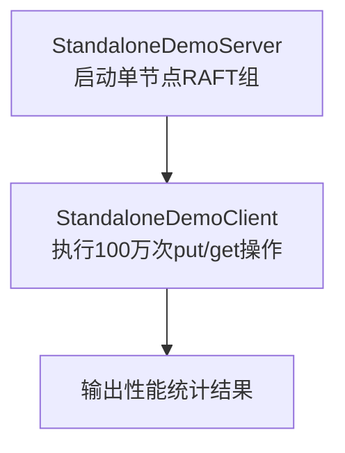
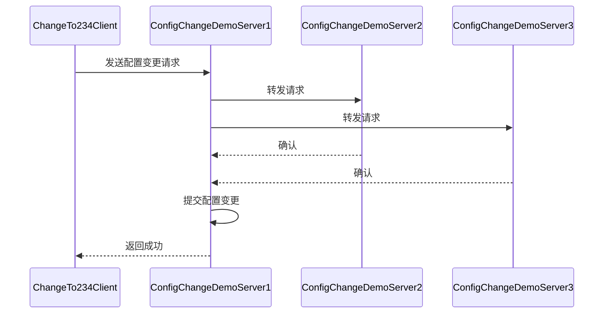
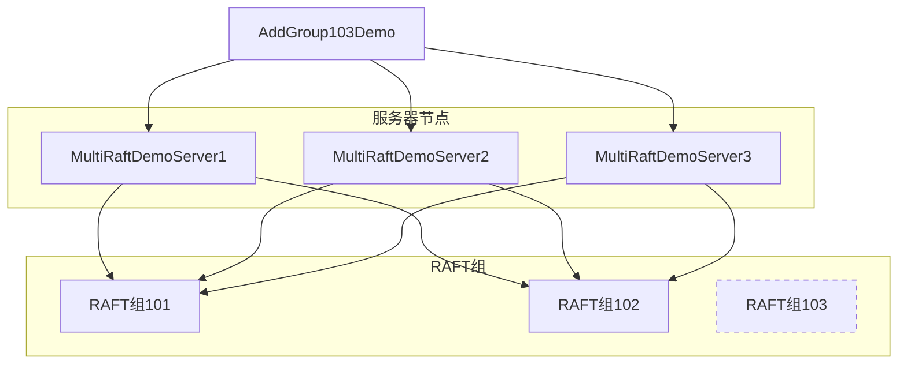
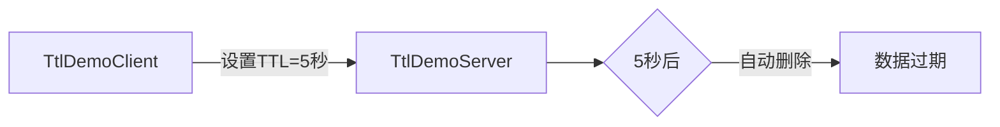
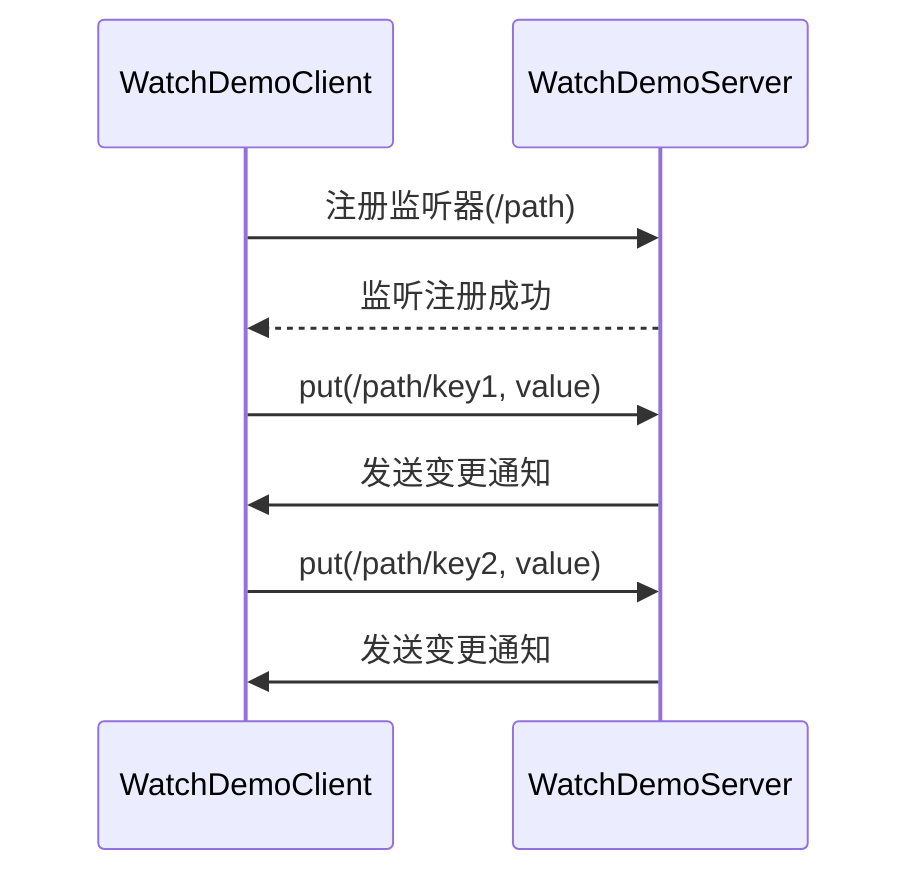
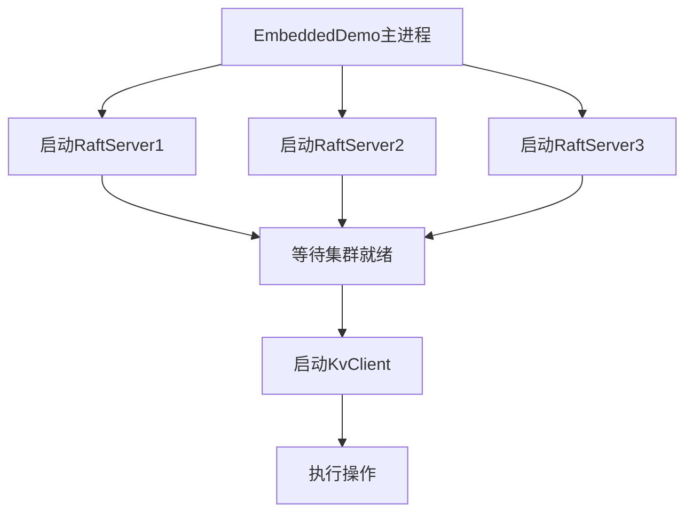

# 示例与演示

<cite>
**本文档中引用的文件**   
- [StandaloneDemoServer.java](file://demos/src/main/java/com/github/dtprj/dongting/demos/standalone/StandaloneDemoServer.java)
- [StandaloneDemoClient.java](file://demos/src/main/java/com/github/dtprj/dongting/demos/standalone/StandaloneDemoClient.java)
- [DemoServer1.java](file://demos/src/main/java/com/github/dtprj/dongting/demos/cluster/DemoServer1.java)
- [DemoClient.java](file://demos/src/main/java/com/github/dtprj/dongting/demos/cluster/DemoClient.java)
- [ChangeLeader.java](file://demos/src/main/java/com/github/dtprj/dongting/demos/cluster/ChangeLeader.java)
- [ConfigChangeDemoServer1.java](file://demos/src/main/java/com/github/dtprj/dongting/demos/configchange/ConfigChangeDemoServer1.java)
- [ChangeTo123Client.java](file://demos/src/main/java/com/github/dtprj/dongting/demos/configchange/ChangeTo123Client.java)
- [MultiRaftDemoServer1.java](file://demos/src/main/java/com/github/dtprj/dongting/demos/multiraft/MultiRaftDemoServer1.java)
- [AddGroup103Demo.java](file://demos/src/main/java/com/github/dtprj/dongting/demos/multiraft/AddGroup103Demo.java)
- [TtlDemoServer.java](file://demos/src/main/java/com/github/dtprj/dongting/demos/ttl/TtlDemoServer.java)
- [TtlDemoClient.java](file://demos/src/main/java/com/github/dtprj/dongting/demos/ttl/TtlDemoClient.java)
- [WatchDemoServer.java](file://demos/src/main/java/com/github/dtprj/dongting/demos/watch/WatchDemoServer.java)
- [WatchDemoClient.java](file://demos/src/main/java/com/github/dtprj/dongting/demos/watch/WatchDemoClient.java)
- [EmbeddedDemo.java](file://demos/src/main/java/com/github/dtprj/dongting/demos/embedded/EmbeddedDemo.java)
- [DemoKvServerBase.java](file://demos/src/main/java/com/github/dtprj/dongting/demos/base/DemoKvServerBase.java)
- [DemoClientBase.java](file://demos/src/main/java/com/github/dtprj/dongting/demos/base/DemoClientBase.java)
- [GroupId.java](file://demos/src/main/java/com/github/dtprj/dongting/demos/cluster/GroupId.java)
</cite>

## 目录
1. [简介](#简介)
2. [单机模式示例](#单机模式示例)
3. [集群模式示例](#集群模式示例)
4. [配置变更示例](#配置变更示例)
5. [多RAFT组示例](#多raft组示例)
6. [TTL功能示例](#ttl功能示例)
7. [Watch功能示例](#watch功能示例)
8. [嵌入式部署示例](#嵌入式部署示例)

## 简介
Dongting项目提供了一系列示例程序，位于`demos`目录下，用于演示其核心功能。这些示例使用DtKV作为RAFT状态机，这是一个内存中的键值数据库。所有示例都无需额外配置，可以直接通过运行`main`方法来执行。本文档将详细介绍每个示例的业务场景、代码结构、关键配置以及运行步骤和预期输出。

**Section sources**
- [README.md](file://README.md#L1-L133)

## 单机模式示例
单机模式示例展示了如何运行一个单节点的RAFT组，适用于开发和测试环境。

### 业务场景
此模式适用于不需要高可用性的场景，如本地开发、功能测试或性能基准测试。它提供了一个最简单的RAFT实现，便于快速启动和验证核心功能。

### 代码结构与关键配置
该示例由`StandaloneDemoServer`和`StandaloneDemoClient`两个主要类组成。服务器端继承自`DemoKvServerBase`，客户端继承自`DemoClientBase`，实现了代码复用。

关键配置包括：
- `nodeId`: 节点ID，设置为1。
- `servers`: 服务器列表，格式为"serverId,ip:replicatePort"，这里配置为"1,127.0.0.1:4001"。
- `members`: 成员列表，仅包含节点1。
- `replicatePort`: 复制端口，为4001。
- `servicePort`: 服务端口，为5001，供客户端访问。



**Diagram sources**
- [StandaloneDemoServer.java](file://demos/src/main/java/com/github/dtprj/dongting/demos/standalone/StandaloneDemoServer.java#L1-L32)
- [StandaloneDemoClient.java](file://demos/src/main/java/com/github/dtprj/dongting/demos/standalone/StandaloneDemoClient.java#L1-L32)

**Section sources**
- [StandaloneDemoServer.java](file://demos/src/main/java/com/github/dtprj/dongting/demos/standalone/StandaloneDemoServer.java#L1-L32)
- [StandaloneDemoClient.java](file://demos/src/main/java/com/github/dtprj/dongting/demos/standalone/StandaloneDemoClient.java#L1-L32)

### 运行步骤与预期输出
1. 在IDE中运行`StandaloneDemoServer`的`main`方法。
2. 等待服务器启动完成。
3. 运行`StandaloneDemoClient`的`main`方法。

预期输出将显示100万次线性一致性的put操作和get操作的完成时间、吞吐量以及系统信息。

## 集群模式示例
集群模式示例展示了如何运行一个三节点的RAFT集群，以实现高可用性和数据冗余。

### 业务场景
此模式适用于生产环境，需要高可用性和容错能力的场景。通过三个节点组成一个RAFT组，即使一个节点发生故障，服务仍然可以正常运行。

### 代码结构与关键配置
该示例包含三个服务器类`DemoServer1`、`DemoServer2`、`DemoServer3`和一个客户端类`DemoClient`。所有服务器都继承自`DemoKvServerBase`。

关键配置包括：
- 三个节点的`nodeId`分别为1、2、3。
- `servers`配置了三个节点的复制端口：4001、4002、4003。
- `members`包含所有三个节点。
- 服务端口分别为5001、5002、5003。

```mermaid
graph TB
subgraph "RAFT集群"
S1[DemoServer1<br/>节点1]
S2[DemoServer2<br/>节点2]
S3[DemoServer3<br/>节点3]
end
C[DemoClient] --> S1
C --> S2
C --> S3
S1 < --> S2
S1 < --> S3
S2 < --> S3
style S1 stroke:#f66,stroke-width:2px
style C stroke:#66f,stroke-width:2px
```

**Diagram sources**
- [DemoServer1.java](file://demos/src/main/java/com/github/dtprj/dongting/demos/cluster/DemoServer1.java#L1-L32)
- [DemoClient.java](file://demos/src/main/java/com/github/dtprj/dongting/demos/cluster/DemoClient.java#L1-L38)

**Section sources**
- [DemoServer1.java](file://demos/src/main/java/com/github/dtprj/dongting/demos/cluster/DemoServer1.java#L1-L32)
- [DemoClient.java](file://demos/src/main/java/com/github/dtprj/dongting/demos/cluster/DemoClient.java#L1-L38)

### 运行步骤与预期输出
1. 分别运行`DemoServer1`、`DemoServer2`和`DemoServer3`的`main`方法。
2. 等待RAFT集群选举完成（通常在1秒内）。
3. 运行`DemoClient`，它将发送100万次put和get请求。
4. 可以运行`PeriodPutClient`进行持续的压力测试。
5. 执行`ChangeLeader`来切换RAFT领导者。

预期输出将显示与单机模式类似的性能统计，但具有更高的容错能力。在运行`PeriodPutClient`时，即使关闭一个服务器，客户端也不会受到影响。

## 配置变更示例
配置变更示例展示了如何在运行时动态更改RAFT成员，实现集群的弹性伸缩。

### 业务场景
此模式适用于需要动态调整集群规模的场景，如根据负载增加或减少节点，或进行滚动升级。它允许在不中断服务的情况下更改集群配置。

### 代码结构与关键配置
该示例包含四个服务器类`ConfigChangeDemoServer1`到`ConfigChangeDemoServer4`和两个客户端类`ChangeTo123Client`和`ChangeTo234Client`。

关键配置包括：
- 初始配置为节点1、2、3组成的集群。
- `ChangeTo234Client`可以将成员变更为节点2、3、4。
- `ChangeTo123Client`可以将成员恢复为节点1、2、3。



**Diagram sources**
- [ConfigChangeDemoServer1.java](file://demos/src/main/java/com/github/dtprj/dongting/demos/configchange/ConfigChangeDemoServer1.java#L1-L31)
- [ChangeTo234Client.java](file://demos/src/main/java/com/github/dtprj/dongting/demos/configchange/ChangeTo234Client.java#L1-L31)

**Section sources**
- [ConfigChangeDemoServer1.java](file://demos/src/main/java/com/github/dtprj/dongting/demos/configchange/ConfigChangeDemoServer1.java#L1-L31)
- [ChangeTo123Client.java](file://demos/src/main/java/com/github/dtprj/dongting/demos/configchange/ChangeTo123Client.java#L1-L31)

### 运行步骤与预期输出
1. 运行`ConfigChangeDemoServer1`、`ConfigChangeDemoServer2`、`ConfigChangeDemoServer3`和`ConfigChangeDemoServer4`。
2. 默认启动一个由节点1、2、3组成的RAFT组。
3. 执行`ChangeTo234Client`将成员变更为节点2、3、4。
4. 执行`ChangeTo123Client`将成员恢复为节点1、2、3。

预期输出将显示"config change success"，表明配置变更成功完成。

## 多RAFT组示例
多RAFT组示例展示了如何在单个进程中运行多个独立的RAFT组，实现数据分片和动态分片管理。

### 业务场景
此模式适用于需要水平扩展的大型系统，通过将数据分片到多个RAFT组中，可以突破单个RAFT组的性能瓶颈。它支持在运行时动态添加或删除RAFT组，实现真正的弹性伸缩。

### 代码结构与关键配置
该示例包含三个服务器类`MultiRaftDemoServer1`到`MultiRaftDemoServer3`和两个管理类`AddGroup103Demo`和`RemoveGroup103Demo`。

关键配置包括：
- 默认启动两个RAFT组，ID分别为101和102。
- `AddGroup103Demo`用于在运行时添加ID为103的RAFT组。
- `RemoveGroup103Demo`用于移除ID为103的RAFT组。



**Diagram sources**
- [MultiRaftDemoServer1.java](file://demos/src/main/java/com/github/dtprj/dongting/demos/multiraft/MultiRaftDemoServer1.java#L1-L32)
- [AddGroup103Demo.java](file://demos/src/main/java/com/github/dtprj/dongting/demos/multiraft/AddGroup103Demo.java#L1-L49)

**Section sources**
- [MultiRaftDemoServer1.java](file://demos/src/main/java/com/github/dtprj/dongting/demos/multiraft/MultiRaftDemoServer1.java#L1-L32)
- [AddGroup103Demo.java](file://demos/src/main/java/com/github/dtprj/dongting/demos/multiraft/AddGroup103Demo.java#L1-L49)

### 运行步骤与预期输出
1. 运行`MultiRaftDemoServer1`、`MultiRaftDemoServer2`和`MultiRaftDemoServer3`。
2. 默认启动两个RAFT组（101和102）。
3. 运行`PeriodPutClient`，它会向RAFT组101、102和103发送put请求。
4. 由于组103不存在，每秒会有两次成功和一次失败的操作。
5. 运行`AddGroup103Demo`添加RAFT组103。
6. `PeriodPutClient`的输出将变为每秒三次成功操作。
7. 运行`RemoveGroup103Demo`移除RAFT组103。

预期输出将显示"group 103 added"或"group 103 removed"，表明多RAFT组的动态管理功能正常工作。

## TTL功能示例
TTL（Time To Live）功能示例展示了如何为键值对设置生存时间，实现自动过期。

### 业务场景
此模式适用于需要缓存失效机制的场景，如会话管理、临时数据存储或缓存系统。通过为数据设置TTL，可以自动清理过期数据，避免手动维护。

### 代码结构与关键配置
该示例由`TtlDemoServer`和`TtlDemoClient`组成，结构与单机模式类似，但使用了TTL相关的API。

关键配置包括：
- 服务器配置与单机模式相同。
- 客户端使用`put`方法的重载版本来设置TTL。



**Diagram sources**
- [TtlDemoServer.java](file://demos/src/main/java/com/github/dtprj/dongting/demos/ttl/TtlDemoServer.java#L1-L32)
- [TtlDemoClient.java](file://demos/src/main/java/com/github/dtprj/dongting/demos/ttl/TtlDemoClient.java#L1-L32)

**Section sources**
- [TtlDemoServer.java](file://demos/src/main/java/com/github/dtprj/dongting/demos/ttl/TtlDemoServer.java#L1-L32)
- [TtlDemoClient.java](file://demos/src/main/java/com/github/dtprj/dongting/demos/ttl/TtlDemoClient.java#L1-L32)

### 运行步骤与预期输出
1. 运行`TtlDemoServer`。
2. 运行`TtlDemoClient`，它会设置带有TTL的键值对。
3. 等待TTL时间过后，尝试获取已过期的键。

预期输出将显示键值对在TTL时间后无法再被获取，证明TTL功能正常工作。

## Watch功能示例
Watch功能示例展示了如何监听键或目录的变化，实现事件驱动的编程模型。

### 业务场景
此模式适用于需要实时响应数据变化的场景，如配置中心、消息通知系统或实时数据同步。通过监听机制，客户端可以在数据变化时立即收到通知。

### 代码结构与关键配置
该示例由`WatchDemoServer`和`WatchDemoClient`组成。

关键配置包括：
- 服务器配置与单机模式相同。
- 客户端使用`watch`方法注册监听器。



**Diagram sources**
- [WatchDemoServer.java](file://demos/src/main/java/com/github/dtprj/dongting/demos/watch/WatchDemoServer.java#L1-L32)
- [WatchDemoClient.java](file://demos/src/main/java/com/github/dtprj/dongting/demos/watch/WatchDemoClient.java#L1-L32)

**Section sources**
- [WatchDemoServer.java](file://demos/src/main/java/com/github/dtprj/dongting/demos/watch/WatchDemoServer.java#L1-L32)
- [WatchDemoClient.java](file://demos/src/main/java/com/github/dtprj/dongting/demos/watch/WatchDemoClient.java#L1-L32)

### 运行步骤与预期输出
1. 运行`WatchDemoServer`。
2. 运行`WatchDemoClient`，它会注册对特定路径的监听。
3. 在客户端或通过其他方式修改被监听路径下的数据。

预期输出将显示客户端收到了变更通知，证明Watch功能正常工作。

## 嵌入式部署示例
嵌入式部署示例展示了如何将多个服务器和客户端嵌入到单个进程中，用于测试和集成。

### 业务场景
此模式适用于单元测试、集成测试或需要在单个进程中模拟完整集群行为的场景。它允许在不启动多个JVM的情况下测试集群功能。

### 代码结构与关键配置
该示例由`EmbeddedDemo`一个类组成，它在一个`main`方法中启动了三个服务器和一个客户端。

关键配置包括：
- 在单个进程中创建三个`RaftServer`实例。
- 使用`getAllGroupReadyFuture`等待所有服务器准备就绪。
- 然后启动客户端进行操作。



**Diagram sources**
- [EmbeddedDemo.java](file://demos/src/main/java/com/github/dtprj/dongting/demos/embedded/EmbeddedDemo.java#L1-L60)

**Section sources**
- [EmbeddedDemo.java](file://demos/src/main/java/com/github/dtprj/dongting/demos/embedded/EmbeddedDemo.java#L1-L60)

### 运行步骤与预期输出
1. 运行`EmbeddedDemo`的`main`方法。

预期输出将显示"All servers are ready"，然后是性能统计结果，证明在单个进程中成功模拟了完整的集群环境。