# 集群模式示例

<cite>
**本文档中引用的文件**
- [DemoServer1.java](file://demos/src/main/java/com/github/dtprj/dongting/demos/cluster/DemoServer1.java)
- [DemoServer2.java](file://demos/src/main/java/com/github/dtprj/dongting/demos/cluster/DemoServer2.java)
- [DemoServer3.java](file://demos/src/main/java/com/github/dtprj/dongting/demos/cluster/DemoServer3.java)
- [DemoClient.java](file://demos/src/main/java/com/github/dtprj/dongting/demos/cluster/DemoClient.java)
- [PeriodPutClient.java](file://demos/src/main/java/com/github/dtprj/dongting/demos/cluster/PeriodPutClient.java)
- [ChangeLeader.java](file://demos/src/main/java/com/github/dtprj/dongting/demos/cluster/ChangeLeader.java)
- [GroupId.java](file://demos/src/main/java/com/github/dtprj/dongting/demos/cluster/GroupId.java)
- [DemoKvServerBase.java](file://demos/src/main/java/com/github/dtprj/dongting/demos/base/DemoKvServerBase.java)
- [DemoClientBase.java](file://demos/src/main/java/com/github/dtprj/dongting/demos/base/DemoClientBase.java)
- [RaftServer.java](file://server/src/main/java/com/github/dtprj/dongting/raft/server/RaftServer.java)
- [VoteProcessor.java](file://server/src/main/java/com/github/dtprj/dongting/raft/rpc/VoteProcessor.java)
- [AppendProcessor.java](file://server/src/main/java/com/github/dtprj/dongting/raft/rpc/AppendProcessor.java)
</cite>

## 目录
1. [简介](#简介)
2. [项目结构](#项目结构)
3. [核心组件](#核心组件)
4. [架构概览](#架构概览)
5. [详细组件分析](#详细组件分析)
6. [启动流程](#启动流程)
7. [核心RAFT行为演示](#核心raft行为演示)
8. [客户端连接与数据操作](#客户端连接与数据操作)
9. [故障恢复测试](#故障恢复测试)
10. [性能考虑](#性能考虑)
11. [故障排除指南](#故障排除指南)
12. [结论](#结论)

## 简介

集群模式示例展示了如何在Dongting框架中实现一个高可用的3节点Raft集群。该示例包含了完整的Leader选举、日志复制、数据读写和故障恢复功能，为开发者提供了学习和实践分布式系统概念的绝佳机会。

本示例通过四个主要组件实现了完整的集群功能：
- **Raft节点**：三个独立的服务器进程，每个运行一个Raft节点
- **DemoClient**：执行大量读写操作的客户端
- **PeriodPutClient**：持续进行写入操作的客户端
- **ChangeLeader**：用于手动切换Leader的管理工具

## 项目结构

集群模式示例位于`demos/src/main/java/com/github/dtprj/dongting/demos/cluster`目录下，包含以下关键文件：

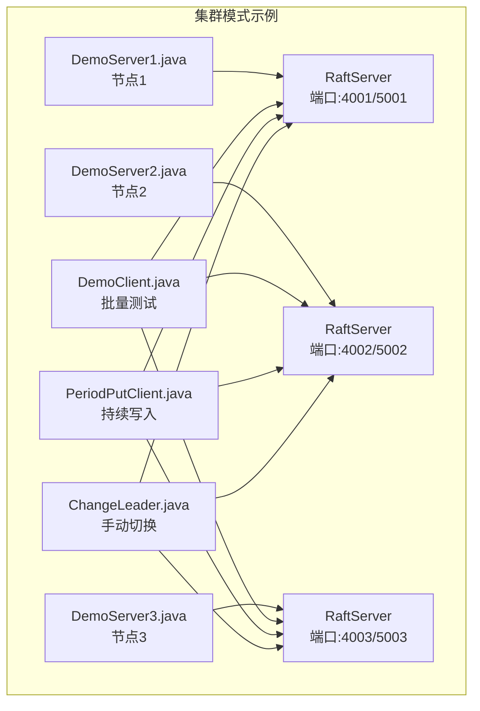

**图表来源**
- [DemoServer1.java](file://demos/src/main/java/com/github/dtprj/dongting/demos/cluster/DemoServer1.java#L20-L31)
- [DemoServer2.java](file://demos/src/main/java/com/github/dtprj/dongting/demos/cluster/DemoServer2.java#L20-L31)
- [DemoServer3.java](file://demos/src/main/java/com/github/dtprj/dongting/demos/cluster/DemoServer3.java#L20-L31)

**章节来源**
- [DemoServer1.java](file://demos/src/main/java/com/github/dtprj/dongting/demos/cluster/DemoServer1.java#L1-L31)
- [DemoServer2.java](file://demos/src/main/java/com/github/dtprj/dongting/demos/cluster/DemoServer2.java#L1-L31)
- [DemoServer3.java](file://demos/src/main/java/com/github/dtprj/dongting/demos/cluster/DemoServer3.java#L1-L31)

## 核心组件

### Raft节点配置

每个Raft节点都遵循相同的配置模式，但具有不同的节点ID和端口号：

```java
// 节点1配置
int nodeId = 1;
String servers = "1,127.0.0.1:4001;2,127.0.0.1:4002;3,127.0.0.1:4003";
String members = "1,2,3";
String observers = "";

// 节点2配置
int nodeId = 2;
String servers = "1,127.0.0.1:4001;2,127.0.0.1:4002;3,127.0.0.1:4003";
String members = "1,2,3";
String observers = "";
```

### 端口分配策略

- **复制端口（400x）**：用于节点间通信和Raft协议交互
- **服务端口（500x）**：用于客户端连接和业务请求

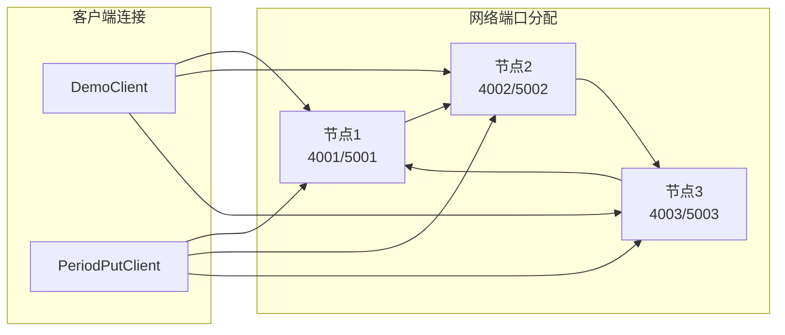

**图表来源**
- [DemoServer1.java](file://demos/src/main/java/com/github/dtprj/dongting/demos/cluster/DemoServer1.java#L22-L23)
- [DemoServer2.java](file://demos/src/main/java/com/github/dtprj/dongting/demos/cluster/DemoServer2.java#L22-L23)
- [DemoServer3.java](file://demos/src/main/java/com/github/dtprj/dongting/demos/cluster/DemoServer3.java#L22-L23)

**章节来源**
- [DemoServer1.java](file://demos/src/main/java/com/github/dtprj/dongting/demos/cluster/DemoServer1.java#L20-L31)
- [DemoServer2.java](file://demos/src/main/java/com/github/dtprj/dongting/demos/cluster/DemoServer2.java#L20-L31)
- [DemoServer3.java](file://demos/src/main/java/com/github/dtprj/dongting/demos/cluster/DemoServer3.java#L20-L31)

## 架构概览

集群模式示例采用经典的Raft共识算法架构，包含以下核心组件：

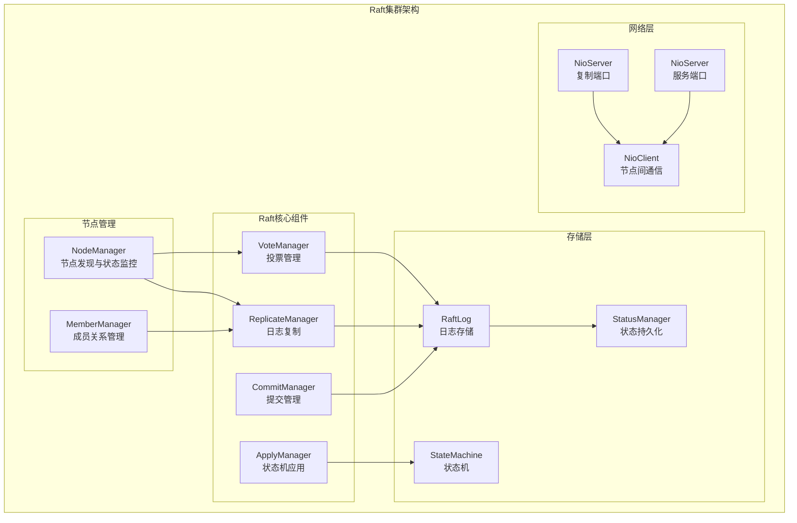

**图表来源**
- [RaftServer.java](file://server/src/main/java/com/github/dtprj/dongting/raft/server/RaftServer.java#L200-L250)
- [VoteProcessor.java](file://server/src/main/java/com/github/dtprj/dongting/raft/rpc/VoteProcessor.java#L40-L80)
- [AppendProcessor.java](file://server/src/main/java/com/github/dtprj/dongting/raft/rpc/AppendProcessor.java#L50-L100)

## 详细组件分析

### RaftServer初始化

RaftServer是整个集群的核心，负责协调所有Raft相关组件：

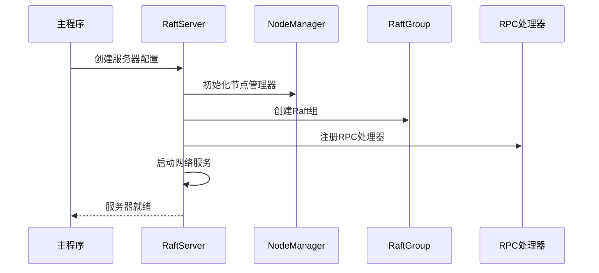

**图表来源**
- [RaftServer.java](file://server/src/main/java/com/github/dtprj/dongting/raft/server/RaftServer.java#L110-L180)

### Leader选举机制

Leader选举是Raft算法的核心功能之一，通过VoteProcessor实现：

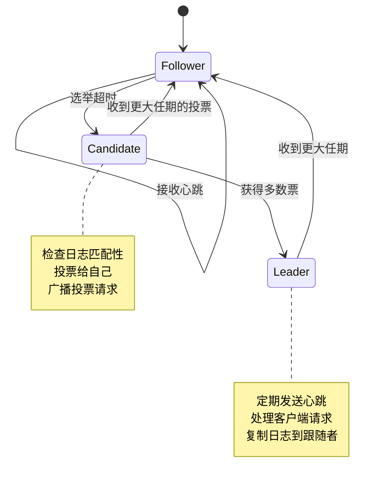

**图表来源**
- [VoteProcessor.java](file://server/src/main/java/com/github/dtprj/dongting/raft/rpc/VoteProcessor.java#L80-L150)

### 日志复制流程

AppendEntries请求处理确保了数据的一致性和可靠性：

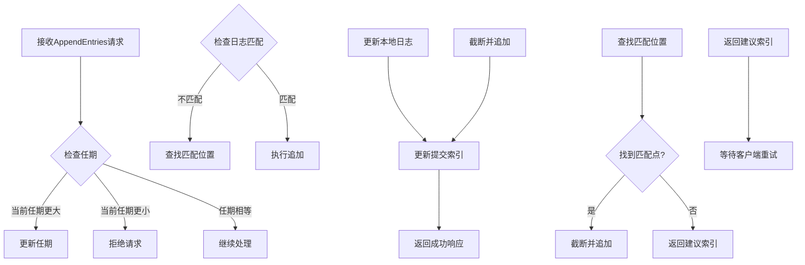

**图表来源**
- [AppendProcessor.java](file://server/src/main/java/com/github/dtprj/dongting/raft/rpc/AppendProcessor.java#L200-L350)

**章节来源**
- [RaftServer.java](file://server/src/main/java/com/github/dtprj/dongting/raft/server/RaftServer.java#L110-L200)
- [VoteProcessor.java](file://server/src/main/java/com/github/dtprj/dongting/raft/rpc/VoteProcessor.java#L40-L200)
- [AppendProcessor.java](file://server/src/main/java/com/github/dtprj/dongting/raft/rpc/AppendProcessor.java#L50-L200)

## 启动流程

### 正确的启动顺序

为了确保集群正常运行，必须按照以下顺序启动各个组件：

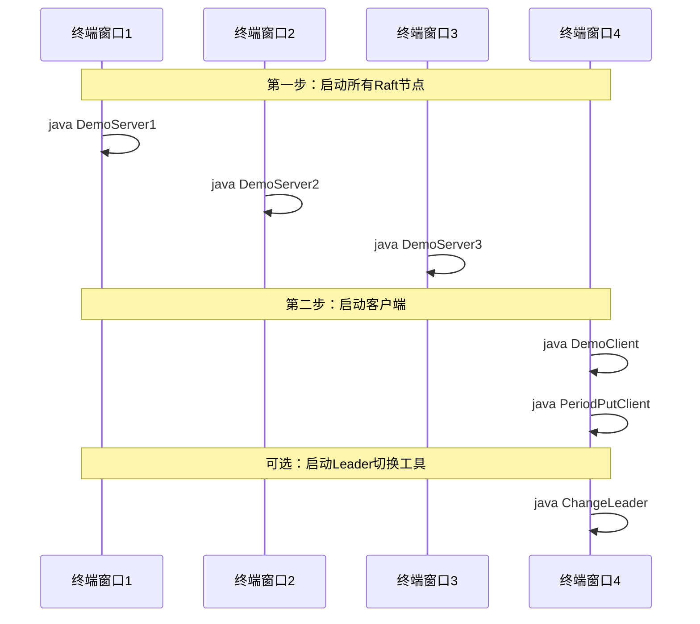

### 网络配置要求

集群需要满足以下网络配置要求：

1. **本地回环地址**：所有节点使用`127.0.0.1`作为IP地址
2. **端口范围**：复制端口4001-4003，服务端口5001-5003
3. **防火墙设置**：确保本地端口可访问
4. **资源限制**：适当调整文件描述符和内存限制

### 启动验证

启动完成后，可以通过以下方式验证集群状态：

```bash
# 检查节点是否就绪
curl http://localhost:5001/api/status
curl http://localhost:5002/api/status  
curl http://localhost:5003/api/status

# 查看Leader信息
java ChangeLeader
```

**章节来源**
- [DemoServer1.java](file://demos/src/main/java/com/github/dtprj/dongting/demos/cluster/DemoServer1.java#L20-L31)
- [DemoServer2.java](file://demos/src/main/java/com/github/dtprj/dongting/demos/cluster/DemoServer2.java#L20-L31)
- [DemoServer3.java](file://demos/src/main/java/com/github/dtprj/dongting/demos/cluster/DemoServer3.java#L20-L31)

## 核心RAFT行为演示

### Leader选举过程

当集群启动或现有Leader失效时，自动触发Leader选举：

```mermaid
gantt
title Leader选举时间线
dateFormat X
axisFormat %s
section 节点1 (Follower)
选举超时 :milestone, e1, 0, 0
开始选举 :active, e1a, after e1, 1
收集投票 :e1b, after e1a, 2
成为Leader :milestone, e1c, after e1b, 3
section 节点2 (Follower)
选举超时 :milestone, e2, 0, 0
开始选举 :e2a, after e2, 1
收集投票 :e2b, after e2a, 2
成为Leader :milestone, e2c, after e2b, 3
section 节点3 (Follower)
选举超时 :milestone, e3, 0, 0
开始选举 :e3a, after e3, 1
收集投票 :e3b, after e3a, 2
成为Leader :milestone, e3c, after e3b, 3
```

### 日志复制机制

日志复制确保所有节点保持一致的状态：

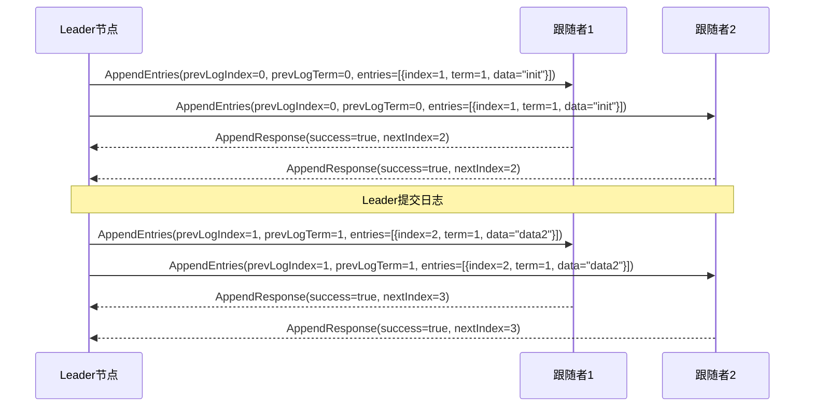

**图表来源**
- [AppendProcessor.java](file://server/src/main/java/com/github/dtprj/dongting/raft/rpc/AppendProcessor.java#L300-L400)

### 数据一致性保证

通过Raft算法确保强一致性：

1. **线性一致性**：所有读操作都能看到最新的写入
2. **原子性**：单个事务中的多个操作要么全部成功，要么全部失败
3. **隔离性**：并发事务之间相互隔离
4. **持久性**：已提交的事务对系统重启具有持久性

**章节来源**
- [VoteProcessor.java](file://server/src/main/java/com/github/dtprj/dongting/raft/rpc/VoteProcessor.java#L80-L180)
- [AppendProcessor.java](file://server/src/main/java/com/github/dtprj/dongting/raft/rpc/AppendProcessor.java#L200-L400)

## 客户端连接与数据操作

### DemoClient实现

DemoClient执行大规模的读写操作，展示集群的性能和稳定性：

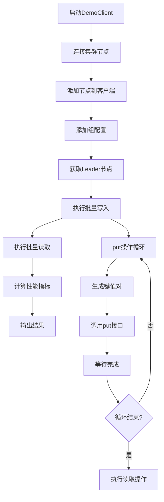

**图表来源**
- [DemoClient.java](file://demos/src/main/java/com/github/dtprj/dongting/demos/cluster/DemoClient.java#L25-L35)
- [DemoClientBase.java](file://demos/src/main/java/com/github/dtprj/dongting/demos/base/DemoClientBase.java#L30-L80)

### PeriodPutClient实现

PeriodPutClient展示持续的数据写入能力：

```java
// 周期性写入逻辑
while (true) {
    try {
        String key = "key" + ((count++) % 10_000);
        long t = System.currentTimeMillis();
        kvClient.put(GROUP_ID, key.getBytes(), "value".getBytes());
        log.info("put key " + key + " cost " + (System.currentTimeMillis() - t) + "ms");
    } catch (Exception e) {
        log.error("put key fail: {}", e.toString());
    }
    Thread.sleep(1000); // 每秒写入一次
}
```

### ChangeLeader工具

ChangeLeader工具允许手动切换Leader节点：

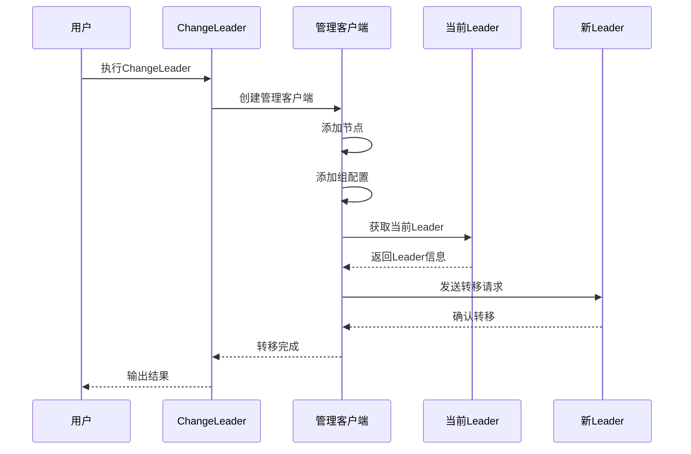

**图表来源**
- [ChangeLeader.java](file://demos/src/main/java/com/github/dtprj/dongting/demos/cluster/ChangeLeader.java#L25-L35)

**章节来源**
- [DemoClient.java](file://demos/src/main/java/com/github/dtprj/dongting/demos/cluster/DemoClient.java#L25-L35)
- [PeriodPutClient.java](file://demos/src/main/java/com/github/dtprj/dongting/demos/cluster/PeriodPutClient.java#L25-L50)
- [ChangeLeader.java](file://demos/src/main/java/com/github/dtprj/dongting/demos/cluster/ChangeLeader.java#L25-L35)

## 故障恢复测试

### 单节点故障模拟

集群具备自动故障检测和恢复能力：

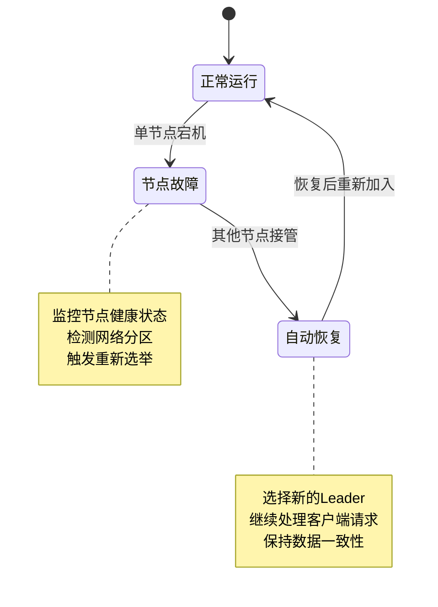

### 故障恢复步骤

1. **故障检测**：监控节点状态和响应时间
2. **自动切换**：当Leader节点不可用时自动选举新Leader
3. **数据同步**：确保新Leader拥有最新的数据状态
4. **服务恢复**：继续处理客户端请求

### 测试场景

- **单节点宕机**：停止任意一个节点，观察集群行为
- **网络分区**：模拟网络中断，测试分区恢复
- **脑裂情况**：验证集群不会出现多个Leader
- **重启恢复**：测试节点重启后的数据完整性

## 性能考虑

### 性能基准测试

集群模式示例提供了详细的性能指标：

```java
// 性能统计输出
System.out.println("----------------------------------------------");
System.out.println("Unbelievable! " + loopCount + " linearizable puts finished in " + t1 + " ms, ");
System.out.println(loopCount + " linearizable lease gets finished in " + t2 + " ms");
System.out.println("Throughput: " + loopCount * 1000L / t1 + " puts/s, " + loopCount * 1000L / t2 + " gets/s");
System.out.println(System.getProperty("os.name") + " with " + Runtime.getRuntime().availableProcessors() + " cores");
System.out.println("----------------------------------------------");
```

### 优化策略

1. **异步处理**：使用Fiber框架实现高效的异步处理
2. **批量操作**：支持批量写入以提高吞吐量
3. **缓存机制**：利用TailCache减少磁盘I/O
4. **连接池**：复用网络连接减少开销

### 内存使用优化

- **对象池**：复用ByteBuffer和其他对象
- **延迟加载**：按需加载大型数据结构
- **垃圾回收**：合理配置JVM参数

## 故障排除指南

### 常见问题及解决方案

#### 1. 节点启动失败

**症状**：节点无法启动或立即退出
**原因**：
- 端口被占用
- 配置文件错误
- 权限不足

**解决方法**：
```bash
# 检查端口占用
netstat -an | grep 4001

# 检查权限
ls -la target/

# 修改配置
# 在DemoServerX.java中修改端口号
```

#### 2. Leader选举失败

**症状**：集群无法选出Leader
**原因**：
- 节点数量不足
- 网络分区
- 时间不同步

**解决方法**：
```bash
# 检查节点状态
java ChangeLeader

# 验证网络连通性
ping 127.0.0.1

# 检查时间同步
date
```

#### 3. 数据不一致

**症状**：不同节点返回不同的数据
**原因**：
- 网络延迟
- 节点故障
- 日志损坏

**解决方法**：
```bash
# 检查日志状态
# 查看target/raft_data_group0_node*/log目录

# 重新同步节点
# 删除节点数据目录后重启

# 使用快照恢复
# 实现快照恢复机制
```

### 调试技巧

1. **启用调试日志**：设置日志级别为DEBUG
2. **监控指标**：使用Prometheus收集性能指标
3. **网络抓包**：使用Wireshark分析网络流量
4. **内存分析**：使用VisualVM检查内存使用

**章节来源**
- [DemoClientBase.java](file://demos/src/main/java/com/github/dtprj/dongting/demos/base/DemoClientBase.java#L60-L85)

## 结论

集群模式示例展示了Dongting框架中Raft算法的完整实现，包括：

1. **高可用架构**：通过3节点配置实现容错能力
2. **自动故障恢复**：节点故障时自动选举新Leader
3. **强一致性保证**：确保数据在所有节点上的一致性
4. **高性能设计**：支持高吞吐量的并发操作
5. **易于使用**：提供直观的API和管理工具

### 最佳实践建议

1. **生产环境部署**：
   - 使用独立的物理服务器
   - 配置适当的监控和告警
   - 定期备份重要数据

2. **扩展性考虑**：
   - 支持动态添加/删除节点
   - 实现负载均衡
   - 优化网络配置

3. **安全性增强**：
   - 启用SSL/TLS加密
   - 实施访问控制
   - 定期安全审计

### 未来发展方向

1. **多租户支持**：支持在同一集群中运行多个独立的Raft组
2. **云原生集成**：更好的容器化和编排支持
3. **监控增强**：集成更多监控和可观测性工具
4. **性能优化**：进一步提升吞吐量和延迟表现

通过本示例的学习，开发者可以深入理解分布式系统的核心概念，并能够基于Dongting框架构建自己的高可用分布式应用。