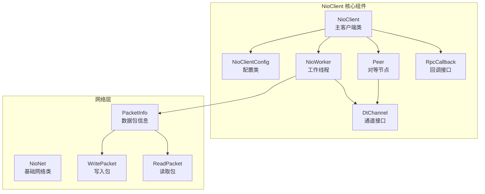
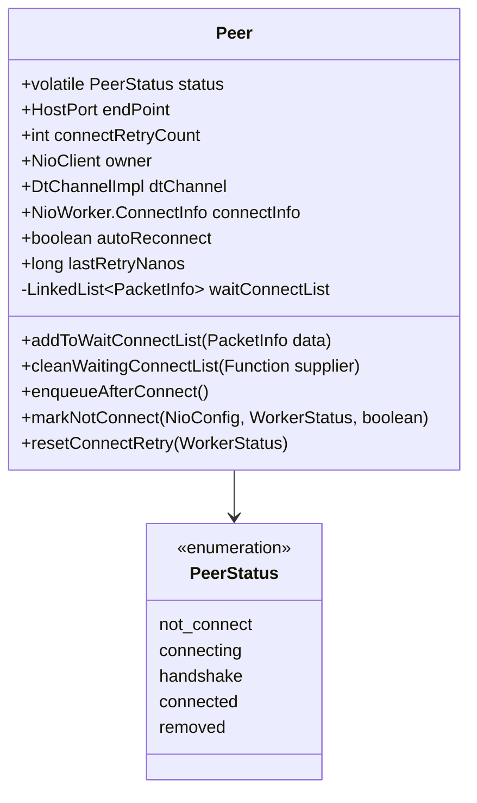

# NioClient 客户端实现技术文档

<cite>
**本文档中引用的文件**
- [NioClient.java](file://client/src/main/java/com/github/dtprj/dongting/net/NioClient.java)
- [NioClientConfig.java](file://client/src/main/java/com/github/dtprj/dongting/net/NioClientConfig.java)
- [NioWorker.java](file://client/src/main/java/com/github/dtprj/dongting/net/NioWorker.java)
- [DtChannel.java](file://client/src/main/java/com/github/dtprj/dongting/net/DtChannel.java)
- [RpcCallback.java](file://client/src/main/java/com/github/dtprj/dongting/net/RpcCallback.java)
- [Peer.java](file://client/src/main/java/com/github/dtprj/dongting/net/Peer.java)
- [PacketInfo.java](file://client/src/main/java/com/github/dtprj/dongting/net/PacketInfo.java)
- [NioClientTest.java](file://client/src/test/java/com/github/dtprj/dongting/net/NioClientTest.java)
</cite>

## 目录
1. [简介](#简介)
2. [项目结构](#项目结构)
3. [核心组件](#核心组件)
4. [架构概览](#架构概览)
5. [详细组件分析](#详细组件分析)
6. [连接管理机制](#连接管理机制)
7. [配置参数详解](#配置参数详解)
8. [RPC调用流程](#rpc调用流程)
9. [性能考虑](#性能考虑)
10. [故障排除指南](#故障排除指南)
11. [总结](#总结)

## 简介

NioClient是Dongting框架中的高性能网络客户端实现，基于Java NIO构建。它提供了可靠的连接管理、自动重连、心跳维持和超时处理机制。该客户端支持请求-响应模式和异步回调，能够与Fiber协程系统无缝集成，实现非阻塞调用。

## 项目结构

NioClient的核心实现位于`client/src/main/java/com/github/dtprj/dongting/net`包中，主要包含以下关键类：



**图表来源**
- [NioClient.java](file://client/src/main/java/com/github/dtprj/dongting/net/NioClient.java#L1-L50)
- [NioWorker.java](file://client/src/main/java/com/github/dtprj/dongting/net/NioWorker.java#L1-L100)

## 核心组件

### NioClient 主类

NioClient是整个客户端的核心类，继承自NioNet，负责管理连接生命周期、发送请求和处理响应。

```java
public class NioClient extends NioNet implements ChannelListener {
    private final NioClientConfig config;
    final NioWorker worker;
    private final CopyOnWriteArrayList<Peer> peers;
    private final Condition connectCond = lock.newCondition();
    private int connectCount;
    
    // 连接状态管理
    long uuid1;
    long uuid2;
}
```

### NioWorker 工作线程

NioWorker是一个独立的工作线程，负责所有网络I/O操作，包括连接建立、数据读写和连接维护。

```java
class NioWorker extends AbstractLifeCircle implements Runnable {
    private final String workerName;
    final WorkerThread thread;
    private final NioStatus nioStatus;
    private final NioConfig config;
    final NioNet owner;
    private Selector selector;
    private final AtomicInteger wakeupCalledInOtherThreads = new AtomicInteger(0);
}
```

**章节来源**
- [NioClient.java](file://client/src/main/java/com/github/dtprj/dongting/net/NioClient.java#L35-L80)
- [NioWorker.java](file://client/src/main/java/com/github/dtprj/dongting/net/NioWorker.java#L50-L120)

## 架构概览

NioClient采用事件驱动的异步架构，通过NioWorker线程处理所有网络I/O操作：


**图表来源**
- [NioClient.java](file://client/src/main/java/com/github/dtprj/dongting/net/NioClient.java#L120-L180)
- [NioWorker.java](file://client/src/main/java/com/github/dtprj/dongting/net/NioWorker.java#L400-L500)

## 详细组件分析

### Peer 对等节点管理

Peer类负责管理单个远程服务器的连接状态和待发送队列：



**图表来源**
- [Peer.java](file://client/src/main/java/com/github/dtprj/dongting/net/Peer.java#L25-L80)

### DtChannel 通道抽象

DtChannel接口定义了网络通道的基本操作：

```java
public interface DtChannel {
    SocketChannel getChannel();
    SocketAddress getRemoteAddr();
    SocketAddress getLocalAddr();
    Peer getPeer();
    long getLastActiveTimeNanos();
    NioNet getOwner();
    UUID getRemoteUuid();
}
```

### PacketInfo 数据包管理

PacketInfo类封装了网络数据包的信息和回调逻辑：

```java
final class PacketInfo {
    DtChannelImpl dtc;
    final WritePacket packet;
    final DtTime timeout;
    final int estimateSize;
    final Peer peer;
    RpcCallback<?> callback;
    final DecoderCallbackCreator<?> respDecoderCallback;
    
    void callSuccess(ReadPacket resp);
    void callFail(boolean callClean, Throwable ex);
}
```

**章节来源**
- [Peer.java](file://client/src/main/java/com/github/dtprj/dongting/net/Peer.java#L25-L130)
- [DtChannel.java](file://client/src/main/java/com/github/dtprj/dongting/net/DtChannel.java#L25-L47)
- [PacketInfo.java](file://client/src/main/java/com/github/dtprj/dongting/net/PacketInfo.java#L25-L80)

## 连接管理机制

### 连接建立流程

NioClient的连接建立遵循严格的生命周期管理：


**图表来源**
- [NioWorker.java](file://client/src/main/java/com/github/dtprj/dongting/net/NioWorker.java#L600-L700)
- [Peer.java](file://client/src/main/java/com/github/dtprj/dongting/net/Peer.java#L80-L130)

### 自动重连机制

NioClient实现了智能的自动重连机制，支持指数退避策略：

```java
// 连接重试配置
public int[] connectRetryIntervals = {100, 1000, 5000, 10 * 1000, 20 * 1000, 30 * 1000, 60 * 1000};

void markNotConnect(NioConfig config, WorkerStatus workerStatus, boolean byAutoRetry) {
    NioClientConfig c = (NioClientConfig) config;
    if (autoReconnect && c.connectRetryIntervals != null) {
        long base;
        int index;
        if (connectRetryCount == 0) {
            base = workerStatus.ts.nanoTime;
            index = 0;
            workerStatus.retryConnect++;
        } else {
            if (byAutoRetry) {
                base = lastRetryNanos;
                index = Math.min(connectRetryCount, c.connectRetryIntervals.length - 1);
            }
        }
        
        if (index != -1) {
            long millis = c.connectRetryIntervals[index];
            lastRetryNanos = base + millis * 1_000_000;
            connectRetryCount = connectRetryCount + 1 > 0 ? connectRetryCount + 1 : Integer.MAX_VALUE;
        }
    }
}
```

### 心跳维持和超时处理

NioWorker定期清理超时连接和待发送请求：

```java
private void run0(Selector selector, Timestamp ts) {
    // ... 其他逻辑 ...
    
    if (ts.nanoTime - lastCleanNanos > cleanIntervalNanos || cleanIntervalNanos <= 0) {
        // 清理读缓冲区
        if (readBuffer != null && ts.nanoTime - readBufferUseTime > cleanIntervalNanos) {
            releaseReadBuffer();
        }
        
        // 清理超时请求
        workerStatus.cleanPendingReqByTimeout();
        
        // 清理超时连接
        cleanOutgoingTimeoutConnect(ts);
        
        // 尝试重连
        if (status == STATUS_RUNNING) {
            tryReconnect(ts);
        }
        
        // 清理对象池
        directPool.clean();
        heapPool.clean();
        
        lastCleanNanos = ts.nanoTime;
    }
}
```

**章节来源**
- [NioWorker.java](file://client/src/main/java/com/github/dtprj/dongting/net/NioWorker.java#L200-L300)
- [Peer.java](file://client/src/main/java/com/github/dtprj/dongting/net/Peer.java#L80-L130)

## 配置参数详解

### NioClientConfig 配置类

NioClientConfig提供了丰富的配置选项来控制客户端行为：

```java
public class NioClientConfig extends NioConfig {
    public List<HostPort> hostPorts;              // 目标服务器地址列表
    public int connectTimeoutMillis = 3000;      // 连接超时时间（毫秒）
    public int[] connectRetryIntervals = {       // 连接重试间隔数组
        100, 1000, 5000, 10 * 1000, 20 * 1000, 
        30 * 1000, 60 * 1000
    };
    
    // 继承自NioConfig的基础配置
    public String name = "DtNioClient";          // 客户端名称
    public int bizThreads = Runtime.getRuntime().availableProcessors(); // 业务线程数
    public int maxOutRequests = 2000;           // 最大并发请求数
    public int maxOutBytes = 32 * 1024 * 1024;  // 最大并发字节数
    public int maxInRequests = 100;             // 最大并发接收请求数
    public int maxInBytes = 32 * 1024 * 1024;   // 最大并发接收字节数
}
```

### 性能相关配置参数

| 参数名 | 默认值 | 说明 |
|--------|--------|------|
| `connectTimeoutMillis` | 3000 | 单次连接超时时间（毫秒） |
| `connectRetryIntervals` | [100,1000,...,60000] | 指数退避重试间隔 |
| `bizThreads` | CPU核心数 | 业务处理线程数 |
| `maxOutRequests` | 2000 | 最大并发请求数 |
| `maxOutBytes` | 32MB | 最大并发字节数 |
| `maxInRequests` | 100 | 最大并发接收请求数 |
| `maxInBytes` | 32MB | 最大并发接收字节数 |

**章节来源**
- [NioClientConfig.java](file://client/src/main/java/com/github/dtprj/dongting/net/NioClientConfig.java#L25-L38)

## RPC调用流程

### 同步RPC调用

```java
public <T> ReadPacket<T> sendRequest(WritePacket request, 
                                     DecoderCallbackCreator<T> decoder, 
                                     DtTime timeout) {
    Objects.requireNonNull(decoder);
    CompletableFuture<ReadPacket<T>> f = new CompletableFuture<>();
    sendRequest(null, request, decoder, timeout, RpcCallback.fromFuture(f));
    return waitFuture(f, timeout);
}
```

### 异步RPC调用

```java
public <T> void sendRequest(Peer peer, WritePacket request, 
                           DecoderCallbackCreator<T> decoder,
                           DtTime timeout, RpcCallback<T> callback) {
    Objects.requireNonNull(decoder);
    send(worker, peer, request, decoder, timeout, callback);
}

// 使用示例
ByteBufferWritePacket wf = new ByteBufferWritePacket(ByteBuffer.wrap(data));
wf.command = Commands.CMD_PING;

client.sendRequest(wf, ctx -> new RefBufferDecoderCallback(),
        new DtTime(5000, TimeUnit.MILLISECONDS), 
        (result, ex) -> {
            if (ex != null) {
                // 处理错误
                handleException(ex);
            } else {
                // 处理响应
                processResponse(result);
            }
        });
```

### RpcCallback 回调机制

RpcCallback接口提供了两种回调方式：

```java
@FunctionalInterface
public interface RpcCallback<T> extends FutureCallback<ReadPacket<T>> {
    // 从CompletableFuture获取结果
    static <T> RpcCallback<T> fromFuture(CompletableFuture<ReadPacket<T>> f) {
        return (result, ex) -> {
            if (ex != null) {
                f.completeExceptionally(ex);
            } else {
                f.complete(result);
            }
        };
    }
    
    // 从CompletableFuture获取解码后的结果
    static <T> RpcCallback<T> fromUnwrapFuture(CompletableFuture<T> f) {
        return (result, ex) -> {
            if (ex != null) {
                f.completeExceptionally(ex);
            } else {
                f.complete(result.body);
            }
        };
    }
}
```

**章节来源**
- [NioClient.java](file://client/src/main/java/com/github/dtprj/dongting/net/NioClient.java#L120-L180)
- [RpcCallback.java](file://client/src/main/java/com/github/dtprj/dongting/net/RpcCallback.java#L25-L47)

## 性能考虑

### 背压控制

NioClient实现了多层次的背压控制机制：

1. **连接级背压**：每个Peer维护待发送队列
2. **通道级背压**：DtChannelImpl管理写队列
3. **全局背压**：NioWorker控制整体并发度

```java
// 背压检查示例
if (workerStatus.packetsToWrite >= config.maxOutRequests ||
    workerStatus.bytesToWrite >= config.maxOutBytes) {
    // 触发背压处理
    handleBackpressure();
}
```

### 流控异常处理

当达到配置的限制时，会抛出FlowControlException：

```java
public class FlowControlException extends NetException {
    public FlowControlException(String message) {
        super(message);
    }
}
```

### 内存池优化

NioClient使用两级内存池来优化内存分配：

```java
// 创建内存池
this.directPool = config.poolFactory.createPool(timestamp, true);  // 直接内存池
this.heapPool = config.poolFactory.createPool(timestamp, false);   // 堆内存池

// 缓冲区复用
private void prepareReadBuffer(Timestamp roundTime) {
    if (readBuffer == null) {
        readBuffer = directPool.borrow(config.readBufferSize);
    }
    readBuffer.clear();
    readBufferUseTime = roundTime.nanoTime;
}
```

## 故障排除指南

### 常见问题及解决方案

#### 1. 连接泄漏问题

**症状**：长时间运行后出现大量连接未释放

**原因**：未正确关闭连接或回调函数异常

**解决方案**：
```java
// 确保在finally块中关闭连接
try {
    ReadPacket<Response> response = client.sendRequest(request, decoder, timeout);
    // 处理响应
} finally {
    // 清理资源
    request.clean();
}
```

#### 2. 背压控制问题

**症状**：客户端性能下降，请求堆积

**原因**：生产者速度超过消费者处理能力

**解决方案**：
```java
// 调整配置参数
NioClientConfig config = new NioClientConfig();
config.maxOutRequests = 5000;  // 增加并发请求数
config.maxOutBytes = 64 * 1024 * 1024;  // 增加并发字节数
```

#### 3. 流控异常处理

**症状**：收到FlowControlException异常

**原因**：客户端达到配置的背压限制

**解决方案**：
```java
try {
    client.sendRequest(request, decoder, timeout, callback);
} catch (FlowControlException e) {
    // 实现退避重试逻辑
    Thread.sleep(100);
    retryWithBackoff(request, decoder, timeout, callback);
}
```

#### 4. 连接超时问题

**症状**：连接建立超时或握手失败

**原因**：网络延迟或服务器负载过高

**解决方案**：
```java
// 增加连接超时时间
config.connectTimeoutMillis = 10000;  // 10秒

// 调整重试策略
config.connectRetryIntervals = new int[]{
    500, 1000, 2000, 5000, 10000, 20000
};
```

### 调试和监控

#### 日志配置

```java
// 启用调试日志
log.info("client {} started", config.name);
log.debug("sending request to peer: {}", peer.endPoint);
log.warn("connect timeout: {}ms, {}", deadline.getTimeout(TimeUnit.MILLISECONDS), peer.endPoint);
```

#### 性能监控

```java
// 性能回调接口
public interface PerfCallback {
    void fireTime(String metric, long startTime, int count, int bytes, Timestamp ts);
    void fire(String metric);
    boolean accept(String metric);
}
```

**章节来源**
- [NioWorker.java](file://client/src/main/java/com/github/dtprj/dongting/net/NioWorker.java#L200-L300)
- [NioClient.java](file://client/src/main/java/com/github/dtprj/dongting/net/NioClient.java#L294-L344)

## 总结

NioClient是一个功能完善的高性能网络客户端实现，具有以下特点：

1. **可靠的连接管理**：支持自动重连、心跳维持和超时处理
2. **灵活的配置选项**：提供丰富的配置参数控制客户端行为
3. **高效的RPC调用**：支持同步和异步调用模式
4. **完善的错误处理**：提供详细的异常类型和处理机制
5. **优秀的性能表现**：通过背压控制和内存池优化提升性能

通过合理配置和使用，NioClient能够满足高并发、低延迟的网络通信需求，是构建分布式系统的理想选择。