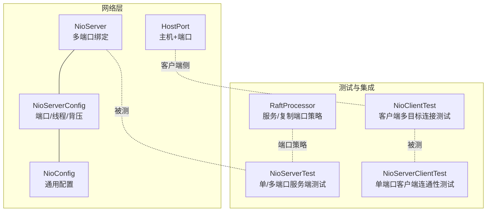
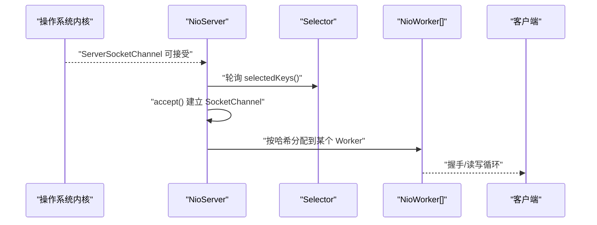
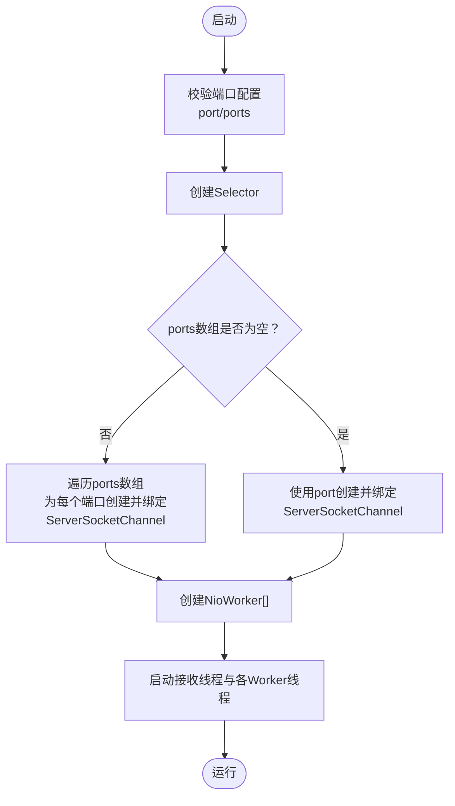
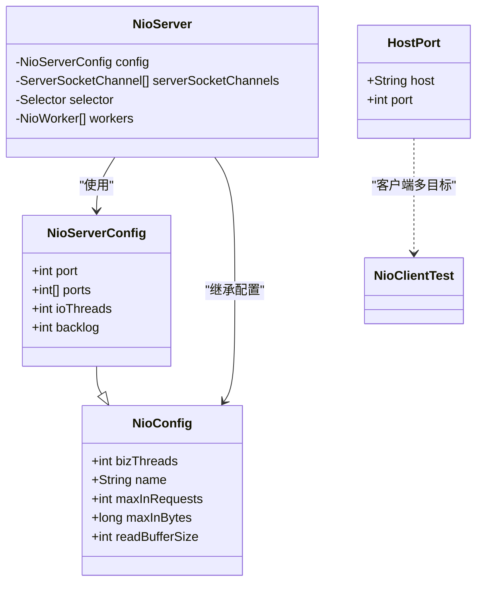

# NioServer多端口绑定

<cite>
**本文引用的文件列表**
- [NioServer.java](file://client/src/main/java/com/github/dtprj/dongting/net/NioServer.java)
- [NioServerConfig.java](file://client/src/main/java/com/github/dtprj/dongting/net/NioServerConfig.java)
- [NioConfig.java](file://client/src/main/java/com/github/dtprj/dongting/net/NioConfig.java)
- [HostPort.java](file://client/src/main/java/com/github/dtprj/dongting/net/HostPort.java)
- [NioServerTest.java](file://client/src/test/java/com/github/dtprj/dongting/net/NioServerTest.java)
- [NioClientTest.java](file://client/src/test/java/com/github/dtprj/dongting/net/NioClientTest.java)
- [NioServerClientTest.java](file://client/src/test/java/com/github/dtprj/dongting/net/NioServerClientTest.java)
- [RaftProcessor.java](file://server/src/main/java/com/github/dtprj/dongting/raft/server/RaftProcessor.java)
</cite>

## 目录
1. [简介](#简介)
2. [项目结构与定位](#项目结构与定位)
3. [核心组件](#核心组件)
4. [架构总览](#架构总览)
5. [详细组件分析](#详细组件分析)
6. [依赖关系分析](#依赖关系分析)
7. [性能与行为特性](#性能与行为特性)
8. [故障排查指南](#故障排查指南)
9. [结论](#结论)
10. [附录：使用示例与最佳实践](#附录使用示例与最佳实践)

## 简介
本文件聚焦于NioServer的“多端口绑定”能力，系统性说明其设计、实现、运行机制与使用方式，并结合测试用例与相关组件，给出可操作的实践建议与排障要点。读者无需深入源码即可理解如何在同一服务实例上同时监听多个TCP端口，以及该能力在实际场景中的意义与限制。

## 项目结构与定位
- NioServer位于网络层，提供基于NIO的异步I/O服务端能力，支持单端口与多端口绑定。
- NioServerConfig用于配置端口、IO线程数、背压参数等；HostPort用于客户端侧的多目标连接配置。
- 测试用例覆盖了单端口、多端口绑定、客户端多目标连接、以及与Raft服务端端口策略的配合使用。

图表来源
- [NioServer.java](file://client/src/main/java/com/github/dtprj/dongting/net/NioServer.java#L60-L138)
- [NioServerConfig.java](file://client/src/main/java/com/github/dtprj/dongting/net/NioServerConfig.java#L21-L43)
- [NioConfig.java](file://client/src/main/java/com/github/dtprj/dongting/net/NioConfig.java#L31-L60)
- [HostPort.java](file://client/src/main/java/com/github/dtprj/dongting/net/HostPort.java#L24-L65)
- [NioServerTest.java](file://client/src/test/java/com/github/dtprj/dongting/net/NioServerTest.java#L86-L110)
- [NioClientTest.java](file://client/src/test/java/com/github/dtprj/dongting/net/NioClientTest.java#L284-L307)
- [NioServerClientTest.java](file://client/src/test/java/com/github/dtprj/dongting/net/NioServerClientTest.java#L41-L76)
- [RaftProcessor.java](file://server/src/main/java/com/github/dtprj/dongting/raft/server/RaftProcessor.java#L44-L74)

章节来源
- [NioServer.java](file://client/src/main/java/com/github/dtprj/dongting/net/NioServer.java#L60-L138)
- [NioServerConfig.java](file://client/src/main/java/com/github/dtprj/dongting/net/NioServerConfig.java#L21-L43)
- [NioConfig.java](file://client/src/main/java/com/github/dtprj/dongting/net/NioConfig.java#L31-L60)
- [HostPort.java](file://client/src/main/java/com/github/dtprj/dongting/net/HostPort.java#L24-L65)
- [NioServerTest.java](file://client/src/test/java/com/github/dtprj/dongting/net/NioServerTest.java#L86-L110)
- [NioClientTest.java](file://client/src/test/java/com/github/dtprj/dongting/net/NioClientTest.java#L284-L307)
- [NioServerClientTest.java](file://client/src/test/java/com/github/dtprj/dongting/net/NioServerClientTest.java#L41-L76)
- [RaftProcessor.java](file://server/src/main/java/com/github/dtprj/dongting/raft/server/RaftProcessor.java#L44-L74)

## 核心组件
- NioServer：服务端主体，负责创建Selector、绑定一个或多个ServerSocketChannel、启动接收线程与IO工作线程。
- NioServerConfig：服务端配置对象，支持单端口port与多端口数组ports二选一或组合使用。
- NioConfig：通用网络配置基类，包含背压、缓冲区大小、性能回调等。
- HostPort：客户端侧地址描述，用于多目标连接（与多端口绑定概念相关但不完全相同）。
- 测试用例：验证单端口、多端口绑定、客户端多目标连接、以及与Raft端口策略的协同。

章节来源
- [NioServer.java](file://client/src/main/java/com/github/dtprj/dongting/net/NioServer.java#L60-L138)
- [NioServerConfig.java](file://client/src/main/java/com/github/dtprj/dongting/net/NioServerConfig.java#L21-L43)
- [NioConfig.java](file://client/src/main/java/com/github/dtprj/dongting/net/NioConfig.java#L31-L60)
- [HostPort.java](file://client/src/main/java/com/github/dtprj/dongting/net/HostPort.java#L24-L65)
- [NioServerTest.java](file://client/src/test/java/com/github/dtprj/dongting/net/NioServerTest.java#L86-L110)
- [NioClientTest.java](file://client/src/test/java/com/github/dtprj/dongting/net/NioClientTest.java#L284-L307)
- [NioServerClientTest.java](file://client/src/test/java/com/github/dtprj/dongting/net/NioServerClientTest.java#L41-L76)
- [RaftProcessor.java](file://server/src/main/java/com/github/dtprj/dongting/raft/server/RaftProcessor.java#L44-L74)

## 架构总览
NioServer采用“1+N线程模型”：
- 1个接收线程（IoAccept）：负责在所有绑定的ServerSocketChannel上接受新连接。
- N个IO工作线程（IoWorker）：负责已建立连接的读写与业务编解码。
- Selector统一管理多个ServerSocketChannel的ACCEPT事件。

图表来源
- [NioServer.java](file://client/src/main/java/com/github/dtprj/dongting/net/NioServer.java#L140-L166)

章节来源
- [NioServer.java](file://client/src/main/java/com/github/dtprj/dongting/net/NioServer.java#L140-L166)

## 详细组件分析

### 多端口绑定实现要点
- 端口配置
  - 支持两种模式：单端口port或多端口数组ports。两者不可同时为0，否则抛出非法参数异常。
  - 对ports数组中的每个端口进行范围校验（1~65535）。
- 绑定流程
  - 启动时创建Selector，并为每个端口创建ServerSocketChannel并绑定。
  - 每个ServerSocketChannel注册到同一Selector的ACCEPT事件。
- 连接分发
  - 接收线程从Selector获取ACCEPT事件后，从对应ServerSocketChannel accept新连接，并根据SocketChannel的哈希值分配给某一个NioWorker。

图表来源
- [NioServer.java](file://client/src/main/java/com/github/dtprj/dongting/net/NioServer.java#L60-L138)

章节来源
- [NioServer.java](file://client/src/main/java/com/github/dtprj/dongting/net/NioServer.java#L60-L138)

### 端口合法性与错误处理
- 端口范围校验：仅允许1~65535。
- 无端口异常：当port为0且ports为空时，抛出非法参数异常。
- IO异常：绑定或关闭过程中捕获IOException并包装为网络异常。

章节来源
- [NioServer.java](file://client/src/main/java/com/github/dtprj/dongting/net/NioServer.java#L60-L89)
- [NioServer.java](file://client/src/main/java/com/github/dtprj/dongting/net/NioServer.java#L101-L121)

### 与客户端多目标连接的关系
- 客户端侧通过HostPort列表配置多个目标地址，用于多目标连接与故障切换。
- 服务端多端口绑定与客户端多目标连接是两个独立的能力维度：前者是服务端同时监听多个端口，后者是客户端连接多个服务端实例或端口。

章节来源
- [HostPort.java](file://client/src/main/java/com/github/dtprj/dongting/net/HostPort.java#L24-L65)
- [NioClientTest.java](file://client/src/test/java/com/github/dtprj/dongting/net/NioClientTest.java#L284-L307)

### 与Raft服务端端口策略的协同
- RaftProcessor中存在“服务端口/复制端口”的判断逻辑，用于在多端口场景下区分请求应走哪个端口。
- 当启用服务端口或复制端口时，可通过检查请求通道的本地端口来决定是否允许处理该命令。

章节来源
- [RaftProcessor.java](file://server/src/main/java/com/github/dtprj/dongting/raft/server/RaftProcessor.java#L44-L74)

## 依赖关系分析
- NioServer依赖NioServerConfig与NioConfig，以获得端口、IO线程数、背压与通用配置。
- NioServerConfig继承自NioConfig，扩展了port与ports字段。
- HostPort用于客户端侧的多目标连接配置，与服务端多端口绑定在概念上互补。

图表来源
- [NioConfig.java](file://client/src/main/java/com/github/dtprj/dongting/net/NioConfig.java#L31-L60)
- [NioServerConfig.java](file://client/src/main/java/com/github/dtprj/dongting/net/NioServerConfig.java#L21-L43)
- [NioServer.java](file://client/src/main/java/com/github/dtprj/dongting/net/NioServer.java#L60-L138)
- [HostPort.java](file://client/src/main/java/com/github/dtprj/dongting/net/HostPort.java#L24-L65)

章节来源
- [NioConfig.java](file://client/src/main/java/com/github/dtprj/dongting/net/NioConfig.java#L31-L60)
- [NioServerConfig.java](file://client/src/main/java/com/github/dtprj/dongting/net/NioServerConfig.java#L21-L43)
- [NioServer.java](file://client/src/main/java/com/github/dtprj/dongting/net/NioServer.java#L60-L138)
- [HostPort.java](file://client/src/main/java/com/github/dtprj/dongting/net/HostPort.java#L24-L65)

## 性能与行为特性
- 线程模型：1个接收线程+N个IO工作线程，连接建立后与某个Worker绑定，避免跨线程竞争。
- 负载均衡：新连接按SocketChannel哈希值分配到不同Worker，理论上可实现连接级的负载均衡。
- 背压控制：通过NioConfig中的maxInRequests/maxInBytes等参数控制入站压力。
- 选择器：所有ServerSocketChannel共享同一Selector，减少上下文切换成本。

章节来源
- [NioServer.java](file://client/src/main/java/com/github/dtprj/dongting/net/NioServer.java#L140-L166)
- [NioConfig.java](file://client/src/main/java/com/github/dtprj/dongting/net/NioConfig.java#L31-L60)

## 故障排查指南
- 端口冲突
  - 现象：启动时绑定失败。
  - 排查：确认ports/port未被占用；检查防火墙与权限。
- 端口非法
  - 现象：启动时报非法参数异常。
  - 排查：确保port在1~65535范围内；若使用ports数组，逐项检查。
- 无端口
  - 现象：启动时报无端口异常。
  - 排查：至少设置port或ports之一非空。
- 连接无法建立
  - 现象：客户端无法连接。
  - 排查：确认服务端已start且端口正确；检查Selector是否正常；查看Worker线程状态。
- 多端口场景下的请求路由
  - 现象：请求被拒绝或返回不支持。
  - 排查：结合RaftProcessor的端口策略，确认请求应走的服务端口或复制端口是否启用。

章节来源
- [NioServer.java](file://client/src/main/java/com/github/dtprj/dongting/net/NioServer.java#L60-L138)
- [NioServerTest.java](file://client/src/test/java/com/github/dtprj/dongting/net/NioServerTest.java#L86-L110)
- [RaftProcessor.java](file://server/src/main/java/com/github/dtprj/dongting/raft/server/RaftProcessor.java#L44-L74)

## 结论
NioServer的多端口绑定通过在启动阶段为每个端口创建ServerSocketChannel并统一注册到Selector，实现了在同一进程内同时监听多个TCP端口。该能力与客户端多目标连接、以及服务端端口策略（如Raft的服务端口/复制端口）共同构成灵活的部署与路由方案。实践中需关注端口合法性、背压配置与线程模型带来的负载分布特征。

## 附录：使用示例与最佳实践
- 单端口启动
  - 设置NioServerConfig.port，启动NioServer，客户端通过单一HostPort连接。
  - 参考路径：[NioServerClientTest.java](file://client/src/test/java/com/github/dtprj/dongting/net/NioServerClientTest.java#L41-L76)
- 多端口启动
  - 设置NioServerConfig.ports为非空数组，启动NioServer，客户端可连接任一端口。
  - 参考路径：[NioServerTest.java](file://client/src/test/java/com/github/dtprj/dongting/net/NioServerTest.java#L86-L110)
- 客户端多目标连接
  - 在NioClientConfig中设置hostPorts列表，实现多目标连接与故障切换。
  - 参考路径：[NioClientTest.java](file://client/src/test/java/com/github/dtprj/dongting/net/NioClientTest.java#L284-L307)
- 与Raft端口策略配合
  - 在RaftProcessor中根据请求通道本地端口判断是否允许处理该命令，实现服务端口/复制端口分流。
  - 参考路径：[RaftProcessor.java](file://server/src/main/java/com/github/dtprj/dongting/raft/server/RaftProcessor.java#L44-L74)