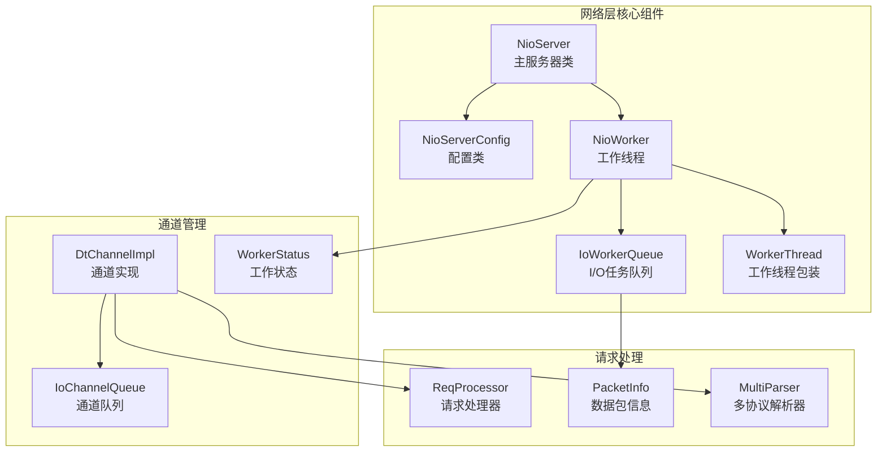
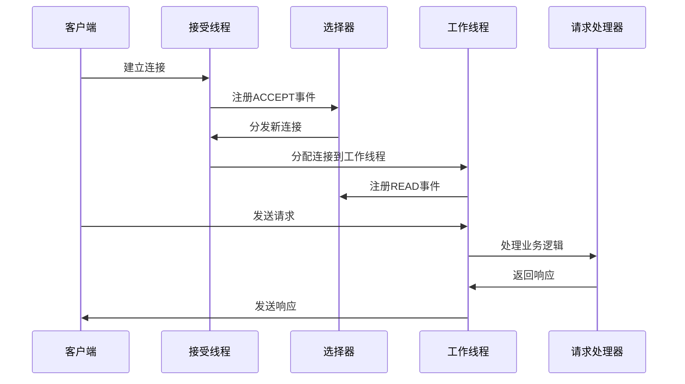
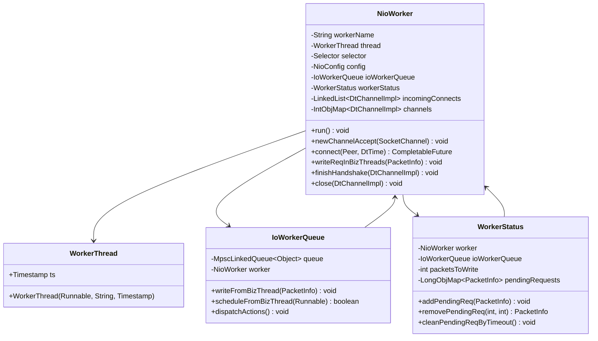
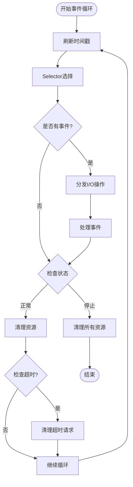
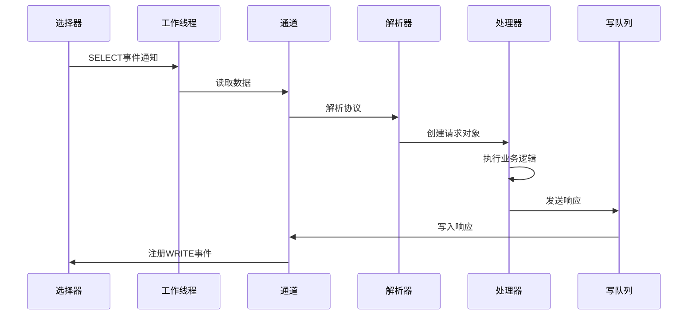
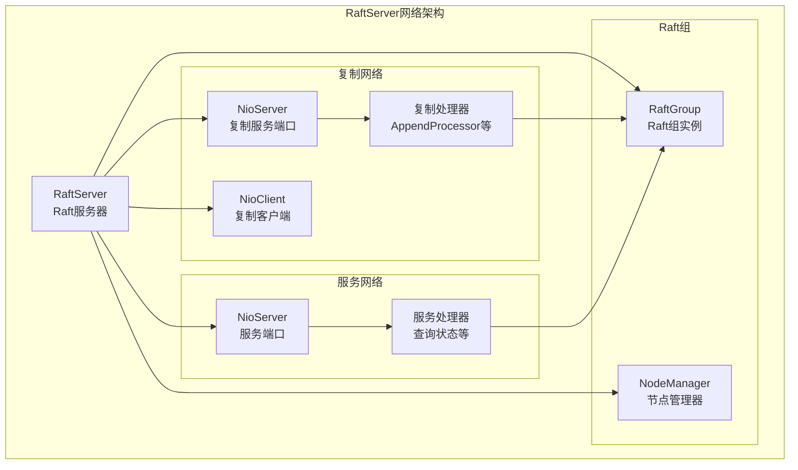

# NioServer架构与实现文档

<cite>
**本文档引用的文件**
- [NioServer.java](file://client/src/main/java/com/github/dtprj/dongting/net/NioServer.java)
- [NioServerConfig.java](file://client/src/main/java/com/github/dtprj/dongting/net/NioServerConfig.java)
- [NioWorker.java](file://client/src/main/java/com/github/dtprj/dongting/net/NioWorker.java)
- [IoWorkerQueue.java](file://client/src/main/java/com/github/dtprj/dongting/net/IoWorkerQueue.java)
- [WorkerThread.java](file://client/src/main/java/com/github/dtprj/dongting/net/WorkerThread.java)
- [ReqProcessor.java](file://client/src/main/java/com/github/dtprj/dongting/net/ReqProcessor.java)
- [DtChannelImpl.java](file://client/src/main/java/com/github/dtprj/dongting/net/DtChannelImpl.java)
- [WorkerStatus.java](file://client/src/main/java/com/github/dtprj/dongting/net/WorkerStatus.java)
- [PacketInfo.java](file://client/src/main/java/com/github/dtprj/dongting/net/PacketInfo.java)
- [IoChannelQueue.java](file://client/src/main/java/com/github/dtprj/dongting/net/IoChannelQueue.java)
- [RaftServer.java](file://server/src/main/java/com/github/dtprj/dongting/raft/server/RaftServer.java)
</cite>

## 目录
1. [简介](#简介)
2. [项目结构概览](#项目结构概览)
3. [核心组件分析](#核心组件分析)
4. [架构概览](#架构概览)
5. [详细组件分析](#详细组件分析)
6. [线程模型与事件循环](#线程模型与事件循环)
7. [请求处理流程](#请求处理流程)
8. [性能调优指南](#性能调优指南)
9. [RaftServer集成](#raftserver集成)
10. [故障排除指南](#故障排除指南)
11. [总结](#总结)

## 简介

Dongting的NioServer是一个高性能的网络服务器框架，采用基于NIO的异步非阻塞I/O模型。它通过精心设计的线程模型、事件循环机制和任务分发策略，实现了高并发连接处理和高效的请求响应能力。该服务器广泛应用于分布式系统中，特别是在Raft共识算法的实现中作为网络通信层。

## 项目结构概览

NioServer的核心实现位于`client/src/main/java/com/github/dtprj/dongting/net/`包下，主要包含以下关键组件：



**图表来源**
- [NioServer.java](file://client/src/main/java/com/github/dtprj/dongting/net/NioServer.java#L58-L85)
- [NioWorker.java](file://client/src/main/java/com/github/dtprj/dongting/net/NioWorker.java#L60-L120)
- [IoWorkerQueue.java](file://client/src/main/java/com/github/dtprj/dongting/net/IoWorkerQueue.java#L30-L50)

## 核心组件分析

### NioServer - 主服务器类

NioServer是整个网络层的核心入口点，负责管理服务器生命周期、接受客户端连接以及协调各个工作线程。

```java
public class NioServer extends NioNet implements Runnable {
    private final NioServerConfig config;
    private ServerSocketChannel ssc;
    private Selector selector;
    private volatile boolean stop;
    private final Thread acceptThread;
    final NioWorker[] workers;
    private final ConcurrentHashMap<UUID, DtChannel> clients = new ConcurrentHashMap<>();
}
```

**节点来源**
- [NioServer.java](file://client/src/main/java/com/github/dtprj/dongting/net/NioServer.java#L58-L85)

### NioServerConfig - 配置管理

NioServerConfig提供了丰富的配置选项，支持动态调整服务器行为：

```java
public class NioServerConfig extends NioConfig {
    public int port;
    public int ioThreads;
    public int backlog = 4096;
    
    // 背压控制配置
    this.maxOutRequests = 0;      // 最大出站请求数
    this.maxOutBytes = 0;         // 最大出站字节数
    this.maxInRequests = 100_000; // 最大入站请求数
    this.maxInBytes = 512 * 1024 * 1024; // 最大入站字节数
}
```

**节点来源**
- [NioServerConfig.java](file://client/src/main/java/com/github/dtprj/dongting/net/NioServerConfig.java#L20-L45)

## 架构概览

NioServer采用了经典的多线程I/O模型，通过以下关键设计实现高性能：



**图表来源**
- [NioServer.java](file://client/src/main/java/com/github/dtprj/dongting/net/NioServer.java#L110-L140)
- [NioWorker.java](file://client/src/main/java/com/github/dtprj/dongting/net/NioWorker.java#L200-L250)

## 详细组件分析

### NioWorker - 工作线程核心

NioWorker是NioServer的核心组件，每个工作线程都运行在一个独立的线程中，负责处理特定数量的连接：



**图表来源**
- [NioWorker.java](file://client/src/main/java/com/github/dtprj/dongting/net/NioWorker.java#L60-L120)
- [WorkerThread.java](file://client/src/main/java/com/github/dtprj/dongting/net/WorkerThread.java#L20-L30)
- [IoWorkerQueue.java](file://client/src/main/java/com/github/dtprj/dongting/net/IoWorkerQueue.java#L30-L50)
- [WorkerStatus.java](file://client/src/main/java/com/github/dtprj/dongting/net/WorkerStatus.java#L30-L60)

**节点来源**
- [NioWorker.java](file://client/src/main/java/com/github/dtprj/dongting/net/NioWorker.java#L60-L120)
- [WorkerThread.java](file://client/src/main/java/com/github/dtprj/dongting/net/WorkerThread.java#L20-L30)
- [IoWorkerQueue.java](file://client/src/main/java/com/github/dtprj/dongting/net/IoWorkerQueue.java#L30-L50)
- [WorkerStatus.java](file://client/src/main/java/com/github/dtprj/dongting/net/WorkerStatus.java#L30-L60)

### IoWorkerQueue - 任务分发中心

IoWorkerQueue实现了生产者-消费者模式，负责在业务线程和I/O线程之间传递任务：

```java
class IoWorkerQueue {
    private final MpscLinkedQueue<Object> queue = MpscLinkedQueue.newInstance();
    private final NioWorker worker;
    
    public void writeFromBizThread(PacketInfo data) {
        data.perfTimeOrAddOrder = perfCallback.takeTime(PerfConsts.RPC_D_WORKER_QUEUE);
        if (!queue.offer(data)) {
            data.callFail(true, new NetException("IoQueue closed"));
        }
    }
    
    public boolean scheduleFromBizThread(Runnable runnable) {
        return queue.offer(runnable);
    }
    
    public void dispatchActions() {
        Object data;
        while ((data = queue.relaxedPoll()) != null) {
            if (data instanceof PacketInfo) {
                processWriteData((PacketInfo) data);
            } else {
                ((Runnable) data).run();
            }
        }
    }
}
```

**节点来源**
- [IoWorkerQueue.java](file://client/src/main/java/com/github/dtprj/dongting/net/IoWorkerQueue.java#L40-L80)

### WorkerStatus - 状态管理

WorkerStatus负责跟踪工作线程的状态，包括待处理请求、超时检测和资源清理：

```java
class WorkerStatus {
    final NioWorker worker;
    final IoWorkerQueue ioWorkerQueue;
    final ByteBufferPool directPool;
    final RefBufferFactory heapPool;
    final Timestamp ts;
    
    int retryConnect;
    int packetsToWrite;
    
    private final LongObjMap<PacketInfo> pendingRequests = new LongObjMap<>();
    private final ArrayList<PacketInfo> tempSortList = new ArrayList<>();
    
    public void addPendingReq(PacketInfo pi) {
        pi.perfTimeOrAddOrder = addOrder;
        addOrder++;
        DtChannelImpl dtc = pi.dtc;
        
        PacketInfo old = pendingRequests.put(BitUtil.toLong(dtc.channelIndexInWorker, pi.packet.seq), pi);
        if (old != null) {
            // 序列号溢出或重复处理
            String errMsg = "dup seq: old=" + old.packet + ", new=" + pi.packet;
            BugLog.getLog().error(errMsg);
            removeFromChannelQueue(old);
            removeFromNearTimeoutQueue(old);
            old.callFail(true, new NetException(errMsg));
        }
        addToNearTimeoutQueueIfNeed(pi);
        
        // 添加到通道队列
        if (dtc.pendingReqHead == null) {
            dtc.pendingReqHead = pi;
        } else {
            dtc.pendingReqTail.nextInChannel = pi;
            pi.prevInChannel = dtc.pendingReqTail;
        }
        dtc.pendingReqTail = pi;
    }
}
```

**节点来源**
- [WorkerStatus.java](file://client/src/main/java/com/github/dtprj/dongting/net/WorkerStatus.java#L80-L150)

## 线程模型与事件循环

### NioWorker事件循环

NioWorker的工作循环是整个服务器的核心，它在一个无限循环中处理各种事件：



**图表来源**
- [NioWorker.java](file://client/src/main/java/com/github/dtprj/dongting/net/NioWorker.java#L150-L200)

### WorkerThread调度机制

WorkerThread是对标准Java线程的封装，提供了时间戳管理功能：

```java
public final class WorkerThread extends Thread {
    public final Timestamp ts;
    
    WorkerThread(Runnable r, String name, Timestamp ts) {
        super(r, name);
        this.ts = ts;
    }
}
```

**节点来源**
- [WorkerThread.java](file://client/src/main/java/com/github/dtprj/dongting/net/WorkerThread.java#L20-L30)

## 请求处理流程

### 从Selector事件分发到ReqProcessor执行

请求处理遵循严格的流程，确保高效和可靠的数据传输：



**图表来源**
- [NioWorker.java](file://client/src/main/java/com/github/dtprj/dongting/net/NioWorker.java#L300-L400)
- [DtChannelImpl.java](file://client/src/main/java/com/github/dtprj/dongting/net/DtChannelImpl.java#L150-L250)

### 请求处理核心逻辑

```java
private void processIncomingRequest(ReadPacket req, ReqProcessor p, Timestamp roundTime) {
    int maxReq = nioConfig.maxInRequests;
    long maxBytes = nioConfig.maxInBytes;
    boolean flowControl;
    
    if (maxReq <= 0 && maxBytes <= 0) {
        flowControl = false;
    } else {
        nioStatus.pendingLock.lock();
        try {
            if (maxReq > 0 && nioStatus.pendingRequests + 1 > maxReq) {
                log.debug("pendingRequests({})>maxInRequests({}), write response code FLOW_CONTROL to client",
                        nioStatus.pendingRequests + 1, nioConfig.maxInRequests);
                writeErrorInIoThread(packet, CmdCodes.FLOW_CONTROL,
                        "max incoming request: " + nioConfig.maxInRequests);
                return;
            }
            if (maxBytes > 0 && nioStatus.pendingBytes + currentReadPacketSize > maxBytes) {
                log.debug("pendingBytes({})>maxInBytes({}), write response code FLOW_CONTROL to client",
                        nioStatus.pendingBytes + currentReadPacketSize, nioConfig.maxInBytes);
                writeErrorInIoThread(packet, CmdCodes.FLOW_CONTROL,
                        "max incoming request bytes: " + nioConfig.maxInBytes);
                return;
            }
            nioStatus.pendingRequests++;
            nioStatus.pendingBytes += currentReadPacketSize;
        } finally {
            nioStatus.pendingLock.unlock();
        }
        flowControl = true;
    }
    
    ReqContext reqContext = new ReqContext(this, req, new DtTime(roundTime, req.timeout, TimeUnit.NANOSECONDS));
    if (p.executor == null) {
        if (timeout(req, reqContext, roundTime)) {
            return;
        }
        WritePacket resp;
        try {
            resp = p.process(req, reqContext);
        } catch (NetCodeException e) {
            log.warn("ReqProcessor.process fail, command={}, code={}, msg={}",
                    req.command, e.getCode(), e.getMessage());
            writeErrorInIoThread(req, e.getCode(), e.getMessage(), reqContext.getTimeout());
            return;
        } catch (Throwable e) {
            log.warn("ReqProcessor.process fail", e);
            writeErrorInIoThread(req, CmdCodes.SYS_ERROR, e.toString(), reqContext.getTimeout());
            return;
        } finally {
            if (flowControl) {
                releasePending(currentReadPacketSize);
            }
        }
        if (resp != null) {
            resp.command = req.command;
            resp.packetType = PacketType.TYPE_RESP;
            resp.seq = req.seq;
            subQueue.enqueue(new PacketInfo(this, resp, reqContext.getTimeout()));
        }
    } else {
        try {
            p.executor.execute(new ProcessInBizThreadTask(
                    req, p, currentReadPacketSize, this, flowControl, reqContext));
        } catch (RejectedExecutionException e) {
            log.debug("catch RejectedExecutionException, write response code FLOW_CONTROL to client, maxInRequests={}",
                    nioConfig.maxInRequests);
            writeErrorInIoThread(req, CmdCodes.FLOW_CONTROL,
                    "max incoming request: " + nioConfig.maxInRequests, reqContext.getTimeout());
            if (flowControl) {
                releasePending(currentReadPacketSize);
            }
        }
    }
}
```

**节点来源**
- [DtChannelImpl.java](file://client/src/main/java/com/github/dtprj/dongting/net/DtChannelImpl.java#L350-L450)

## 性能调优指南

### 合理配置worker线程池大小

NioServerConfig提供了智能的线程数计算方法：

```java
private int calcIoThreads() {
    int p = Runtime.getRuntime().availableProcessors();
    if (p <= 3) {
        return 1;
    } else if (p <= 6) {
        return 2;
    } else if (p <= 12) {
        return 3;
    } else if (p <= 24) {
        return 4;
    } else if (p <= 40) {
        return 5;
    } else if (p <= 64) {
        return 6;
    } else if (p <= 100) {
        return 7;
    } else {
        return 8;
    }
}
```

### 关键参数配置建议

| 参数 | 默认值 | 说明 | 调优建议 |
|------|--------|------|----------|
| `ioThreads` | 动态计算 | I/O工作线程数 | 根据CPU核心数调整，通常为CPU核心数的1-2倍 |
| `bizThreads` | CPU核心数×4 | 业务线程池大小 | 根据业务复杂度调整，复杂业务可适当增加 |
| `maxInRequests` | 100,000 | 单个工作线程最大入站请求数 | 根据内存和业务需求调整 |
| `maxInBytes` | 512MB | 单个工作线程最大入站字节数 | 根据内存和业务需求调整 |
| `selectTimeout` | 50ms | 选择器超时时间 | 较小值提高响应速度，较大值降低CPU使用率 |
| `cleanInterval` | 100ms | 清理间隔时间 | 根据连接数和请求频率调整 |

### 连接限流和资源隔离

NioServer通过多层次的背压控制实现资源隔离：

1. **工作线程级别限制**：每个工作线程独立控制入站和出站流量
2. **通道级别限制**：每个连接独立控制流量
3. **业务线程池限制**：防止业务线程池过载

```java
// 背压控制示例
if (maxReq > 0 && nioStatus.pendingRequests + 1 > maxReq) {
    log.debug("pendingRequests({})>maxInRequests({}), write response code FLOW_CONTROL to client",
            nioStatus.pendingRequests + 1, nioConfig.maxInRequests);
    writeErrorInIoThread(packet, CmdCodes.FLOW_CONTROL,
            "max incoming request: " + nioConfig.maxInRequests);
    return;
}
```

**节点来源**
- [NioServerConfig.java](file://client/src/main/java/com/github/dtprj/dongting/net/NioServerConfig.java#L35-L55)
- [DtChannelImpl.java](file://client/src/main/java/com/github/dtprj/dongting/net/DtChannelImpl.java#L350-L380)

## RaftServer集成

### 网络层路由机制

RaftServer通过NioServer实现不同类型的网络通信：



**图表来源**
- [RaftServer.java](file://server/src/main/java/com/github/dtprj/dongting/raft/server/RaftServer.java#L125-L180)

### 请求路由到RaftGroup

RaftServer将不同命令路由到相应的RaftGroup进行处理：

```java
// 复制网络处理器注册
replicateNioServer.register(Commands.NODE_PING, new NodePingProcessor(serverConfig.nodeId, nodeManager));
addRaftGroupProcessor(replicateNioServer, Commands.RAFT_PING, new RaftPingProcessor(this));
AppendProcessor appendProcessor = new AppendProcessor(this);
addRaftGroupProcessor(replicateNioServer, Commands.RAFT_APPEND_ENTRIES, appendProcessor);
addRaftGroupProcessor(replicateNioServer, Commands.RAFT_INSTALL_SNAPSHOT, appendProcessor);
addRaftGroupProcessor(replicateNioServer, Commands.RAFT_REQUEST_VOTE, new VoteProcessor(this));

// 服务网络处理器注册
if (serverConfig.servicePort > 0) {
    NioServerConfig serviceServerConfig = new NioServerConfig();
    serviceServerConfig.port = serverConfig.servicePort;
    serviceServerConfig.name = "RaftServiceServer" + serverConfig.nodeId;
    serviceServerConfig.bizThreads = 0;
    serviceServerConfig.decodeContextFactory = DecodeContextEx::new;
    customServiceNioServer(serviceServerConfig);
    serviceNioServer = new NioServer(serviceServerConfig);
    addRaftGroupProcessor(serviceNioServer, Commands.RAFT_QUERY_STATUS, queryStatusProcessor);
}
```

**节点来源**
- [RaftServer.java](file://server/src/main/java/com/github/dtprj/dongting/raft/server/RaftServer.java#L159-L180)

### 配置定制化

RaftServer允许对网络配置进行定制：

```java
protected void customReplicateNioServer(NioServerConfig c) {
    // 自定义复制网络配置
    c.maxOutRequests = 0;
    c.maxOutBytes = 0;
    c.maxInRequests = 0;
    c.maxInBytes = 0;
    c.maxBodySize = Integer.MAX_VALUE;
    c.maxPacketSize = Integer.MAX_VALUE;
    c.decodeContextFactory = DecodeContextEx::new;
}

protected void customServiceNioServer(NioServerConfig c) {
    // 自定义服务网络配置
    c.bizThreads = Runtime.getRuntime().availableProcessors() * 2;
    c.maxInRequests = 1000;
    c.maxInBytes = 128 * 1024 * 1024;
}
```

**节点来源**
- [RaftServer.java](file://server/src/main/java/com/github/dtprj/dongting/raft/server/RaftServer.java#L210-L220)

## 故障排除指南

### 常见问题诊断

1. **连接超时问题**
   - 检查`connectTimeoutMillis`配置
   - 验证网络连通性和防火墙设置
   - 查看连接重试间隔配置

2. **内存泄漏问题**
   - 监控`pendingRequests`和`pendingBytes`计数
   - 检查`cleanInterval`配置是否合适
   - 验证请求处理是否正确释放资源

3. **性能瓶颈问题**
   - 调整`ioThreads`和`bizThreads`数量
   - 优化`selectTimeout`和`cleanInterval`
   - 监控各组件的CPU和内存使用情况

### 日志分析

NioServer提供了详细的日志记录，帮助诊断问题：

```java
// 连接建立日志
log.info("new DtChannel init: {}", sc);

// 连接关闭日志  
log.info("closing channel: {}", sc);

// 错误处理日志
log.warn("socket may closed, remove it: {}", key.channel());

// 性能监控日志
log.debug("drop timeout request: {}ms, cmd={}, seq={}, {}", timeout, p.command,
        p.seq, pi.dtc.getChannel());
```

### 监控指标

建议监控以下关键指标：

- **连接数**：当前活跃连接数
- **请求处理速率**：每秒处理的请求数
- **队列长度**：各队列的积压情况
- **内存使用**：堆内存和直接内存使用情况
- **CPU使用率**：各线程的CPU占用情况
- **错误率**：各类错误的发生频率

## 总结

Dongting的NioServer通过精心设计的多线程I/O模型，实现了高性能、高可靠性的网络通信能力。其核心特点包括：

1. **高效的线程模型**：基于NIO的异步非阻塞I/O，支持大量并发连接
2. **灵活的任务分发**：通过IoWorkerQueue实现业务线程和I/O线程的解耦
3. **完善的资源管理**：多层次的背压控制和资源隔离机制
4. **优秀的扩展性**：支持自定义配置和处理器，适应不同业务场景
5. **强大的集成能力**：与Raft算法完美集成，支撑分布式系统的网络通信

通过合理的配置和调优，NioServer能够满足高并发、低延迟的网络通信需求，在分布式系统中发挥重要作用。其设计理念和实现方式为构建高性能网络应用提供了宝贵的参考。