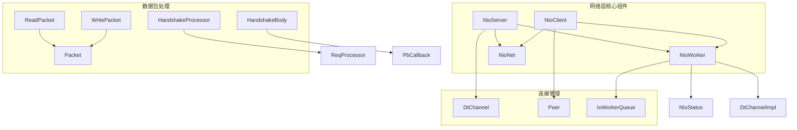
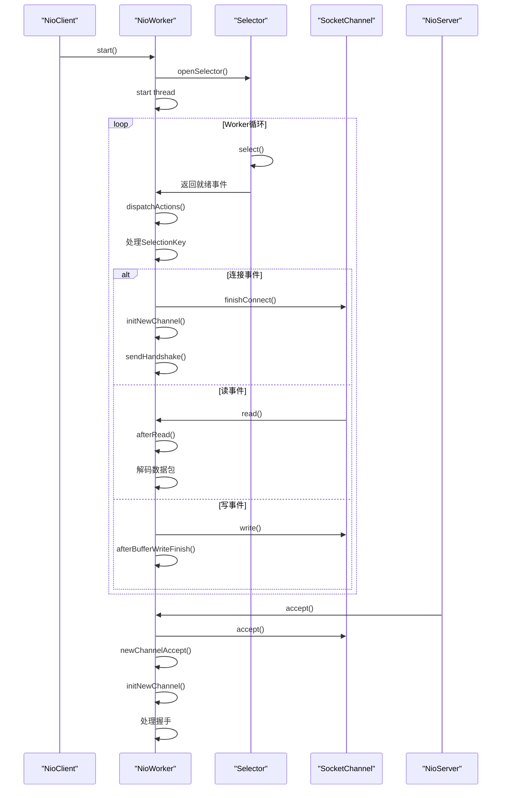
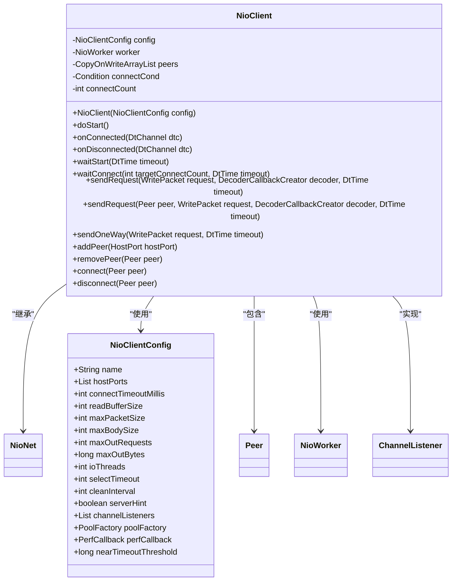
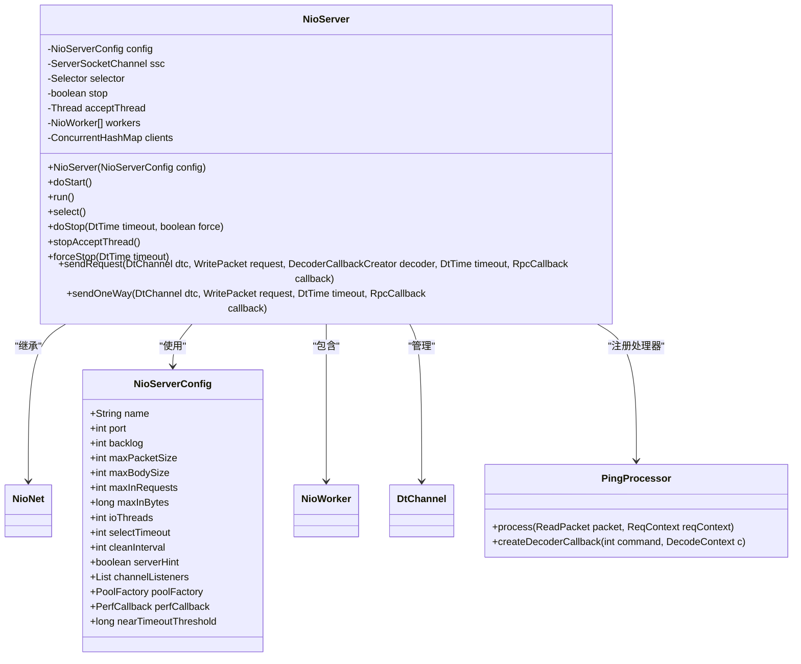
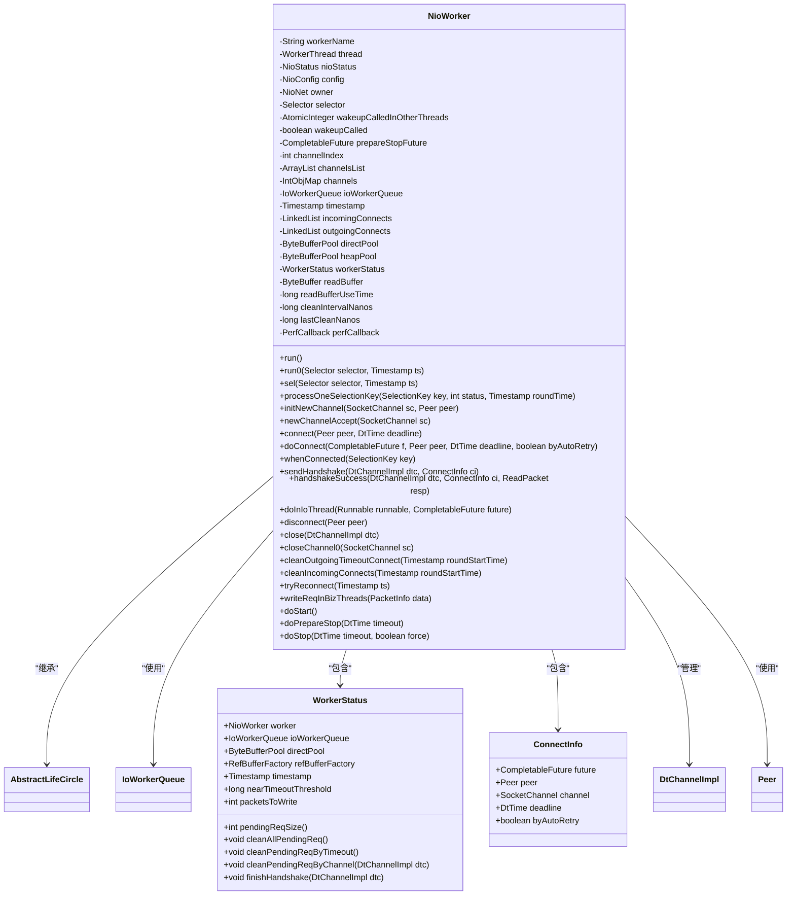
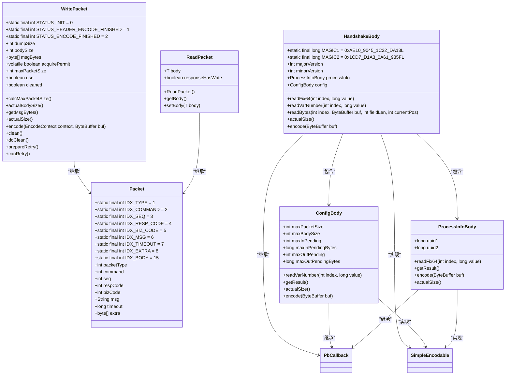
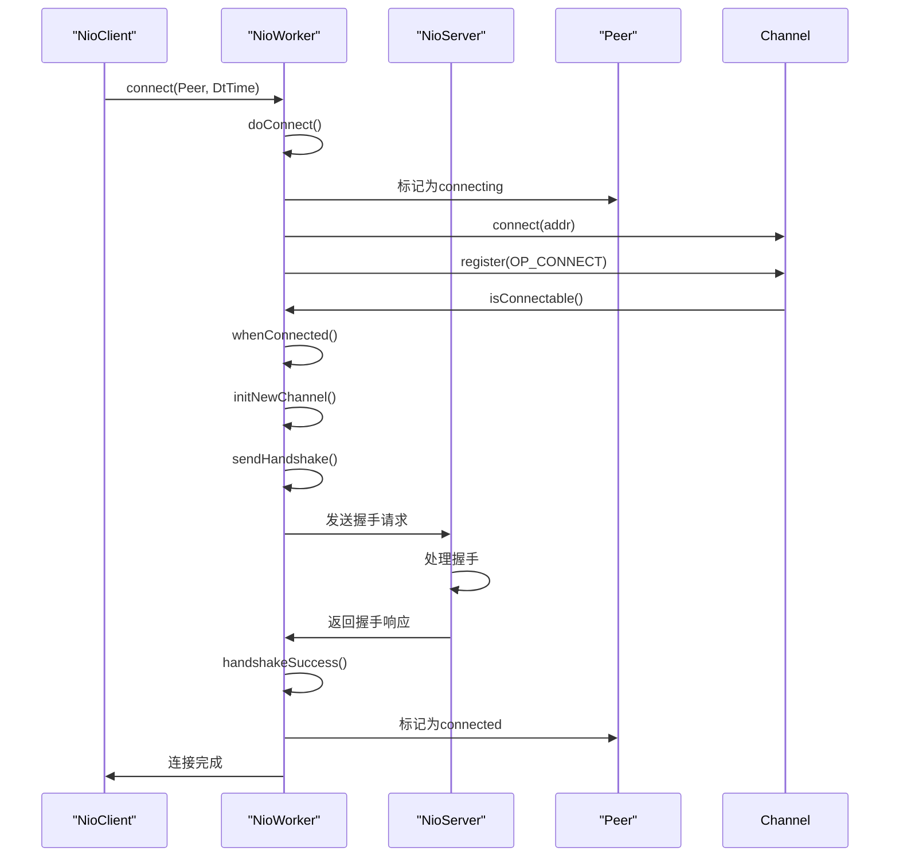
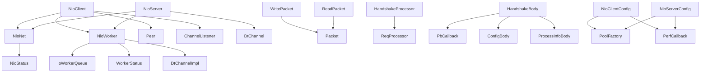

# 网络通信

<cite>
**本文档引用的文件**   
- [NioClient.java](file://client/src/main/java/com/github/dtprj/dongting/net/NioClient.java)
- [NioServer.java](file://client/src/main/java/com/github/dtprj/dongting/net/NioServer.java)
- [NioWorker.java](file://client/src/main/java/com/github/dtprj/dongting/net/NioWorker.java)
- [Packet.java](file://client/src/main/java/com/github/dtprj/dongting/net/Packet.java)
- [WritePacket.java](file://client/src/main/java/com/github/dtprj/dongting/net/WritePacket.java)
- [ReadPacket.java](file://client/src/main/java/com/github/dtprj/dongting/net/ReadPacket.java)
- [HandshakeProcessor.java](file://client/src/main/java/com/github/dtprj/dongting/net/HandshakeProcessor.java)
- [HandshakeBody.java](file://client/src/main/java/com/github/dtprj/dongting/net/HandshakeBody.java)
- [DtChannel.java](file://client/src/main/java/com/github/dtprj/dongting/net/DtChannel.java)
- [Peer.java](file://client/src/main/java/com/github/dtprj/dongting/net/Peer.java)
- [NioClientConfig.java](file://client/src/main/java/com/github/dtprj/dongting/net/NioClientConfig.java)
- [NioServerConfig.java](file://client/src/main/java/com/github/dtprj/dongting/net/NioServerConfig.java)
</cite>

## 目录
1. [简介](#简介)
2. [项目结构](#项目结构)
3. [核心组件](#核心组件)
4. [架构概述](#架构概述)
5. [详细组件分析](#详细组件分析)
6. [依赖分析](#依赖分析)
7. [性能考虑](#性能考虑)
8. [故障排除指南](#故障排除指南)
9. [结论](#结论)

## 简介
本文档详细描述了Dongting项目中基于Java NIO的网络通信层实现。重点介绍客户端(NioClient)和服务器(NioServer)的实现原理，包括连接建立、握手过程、数据包编解码和传输机制。文档还说明了网络层如何与上层的RAFT和KV逻辑进行交互，并详细描述了连接管理、超时处理和错误恢复策略，为需要理解或定制网络行为的用户提供参考。

## 项目结构
网络通信相关的核心代码位于client模块的`com.github.dtprj.dongting.net`包中，采用典型的NIO多线程架构设计。

**图示来源**
- [NioClient.java](file://client/src/main/java/com/github/dtprj/dongting/net/NioClient.java#L37-L73)
- [NioServer.java](file://client/src/main/java/com/github/dtprj/dongting/net/NioServer.java#L30-L65)
- [NioWorker.java](file://client/src/main/java/com/github/dtprj/dongting/net/NioWorker.java#L80-L120)

## 核心组件
网络通信层的核心组件包括NioClient、NioServer、NioWorker和数据包处理相关类。NioClient和NioServer都继承自NioNet，共享基础网络功能。NioWorker负责实际的I/O操作，每个Worker对应一个线程。数据包通过WritePacket和ReadPacket进行编解码，支持多种数据类型和编码格式。

**组件来源**
- [NioClient.java](file://client/src/main/java/com/github/dtprj/dongting/net/NioClient.java#L37-L73)
- [NioServer.java](file://client/src/main/java/com/github/dtprj/dongting/net/NioServer.java#L30-L65)
- [Packet.java](file://client/src/main/java/com/github/dtprj/dongting/net/Packet.java#L15-L35)

## 架构概述
Dongting的网络通信层采用经典的Reactor模式，结合多线程工作模型，实现了高性能的网络I/O处理。

**图示来源**
- [NioClient.java](file://client/src/main/java/com/github/dtprj/dongting/net/NioClient.java#L75-L95)
- [NioServer.java](file://client/src/main/java/com/github/dtprj/dongting/net/NioServer.java#L85-L115)
- [NioWorker.java](file://client/src/main/java/com/github/dtprj/dongting/net/NioWorker.java#L200-L300)

## 详细组件分析

### NioClient分析
NioClient是客户端网络组件，负责与服务器建立连接并发送请求。

**图示来源**
- [NioClient.java](file://client/src/main/java/com/github/dtprj/dongting/net/NioClient.java#L37-L73)
- [NioClientConfig.java](file://client/src/main/java/com/github/dtprj/dongting/net/NioClientConfig.java#L15-L45)

### NioServer分析
NioServer是服务器端网络组件，负责监听端口并处理客户端连接。

**图示来源**
- [NioServer.java](file://client/src/main/java/com/github/dtprj/dongting/net/NioServer.java#L30-L65)
- [NioServerConfig.java](file://client/src/main/java/com/github/dtprj/dongting/net/NioServerConfig.java#L15-L45)

### NioWorker分析
NioWorker是I/O工作线程，负责实际的网络I/O操作。

**图示来源**
- [NioWorker.java](file://client/src/main/java/com/github/dtprj/dongting/net/NioWorker.java#L80-L120)
- [IoWorkerQueue.java](file://client/src/main/java/com/github/dtprj/dongting/net/IoWorkerQueue.java#L15-L30)

### 数据包处理分析
数据包处理是网络通信的核心，包括数据包的编解码和传输。

**图示来源**
- [Packet.java](file://client/src/main/java/com/github/dtprj/dongting/net/Packet.java#L15-L35)
- [WritePacket.java](file://client/src/main/java/com/github/dtprj/dongting/net/WritePacket.java#L30-L60)
- [ReadPacket.java](file://client/src/main/java/com/github/dtprj/dongting/net/ReadPacket.java#L15-L25)
- [HandshakeBody.java](file://client/src/main/java/com/github/dtprj/dongting/net/HandshakeBody.java#L15-L45)

### 连接管理分析
连接管理负责客户端与服务器之间的连接建立、维护和断开。

**图示来源**
- [NioClient.java](file://client/src/main/java/com/github/dtprj/dongting/net/NioClient.java#L150-L180)
- [NioWorker.java](file://client/src/main/java/com/github/dtprj/dongting/net/NioWorker.java#L500-L600)
- [HandshakeProcessor.java](file://client/src/main/java/com/github/dtprj/dongting/net/HandshakeProcessor.java#L15-L45)

## 依赖分析
网络通信层的组件之间存在明确的依赖关系，形成了清晰的层次结构。

**图示来源**
- [NioClient.java](file://client/src/main/java/com/github/dtprj/dongting/net/NioClient.java#L37-L73)
- [NioServer.java](file://client/src/main/java/com/github/dtprj/dongting/net/NioServer.java#L30-L65)
- [NioWorker.java](file://client/src/main/java/com/github/dtprj/dongting/net/NioWorker.java#L80-L120)

## 性能考虑
网络通信层在设计时充分考虑了性能优化，采用了多种技术来提高吞吐量和降低延迟。

1. **对象池技术**：使用ByteBufferPool和RefBufferFactory来复用缓冲区对象，减少GC压力。
2. **零拷贝**：支持RefBuffer等零拷贝数据结构，避免不必要的数据复制。
3. **批量处理**：通过IoWorkerQueue批量处理I/O事件，减少系统调用次数。
4. **连接复用**：保持长连接，避免频繁的连接建立和断开开销。
5. **异步处理**：采用异步非阻塞I/O模型，提高并发处理能力。
6. **配置优化**：提供多种配置参数，可根据实际场景调整性能。

**性能来源**
- [NioWorker.java](file://client/src/main/java/com/github/dtprj/dongting/net/NioWorker.java#L150-L180)
- [ByteBufferPool.java](file://client/src/main/java/com/github/dtprj/dongting/buf/ByteBufferPool.java#L15-L30)
- [RefBufferFactory.java](file://client/src/main/java/com/github/dtprj/dongting/buf/RefBufferFactory.java#L15-L30)

## 故障排除指南
当网络通信出现问题时，可以按照以下步骤进行排查：

1. **检查连接状态**：使用`getPeers()`方法检查客户端连接状态，确认是否已成功连接。
2. **查看日志信息**：检查日志中的错误信息，特别是连接超时、握手失败等异常。
3. **验证配置参数**：确认NioClientConfig和NioServerConfig中的参数设置是否正确。
4. **检查防火墙设置**：确保服务器端口已开放，防火墙没有阻止连接。
5. **测试网络连通性**：使用ping或telnet测试网络连通性。
6. **监控性能指标**：通过PerfCallback监控关键性能指标，如I/O延迟、吞吐量等。
7. **检查资源使用**：确认系统资源（内存、文件描述符等）是否充足。

**故障排除来源**
- [NioClient.java](file://client/src/main/java/com/github/dtprj/dongting/net/NioClient.java#L250-L280)
- [NioWorker.java](file://client/src/main/java/com/github/dtprj/dongting/net/NioWorker.java#L700-L730)
- [NetException.java](file://client/src/main/java/com/github/dtprj/dongting/net/NetException.java#L15-L25)

## 结论
Dongting的网络通信层基于Java NIO实现了高性能、高可靠性的网络I/O处理。通过NioClient和NioServer的协同工作，结合NioWorker的多线程模型，实现了高效的连接管理和数据传输。握手机制确保了连接的安全性和兼容性，而灵活的配置选项和性能优化技术则满足了不同应用场景的需求。该网络层为上层的RAFT和KV逻辑提供了稳定可靠的通信基础，是整个系统的重要组成部分。