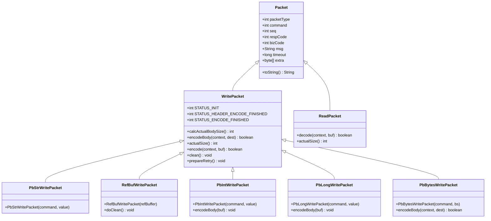
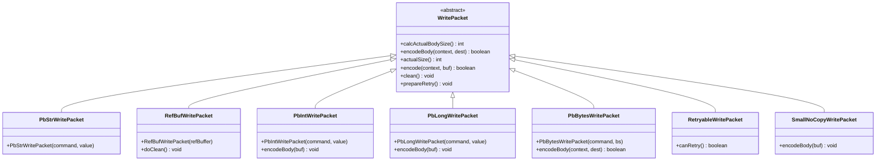

# 通信协议与数据包

<cite>
**本文档中引用的文件**
- [Packet.java](file://client/src/main/java/com/github/dtprj/dongting/net/Packet.java)
- [CmdCodes.java](file://client/src/main/java/com/github/dtprj/dongting/net/CmdCodes.java)
- [PacketType.java](file://client/src/main/java/com/github/dtprj/dongting/net/PacketType.java)
- [HandshakeBody.java](file://client/src/main/java/com/github/dtprj/dongting/net/HandshakeBody.java)
- [MultiParser.java](file://client/src/main/java/com/github/dtprj/dongting/net/MultiParser.java)
- [WritePacket.java](file://client/src/main/java/com/github/dtprj/dongting/net/WritePacket.java)
- [PbStrWritePacket.java](file://client/src/main/java/com/github/dtprj/dongting/net/PbStrWritePacket.java)
- [RefBufWritePacket.java](file://client/src/main/java/com/github/dtprj/dongting/net/RefBufWritePacket.java)
- [PbIntWritePacket.java](file://client/src/main/java/com/github/dtprj/dongting/net/PbIntWritePacket.java)
- [PbLongWritePacket.java](file://client/src/main/java/com/github/dtprj/dongting/net/PbLongWritePacket.java)
- [PbBytesWritePacket.java](file://client/src/main/java/com/github/dtprj/dongting/net/PbBytesWritePacket.java)
- [NetCodeException.java](file://client/src/main/java/com/github/dtprj/dongting/net/NetCodeException.java)
- [NetException.java](file://client/src/main/java/com/github/dtprj/dongting/net/NetException.java)
- [NetTimeoutException.java](file://client/src/main/java/com/github/dtprj/dongting/net/NetTimeoutException.java)
</cite>

## 目录
1. [简介](#简介)
2. [数据包结构概述](#数据包结构概述)
3. [Packet头部格式](#packet头部格式)
4. [命令码（CmdCodes）定义](#命令码cmdcodes定义)
5. [数据包类型（PacketType）](#数据包类型packettype)
6. [握手流程（HandshakeBody）](#握手流程handshakebody)
7. [消息解析器（MultiParser）](#消息解析器multiparser)
8. [WritePacket具体实现类](#writepacket具体实现类)
9. [数据包生命周期](#数据包生命周期)
10. [协议扩展指南](#协议扩展指南)
11. [异常处理机制](#异常处理机制)
12. [性能考虑](#性能考虑)
13. [故障排除指南](#故障排除指南)
14. [总结](#总结)

## 简介

Dongting通信协议层是一个高性能的自定义二进制协议实现，专为分布式系统设计。该协议采用Protocol Buffers（Protobuf）作为序列化格式，提供了高效的网络通信能力。协议支持多种数据包类型，包括请求、响应和单向消息，并具备完整的握手流程、错误处理和性能优化机制。

## 数据包结构概述

Dongting协议的数据包结构基于分层设计，包含以下核心组件：



**图表来源**
- [Packet.java](file://client/src/main/java/com/github/dtprj/dongting/net/Packet.java#L18-L51)
- [WritePacket.java](file://client/src/main/java/com/github/dtprj/dongting/net/WritePacket.java#L28-L199)

## Packet头部格式

Packet头部是整个数据包的核心部分，包含了协议版本、命令标识、序列号等关键信息。头部字段按照Protocol Buffers的编码规则进行组织：


**图表来源**
- [WritePacket.java](file://client/src/main/java/com/github/dtprj/dongting/net/WritePacket.java#L50-L120)

**章节来源**
- [Packet.java](file://client/src/main/java/com/github/dtprj/dongting/net/Packet.java#L18-L51)
- [WritePacket.java](file://client/src/main/java/com/github/dtprj/dongting/net/WritePacket.java#L50-L120)

## 命令码（CmdCodes）定义

命令码是协议中用于标识不同操作类型的数字代码。这些代码定义在CmdCodes接口中，为客户端和服务器之间的通信提供了标准化的指令集：

```java
public interface CmdCodes {
    int SUCCESS = 0;                    // 成功
    int CLIENT_ERROR = 1;               // 客户端错误
    int SYS_ERROR = 2;                  // 系统错误
    int COMMAND_NOT_SUPPORT = 3;        // 不支持的命令
    int STOPPING = 4;                   // 正在停止
    int FLOW_CONTROL = 5;               // 流量控制
    int NOT_RAFT_LEADER = 6;           // 非Raft领导者
    int RAFT_GROUP_NOT_FOUND = 7;      // Raft组未找到
    int RAFT_GROUP_STOPPED = 8;        // Raft组已停止
    int RAFT_GROUP_NOT_INIT = 9;       // Raft组未初始化
}
```

这些命令码涵盖了常见的网络通信场景，包括成功响应、错误处理、状态查询和特定业务逻辑的反馈。

**章节来源**
- [CmdCodes.java](file://client/src/main/java/com/github/dtprj/dongting/net/CmdCodes.java#L18-L32)

## 数据包类型（PacketType）

数据包类型定义了消息在网络中的传输方向和用途：

```java
public interface PacketType {
    int TYPE_REQ = 1;        // 请求包
    int TYPE_RESP = 2;       // 响应包
    int TYPE_ONE_WAY = 3;    // 单向消息
}
```

- **TYPE_REQ（1）**：表示这是一个请求消息，通常需要响应
- **TYPE_RESP（2）**：表示这是一个响应消息，对应某个请求
- **TYPE_ONE_WAY（3）**：表示这是一个不需要响应的单向消息

**章节来源**
- [PacketType.java](file://client/src/main/java/com/github/dtprj/dongting/net/PacketType.java#L6-L23)

## 握手流程（HandshakeBody）

HandshakeBody是协议握手阶段的核心组件，负责建立连接时的身份验证和配置协商。握手过程包含以下关键元素：

### 魔数验证

握手过程中使用两个魔数进行身份验证：
- `MAGIC1 = 0xAE10_9045_1C22_DA13L`
- `MAGIC2 = 0x1CD7_D1A3_0A61_935FL`

这些魔数确保只有正确的协议版本能够建立连接。

### 握手流程架构


**图表来源**
- [HandshakeBody.java](file://client/src/main/java/com/github/dtprj/dongting/net/HandshakeBody.java#L30-L80)

### 配置协商

握手过程中会协商以下配置参数：

```java
class ConfigBody {
    int maxPacketSize;          // 最大数据包大小
    int maxBodySize;           // 最大消息体大小
    int maxInPending;          // 最大输入待处理数量
    long maxInPendingBytes;    // 最大输入待处理字节数
    int maxOutPending;         // 最大输出待处理数量
    long maxOutPendingBytes;   // 最大输出待处理字节数
}
```

这些配置参数帮助双方协调资源使用，防止内存溢出和性能问题。

**章节来源**
- [HandshakeBody.java](file://client/src/main/java/com/github/dtprj/dongting/net/HandshakeBody.java#L30-L217)

## 消息解析器（MultiParser）

MultiParser是协议的核心解析组件，负责高效地解析传入的数据流。它采用流式解析方式，能够处理不完整的数据包和多包合并的情况。

### 解析流程


**图表来源**
- [MultiParser.java](file://client/src/main/java/com/github/dtprj/dongting/net/MultiParser.java#L35-L96)

### 性能特性

MultiParser具有以下性能特点：
- **零拷贝解析**：直接在原始字节缓冲区上解析，避免不必要的内存复制
- **流式处理**：支持部分数据包的逐步解析
- **内存效率**：最小化内存分配和垃圾回收压力
- **错误恢复**：遇到无效数据时能够快速失败并清理资源

**章节来源**
- [MultiParser.java](file://client/src/main/java/com/github/dtprj/dongting/net/MultiParser.java#L25-L96)

## WritePacket具体实现类

WritePacket是所有可写数据包的基类，提供了统一的编码和生命周期管理。系统提供了多种专门化的WritePacket实现类：

### 实现类概览



**图表来源**
- [WritePacket.java](file://client/src/main/java/com/github/dtprj/dongting/net/WritePacket.java#L28-L199)
- [PbStrWritePacket.java](file://client/src/main/java/com/github/dtprj/dongting/net/PbStrWritePacket.java#L18-L27)
- [RefBufWritePacket.java](file://client/src/main/java/com/github/dtprj/dongting/net/RefBufWritePacket.java#L22-L52)

### 具体实现类详解

#### 1. PbStrWritePacket
用于发送字符串数据的专用数据包，自动将字符串转换为UTF-8字节数组。

#### 2. RefBufWritePacket
基于引用计数缓冲区的写入包，适用于大块数据的高效传输，自动管理内存释放。

#### 3. PbIntWritePacket
用于发送整数数据的轻量级数据包，采用固定长度编码。

#### 4. PbLongWritePacket
用于发送长整型数据的轻量级数据包，同样采用固定长度编码。

#### 5. PbBytesWritePacket
通用的字节数组写入包，支持任意二进制数据的传输。

**章节来源**
- [PbStrWritePacket.java](file://client/src/main/java/com/github/dtprj/dongting/net/PbStrWritePacket.java#L18-L27)
- [RefBufWritePacket.java](file://client/src/main/java/com/github/dtprj/dongting/net/RefBufWritePacket.java#L22-L52)
- [PbIntWritePacket.java](file://client/src/main/java/com/github/dtprj/dongting/net/PbIntWritePacket.java#L22-L46)
- [PbLongWritePacket.java](file://client/src/main/java/com/github/dtprj/dongting/net/PbLongWritePacket.java#L22-L46)
- [PbBytesWritePacket.java](file://client/src/main/java/com/github/dtprj/dongting/net/PbBytesWritePacket.java#L22-L43)

## 数据包生命周期

数据包的生命周期包括创建、编码、发送、接收、解码和处理六个主要阶段：

### 生命周期流程


### 编码阶段详解

编码阶段分为三个子阶段：

1. **初始化阶段（STATUS_INIT）**：计算总大小，准备编码上下文
2. **头部编码阶段（STATUS_HEADER_ENCODE_FINISHED）**：编码Packet头部信息
3. **消息体编码阶段（STATUS_ENCODE_FINISHED）**：编码实际消息内容

### 内存管理

每个WritePacket都实现了完整的内存管理机制：
- **自动清理**：通过`clean()`方法自动释放资源
- **引用计数**：对于共享缓冲区使用引用计数管理
- **异常安全**：即使在编码过程中发生异常也能正确清理

## 协议扩展指南

为了支持新的命令类型，需要遵循以下步骤：

### 扩展步骤

1. **定义新命令码**：在CmdCodes接口中添加新的常量
2. **创建数据包类**：继承WritePacket或其子类
3. **实现编码逻辑**：重写`calcActualBodySize()`和`encodeBody()`方法
4. **添加解码逻辑**：在相应的ReadPacket类中实现解码
5. **更新握手配置**：如果需要新的配置参数，在HandshakeBody中添加

### 示例：添加新的命令类型

```java
// 1. 在CmdCodes中添加新命令码
public interface CmdCodes {
    // ... 现有命令码 ...
    int NEW_COMMAND = 10;  // 新命令类型
}

// 2. 创建对应的WritePacket类
public class NewCommandWritePacket extends WritePacket {
    private final String data;
    
    public NewCommandWritePacket(String data) {
        this.command = CmdCodes.NEW_COMMAND;
        this.data = data;
    }
    
    @Override
    protected int calcActualBodySize() {
        return data.getBytes(StandardCharsets.UTF_8).length;
    }
    
    @Override
    protected boolean encodeBody(EncodeContext context, ByteBuffer dest) {
        byte[] bytes = data.getBytes(StandardCharsets.UTF_8);
        dest.put(bytes);
        return true;
    }
}
```

## 异常处理机制

Dongting协议提供了完善的异常处理机制，涵盖各种网络通信场景：

### 异常层次结构


**图表来源**
- [NetException.java](file://client/src/main/java/com/github/dtprj/dongting/net/NetException.java#L18-L41)
- [NetCodeException.java](file://client/src/main/java/com/github/dtprj/dongting/net/NetCodeException.java#L18-L49)
- [NetTimeoutException.java](file://client/src/main/java/com/github/dtprj/dongting/net/NetTimeoutException.java#L18-L31)

### 异常处理策略

#### 1. NetCodeException
用于处理带有业务码的错误情况，包含详细的错误信息和额外数据：

```java
public class NetCodeException extends NetException {
    private final int code;
    private final byte[] extra;
    
    public NetCodeException(int code, String msg, byte[] extra) {
        super(msg);
        this.code = code;
        this.extra = extra;
    }
}
```

#### 2. NetTimeoutException
专门处理超时相关的异常，提供清晰的错误信息。

#### 3. 异常传播
- **本地异常**：在本地处理并记录
- **远程异常**：通过NetCodeException传递给调用方
- **网络异常**：自动重试或降级处理

**章节来源**
- [NetException.java](file://client/src/main/java/com/github/dtprj/dongting/net/NetException.java#L18-L41)
- [NetCodeException.java](file://client/src/main/java/com/github/dtprj/dongting/net/NetCodeException.java#L18-L49)
- [NetTimeoutException.java](file://client/src/main/java/com/github/dtprj/dongting/net/NetTimeoutException.java#L18-L31)

## 性能考虑

Dongting协议在设计时充分考虑了性能优化：

### 内存优化

1. **零拷贝设计**：尽可能减少数据复制
2. **对象池化**：复用频繁创建的对象
3. **引用计数**：管理共享缓冲区的生命周期
4. **延迟初始化**：只在需要时计算昂贵的操作结果

### 编码优化

1. **预计算大小**：提前计算数据包大小，避免重复计算
2. **流式编码**：支持增量编码，减少内存占用
3. **压缩支持**：对大型数据包提供压缩选项
4. **批量处理**：支持多个数据包的批量编码

### 网络优化

1. **连接复用**：支持多个逻辑连接共享物理连接
2. **流量控制**：内置流量控制机制，防止拥塞
3. **心跳检测**：定期发送心跳包保持连接活跃
4. **断线重连**：自动处理网络中断和重连

## 故障排除指南

### 常见问题及解决方案

#### 1. 握手失败
**症状**：连接建立后立即断开
**原因**：魔数不匹配或版本不兼容
**解决方案**：
- 检查客户端和服务器的协议版本
- 验证魔数配置是否一致
- 查看日志中的详细错误信息

#### 2. 数据包大小超限
**症状**：抛出PbException异常
**原因**：数据包大小超过配置限制
**解决方案**：
- 调整maxPacketSize配置
- 分割大数据包为多个小包
- 优化数据结构减少冗余

#### 3. 编码异常
**症状**：编码过程中抛出CodecException
**原因**：消息体大小与实际编码结果不匹配
**解决方案**：
- 检查`calcActualBodySize()`方法的实现
- 验证`encodeBody()`方法的完整性
- 使用调试工具验证编码结果

#### 4. 内存泄漏
**症状**：长时间运行后内存持续增长
**原因**：WritePacket未正确清理
**解决方案**：
- 确保调用`clean()`方法
- 检查引用计数管理
- 使用内存分析工具定位泄漏源

### 调试技巧

1. **启用详细日志**：设置适当的日志级别查看详细信息
2. **使用监控工具**：监控网络流量和内存使用情况
3. **单元测试**：编写针对特定场景的单元测试
4. **性能分析**：使用性能分析工具识别瓶颈

## 总结

Dongting通信协议层是一个设计精良的高性能网络通信框架，具有以下核心优势：

### 技术特点

1. **高效性**：采用Protocol Buffers作为序列化格式，提供优秀的编码效率
2. **可靠性**：完善的异常处理和错误恢复机制
3. **可扩展性**：模块化设计支持灵活的功能扩展
4. **性能优化**：多层次的性能优化策略

### 应用场景

- **分布式系统**：适合构建高可用的分布式应用
- **微服务通信**：提供高效的服务间通信能力
- **实时数据传输**：支持低延迟的实时数据交换
- **大规模集群**：适用于大规模集群环境

### 最佳实践

1. **合理选择数据包类型**：根据通信需求选择合适的PacketType
2. **优化消息大小**：避免过大的消息包，考虑分片传输
3. **正确处理异常**：实现健壮的异常处理逻辑
4. **监控和调优**：持续监控性能指标并进行优化

通过深入理解这些设计原理和实现细节，开发者可以更好地利用Dongting协议构建高性能的网络应用程序。