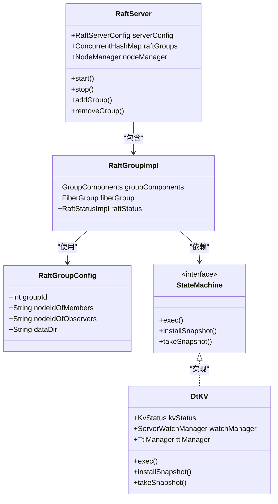
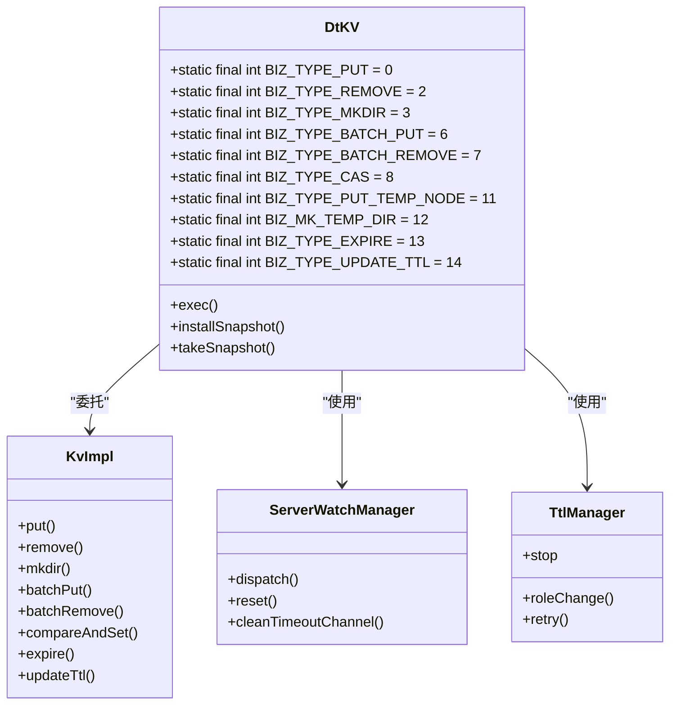
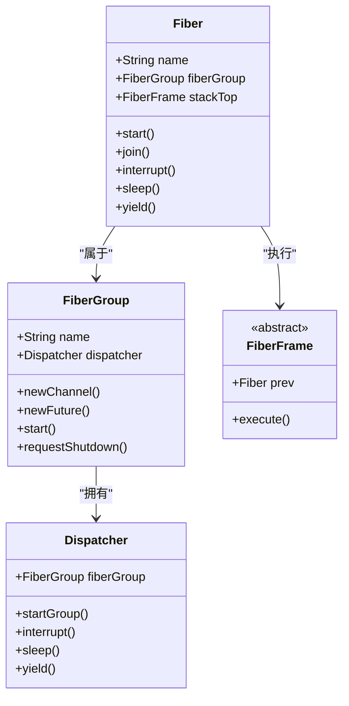
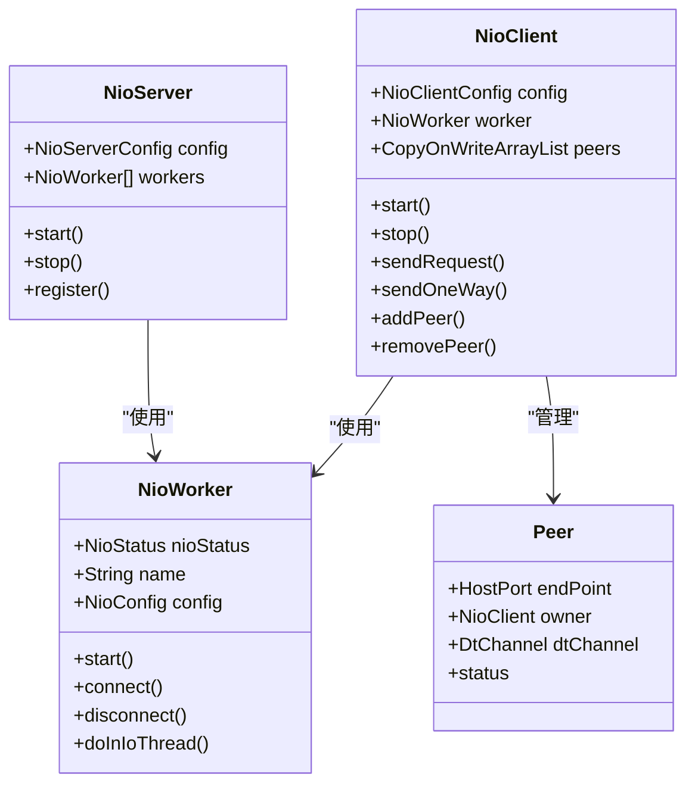

# 项目概述

<cite>
**本文档引用的文件**   
- [README.md](file://README.md)
- [devlogs/2023_07_27_dongting的定位和原则.txt](file://devlogs/2023_07_27_dongting的定位和原则.txt)
- [devlogs/2023_07_26_dongting线程模型.txt](file://devlogs/2023_07_26_dongting线程模型.txt)
- [server/src/main/java/com/github/dtprj/dongting/fiber/Fiber.java](file://server/src/main/java/com/github/dtprj/dongting/fiber/Fiber.java)
- [server/src/main/java/com/github/dtprj/dongting/raft/server/RaftServer.java](file://server/src/main/java/com/github/dtprj/dongting/raft/server/RaftServer.java)
- [server/src/main/java/com/github/dtprj/dongting/dtkv/server/DtKV.java](file://server/src/main/java/com/github/dtprj/dongting/dtkv/server/DtKV.java)
- [demos/src/main/java/com/github/dtprj/dongting/demos/base/DemoKvServerBase.java](file://demos/src/main/java/com/github/dtprj/dongting/demos/base/DemoKvServerBase.java)
- [client/src/main/java/com/github/dtprj/dongting/net/NioClient.java](file://client/src/main/java/com/github/dtprj/dongting/net/NioClient.java)
</cite>

## 目录
1. [项目定位与核心目标](#项目定位与核心目标)
2. [核心能力与技术架构](#核心能力与技术架构)
3. [设计理念与原则](#设计理念与原则)
4. [适用场景](#适用场景)
5. [技术优势与差异化](#技术优势与差异化)
6. [架构决策背景](#架构决策背景)

## 项目定位与核心目标

dongting项目是一个高性能的分布式系统引擎，其核心定位是作为“基础组件的基础组件”。该项目集成了RAFT一致性算法、分布式KV存储（DtKV）、Fiber协程系统和高性能网络通信能力，旨在为构建高可靠、高性能的分布式系统提供一个精简、稳定且可扩展的核心基础。

项目的核心目标是解决分布式系统中的关键挑战，包括数据一致性、高可用性、可扩展性和性能瓶颈。通过零外部依赖的设计，dongting能够轻松嵌入到各种应用中，无论是技术实力较弱的公司可以直接使用其提供的配置中心、服务发现等组件，还是有能力的大厂可以基于其核心能力进行二次定制和深度开发。

**Section sources**
- [README.md](file://README.md#L0-L23)
- [devlogs/2023_07_27_dongting的定位和原则.txt](file://devlogs/2023_07_27_dongting的定位和原则.txt#L0-L18)

## 核心能力与技术架构

### RAFT一致性算法
dongting完整实现了RAFT论文中的全部内容，提供了一个通用的RAFT框架。它支持多RAFT组（Multi RAFT group），可以在同一个进程中运行多个RAFT组，实现分片和动态扩展。RAFT组的成员可以动态增减，支持运行时平滑变更，无需重启服务器和客户端。

**Diagram sources **
- [server/src/main/java/com/github/dtprj/dongting/raft/server/RaftServer.java](file://server/src/main/java/com/github/dtprj/dongting/raft/server/RaftServer.java#L0-L663)
- [server/src/main/java/com/github/dtprj/dongting/dtkv/server/DtKV.java](file://server/src/main/java/com/github/dtprj/dongting/dtkv/server/DtKV.java#L0-L401)

### 分布式KV存储（DtKV）
DtKV是基于dongting-RAFT框架实现的一个简单的KV系统，可以作为一个轻量级的配置中心。它支持线性一致性，确保所有客户端看到的数据视图是一致的。DtKV支持多种操作，包括PUT、GET、REMOVE、批量操作、CAS（Compare and Set）等。

**Diagram sources **
- [server/src/main/java/com/github/dtprj/dongting/dtkv/server/DtKV.java](file://server/src/main/java/com/github/dtprj/dongting/dtkv/server/DtKV.java#L0-L401)

### Fiber协程系统
dongting的Fiber系统是一个轻量级的并发模型，用于减少多线程竞争的开销。每个Fiber是一个轻量级的执行单元，可以在单个线程中并发执行多个Fiber，从而提高CPU利用率。

**Diagram sources **
- [server/src/main/java/com/github/dtprj/dongting/fiber/Fiber.java](file://server/src/main/java/com/github/dtprj/dongting/fiber/Fiber.java#L0-L236)

### 高性能网络通信
dongting的网络通信模块基于NIO实现，提供了高性能的RPC能力。它使用1+N的线程模型，其中1个线程负责处理socket接入请求，N个worker线程负责处理具体的IO操作。

**Diagram sources **
- [client/src/main/java/com/github/dtprj/dongting/net/NioClient.java](file://client/src/main/java/com/github/dtprj/dongting/net/NioClient.java#L0-L344)

## 设计理念与原则

### 零外部依赖
dongting项目不依赖任何第三方库，所有功能都由项目自身实现。这使得项目非常轻量，两个JAR包（客户端和服务器）的总大小不到1MB。Slf4j是可选的，如果不在classpath中，项目将使用JDK的日志系统。

### 线性一致性保障
通过RAFT算法，dongting确保了数据的线性一致性。所有写操作都必须经过RAFT共识过程，确保数据在所有副本上的一致性。

### 基于Fiber的轻量级并发模型
为了减少多线程竞争的开销，dongting采用了单线程模式，多个线程各司其职，每个线程都有其负责的范围。线程之间通过内存消息队列进行通信，避免了复杂的锁机制。

### 性能导向编程
dongting在设计和实现上都以性能为导向。例如，网络通信模块使用NIO，减少系统调用的开销；对象池技术减少内存分配和垃圾回收的压力。

**Section sources**
- [README.md](file://README.md#L38-L66)
- [devlogs/2023_07_27_dongting的定位和原则.txt](file://devlogs/2023_07_27_dongting的定位和原则.txt#L5-L9)
- [devlogs/2023_07_26_dongting线程模型.txt](file://devlogs/2023_07_26_dongting线程模型.txt#L0-L14)

## 适用场景

### 分布式配置中心
基于DtKV，可以构建一个高性能的分布式配置中心，支持线性一致性，确保所有客户端看到的配置是一致的。

### 服务发现
利用RAFT的选举机制和成员管理能力，可以实现高可用的服务发现系统。

### 分布式锁
虽然目前尚未实现，但计划中的分布式锁功能可以基于RAFT算法实现，确保锁的强一致性。

### 消息队列（MQ）
计划中的消息队列功能可以利用RAFT日志作为消息日志，实现具有线性一致性的消息队列。

## 技术优势与差异化

### 高性能
在AMD 5600X 6核CPU、32GB DDR4 3600MHz RAM、1TB PCI-E 3.0 SSD的测试环境下，dongting在单服务器模式下可以达到177万TPS，在3服务器RAFT组模式下可以达到90万TPS。

### 轻量级
项目不依赖任何第三方库，总大小不到1MB，非常适合嵌入到各种应用中。

### 易于使用
项目提供了丰富的演示示例，可以直接运行，无需配置。推荐在IDE中运行，便于设置断点和观察。

### 可扩展性强
支持多RAFT组、动态添加和删除RAFT组，可以轻松实现分片和弹性扩展。

**Section sources**
- [README.md](file://README.md#L0-L133)
- [devlogs/2023_07_20_现代硬件下的IO程序开发.txt](file://devlogs/2023_07_20_现代硬件下的IO程序开发.txt#L7-L14)

## 架构决策背景

### 为什么选择RAFT
RAFT算法是目前实现分布式一致性的最佳选择之一。它简单易懂，易于实现，且在实践中被广泛验证。通过RAFT，可以构建高可用、强一致的分布式系统。

### 为什么实现Fiber
传统的多线程模型在高并发场景下容易出现锁竞争和上下文切换的开销。Fiber作为一种轻量级的并发模型，可以在单个线程中并发执行多个任务，减少线程切换的开销，提高CPU利用率。

### 为什么零依赖
零依赖的设计使得项目更加稳定和可靠。不受第三方库版本更新的影响，也避免了复杂的依赖管理问题。同时，项目可以轻松嵌入到各种环境中，不受外部库的限制。

**Section sources**
- [devlogs/2023_07_27_dongting的定位和原则.txt](file://devlogs/2023_07_27_dongting的定位和原则.txt#L0-L18)
- [devlogs/2023_07_26_dongting线程模型.txt](file://devlogs/2023_07_26_dongting线程模型.txt#L0-L14)