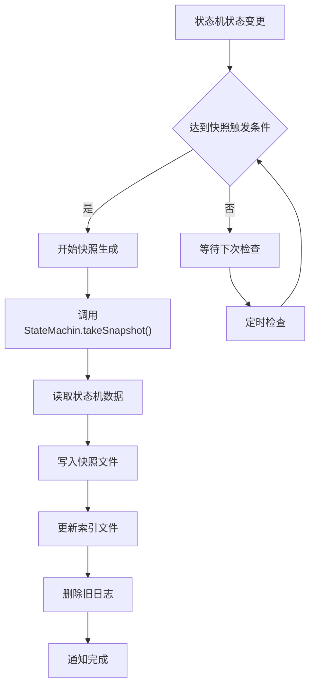
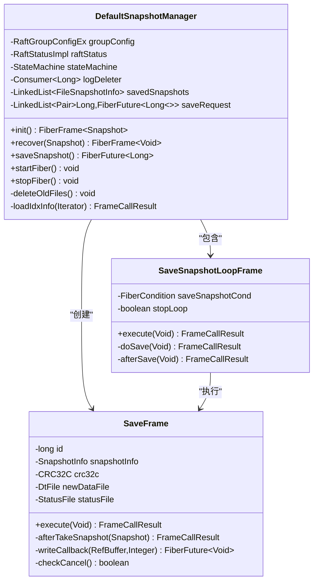
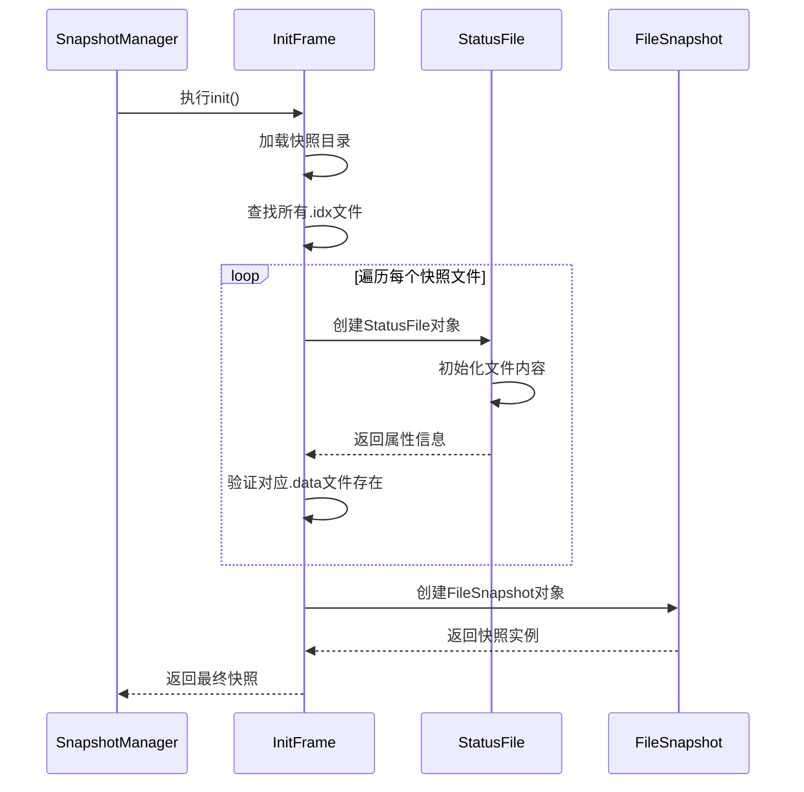
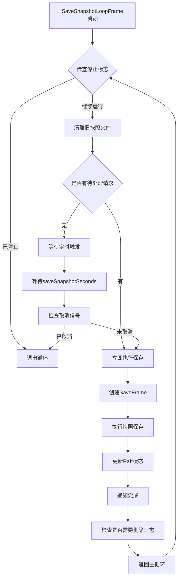
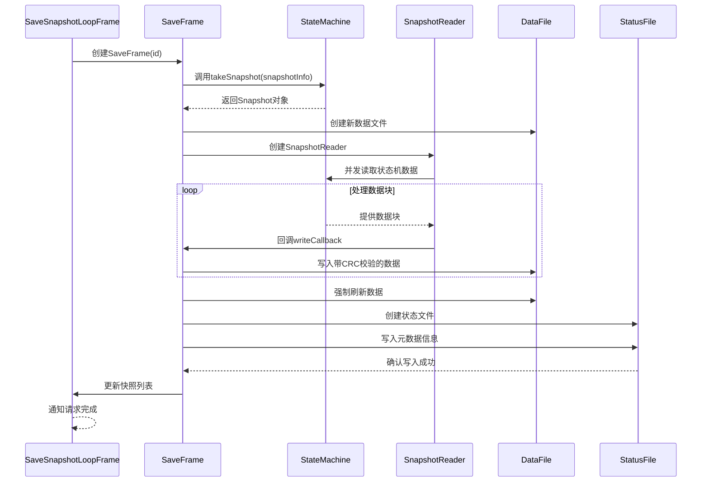
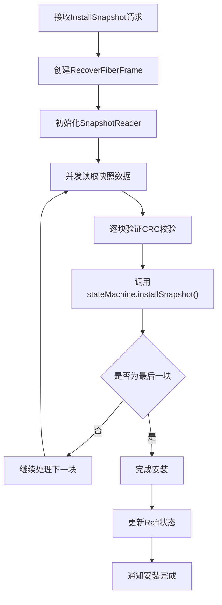
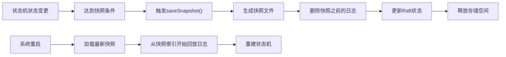

# 快照机制

<cite>
**本文档引用的文件**
- [SnapshotManager.java](file://server/src/main/java/com/github/dtprj/dongting/raft/sm/SnapshotManager.java)
- [DefaultSnapshotManager.java](file://server/src/main/java/com/github/dtprj/dongting/raft/sm/DefaultSnapshotManager.java)
- [RaftLog.java](file://server/src/main/java/com/github/dtprj/dongting/raft/store/RaftLog.java)
- [Snapshot.java](file://server/src/main/java/com/github/dtprj/dongting/raft/sm/Snapshot.java)
- [SnapshotReader.java](file://server/src/main/java/com/github/dtprj/dongting/raft/impl/SnapshotReader.java)
- [DtKV.java](file://server/src/main/java/com/github/dtprj/dongting/dtkv/server/DtKV.java)
- [DefaultRaftLog.java](file://server/src/main/java/com/github/dtprj/dongting/raft/store/DefaultRaftLog.java)
- [DefaultSnapshotManagerTest.java](file://server/src/test/java/com/github/dtprj/dongting/raft/sm/DefaultSnapshotManagerTest.java)
</cite>

## 目录
1. [简介](#简介)
2. [快照机制概述](#快照机制概述)
3. [核心接口设计](#核心接口设计)
4. [快照管理器架构](#快照管理器架构)
5. [快照生成流程](#快照生成流程)
6. [快照安装过程](#快照安装过程)
7. [日志压缩机制](#日志压缩机制)
8. [配置参数详解](#配置参数详解)
9. [性能优化策略](#性能优化策略)
10. [故障排除指南](#故障排除指南)
11. [总结](#总结)

## 简介

Dongting的快照机制是Raft分布式一致性算法的重要组成部分，用于实现高效的日志压缩和系统恢复。快照机制通过定期捕获状态机的状态，将大量历史日志压缩为单个快照文件，从而显著减少存储空间并加快系统重启时的状态恢复速度。

## 快照机制概述

快照机制的核心目标包括：
- **日志压缩**：将大量连续的日志条目压缩为单个快照
- **状态恢复**：在系统重启时快速恢复到最近的一致性状态
- **存储优化**：减少磁盘空间占用，提高I/O效率
- **性能提升**：减少日志回放时间，加快系统启动速度



## 核心接口设计

### SnapshotManager接口

SnapshotManager是快照管理的核心接口，定义了快照生命周期的关键操作：

```java
public interface SnapshotManager {
    FiberFrame<Snapshot> init();              // 初始化快照管理器
    FiberFrame<Void> recover(Snapshot snapshot); // 恢复状态机到指定快照
    void startFiber();                        // 启动快照处理线程
    void stopFiber();                         // 停止快照处理线程
    FiberFuture<Long> saveSnapshot();         // 触发快照保存
}
```

### DefaultSnapshotManager实现

DefaultSnapshotManager提供了完整的快照管理功能，实现了以下核心特性：



**图表来源**
- [DefaultSnapshotManager.java](file://server/src/main/java/com/github/dtprj/dongting/raft/sm/DefaultSnapshotManager.java#L62-L516)

**章节来源**
- [SnapshotManager.java](file://server/src/main/java/com/github/dtprj/dongting/raft/sm/SnapshotManager.java#L23-L35)
- [DefaultSnapshotManager.java](file://server/src/main/java/com/github/dtprj/dongting/raft/sm/DefaultSnapshotManager.java#L62-L116)

## 快照管理器架构

### 初始化流程

快照管理器的初始化过程包括加载现有快照文件、验证数据完整性并准备状态机恢复：



**图表来源**
- [DefaultSnapshotManager.java](file://server/src/main/java/com/github/dtprj/dongting/raft/sm/DefaultSnapshotManager.java#L118-L180)

### 快照保存循环

快照保存采用异步循环模式，支持定时触发和手动请求两种方式：



**图表来源**
- [DefaultSnapshotManager.java](file://server/src/main/java/com/github/dtprj/dongting/raft/sm/DefaultSnapshotManager.java#L258-L295)

**章节来源**
- [DefaultSnapshotManager.java](file://server/src/main/java/com/github/dtprj/dongting/raft/sm/DefaultSnapshotManager.java#L118-L295)

## 快照生成流程

### 触发条件

快照生成可以通过以下两种方式触发：

1. **定时触发**：基于配置的间隔时间自动触发
2. **手动触发**：通过saveSnapshot()方法主动请求

### 生成步骤

快照生成过程分为多个阶段，确保数据一致性和完整性：



**图表来源**
- [DefaultSnapshotManager.java](file://server/src/main/java/com/github/dtprj/dongting/raft/sm/DefaultSnapshotManager.java#L307-L450)

### 数据格式

快照文件采用二进制格式存储，包含以下结构：

- **头部信息**：包含快照的基本元数据
- **数据块**：按固定大小缓冲区分块存储
- **CRC校验**：每块数据后附加CRC32校验码
- **索引文件**：记录快照的完整元数据信息

**章节来源**
- [DefaultSnapshotManager.java](file://server/src/main/java/com/github/dtprj/dongting/raft/sm/DefaultSnapshotManager.java#L307-L450)

## 快照安装过程

### 安装流程

快照安装是将接收到的快照数据应用到状态机的过程：



**图表来源**
- [DefaultSnapshotManager.java](file://server/src/main/java/com/github/dtprj/dongting/raft/sm/DefaultSnapshotManager.java#L452-L516)

### beginInstall/finishInstall机制

RaftLog接口提供了特殊的安装模式，用于处理快照安装期间的日志操作：

```java
// 开始安装快照模式
FiberFrame<Void> beginInstall() throws Exception;

// 结束安装快照模式
FiberFrame<Void> finishInstall(long nextLogIndex, long nextLogPos) throws Exception;
```

这种机制确保在快照安装过程中：
- 不会追加新的日志条目
- 不会覆盖现有的日志数据
- 保持Raft状态的一致性

**章节来源**
- [DefaultSnapshotManager.java](file://server/src/main/java/com/github/dtprj/dongting/raft/sm/DefaultSnapshotManager.java#L452-L516)

## 日志压缩机制

### RaftLog接口方法

RaftLog接口提供了直接的日志压缩功能：

```java
// 截断尾部日志到指定索引（包含）
FiberFrame<Void> truncateTail(long index);

// 标记指定索引前的日志可以被删除
void markTruncateByIndex(long index, long delayMillis);

// 根据时间戳标记可删除的日志
void markTruncateByTimestamp(long timestampBound, long delayMillis);
```

### 快照与日志压缩的关系

快照机制与日志压缩紧密配合：



**图表来源**
- [RaftLog.java](file://server/src/main/java/com/github/dtprj/dongting/raft/store/RaftLog.java#L35-L50)

**章节来源**
- [RaftLog.java](file://server/src/main/java/com/github/dtprj/dongting/raft/store/RaftLog.java#L35-L50)

## 配置参数详解

### 关键配置参数

快照机制的行为由以下配置参数控制：

| 参数名称 | 默认值 | 说明 |
|---------|--------|------|
| `saveSnapshotSeconds` | 3600 | 快照保存间隔（秒） |
| `maxKeepSnapshots` | 2 | 最大保留快照数量 |
| `diskSnapshotBufferSize` | 64KB | 快照写入缓冲区大小 |
| `snapshotConcurrency` | 1 | 快照读取并发数 |
| `deleteLogsAfterTakeSnapshot` | true | 快照后是否删除日志 |

### 配置示例

```java
// 配置快照行为
RaftGroupConfig config = new RaftGroupConfig();
config.saveSnapshotSeconds = 1800;        // 30分钟保存一次快照
config.maxKeepSnapshots = 5;              // 保留最多5个快照
config.diskSnapshotBufferSize = 128 * 1024; // 128KB缓冲区
config.snapshotConcurrency = 4;           // 4个并发读取线程
config.deleteLogsAfterTakeSnapshot = true; // 自动删除旧日志
```

**章节来源**
- [DefaultSnapshotManager.java](file://server/src/main/java/com/github/dtprj/dongting/raft/sm/DefaultSnapshotManager.java#L293-L295)

## 性能优化策略

### 异步处理

快照操作采用Fiber异步框架，避免阻塞主线程：

```java
// 使用FiberFuture进行异步快照保存
FiberFuture<Long> future = snapshotManager.saveSnapshot();
future.await(result -> {
    // 处理完成回调
});
```

### 并发控制

快照读取和写入都支持并发控制：

- **读取并发**：允许多个线程同时读取状态机数据
- **写入并发**：支持多个线程同时写入快照文件
- **缓冲区管理**：动态分配和回收缓冲区，减少内存碎片

### 缓存机制

快照管理器维护快照文件的缓存列表，避免重复加载：

```java
private final LinkedList<FileSnapshotInfo> savedSnapshots = new LinkedList<>();
```

**章节来源**
- [DefaultSnapshotManager.java](file://server/src/main/java/com/github/dtprj/dongting/raft/sm/DefaultSnapshotManager.java#L307-L450)

## 故障排除指南

### 常见问题及解决方案

1. **快照保存失败**
   - 检查磁盘空间是否充足
   - 验证状态机是否正常工作
   - 查看日志中的具体错误信息

2. **快照恢复异常**
   - 确认快照文件完整性
   - 检查状态机安装逻辑
   - 验证快照版本兼容性

3. **性能问题**
   - 调整快照缓冲区大小
   - 优化并发参数设置
   - 监控I/O性能指标

### 调试技巧

```java
// 启用详细日志
log.info("开始保存快照 {}, groupId={}, lastIndex={}, lastTerm={}", 
    id, groupConfig.groupId, snapshotInfo.getLastIncludedIndex(), 
    snapshotInfo.getLastIncludedTerm());

// 监控快照进度
log.info("快照 {} 数据文件写入成功: {}", id, newDataFile.getFile().getPath());
log.info("快照状态文件写入成功: {}", newIdxFile.getPath());
```

**章节来源**
- [DefaultSnapshotManager.java](file://server/src/main/java/com/github/dtprj/dongting/raft/sm/DefaultSnapshotManager.java#L320-L325)
- [DefaultSnapshotManager.java](file://server/src/main/java/com/github/dtprj/dongting/raft/sm/DefaultSnapshotManager.java#L420-L425)

## 总结

Dongting的快照机制是一个高度优化的系统，具有以下特点：

1. **高效性**：采用异步处理和并发控制，最小化对系统性能的影响
2. **可靠性**：完善的错误处理和数据校验机制，确保快照数据的完整性
3. **灵活性**：支持多种配置选项，适应不同的应用场景需求
4. **可扩展性**：模块化设计，便于添加新的快照格式和存储后端

通过合理配置和使用快照机制，可以显著提升系统的存储效率和恢复速度，是构建高性能分布式系统的重要基础设施。