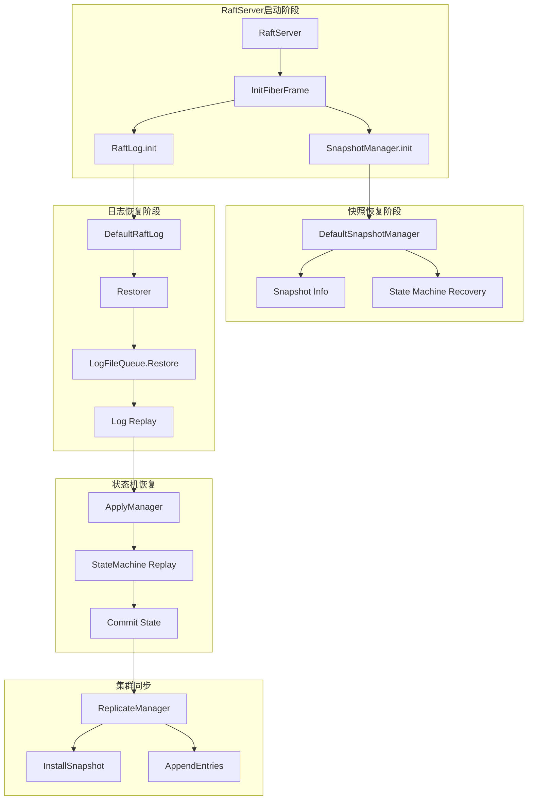
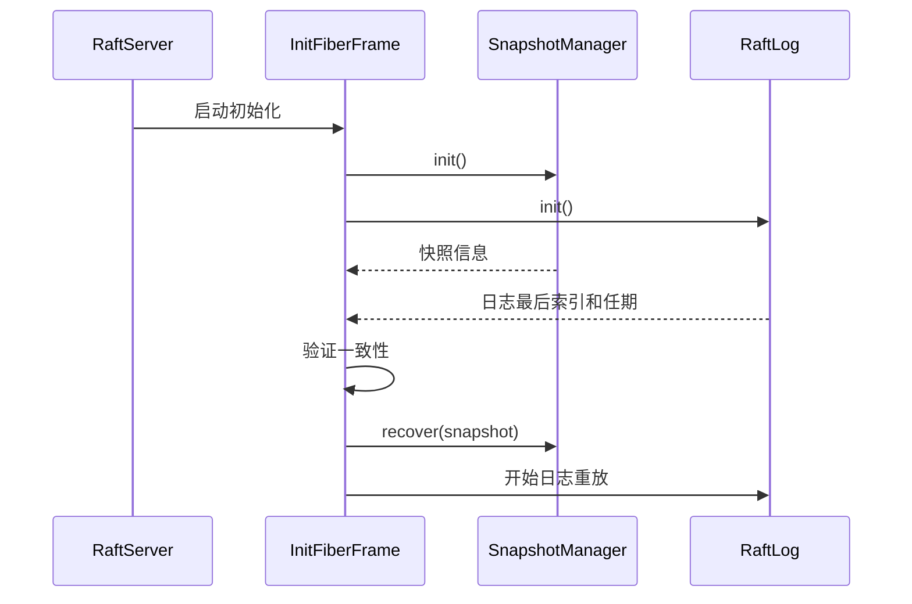
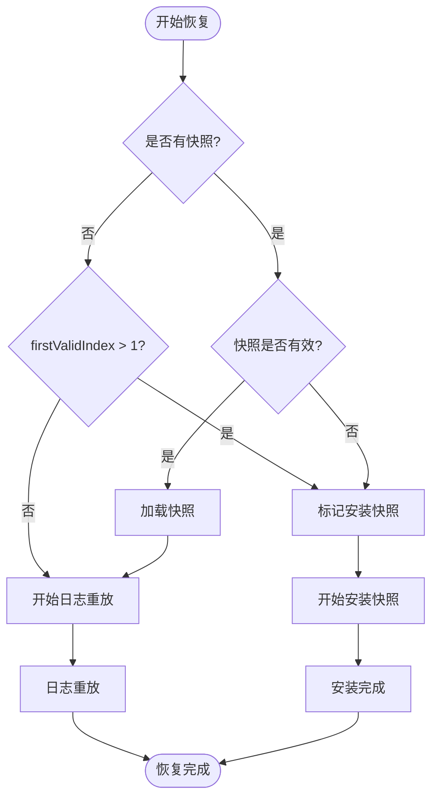
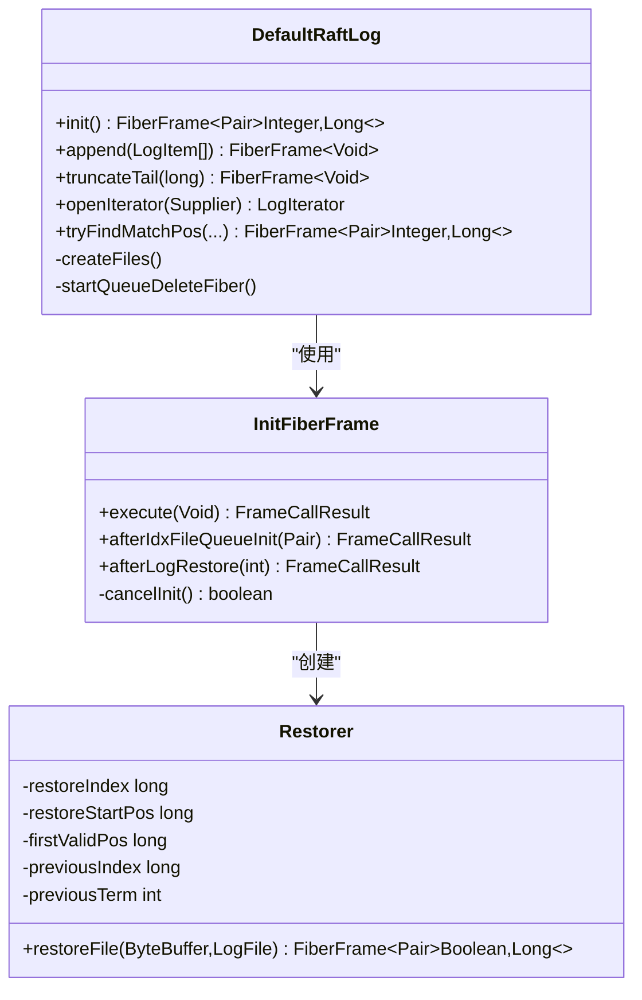
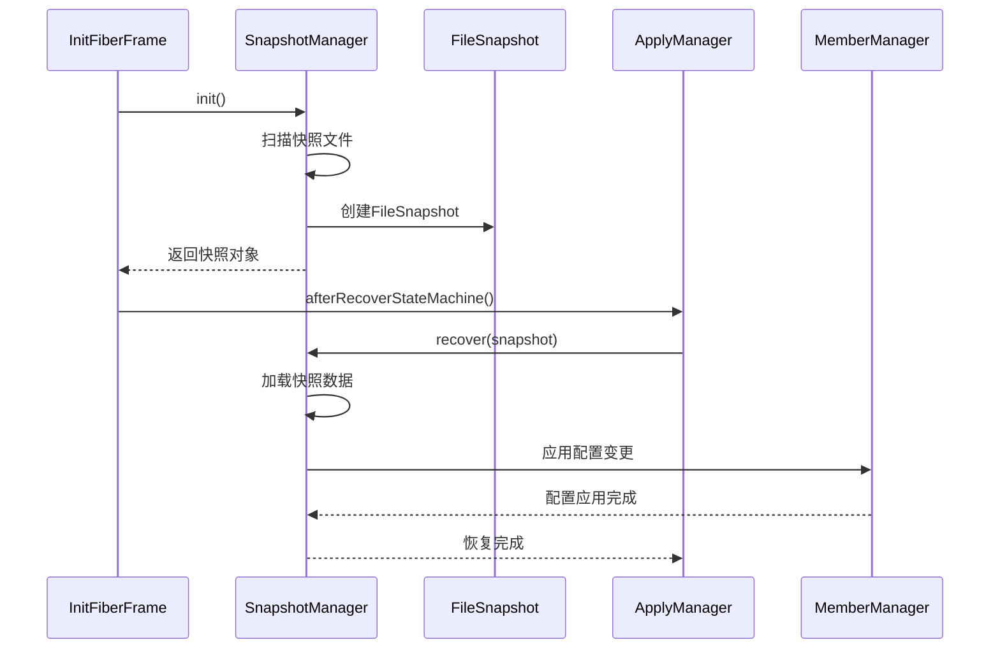
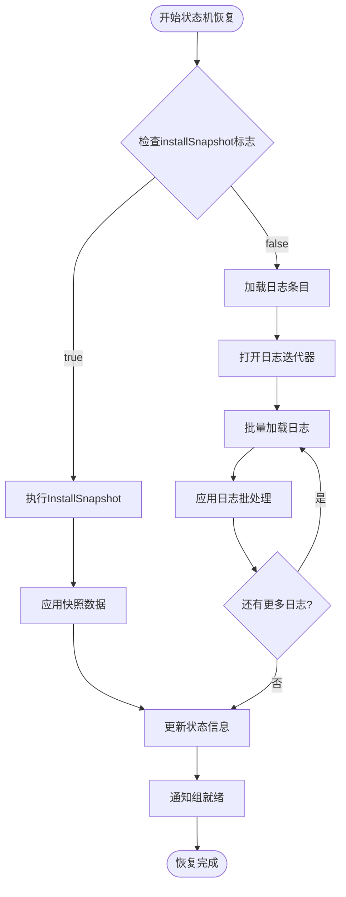
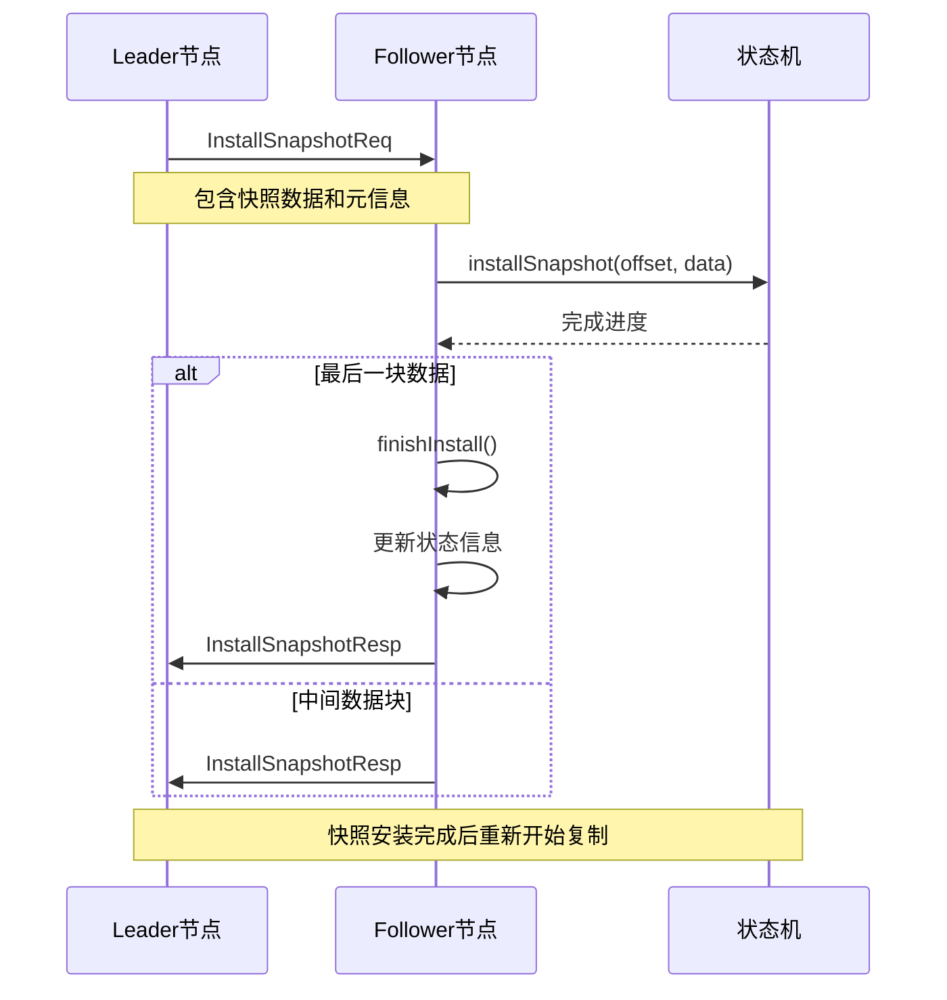
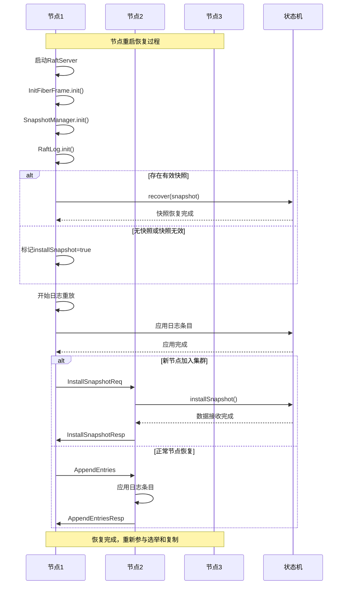

# 故障恢复机制

<cite>
**本文档引用的文件**
- [DefaultRaftLog.java](file://server/src/main/java/com/github/dtprj/dongting/raft/store/DefaultRaftLog.java)
- [InitFiberFrame.java](file://server/src/main/java/com/github/dtprj/dongting/raft/impl/InitFiberFrame.java)
- [DefaultSnapshotManager.java](file://server/src/main/java/com/github/dtprj/dongting/raft/sm/DefaultSnapshotManager.java)
- [ApplyManager.java](file://server/src/main/java/com/github/dtprj/dongting/raft/impl/ApplyManager.java)
- [Restorer.java](file://server/src/main/java/com/github/dtprj/dongting/raft/store/Restorer.java)
- [AppendProcessor.java](file://server/src/main/java/com/github/dtprj/dongting/raft/rpc/AppendProcessor.java)
- [RaftServer.java](file://server/src/main/java/com/github/dtprj/dongting/raft/server/RaftServer.java)
- [LogFileQueue.java](file://server/src/main/java/com/github/dtprj/dongting/raft/store/LogFileQueue.java)
- [InstallSnapshotReq.java](file://server/src/main/java/com/github/dtprj/dongting/raft/rpc/InstallSnapshotReq.java)
- [ReplicateManager.java](file://server/src/main/java/com/github/dtprj/dongting/raft/impl/ReplicateManager.java)
</cite>

## 目录
1. [概述](#概述)
2. [系统架构](#系统架构)
3. [故障恢复流程](#故障恢复流程)
4. [RaftLog初始化与恢复](#raftlog初始化与恢复)
5. [快照管理器恢复](#快照管理器恢复)
6. [状态机重放机制](#状态机重放机制)
7. [多节点集群同步](#多节点集群同步)
8. [故障恢复时序图](#故障恢复时序图)
9. [关键代码路径](#关键代码路径)
10. [最佳实践](#最佳实践)

## 概述

Dongting的故障恢复机制是一个复杂而精密的系统，确保在节点崩溃或重启后能够正确恢复状态并重新加入集群。该机制基于Raft共识算法，通过RaftLog的init()方法加载最后一条日志项，并结合StatusManager恢复持久化的任期和投票信息。

系统的核心设计理念是：
- **数据完整性**：确保所有已提交的日志条目都被正确应用到状态机
- **一致性保证**：通过快照和日志重放机制维护状态机与日志的一致性
- **高可用性**：支持多节点集群中的故障转移和数据同步
- **渐进式恢复**：根据实际情况选择从快照还是从日志开始恢复

## 系统架构



**图表来源**
- [RaftServer.java](file://server/src/main/java/com/github/dtprj/dongting/raft/server/RaftServer.java#L104-L123)
- [InitFiberFrame.java](file://server/src/main/java/com/github/dtprj/dongting/raft/impl/InitFiberFrame.java#L75-L112)

## 故障恢复流程

故障恢复过程可以分为以下几个主要阶段：

### 1. 初始化阶段
当RaftServer启动时，会创建一个InitFiberFrame来协调整个恢复过程：



**图表来源**
- [InitFiberFrame.java](file://server/src/main/java/com/github/dtprj/dongting/raft/impl/InitFiberFrame.java#L75-L112)
- [DefaultRaftLog.java](file://server/src/main/java/com/github/dtprj/dongting/raft/store/DefaultRaftLog.java#L109-L138)

### 2. 决策阶段
系统根据当前状态决定是从快照还是从日志开始恢复：



**图表来源**
- [InitFiberFrame.java](file://server/src/main/java/com/github/dtprj/dongting/raft/impl/InitFiberFrame.java#L114-L137)

**章节来源**
- [InitFiberFrame.java](file://server/src/main/java/com/github/dtprj/dongting/raft/impl/InitFiberFrame.java#L75-L194)

## RaftLog初始化与恢复

RaftLog的初始化是故障恢复的关键步骤，通过DefaultRaftLog的init()方法实现：

### 初始化过程



**图表来源**
- [DefaultRaftLog.java](file://server/src/main/java/com/github/dtprj/dongting/raft/store/DefaultRaftLog.java#L80-L138)
- [Restorer.java](file://server/src/main/java/com/github/dtprj/dongting/raft/store/Restorer.java#L40-L82)

### 日志恢复机制

Restorer负责从磁盘文件中恢复日志条目：

1. **索引文件扫描**：首先扫描索引文件找到最后一个有效的日志位置
2. **日志文件验证**：逐个验证日志文件的CRC校验和完整性
3. **条目重放**：按顺序重放所有有效的日志条目到状态机

```java
// 关键恢复逻辑示例
private FrameCallResult afterIdxFileQueueInit(Pair<Long, Long> p) {
    if (p == null) {
        // 返回null会导致安装快照
        setResult(null);
        return Fiber.frameReturn();
    }
    long restoreIndex = p.getLeft();
    long restoreStartPos = p.getRight();
    long firstValidPos = RaftUtil.parseLong(statusManager.getProperties(),
            KEY_FIRST_VALID_POS, 0);
    
    return Fiber.call(logFiles.restore(restoreIndex, restoreStartPos, firstValidPos),
            this::afterLogRestore);
}
```

**章节来源**
- [DefaultRaftLog.java](file://server/src/main/java/com/github/dtprj/dongting/raft/store/DefaultRaftLog.java#L109-L138)
- [Restorer.java](file://server/src/main/java/com/github/dtprj/dongting/raft/store/Restorer.java#L40-L82)

## 快照管理器恢复

DefaultSnapshotManager负责管理快照的创建、存储和恢复：

### 快照恢复流程



**图表来源**
- [DefaultSnapshotManager.java](file://server/src/main/java/com/github/dtprj/dongting/raft/sm/DefaultSnapshotManager.java#L218-L250)
- [InitFiberFrame.java](file://server/src/main/java/com/github/dtprj/dongting/raft/impl/InitFiberFrame.java#L139-L166)

### 快照验证机制

系统在恢复快照时会进行严格的验证：

```java
// 快照验证逻辑
private FrameCallResult afterSnapshotManagerInit(Snapshot snapshot) {
    if (snapshot == null) {
        if (raftStatus.firstValidIndex > 1) {
            raftStatus.installSnapshot = true;
            log.warn("no snapshot and firstValidIndex>1, mark install snapshot");
        }
        return afterRecoverStateMachine(null);
    } else if (snapshot.getSnapshotInfo().getLastIncludedIndex() < raftStatus.firstValidIndex) {
        raftStatus.installSnapshot = true;
        log.warn("snapshot lastIncludedIndex({}) less than firstValidIndex({}), mark install snapshot",
                snapshot.getSnapshotInfo().getLastIncludedIndex(), raftStatus.firstValidIndex);
        return afterRecoverStateMachine(null);
    }
    SnapshotInfo si = snapshot.getSnapshotInfo();
    if (si.getLastIncludedTerm() > raftStatus.currentTerm) {
        log.error("snapshot term greater than current term, snapshot={}, current={}",
                si.getLastIncludedTerm(), raftStatus.currentTerm);
        throw new RaftException("snapshot term greater than current term");
    }
    // 更新状态
    gc.raftStatus.lastConfigChangeIndex = si.getLastConfigChangeIndex();
    gc.raftStatus.lastSavedSnapshotIndex = si.getLastIncludedIndex();
}
```

**章节来源**
- [DefaultSnapshotManager.java](file://server/src/main/java/com/github/dtprj/dongting/raft/sm/DefaultSnapshotManager.java#L218-L250)
- [InitFiberFrame.java](file://server/src/main/java/com/github/dtprj/dongting/raft/impl/InitFiberFrame.java#L114-L137)

## 状态机重放机制

ApplyManager负责将日志条目应用到状态机，这是确保数据一致性的关键环节：

### 状态机恢复过程



**图表来源**
- [ApplyManager.java](file://server/src/main/java/com/github/dtprj/dongting/raft/impl/ApplyManager.java#L280-L350)

### 日志重放机制

ApplyManager通过ApplyFrame执行日志重放：

```java
private class ApplyFrame extends FiberFrame<Void> {
    private RaftLog.LogIterator logIterator;
    private final TailCache tailCache = raftStatus.tailCache;

    private FrameCallResult execLoop(Void v) {
        RaftStatusImpl raftStatus = ApplyManager.this.raftStatus;
        long diff = raftStatus.commitIndex - raftStatus.lastApplying;
        if (diff == 0) {
            return needApplyCond.await(this);
        }
        
        long index = raftStatus.lastApplying + 1;
        RaftTask rt = tailCache.get(index);
        if (rt == null) {
            // 从日志文件加载
            if (logIterator == null) {
                logIterator = raftLog.openIterator(null);
            }
            FiberFrame<List<LogItem>> ff = logIterator.next(index, limit, 16 * 1024 * 1024);
            return Fiber.call(ff, this::afterLoad);
        } else {
            // 从缓存加载
            closeIterator();
            return exec(rt, index, this::execLoop);
        }
    }
}
```

**章节来源**
- [ApplyManager.java](file://server/src/main/java/com/github/dtprj/dongting/raft/impl/ApplyManager.java#L280-L350)

## 多节点集群同步

在多节点集群中，新加入或重启的节点需要通过InstallSnapshot或AppendEntries RPC与Leader同步数据：

### InstallSnapshot流程



**图表来源**
- [AppendProcessor.java](file://server/src/main/java/com/github/dtprj/dongting/raft/rpc/AppendProcessor.java#L446-L582)
- [InstallSnapshotReq.java](file://server/src/main/java/com/github/dtprj/dongting/raft/rpc/InstallSnapshotReq.java#L39-L73)

### AppendEntries同步

对于较小的增量数据，使用AppendEntries RPC进行同步：

```java
// InstallSnapshot请求处理
private FrameCallResult doInstall(RaftStatusImpl raftStatus, InstallSnapshotReq req) {
    if (!raftStatus.installSnapshot) {
        log.error("not in install snapshot state, groupId={}", groupId);
        return releaseAndWriteResp(new RaftException("not in install snapshot state"));
    }
    boolean done = req.done;
    ByteBuffer buf = req.data == null ? null : req.data.getBuffer();
    log.info("apply snapshot, groupId={}, offset={}, bytes={}, done={}", groupId,
            req.offset, buf == null ? 0 : buf.remaining(), done);
    FiberFuture<Void> f = gc.stateMachine.installSnapshot(req.lastIncludedIndex,
            req.lastIncludedTerm, req.offset, done, buf);
    if (done) {
        return f.await(v -> finishInstall(req, raftStatus));
    } else {
        f.registerCallback((v, ex) -> releaseAndWriteResp(ex));
        return Fiber.frameReturn();
    }
}
```

**章节来源**
- [AppendProcessor.java](file://server/src/main/java/com/github/dtprj/dongting/raft/rpc/AppendProcessor.java#L446-L582)
- [InstallSnapshotReq.java](file://server/src/main/java/com/github/dtprj/dongting/raft/rpc/InstallSnapshotReq.java#L39-L73)

## 故障恢复时序图

以下是完整的故障恢复时序图：



**图表来源**
- [InitFiberFrame.java](file://server/src/main/java/com/github/dtprj/dongting/raft/impl/InitFiberFrame.java#L75-L194)
- [AppendProcessor.java](file://server/src/main/java/com/github/dtprj/dongting/raft/rpc/AppendProcessor.java#L446-L582)

## 关键代码路径

### 1. 初始化入口
```
RaftServer.start() -> InitFiberFrame.execute() -> SnapshotManager.init() -> RaftLog.init()
```

### 2. 快照恢复路径
```
InitFiberFrame.afterSnapshotManagerInit() -> SnapshotManager.recover() -> StateMachine.recover()
```

### 3. 日志恢复路径
```
DefaultRaftLog.init() -> IdxFileQueue.initRestorePos() -> LogFileQueue.restore() -> Restorer.restoreFile()
```

### 4. 状态机应用路径
```
ApplyManager.ApplyFrame.execLoop() -> LogIterator.next() -> StateMachine.apply()
```

### 5. 集群同步路径
```
ReplicateManager.sendInstallSnapshotReq() -> AppendProcessor.doInstall() -> StateMachine.installSnapshot()
```

**章节来源**
- [InitFiberFrame.java](file://server/src/main/java/com/github/dtprj/dongting/raft/impl/InitFiberFrame.java#L75-L194)
- [DefaultRaftLog.java](file://server/src/main/java/com/github/dtprj/dongting/raft/store/DefaultRaftLog.java#L80-L138)
- [ApplyManager.java](file://server/src/main/java/com/github/dtprj/dongting/raft/impl/ApplyManager.java#L280-L350)

## 最佳实践

### 1. 故障恢复监控
- 监控InitFiberFrame的执行时间，异常延迟可能表明磁盘I/O问题
- 跟踪快照恢复和日志重放的进度，及时发现数据不一致
- 设置合理的超时时间，避免长时间阻塞恢复过程

### 2. 性能优化建议
- 合理配置快照间隔，平衡存储空间和恢复速度
- 使用异步I/O操作提高日志写入和读取性能
- 实施预读机制减少日志文件访问延迟

### 3. 数据保护措施
- 定期备份快照文件，防止数据丢失
- 实施多副本策略，提高数据可靠性
- 监控磁盘空间，及时清理过期日志文件

### 4. 故障诊断工具
- 利用日志记录详细的恢复过程信息
- 实施健康检查机制，定期验证数据完整性
- 提供故障恢复状态查询接口，便于运维监控

通过以上机制和最佳实践，Dongting实现了可靠且高效的故障恢复能力，确保分布式系统的高可用性和数据一致性。系统能够在各种故障场景下自动恢复，并重新加入集群继续提供服务。