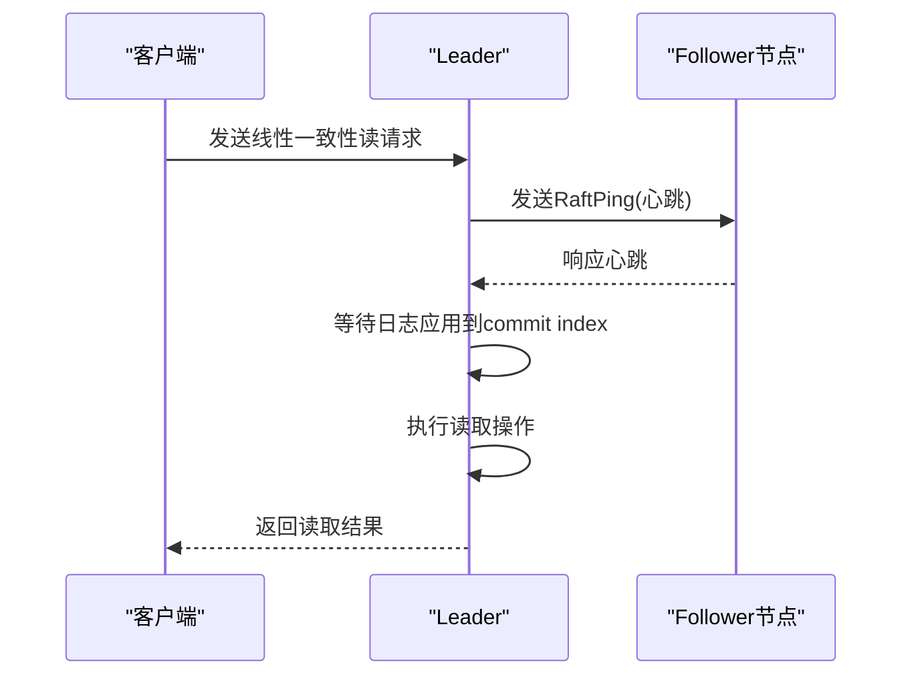
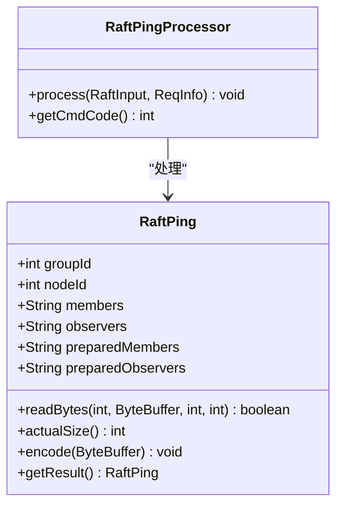
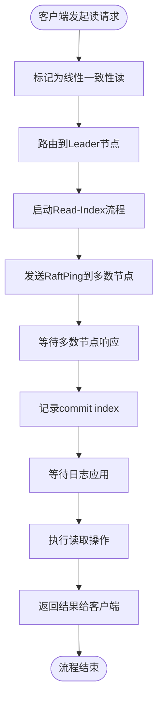
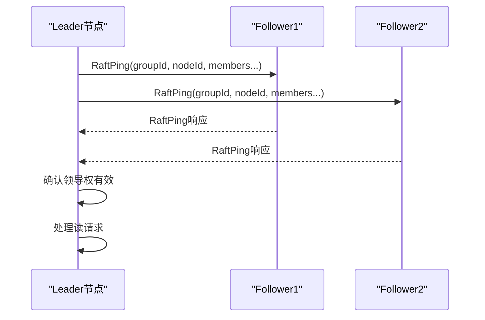

# 线性一致性读

<cite>
**本文档引用的文件**  
- [RaftPing.java](file://server/src/main/java/com/github/dtprj/dongting/raft/rpc/RaftPing.java)
- [RaftPingProcessor.java](file://server/src/main/java/com/github/dtprj/dongting/raft/rpc/RaftPingProcessor.java)
- [RaftServer.java](file://server/src/main/java/com/github/dtprj/dongting/raft/server/RaftServer.java)
- [RaftGroupImpl.java](file://server/src/main/java/com/github/dtprj/dongting/raft/impl/RaftGroupImpl.java)
- [NodePing.java](file://server/src/main/java/com/github/dtprj/dongting/raft/rpc/NodePing.java)
- [NodePingProcessor.java](file://server/src/main/java/com/github/dtprj/dongting/raft/rpc/NodePingProcessor.java)
- [devlogs/2023_07_25_再论线性一致性.md](file://devlogs/2023_07_25_再论线性一致性.md)
</cite>

## 目录
1. [引言](#引言)
2. [线性一致性读的实现机制](#线性一致性读的实现机制)
3. [Leader Lease与Read-Index流程](#leader-lease与read-index流程)
4. [RaftPing与心跳机制](#raftping与心跳机制)
5. [客户端线性一致性读流程](#客户端线性一致性读流程)
6. [普通读与线性一致性读的性能对比](#普通读与线性一致性读的性能对比)
7. [配置建议](#配置建议)
8. [RPC消息交互过程](#rpc消息交互过程)
9. [高可用与强一致性的平衡](#高可用与强一致性的平衡)
10. [结论](#结论)

## 引言
线性一致性是分布式系统中最强的一致性模型，它要求系统在所有客户端看来，读取操作的结果必须与一个单体系统的行为一致。在dongting系统中，通过Leader Lease机制和Read-Index流程实现了线性一致性读。本文将深入解析其实现原理，包括RaftPing和心跳机制如何验证领导权的有效性，防止过时的Leader提供服务。

## 线性一致性读的实现机制
dongting系统通过Read-Index流程实现线性一致性读。当客户端发起线性一致性读请求时，Leader节点首先需要确认自己仍然是当前任期的合法Leader。这通过向大多数节点发送心跳（RaftPing）来完成。只有在收到大多数节点的响应后，Leader才能处理读请求，确保其领导权的有效性。

该机制的核心思想是：如果一个节点能够成功与大多数节点通信并确认其领导地位，那么在该任期内不会有其他节点被选举为新的Leader。这样就保证了读取操作的线性一致性。

**节来源**
- [devlogs/2023_07_25_再论线性一致性.md](file://devlogs/2023_07_25_再论线性一致性.md)

## Leader Lease与Read-Index流程
dongting系统采用了Read-Index流程而非传统的Leader Lease机制来实现线性一致性读。Read-Index流程的主要优势在于不需要依赖物理时钟，避免了时钟漂移带来的问题。

Read-Index流程的具体步骤如下：
1. 客户端向Leader发送读请求
2. Leader向大多数节点发送心跳（RaftPing）以确认其领导权
3. 收到大多数节点的响应后，记录当前的提交索引（commit index）
4. 等待本地日志应用到该索引位置
5. 执行读取操作并返回结果

这种流程确保了读取操作不会返回过时的数据，因为只有在确认领导权有效且日志已同步到最新状态后才会执行读取。

**图来源**
- [RaftPing.java](file://server/src/main/java/com/github/dtprj/dongting/raft/rpc/RaftPing.java)
- [RaftPingProcessor.java](file://server/src/main/java/com/github/dtprj/dongting/raft/rpc/RaftPingProcessor.java)

**节来源**
- [devlogs/2023_07_25_再论线性一致性.md](file://devlogs/2023_07_25_再论线性一致性.md)

## RaftPing与心跳机制
RaftPing是dongting系统中用于验证Leader领导权的关键机制。当RaftServer处理读请求时，会通过RaftPing和心跳机制验证自身领导权的有效性。

RaftPing消息包含以下信息：
- groupId：Raft组ID
- nodeId：节点ID
- members：当前成员列表
- observers：观察者列表
- preparedMembers：准备中的成员列表
- preparedObservers：准备中的观察者列表

Leader节点定期向其他节点发送心跳，同时在处理线性一致性读请求时也会发送RaftPing。如果Leader在指定时间内没有收到大多数节点的响应，则认为其领导权已失效，会自动降级为Follower。

这种双重验证机制确保了即使在Leader Lease过期的情况下，也能通过心跳通信确认领导权状态，防止过时的Leader提供服务。

**图来源**
- [RaftPing.java](file://server/src/main/java/com/github/dtprj/dongting/raft/rpc/RaftPing.java)
- [RaftPingProcessor.java](file://server/src/main/java/com/github/dtprj/dongting/raft/rpc/RaftPingProcessor.java)

**节来源**
- [RaftPing.java](file://server/src/main/java/com/github/dtprj/dongting/raft/rpc/RaftPing.java)
- [RaftPingProcessor.java](file://server/src/main/java/com/github/dtprj/dongting/raft/rpc/RaftPingProcessor.java)

## 客户端线性一致性读流程
客户端发起线性一致性读的完整流程如下：

1. 客户端标记请求为线性一致性读
2. 请求被路由到当前Leader节点
3. Leader节点收到请求后，启动Read-Index流程
4. Leader向大多数节点发送RaftPing消息
5. 等待收到大多数节点的响应
6. 记录当前的commit index
7. 等待本地状态机应用日志到该index
8. 执行实际的读取操作
9. 将结果返回给客户端

在整个流程中，RaftServer通过心跳机制持续监控集群状态。如果在处理读请求期间检测到领导权变更，会立即终止读取操作并返回错误，确保不会提供过时的数据。

**图来源**
- [RaftServer.java](file://server/src/main/java/com/github/dtprj/dongting/raft/server/RaftServer.java)
- [RaftGroupImpl.java](file://server/src/main/java/com/github/dtprj/dongting/raft/impl/RaftGroupImpl.java)

**节来源**
- [RaftServer.java](file://server/src/main/java/com/github/dtprj/dongting/raft/server/RaftServer.java)
- [RaftGroupImpl.java](file://server/src/main/java/com/github/dtprj/dongting/raft/impl/RaftGroupImpl.java)

## 普通读与线性一致性读的性能对比
在dongting系统中，普通读和线性一致性读在性能上有显著差异：

| 读取类型 | 延迟 | 吞吐量 | 一致性保证 | 适用场景 |
|---------|------|--------|----------|---------|
| 普通读 | 低 | 高 | 最终一致性 | 对一致性要求不高的读取操作 |
| 线性一致性读 | 较高 | 较低 | 强一致性 | 对数据新鲜度要求高的关键业务 |

普通读的延迟主要由网络传输和本地处理时间决定，而线性一致性读还需要额外的RaftPing通信开销。具体来说，线性一致性读的延迟增加主要来自：
1. RaftPing消息的网络往返时间
2. 等待多数节点响应的时间
3. 等待日志应用到commit index的时间

性能开销的大小与集群规模、网络延迟和负载情况密切相关。在小规模集群中，额外开销相对较小；而在大规模跨地域部署的集群中，开销可能显著增加。

**节来源**
- [devlogs/2023_07_25_再论线性一致性.md](file://devlogs/2023_07_25_再论线性一致性.md)

## 配置建议
为了在保证线性一致性的同时优化性能，建议采用以下配置策略：

1. **合理设置心跳间隔**：心跳间隔不宜过短，以免增加网络开销；也不宜过长，以免影响故障检测速度。建议根据网络状况和应用需求进行调优。

2. **区分读取类型**：对于不需要强一致性的读取操作，使用普通读；对于关键业务数据的读取，使用线性一致性读。

3. **优化网络拓扑**：尽量将同一Raft组的节点部署在低延迟的网络环境中，减少RaftPing的往返时间。

4. **调整超时参数**：根据实际网络延迟调整RaftPing的超时时间，避免因短暂网络抖动导致不必要的领导权变更。

5. **监控和告警**：建立完善的监控体系，及时发现和处理领导权频繁变更等异常情况。

这些配置建议有助于在高可用性和强一致性之间取得平衡，满足不同应用场景的需求。

**节来源**
- [devlogs/2023_07_25_再论线性一致性.md](file://devlogs/2023_07_25_再论线性一致性.md)

## RPC消息交互过程
在dongting系统中，线性一致性读涉及的主要RPC消息交互过程如下：

1. **RaftPing消息**：Leader向其他节点发送的心跳消息，用于确认领导权。消息包含groupId、nodeId、成员列表等信息。

2. **RaftPing响应**：Follower节点收到RaftPing后，返回确认响应，表示认可当前Leader的领导地位。

3. **NodePing消息**：节点间的心跳检测消息，用于监控节点健康状态。

4. **NodePing响应**：接收节点返回的心跳响应，确认节点正常运行。

这些RPC消息通过Raft协议的通信机制进行传输，确保了消息的可靠性和有序性。RaftPingProcessor负责处理RaftPing消息，而NodePingProcessor负责处理NodePing消息。

**图来源**
- [RaftPing.java](file://server/src/main/java/com/github/dtprj/dongting/raft/rpc/RaftPing.java)
- [RaftPingProcessor.java](file://server/src/main/java/com/github/dtprj/dongting/raft/rpc/RaftPingProcessor.java)
- [NodePing.java](file://server/src/main/java/com/github/dtprj/dongting/raft/rpc/NodePing.java)
- [NodePingProcessor.java](file://server/src/main/java/com/github/dtprj/dongting/raft/rpc/NodePingProcessor.java)

**节来源**
- [RaftPing.java](file://server/src/main/java/com/github/dtprj/dongting/raft/rpc/RaftPing.java)
- [RaftPingProcessor.java](file://server/src/main/java/com/github/dtprj/dongting/raft/rpc/RaftPingProcessor.java)

## 高可用与强一致性的平衡
dongting系统通过Read-Index流程在高可用性和强一致性之间取得了良好的平衡。与传统的Leader Lease机制相比，Read-Index流程不依赖物理时钟，避免了时钟漂移带来的风险。

当网络分区发生时，只有包含大多数节点的分区才能处理线性一致性读请求，这保证了数据的一致性。同时，系统通过快速的领导权变更机制，确保在Leader失效时能够及时选举出新的Leader，维持系统的可用性。

这种设计使得dongting系统既能提供强一致性保证，又能在节点故障或网络异常时保持较高的可用性，满足了大多数分布式应用场景的需求。

**节来源**
- [devlogs/2023_07_25_再论线性一致性.md](file://devlogs/2023_07_25_再论线性一致性.md)

## 结论
dongting系统通过Read-Index流程和RaftPing机制实现了线性一致性读，确保了读取操作的强一致性。该实现不依赖物理时钟，避免了时钟漂移问题，同时通过心跳机制验证领导权的有效性，防止过时的Leader提供服务。

客户端发起线性一致性读时，系统会通过完整的流程确保读取到最新已提交的数据。虽然相比普通读有一定的性能开销，但通过合理的配置和使用策略，可以在强一致性和性能之间取得平衡。

这种设计体现了dongting系统在高可用性和强一致性之间取得的精妙平衡，为分布式应用提供了可靠的数据一致性保证。