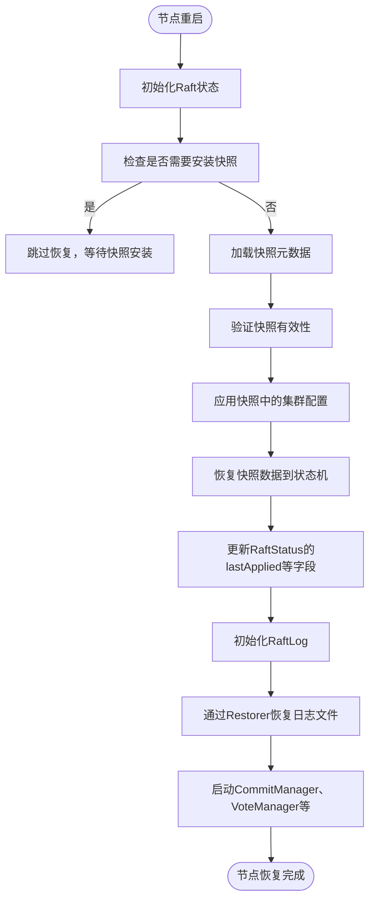

# 高级特性

<cite>
**本文档引用的文件**
- [DefaultSnapshotManager.java](file://server/src/main/java/com/github/dtprj/dongting/raft/sm/DefaultSnapshotManager.java)
- [SnapshotManager.java](file://server/src/main/java/com/github/dtprj/dongting/raft/sm/SnapshotManager.java)
- [SnapshotReader.java](file://server/src/main/java/com/github/dtprj/dongting/raft/impl/SnapshotReader.java)
- [InitFiberFrame.java](file://server/src/main/java/com/github/dtprj/dongting/raft/impl/InitFiberFrame.java)
- [Restorer.java](file://server/src/main/java/com/github/dtprj/dongting/raft/store/Restorer.java)
- [DefaultRaftLog.java](file://server/src/main/java/com/github/dtprj/dongting/raft/store/DefaultRaftLog.java)
- [2023_07_25_再论线性一致性.md](file://devlogs/2023_07_25_再论线性一致性.md)
</cite>

## 目录
1. [快照机制](#快照机制)
2. [线性一致性读](#线性一致性读)
3. [故障恢复流程](#故障恢复流程)

## 快照机制

Dongting 的快照机制是 Raft 一致性算法中用于日志压缩和系统恢复的核心功能。该机制通过定期将状态机的完整状态持久化到磁盘，从而避免日志文件无限增长，同时为新节点加入或故障节点重启提供快速恢复的途径。

快照的触发由 `DefaultSnapshotManager` 类管理，其核心逻辑在 `SaveSnapshotLoopFrame` 中实现。快照的生成并非由外部直接调用，而是通过 `saveSnapshot()` 方法将请求放入 `saveRequest` 队列，并通过 `saveSnapshotCond` 条件变量通知后台的 `saveLoopFrame` 纤程（Fiber）进行处理。该纤程会周期性地检查队列，当有请求或达到配置的 `saveSnapshotSeconds` 间隔时，便会启动快照生成流程。

快照的生成过程是一个多阶段的异步操作。首先，`SaveFrame` 会调用状态机的 `takeSnapshot()` 方法获取一个内存中的快照视图。随后，`SnapshotReader` 被用来异步读取该快照数据。`SnapshotReader` 内部维护了读取和写入的并发控制，通过 `readList` 和 `writeList` 两个链表来管理读取和写入任务，确保在高并发下高效地将数据从状态机传输到磁盘。数据在写入前会计算 CRC32C 校验码，以保证数据的完整性。

快照数据被写入两个文件：一个 `.data` 文件存储实际的状态数据，一个 `.idx` 文件作为元数据文件，存储快照的索引、任期、集群成员配置等关键信息。这种分离设计使得元数据可以被快速读取，而无需加载庞大的数据文件。为了保证原子性，新文件会以临时名称创建，只有在所有数据和元数据都成功写入并刷新到磁盘后，才会通过重命名操作使其生效。旧的快照文件则根据 `maxKeepSnapshots` 配置进行保留和清理。

快照的安装（或称恢复）发生在节点重启或新节点加入时。`InitFiberFrame` 在初始化流程中会首先调用 `snapshotManager.init()` 来加载最新的快照元数据。如果存在有效快照，系统会调用 `recover()` 方法，通过 `RecoverFiberFrame` 和 `SnapshotReader` 将 `.data` 文件中的数据流式地读取并应用到状态机中。在应用过程中，系统会验证每条数据的 CRC 校验码，并在最后调用 `installSnapshot()` 的完成回调，标志着快照恢复的结束。快照恢复完成后，系统的 `lastApplied` 等状态会被更新，从而允许日志复制从快照之后的索引开始，极大地加速了恢复过程。

**Section sources**
- [DefaultSnapshotManager.java](file://server/src/main/java/com/github/dtprj/dongting/raft/sm/DefaultSnapshotManager.java#L233-L279)
- [DefaultSnapshotManager.java](file://server/src/main/java/com/github/dtprj/dongting/raft/sm/DefaultSnapshotManager.java#L350-L407)
- [SnapshotReader.java](file://server/src/main/java/com/github/dtprj/dongting/raft/impl/SnapshotReader.java#L31-L99)
- [InitFiberFrame.java](file://server/src/main/java/com/github/dtprj/dongting/raft/impl/InitFiberFrame.java#L114-L166)

## 线性一致性读

线性一致性是分布式系统中最强的一致性模型，它要求系统的行为看起来就像一个单一的、非分布式系统。在 Dongting 中，线性一致性读的实现确保了客户端在读取数据时，能够看到一个全局一致的、最新的状态，避免了读取到过时或不一致的数据。

根据项目文档 `2023_07_25_再论线性一致性.md` 的阐述，线性一致性要求所有操作的执行顺序必须与它们在时间上的发生顺序一致。例如，如果客户端 A 在读取到比分变为 1:0 之后，通知客户端 B 进行读取，那么客户端 B 必须读取到 1:0 或之后的比分，而不能读取到 0:0。这种“因果关系”的传递是线性一致性的核心。

Dongting 通过其 Raft 算法的领导者机制来实现线性一致性读。所有的读请求都必须由当前的领导者处理。领导者在处理读请求时，会首先确保自己仍然是领导者（通过一个心跳机制），然后将一个特殊的“读索引”（Read Index）条目追加到自己的日志中。这个条目不需要被持久化，但需要被复制到大多数节点以确认领导者的地位。一旦领导者确认了这一点，它就可以安全地从自己的状态机中读取数据并返回给客户端。这个过程确保了在领导者返回读取结果时，它已经确认了自己在该时刻的领导权，从而保证了返回的数据是最新且一致的。

这种实现方式避免了在每次读取时都进行一次完整的 Raft 提案（Write），从而在保证强一致性的同时，也保持了较高的读取性能。它巧妙地利用了 Raft 的领导者选举和心跳机制，将读取操作与领导权的确认结合起来，是实现高性能线性一致性读的关键。

**Section sources**
- [2023_07_25_再论线性一致性.md](file://devlogs/2023_07_25_再论线性一致性.md#L0-L63)

## 故障恢复流程

Dongting 的故障恢复流程是一个从节点重启到完全重建其日志和状态机的完整过程，该流程在 `InitFiberFrame` 中被精心编排，确保了节点能够安全、可靠地重新加入集群。

恢复流程始于 `InitFiberFrame` 的执行。首先，系统会初始化 `RaftStatus` 等核心状态，并启动处理各种 Raft 消息的纤程。随后，流程进入关键的恢复阶段。系统会首先检查 `statusManager` 以确定是否需要安装快照（`installSnapshot`）。如果需要，则跳过快照和日志的恢复，等待后续的快照安装流程。否则，系统会尝试通过 `snapshotManager.init()` 加载最新的快照。

如果成功加载到快照，系统会进行一系列验证，包括检查快照的索引是否大于 `firstValidIndex`，以及快照的任期是否不高于当前任期。验证通过后，系统会调用 `memberManager.applyConfigFrame()` 将快照中保存的集群配置应用到当前节点。紧接着，`snapshotManager.recover()` 方法被调用，启动快照数据的恢复过程。

快照恢复完成后，`afterRecoverStateMachine` 方法会更新 `RaftStatus` 中的 `lastApplied`、`lastApplying` 和 `commitIndex` 等字段，将它们设置为快照的索引。这标志着状态机已经恢复到快照所代表的时刻。

接下来，系统会初始化 `RaftLog`。`DefaultRaftLog.init()` 会调用 `IdxFileQueue.initRestorePos()` 来确定日志恢复的起始位置，然后通过 `Restorer` 组件来恢复日志文件。`Restorer` 会从指定的索引和位置开始，逐条读取日志文件中的条目，验证其 CRC 校验码和逻辑连续性（如索引和任期的递增），并将有效的条目重新索引到内存中的索引结构里。这个过程确保了日志的完整性和正确性。

最后，当日志恢复成功后，系统会启动 `commitManager`、`voteManager` 等核心管理器的纤程，标志着节点的初始化和恢复流程完全结束，该节点现在可以正常参与 Raft 的选举和日志复制过程。

**Diagram sources**
- [InitFiberFrame.java](file://server/src/main/java/com/github/dtprj/dongting/raft/impl/InitFiberFrame.java#L75-L166)
- [DefaultRaftLog.java](file://server/src/main/java/com/github/dtprj/dongting/raft/store/DefaultRaftLog.java#L109-L138)
- [Restorer.java](file://server/src/main/java/com/github/dtprj/dongting/raft/store/Restorer.java#L40-L82)

**Section sources**
- [InitFiberFrame.java](file://server/src/main/java/com/github/dtprj/dongting/raft/impl/InitFiberFrame.java#L75-L166)
- [DefaultRaftLog.java](file://server/src/main/java/com/github/dtprj/dongting/raft/store/DefaultRaftLog.java#L109-L138)
- [Restorer.java](file://server/src/main/java/com/github/dtprj/dongting/raft/store/Restorer.java#L40-L82)