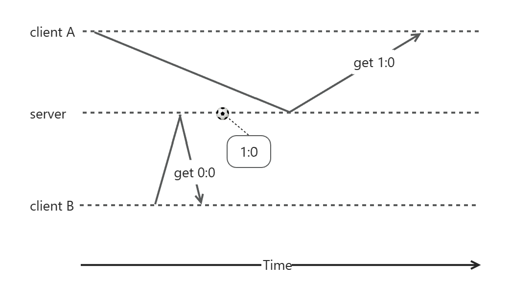
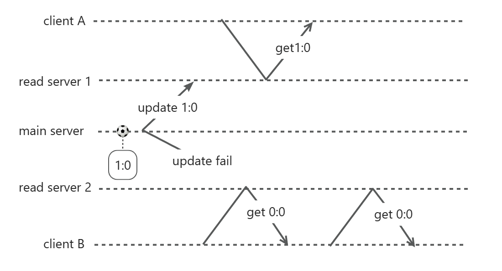
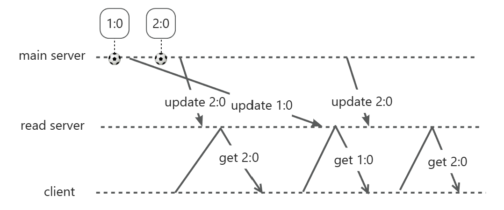
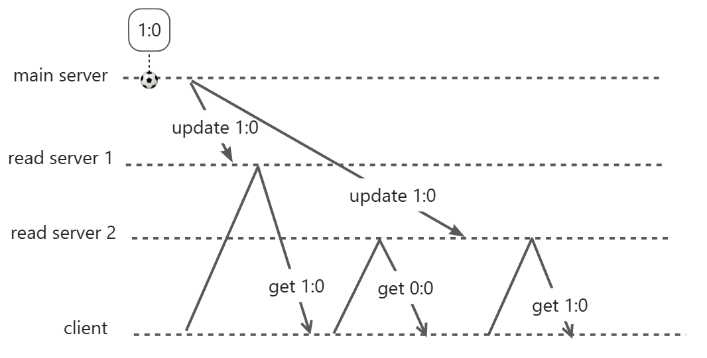
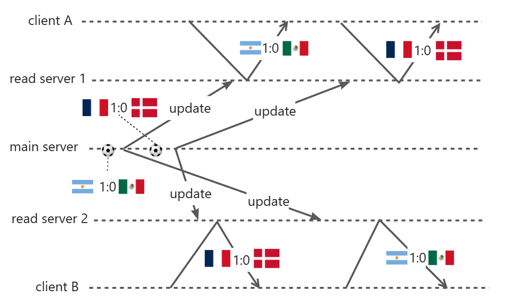
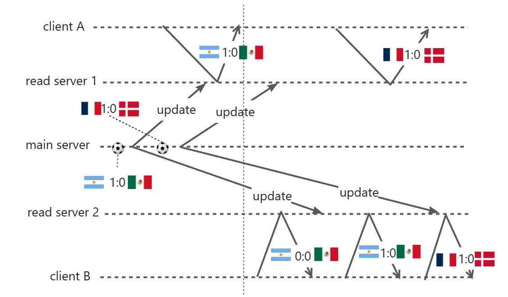
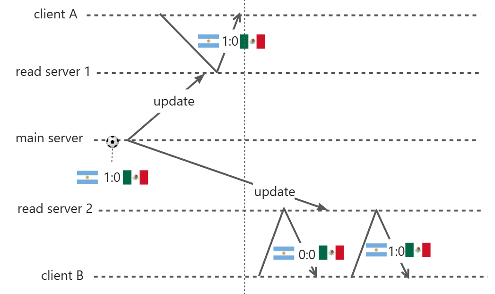
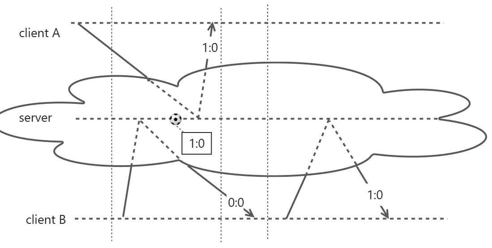
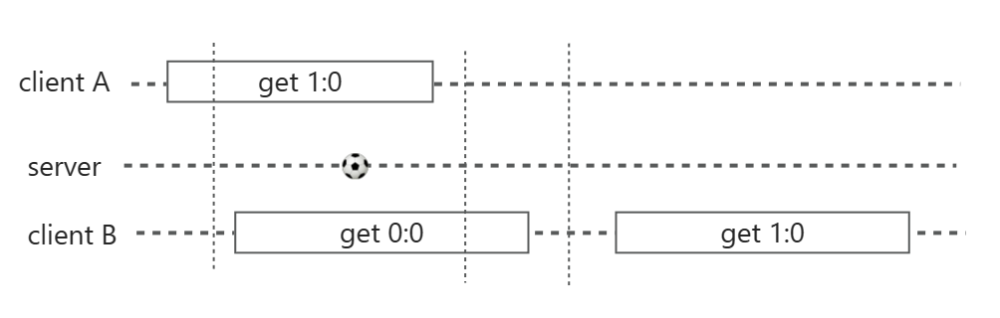

本文我们以新闻网站（这个新闻网站实时报道足球比赛的比分）为例，来解释分布式系统中的一致性问题。理清最终一致性、因果一致性、顺序一致性和线性一致性的概念（其中顺序一致性和线性一致性是最容易弄混的）。

在前厂上班的时候，我曾经写过一篇关于raft和线程一致性的文章，所以本文是“再论”。文中的图都是我画的，基于个人的当前的理解，也许还有不对的地方，欢迎讨论。

首先，我们先来看一个单体系统。在下图的例子中，有两个Client和一个Server组成了分布式系统，Server只有一个，就服务端而言，它是一个单体系统，肯定不会有任何一致性问题。在最下面的横向箭头标明了时间的方向，后续的图将不再标注时间方向，此外，我们还将进球的时间点标记在图上。
需要注意的是，下图中虽然A先于B发起请求，但却得到了新的比分（1:0），这是完全合理的，不违反任何一致性，因为A的请求到达server要晚于B的请求。

假设client越来越多，server不堪重负，改成了分布式架构，这个时候一致性问题就出现了。下图是一个例子，服务器变成了3个，一个主服务器（main server）和两个读服务器（read server）。当比分发生变更的时候，main server去更新read server的数据，但是更新read server 2的时候失败了，如果不再进球，client B去获取比分的时候，就永远是0:0，这个时候main server和read server数据不能一致，一致性就被破坏了。

为了解决问题，main server更新失败以后，进行重试（或者定期更新也行），这样，虽然client B没能及时获得1:0的比分，但它再刷新一次就能看到了。这样我们就得到了一个满足最终一致性的系统（我们这里只是举了一个具体的故障例子，实际上故障会有很多种，满足最终一致性的系统需要在各种情况下都满足最终一致）。

相对而言，最终一致最好理解，实现较为简单，性能方面通常也不需要太大开销，大部分分布式系统实现的都是最终一致性。比如有的时候下单以后暂时没有在“我的订单”中看见，或者消费以后余额没有及时刷新（并不意味着可以把1块钱花两次，通常是读服务器没有刷新，执行写操作的服务器那里有最高等级的一致性）等。

接下来看一个满足最终一致，但不满足因果一致性的例子。这次进了两个球，但是第二次更新到达read server更早，这种事在分布式系统中很常见（就算派两个人去送信也可能后出发的先到）。于是client会先看到2:0，然后才看到1:0，这违反了因果关系。由于main server有定期更新read server的机制，所以read server的比分最终会变成2:0并被client看到，这保证了最终一致性。

为了解决上图这个问题，read server应该拒绝第一次更新（比分从0:0直接更新为2:0是不符合因果的），并且必须1:0更新成功以后，main server才能发起更新2:0的请求。

然而，破坏一致性可以有很多种原因，这里再举另外一个例子，仍然是满足最终一致，但不满足因果一致。这一次原因也很简单，有两个read server，client请求比分的时候，落到哪个read server是不确定的。如下图：

要解决上面的问题，一个解决办法是client应该到固定的read server去获取数据，但后续又会衍生出如果这个read server宕机了怎么处理等问题，这里不展开了。

因果一致性要求有因果关系的事件，必须先观察到因，后观察到果，或同时观察到因果；不能先观察到果，后观察到因。

因果一致性的一个典型应用场景是类似微信朋友圈的评论。我不确定它是否实现了更高等级的一致性（代价更高），但因果一致是一个合理的最低要求：一条朋友圈消息，如果所有的评论都是不相关的，那么不同的人在同一个时刻刷到不同评论不会有太大影响，只要所有的评论最终都能展示出来就好；但如果评论B是回复评论A的，一个人能看到评论B时，他就必须能看到评论A。

接下来我们再看一个满足因果一致，但是不满足顺序一致的例子。两场比赛，它们的比分互相没有关系，所以下图不违反因果一致性（因果一致性要求：如果后续还有进球，同一场比赛需要先看到1:0，再看到2:0，这里画不下，就不展示了）。但是client A和client B观察到的事件顺序不一样，client A认为阿根廷先进球，client B认为法国先进球，这就违反了顺序一致性。

顺序一致性要求所有的事件，在所有的client看来发生顺序一致，它已经属于我们平时说的强一致性，为什么上面还有个线性一致性呢？

下图就列举了一个满足顺序一致，但不满足线性一致的例子。两个client都是先看到阿根廷进球，然后才看到法国进球。但是client A看到阿根廷进球后，client B发起了一个请求，却读到了0:0的比分，这也是不合理的（就好像你拿着两个手机刷同一场比赛的比分，当第一个手机刷出1:0的比分以后，第二个手机再去刷一下却刷出了0:0）。

上面这个图画的有点复杂，我们把它简化一下，是这样的（去掉了证明它满足顺序一致性的那部分）：

一个满足线性一致性的系统，不管它内部实现多复杂，如果把整个系统看作一个黑盒（下图用云表示），在外界的client看来，它仿佛是个单体系统。下图中我把请求进入系统的部分用虚线表示。

注意上图client B的第一个请求，它读到了0:0的比分，因为我画出了黑盒内的实现（虚线）部分，它看起来很合理。

如果我像下图中这样画，就容易让人困惑。但是请记住，它是合理的，不违反线性一致性，哪怕server是个单体系统，道理也是这样的。这是因为两个client的第一个请求存在时间上的重叠，重叠的请求具体怎么排序，仅仅从两个请求的起止时间，是无法判断的。而client B的第二个请求在client A的第一个请求之后，后者读到了1:0，所以前者必须能看见这个进球。

最后，在上面我们通过垂直虚线，来界定多个client操作的时间先后顺序，这等于是隐式引入了绝对时间的概念。在相对论中绝对时间是不存在的，在这里也不存在，服务器的时间没有办法无误差对齐。如果server是一个黑盒，从外界无法测量两个client操作的先后顺序，那也就无法证明server满足（或违反）了线性一致性。

怎么办呢？实际上，我们是通过因果逻辑，来建立事件之间的先后关系的。假设client A读到1:0的结果之后，发送一个消息给client B，client B收到消息以后，再发起读取请求，线性一致性要求必须读到1:0（或之后的比分）。由于client A读取完成先于（happens before）发送消息，发送消息先于client B发起读取，所以client A读取完成先于client B的读取发送。

换成前面提到的两个手机的例子，就是第一个手机刷出（读取完成）1:0的比分之后，第二个手机再发起读取，线性一致的读取结果必定是1:0或之后的比分，这里我们是通过人的操作建立了先后顺序。