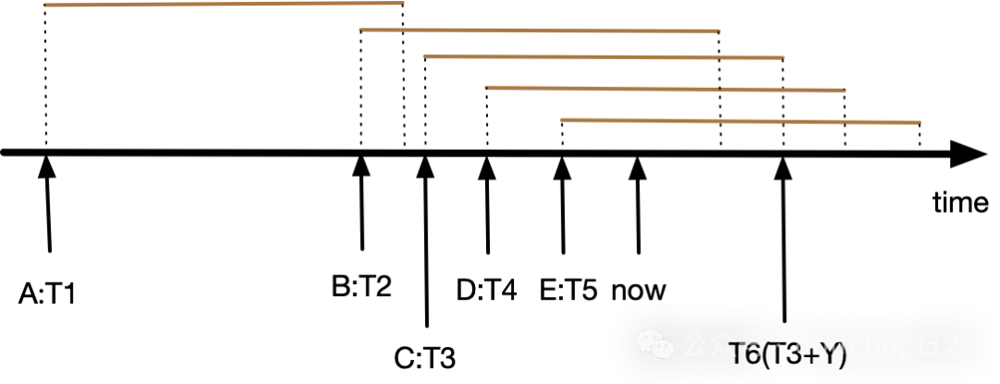
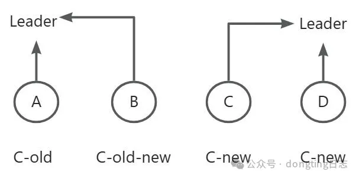
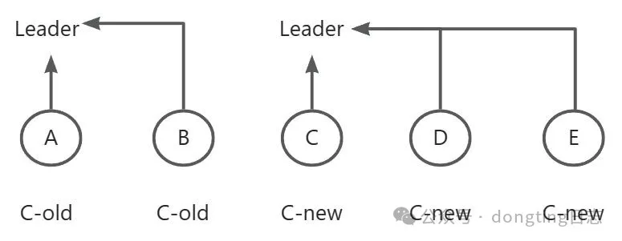

# 前言

我在2022年写的《[用人话讲解raft算法及其在工程中的改进](https://mp.weixin.qq.com/s/9291GmhiZXysm39K5tTjEw)》和2023年写的
《[再论线性一致性](2023_07_25_再论线性一致性.md)》对raft做了简单通俗的介绍，适合于了解raft和线性一致性。这两篇文章没有系统的介绍raft算法，
想了解更多你可能需要先阅读一下论文。

然而，就工程方面而言，raft论文还是过于简单了。一是它没有深入讨论很多细节，特别是关于读取操作。二是它假设所有的操作
（比如日志append和状态机apply）都是串行执行的原子操作，实际工程中为了提升性能，常常是异步操作，并发执行，这些优化带来了开发上的复杂性，
而且还要证明这样做没有违反线性一致性。

尽管我以前常写一些关于性能方面的文章，但并不是说我做项目只关注性能，我开发[Dongting项目](https://github.com/dtprj/dongting)
是非常严肃的。本文会给出本项目的前置假设，实现raft的各种关键细节，以及相关证明。这些细节在网上很少见
（特别是本文后面的“lease的计算”和“raft成员变更”两节），大部分探讨raft实现的文章往往过于简单、粗糙，有的甚至有错误，
所以本文可能是网上关于raft最细致的文章。

本文面向raft专家或有志于成为raft专家的读者。

# 前置假设

数学上所有的定理都由公理推导而出，这一部分我们给出本项目的前置假设，作为“公理”，并讨论如果这些前置假设没有得到满足时，
会导致哪些功能的正确性被破坏。

前置假设1：当fsync/fdatasync调用返回时，数据已安全的写到磁盘上。

操作系统对于文件写操作是有缓存的，写入的数据并没有马上往存储介质写，所以需要fsync/fdatasync刷盘调用会将缓存中的数据写入到存储介质，
并在操作完成后返回。Java中对应的操作是FileChannel.force()、FileDescriptor.sync()等。Dongting默认会在fsync/fdatasync返回之后，
才算append完成，leader在多数节点append完成并且自己append完成的情况下才会执行commit。

然而，为了提升性能，一些存储设备可能会“欺骗”操作系统，它写在自己的缓存中（设备缓存，而不是操作系统内存中的文件缓存），然后就报告完成。

如果这一点不能保证会发生什么呢？以3副本raft集群来说，1个节点发生掉电故障并丢失部分数据，并不会导致任何问题。然而如果两个节点同时发生故障，
并且至少有一个节点丢失了数据，就有可能会造成尾部已经commit的数据丢失，连最终一致性都不满足。

举例来说，机械硬盘是带有缓存的，当发生断电故障时，缓存中的数据可能还没有完成写入。有一些措施来避免这种问题：服务器机房都是有UPS的，
可以保证体面的关闭；磁盘阵列卡带有电池，可以在掉电后维持数据；可以在操作系统中禁用磁盘缓存。此外，还可以将raft节点部署在不同的可用区，
这样同时发生电源故障的概率是非常小的。

网络存储和云盘更加令人不安，它们供应商更多，你不知道厂商为了保证性能（网络设备延迟比本地设备更大）会进行什么优化。在Java类
FileChannel.force的说明中，明确表示如果是本地存储则保证返回时已经写入，如果存储不在本地则没有保证，大概就是这个原因。
而且云盘故障爆炸半径往往更大一些，容易一次坏一大片。

前置假设2：系统的时间是基本准确的

lease read依赖于这个前置条件。如果不满足，lease read可能会不满足线性一致性，但仍然保证最终一致性。

在《[Dongting的时间度量](2023_07_21_dongting的时间度量.txt)》一文提到了项目使用System.nanoTime()来衡量时间的流逝。
因为我们租约时间略小于选举超时时间，例如选举超时时间15秒，而租约是14秒，那么不同的计算机之间，每15秒时间误差不超过1秒即可。

如果不接受这一点，可以使用log read或者read index（暂未实现），它们不依赖于时间的正确性。

前置假设3：基本硬件都正常工作

具体来说，Dongting不能检测内存的位翻转错误，这是ECC内存该干的事情；
对于网络数据包，Dongting不进行CRC校验而是交给TCP去实现；
而对于存储设备，Dongting的每条raft log，都有CRC校验，如果读出的数据和写入的数据不一致，会报告错误（损失可用性，满足一致性）。

# 读写Quorum

介绍了前置条件，现在从最简单的东西开始介绍，把复杂的留后面。在
《[用人话讲解raft算法及其在工程中的改进](https://mp.weixin.qq.com/s/9291GmhiZXysm39K5tTjEw)》文中quorum一节提到，
可以分离选举quorum和读写quorum，这实现起来非常简单，所以我就这么做了。这样，如果有4个节点组成一个集群，写入操作只要有两个节点完成就行了，
性能高于5节点集群（和传统4节点集群）而可靠性高于3节点集群。具体还是看
《[用人话讲解raft算法及其在工程中的改进](https://mp.weixin.qq.com/s/9291GmhiZXysm39K5tTjEw)》这篇文章，这里就不多说了。

而上篇文章提到的见证者（witness），实现起来很复杂，暂时就没有实现。

# observer

在本项目中，observer是没有投票权的follower。它用于增加集群的副本数，由于不参与投票，所以不会导致quorum和延迟的增加。

observer可以随时转换为follower，往集群中增加节点时，新增加的节点首先作为observer加入，等它的日志进度追上leader，然后再转为follower比较好。

如果以后实现了follower读，observer也可以和follower一样提供读取服务。

# 配置检查

在一个集群中，因为错误的配置，不同节点的配置不同会发生不可预知的严重后果。

我在所有的公司都遇到过配置错误导致的重大故障，要求开发人员或者运维人员做正确的配置是很难的，一个复杂系统要配置的东西往往太多了，人总是会犯错的。

所以Dongting会在节点和节点之间TCP连接建立后检查两端的配置是否一致，如果不一致则丢出错误导致启动失败。在项目中这个过程称为raft ping。

raft ping以raft group为单位，在mutli raft情况下，虽然TCP连接是共享的，但每个raft group有各自的raft ping。
连接建立后只ping一次，如果发生了TCP重连，则需要重新做raft ping。

当raft成员需要变更的时候，可以在运行时先动态关闭配置检查，然后再执行变更。

# 快速index匹配算法

按照论文，leader维护的nextIndex默认初始化为lastLogIndex+1，如果以此位点复制日志到follower产生不匹配的问题，那么就将nextIndex减1并重试。

这个方式不适合生产环境，比如一个follower长期掉线导致日志进度大大落后，然后leader发生了切换导致nextIndex被重置，这样的话，
一个rpc来回只能将nextIndex减一，需要很长时间才能找到正确的位点。所以需要更快的匹配算法。

dongting的快速匹配算法通过RaftLog接口的tryFindMatchPos(term, index)方法来实现。它用来查找leader和follower之间匹配的最大index，
再加1就是nextIndex。

follower无法单方面判定正确的复制位点是多少（因为leader更换可能会导致不同节点raft log分叉，leader和follower的日志会不一致，
follower的日志也可能比leader还长），所以tryFindMatchPos需要在follower和leader上先后各调用一次才能找到正确的匹配点。

具体过程是，leader调用AppendEntries RPC的时候，follower发现不匹配，然后以本次AppendEntries RPC的previousLogTerm
和previousLogIndex为参数，调用tryFindMatchPos来返回一个建议的nextIndex和term给leader；leader收到后，以此为参数，
也调用tryFindMatchPos，然后就能返回正确的nextIndex和term。

以raft论文中的这个例子为例，图中leader新当选后，nextIndex会初始化为11。以11为起点，复制数据给a~f都会失败，应用tryFindMatchPos后，
两次返回如下：

(a)、follower调用tryFindMatchPos(6,10)返回term=6，index=9；leader调用tryFindMatchPos(6,9)返回term=6，index=9

(b)、follower调用tryFindMatchPos(6,10)返回term=4，index=4；leader调用tryFindMatchPos(4,4)返回term=4，index=4

(c)、previousLogTerm=6，previousLogIndex=10，没有不匹配，follower长出来的部分将被截断

(d)、previousLogTerm=6，previousLogIndex=10，没有不匹配，follower长出来的部分将被截断

(e)、follower调用tryFindMatchPos(6,10)返回term=4，index=7，leader调用tryFindMatchPos(4,7)返回term=4，index=7

(f)、follower调用tryFindMatchPos(6,10)返回term=3，index=9，leader调用tryFindMatchPos(3,9)返回term=1，index=3

以上只有f是真正通过两次匹配找到的，其它的第一次其实就找到了。

tryFindMatchPos(suggestTerm,suggestIndex)具体算法为，在本地日志队列中寻找一个最大的index，它需要满足以下条件之一：

1. term=suggestTerm并且index=suggestIndex
2. term<=suggestTerm并且index<suggestIndex

# 异步apply

对于状态机执行耗时较长的情况，可以异步（在其它线程）执行。这样可以有效降低raft线程的负担，异步执行的日志甚至可以多线程并发执行。这分两种情况：

1. 状态机不保证异步执行的日志按顺序完成，后执行的日志可能先完成。
2. 状态机保证异步执行的日志按顺序完成。

我没有深入思考过第一种情况，只能浅显的说一下。

对于一些数据库类的状态机，必须按第一种情况处理才好。否则两个互不相关的事务，较快的事务仅仅因为log index更大，就必须等前面较慢的事务先完成，
是不合理的。然而这样做了以后是否还满足线性一致性呢？事务的执行完成顺序和raft log的index顺序不一样，从上帝视角看是不对的，
不过只要client感知不到OK了，又或者可以不要求最高级别的一致性。这部分我没有深入思考过，数据库我也不太了解，就不瞎说了。

Dongting对状态机的要求是要满足第二种情况。状态机只负责保证交给它的日志的顺序执行，而raft框架需要保证所有的日志，
包括普通的给状态机执行的日志、心跳日志、配置变更日志（详见本文raft成员变更一节）按index顺序完成。对于心跳日志，当前面的日志执行完成后，
由raft框架“执行”它（其实是空操作），然后移动lastApplied。对于配置变更日志，在配置变更执行之前，需要先等待前面的日志全部执行完成。
多亏了项目的[fiber实现](2024_07_16_3000行代码实现fiber.md)，才能在异步开发的场景下比较容易地实现等待。

_注：在Dongting的raft实现中，心跳不但作为AppendEntries RPC来发送，而且作为一条日志来保存（这一点在论文中没有明确），
有对应的raft log index。这样做的好处是，通过心跳可以检查follower存储设备的健康，避免follower心跳OK但是日志写不进去的情况。_

# 异步并发写日志

之前我在文章中也提到过，Dongting不但异步写日志，而且并发写。一次写入还没有完成时，如果有新的数据过来，就开始下一次写入。

并发写入的时候，计算本次要写入的字节数，精确指定写入开始的位置就可以了，多个写入不会冲突。Dongting预分配日志文件，
写入过程不会导致文件长度增加，调用fdatasync即可将数据刷新到存储设备（fsync要更新文件元数据，会多一下IO操作）。

write操作主要是写操作系统的缓存，fdatasync才是真正的重量级操作，它的延迟非常大，为了提升性能，Dongting分离了write和fdatasync操作。
由于fdatasync是针对整个文件，并发调用没有意义，所以同时只有一个fdatasync操作。当一次fdatasync操作完成之后，
如果一个或多个write操作已经完成，会合并调用下一次fdatasync，这样提升了吞吐。write操作可能不按顺序完成，开发中要进行处理。

这样，项目中的各种log index的关系是：
lastApplied <= lastApplying <= commitIndex <= lastForceLogIndex <= lastWriteLogIndex <= lastLogIndex。

write完成和force（即fdatasync）完成都有通知，因此Dongting raft可以配置为同步刷盘和异步刷盘。同步刷盘监听force完成通知，
异步刷盘监听write完成通知。即使配置为异步刷盘，Dongting也是尽可能快地调用fdatasync，只不过不必等它完成。

异步写会面临这样的问题：如果向存储设备发起了写操作，在操作还没有完成的情况下，有投票请求过来（或者当前节点想要作为candidate发起投票），
那么lastLogIndex是否应该包括当前正在写的这些日志条目呢？

Dongting现在对这个问题的处理非常简单，在进行投票等操作之前，先等待所有日志写入和fdatasync完成，这样就可以避免各种潜在的问题。

# 并发复制

leader往follower发送AppendEntries RPC是异步的。leader会同时往多个follower发送请求，不会一个返回了再去请求下一个。

针对同一个follower，leader会发送多个AppendEntries RPC请求，不会等前一个请求返回了，才发送下一个。有流量控制，避免过多的请求淹没follower。

对于同一条日志，leader将它写入存储，和将它复制到follower这两件事情也是同时做的，如果要等写入完成再复制，那就增加相应延迟了。

# log read

对于raft框架而言，log read和普通的raft write操作似乎没有不同，流程都是一样的，执行的时候丢给状态机就行了。然而，如果raft框架知道某个raft操作是只读操作的话，就能做一些优化。

首先，在log read中，写入到日志的条目似乎没有什么作用。假设leader执行读操作，那么follower是不需要执行的，不需要把完整的读请求序列化到
raft log，只要保存一个占位符就行了（占用一个raft log index），当这个index被commit的以后，leader就可以执行读操作并返回给client了。
可不可以连占位符也不保存呢？其实也是可以的，不过这就等于readIndex读取方式了。

其次，读操作如果发生了异常，可以安全地忽略它。

最后，对于未写入的、相邻的读操作，可以合并共用一个占位符（注意，一个读操作不能和之前已经写入的读操作合并，这样无法确定leader的有效性）。
读操作不会改变状态机，所以在commit以后可以安全地并发执行。对于读多写少的系统，这样能大大提升log read的性能。为了避免复杂性，
Dongting目前还没有实现这一点，因为如果要提升性能，还是lease read更实在。

# wait-free read

log read是线性的，按log index排序。而对于lease read和readIndex read，都有在线性系统中选择一个点的问题。

假设leader依次接到A（write）、B（write）、C（read）三个操作，一段时间后，A操作已经执行完成，lastApplied指向A，
而B操作还没有commit，那么当leader通过lease或者follower通信确定了领导者地位后，是否可以不等待B完成，立即执行C操作呢？

答案是可以的。因为B和C的执行时间段是重叠的，leader决定它们的排序，无论先执行哪个都不违反线性一致性。然而如果B、C是同一个client依次发出的呢？
如下图：

看起来有点奇怪，后发起的操作先完成。我个人认为这还是符合线性一致性的，这可能不满足某些场景的期望，在这种场景下，client先发送B（write），
在完成前又发送了C（read），原本的预期是C要依赖于B的结果。我也不知道这种场景到底有没有，为什么不把B和C合并成一个操作（事务）呢？

如果要满足这样的场景，lease read和readIndex read需要设置一个选项来禁用wait-free。也可以不提供这种支持，如果有这样的需求就使用log read。

# MVCC read

lease read和readIndex read可以并发执行，这就造成了读取结果的不确定性。回到上一节A（write）、B（write）、C（read）三个操作的例子，
lastApplied指向A，如果采用wait-free的读取方式，一个线程立刻准备执行C的读取，此时B还未commit，但如果这个线程动作慢了一点，
也有可能读到B操作，因为B的执行和C读取是并发的。

如果C在B完成之后才开始，相当于raft系统将C排序在B之后，虽然从上帝视角看，本来leader是想先执行C的。

这引发了另一个问题，C到底是应该读A操作完成以后的快照，还是读取最新的状态机呢？两种方式都不违反线性一致性，但最好不要混用。
我认为读快照更好，反正状态机早晚得实现MVCC，在保存snapshot的时候也要用到的。

我们来证明一下读取最新数据没有违反线性一致性。以lease read为例，leader的重要作用是确定一个时间点**T(读取开始时间)**，确保：

1、T(客户端发起请求的时间) < **T(读取开始时间) < T(lease截止时间)**

2、 T(读取开始时间) < T(读取完成时间) < T(客户端收到响应的时间)

T(读取开始时间)和T(lease截止时间) 这两者哪个更大，是不重要的。也就是说，哪怕leader已经退位，哪怕读取线程卡了1年，
然后读取了1年后状态机的最新状态（假设客户端没有超时），都不违反线性一致性。在线性一致性全局时钟下，这个读取操作被视为原子操作，
只要它发生的时间点在客户端发起请求和收到响应之间都是合法的。（我知道可能没讲清楚，只能各位读者努力思考一下了T_T）

# 各种读取方式的区别

log read最简单，也最可靠，性能可能会差点。

readIndex read不需要写raft log，当禁用wait-free以后，它等效于log read，同时性能更好。

lease read性能最好，它连和follower通信也省了，不过它依赖于前置假设2：系统的时间是基本准确的。

follower读需要去leader取一次index，如果leader取index时，采用的是lease方式，则相当于lease read，
如果leader和所有follower通信一次确定leader地位，它相当于readIndex read。

# lease的计算

高效的lease截止时间的计算比想象中要复杂。

本节我们假设选举超时时间为X，follower超过X时间没有收到leader的数据就会发起投票，而租约时间为Y。考虑到不同服务器的时间差计量会有误差，
Y应该略小于X。

对于一个follower而言，当A时间点leader发起一个心跳请求，B时间点follower收到并处理，在B+X时间点之前这个follower不会发起投票，
leader计算lease的时候无法得知B（在follower上生成），所以leader只好用A和A+Y作为lease的起止时间。

Dongting的每条数据日志数据（包括普通日志、心跳、配置变更）都能刷新lease。对于同一条日志，leader需要向多个follower复制，
复制开始的时间各不相同，甚至会相差很大（当某个follower的日志进度严重落后于leader的时候）。
我们需要将每一条日志针对不同follower的lease开始时间对齐。具体来说，当leader生成这条日志的时候，取一个时间点，
所有的follower都用这个时间点作为lease开始时间。这一点非常重要，下面的证明需要用到。

不同的follower有各自的lease起止时间，而leader需要根据这些数据，计算一个单一的lease截止时间点，在这个时间点之前，
它可以安全的认为自己还是leader。

最简单的办法确保当前时间点在所有follower的lease范围内，但如果有follower故障了，就不能提供lease read了吗？这显然是不行的。

**我总结了lease截止时间的计算方式为：如果有一个N个节点组成的集群，它的读写Quorum为Q，lease超时时间为Y，将这N个节点（包含leader自己）
的lease开始时间从大到小排序，T(第Q大的lease开始时间)+Y就是lease截止时间。**

举个例子，假设有一个5节点集群（A、B、C、D、E），E为leader，它的读写Quorum是3（注意3节点和4节点集群读写quorum都是2）。
5个节点的lease开始时间从小到大依次为T1、T2、T3、T4、T5（leader自己），lease结束时间就是T6=T3+Y（因为T3是第3大的数字）。见下图：

可以看出，从当前时间now到T6，C、D、E都不会发起投票，leader有大于等于Q个节点的支持，所以即便类似A这样的节点发起投票，也不会获得多数支持。
但真的是这样吗？下面给出严格的证明，已知：

1、raft log从小到大，生成时间是单调递增的。

2、上面提到，我们对齐了每条日志的lease开始时间。

所以，在lease截止时间点前，至少有Q个节点的日志大于等于lease开始时间（上图中的T3）对应的那条日志，而发起投票的节点，
它的最新日志一定小于那条日志，它必定不会当选。

# raft成员变更

Dongting使用的成员变更方式为joint consensus，本文我们只讨论这种方式。
类似两阶段提交，我们把配置变更分为3个步骤，config-prepare，config-commit和config-abort。

两阶段配置变更在一切顺利的情况下没有什么问题，然而如果发生各种异常情况，一个糟糕的实现会出现各种问题。下面举一些例子。

最开始我考虑用admin tool和各个节点通信下发配置。由于网络故障，config-prepare阶段可能无法将共同一致（joint-consensus）
的配置下发到所有节点。这个时候，也不能等所有节点都config-prepare完毕再提交（因为可能就是因为有节点发生故障下线了，才需要更新成员配置）。
所以config-prepare和config-commit都应该遵循多数原则。

如上图所示，有A、B、C、D四个节点，老的配置为（A, B, C），新配置为（B, C, D）。

config-prepare阶段由于A不在线，只能将C-old-new下发到B、C、D。在config-commit阶段，由于config-commit是分步进行的，
当C-new仅仅更新了C、D的时候，这个时候发生选举，可能会生成两个leader（假设A又恢复了）。

为了解决这个问题，可以在C-old-new阶段，节点只把选票投给新配置列表中的节点。即上图中B不能投票给A。然而上面只是一个例子，还有很多其它问题。
我花了很多时间来思考应该怎么做，最后我得出结论这样做是最好的：

1. 配置变更应该通过一条raft log来操作。admin tool只将配置下发到leader，leader通过raft复制来进一步下发配置。
2. 配置变更的执行应该像普通的raft操作一样，在对应的raft log执行时来做，要保持顺序。
3. 候选人发起投票前，应该先执行完它已有的日志。

通过这样的方式可以轻松解决上面的问题，上图中B不可能投票给A，因为B持有C-old-new而A没有，B的日志一定比A要新。

还有三个需要注意的问题。

第一个问题，在变更过程中不同的节点可能会处在不同的配置阶段，leader应该在config-preare在多数成员执行之前，不接受config-commit指令。
如果不这样做，会产生如下问题：

这个例子由三节点｛A、B、C｝扩展为5节点｛A、B、C、D、E｝，C为老leader，C下发C-old-new后，A、B都收到了这个配置，因此C可以提交新配置，
然后C又下发第二阶段的配置C-new，所有节点都收到了配置，于是C提交了新配置。但由于raft的apply index落后于commit index，
所以A、B的使用的配置可能还是C-old，这时如果发生网络分裂，A可能会使用旧配置选为leader（依靠B的选票）。而C有D、E的支持，还可以继续写入。

第二个问题，raft成员变更作为一个raft条目，但它不是状态机的一部分。因此raft框架需要负责将它持久化，
保证raft group的成员配置不会因为重启而丢失。

当配置执行时，raft框架要将它保存到存储设备，当保存状态机的快照时，对应的配置作为状态机快照的元信息被保存。如果发生重启，
raft框架需要先应用状态机快照（含对应的raft group成员配置），然后再redo剩余的raft log。

第三个问题，admin tools和raft leader的通信也可能会出现问题，如果因此admin tools下发不一致的指令可能会导致问题。

为了解决问题，config-prepare、config-commit、config-abort指令都设计成幂等的，如果config-prepare因为网络超时而失败，可以安全重试。
config-prepare执行以后会给admin tools返回这条raft log的index，admin tools发起config-commit请求需要以这个index作为参数，
leader在把这个请求送到raft系统执行之前会进行检查，如果和当前config-prepare index不同，则拒绝这个请求。

通过以上这些机制，我们可以尽可能自动处理各种错误，而不需要人工介入。这正是multi-raft用于弹性伸缩所需要的能力。

# 结束语

本文Dongting项目开发中的心得总结，只记录了要点，还有很多细节。这应该是我写过的最长的文章了，
文中内容我不敢100%肯定是最优的（甚至也可能会有错误？），如果有问题欢迎和我讨论。

[Dongting项目](https://github.com/dtprj/dongting)的目标是做一个raft/mq/config/low level rpc四合一引擎，0依赖，10倍性能，
目前还在开发中，当前（2024年7月）项目进展可见《[第二点阶段性进展](2024_07_09_第二点阶段性进展.md)》。

2025年8月11日补充，见：
git log b62393a1f996129b37be3bc66f27667026b0aca2