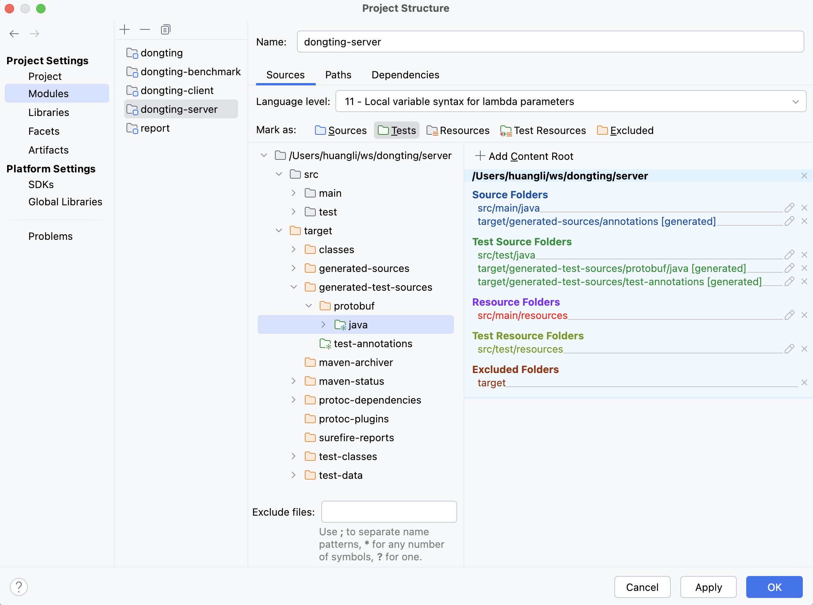
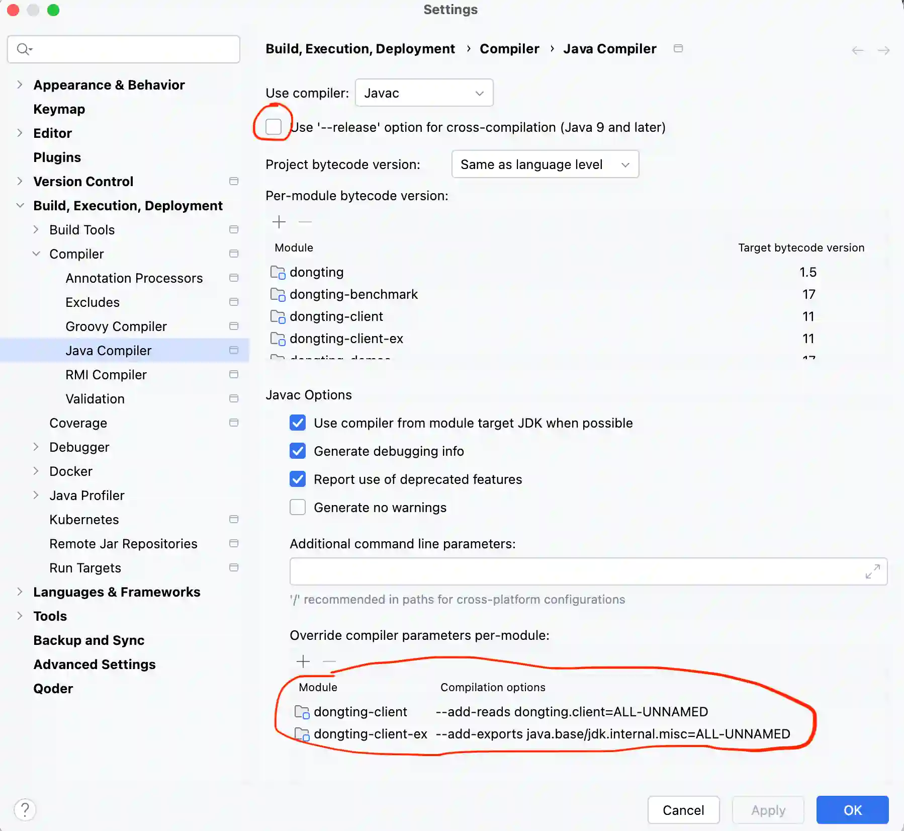

# run unit tests

```
mvn clean test -Dtick=5
```

# Build and setup IDE

The Dongting project outputs two jars for users: dongting-client.jar requires Java 8, and dongting-server.jar
requires Java 11. However, compiling the entire project requires Java 17 because the benchmark module requires Java 17.

Although the mvn command build succeeds in the command line,
importing the entire project into the IDE may lead to compilation errors.

First, the test code depends on some files generated by the protobuf compiler. 
Run the following command to generate the source files:
```
mvn clean compile test-compile
```

Then add the source file path generated by the plugin to the *sources* in the IDE
(The IntelliJ IDEA may set it automatically). Like below:


Second, the client module defines multiple compilation in pom.xml (for supports from Java 8 to Java 25), 
but the IDE may not handle it well. Setup in IntelliJ IDEA like below (the --add-exports/--add-reads should 
automatically be added after maven sync projects):



Now you can build and run the project in the IDE.

# run demos in IDE

demos directory contains some examples of using `dongting`, they require no configuration 
and can be run directly by the `main` method.

# Run simple benchmark

Run main method RaftBenchmark, that's all. 

There are some parameters you can set in source code, see comments.


